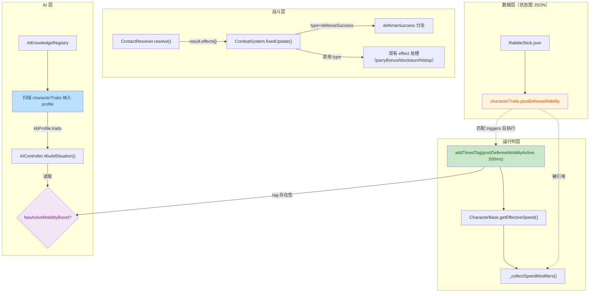

# Rabble Stick Post-Defense Mobility 设计计划

> 日期：2026-09-07
> 关联：`plans/commits_detailed/26.9.5 AI决策升级.MD`（刚完成的 AI 决策架构）
> 目标：为 Rabble Stick（招数少、攻击距离短）加一个防守成功后移动加速的平衡机制，同时验证 Character Trait 驱动 Combat Event 的通用架构链。

---

## 1. 背景与动机

Rabble Stick 当前两个弱点：
- 攻击距离极短（thrust + swing 都是 light）
- 招数只有 2 个攻击，变化少

目标：给它一个"防守成功 → 主动进攻窗口"的机制，让它能主动缩短距离，弥补攻击距离短的缺陷。

更重要的目标：这次不是写一个"Rabble 专属特殊机制"，而是验证一条**可复用的架构链**：

```
Character Trait（数据）
        ↓
Combat Event（事实）
        ↓
Trait Resolver（消费事实）
        ↓
Runtime State（改变行为）
        ↓
AI Knowledge（改变决策）
```

这条链跑通后，将来加任何角色特性（长柄兵 reach advantage、重甲兵防御特化等）都只是填数据，不是写代码。

---

## 2. 核心设计决策

### 2.1 Event vs Effect 语义分层

**现状问题**：ContactResolver 的防御结果没有统一表达：
- parry → 有 effect（parryBonus + clash + hitstop）
- 普通 block → 有 effect（blockstun + hitstop）
- dodge → **没有任何 effect**，攻击直接失效

**决策**：引入 `defenseSuccess` 作为 Event（事实），表示"这次防守成功了"。它本身不施加任何效果，由 Trait 消费。

```
Combat Result
├── Event:  defenseSuccess { source: "guard_block" | "parry" | "dodge" }
├── Effect: parryBonus（对 parry 这个事实的响应，主角用）
├── Effect: blockstun（对 guard_block 这个事实的响应）
└── Effect: hitstop（对所有冲突的响应）
```

**实现方式**：Event 仍然走 `result.effects` 数组管道（不引入 EventBus 新基础设施），但 CombatSystem 遇到 `type === "defenseSuccess"` 时走 trait 查询分发，不直接调角色方法。

### 2.2 Trait 数据挂载点

**决策**：状态图 JSON 顶层加 `characterTraits` 块。

理由：
- StateGraph 已是角色战斗能力的权威定义
- AIKnowledgeRegistry 本来就在读这个文件，就近扩展零额外加载管道
- 避免数据散落（StateGraph 定义能力，Character config 定义 trait，AI KB 再把两边合并）

**不做的事**：不提前造 `combatTraits.mobility / combatTraits.defense / combatTraits.counter` 三级抽象——Trait 数量还少，现在抽象过度设计。

### 2.3 Trait 数据结构

RabbleStick.json 顶层新增：

```json
{
  "machine": "rabble_stick",
  "initialState": "idle",

  "characterTraits": {
    "postDefenseMobility": {
      "enabled": true,
      "triggers": ["guard_block", "parry", "dodge"],
      "durationMs": 500,
      "speedMultiplier": 1.5
    }
  },

  "states": { ... }
}
```

AIKnowledgeRegistry 直接扫描同一份数据 → KB profile 里多一个 `traits` 字段。游戏机制和 AI 知识的**源头只有一个**。

### 2.4 速度 Modifier 小整合

**现状**：`CharacterBase.getEffectiveSpeed()` 已有两条硬编码路径：

```javascript
// 硬编码 ❶
if (this.hasTag("parryBonus") || this.hasTag("chainBonus")) {
    speed *= this._moveSpeedBonus;
}
// 通用扩展点 ❷
if (this.buffsProvider?.getSpeedMultiplier) {
    speed *= this.buffsProvider.getSpeedMultiplier();
}
```

**决策**：把 ❶ 和新增的 postDefenseMobility 统一成一个薄接口——`_collectSpeedModifiers()` 方法，从 tag → trait 配置查 multiplier。

**范围严格锁死**：
- ✅ 只碰移动速度这条线
- ❌ 不碰 `bonusTimeScale`（CombatCharacter 里的动画加速，另一条线）
- ❌ 不做完整 Buff System，不引入 buffsProvider 改造

---

## 3. 架构总览



---

## 4. 文件级改动清单

### 4.1 RabbleStick.json

**新增顶层 characterTraits 块**：

```json
{
  "machine": "rabble_stick",
  "initialState": "idle",

  "characterTraits": {
    "postDefenseMobility": {
      "enabled": true,
      "triggers": ["guard_block", "parry", "dodge"],
      "durationMs": 500,
      "speedMultiplier": 1.5
    }
  },

  "states": { ... }
}
```

主角 LongSwordMan.json **不需要**加 characterTraits——它继续用 parryBonus tag 系统，两套并存，零回归风险。

### 4.2 `scripts/Systems/ContactResolver.js`

**新增 defenseSuccess event push**（不改动现有 effect）：

| 分支 | 现有 effect | 新增 Event |
|---|---|---|
| parry | parryBonus + clash + hitstop | defenseSuccess { source: "parry" } |
| 普通 guard block | blockstun + hitstop | defenseSuccess { source: "guard_block" } |
| dodge | （无 effect） | defenseSuccess { source: "dodge" } |

具体位置：
- **parry 分支**（~L115）：在 `canParry` 为 true 时 push
- **普通 block 分支**（~L121）：在 `canParry` 为 false、但 `blocked === true` 时 push
- **dodge 分支**：新增。需要找到 dodge 路径（被闪避的攻击当前只是让 attacker invalidated），在确定"这次 dodge 生效了"的点 push

### 4.3 CombatSystem.js

**新增 defenseSuccess 处理分支**（在现有 effect 处理循环里，`parryBonus` 分支之前）：

```javascript
if (effect.type === "defenseSuccess") {
    const traits = target.stateGraph?.characterTraits || {};
    for (const [traitName, traitConfig] of Object.entries(traits)) {
        if (!traitConfig.enabled) continue;
        if (!traitConfig.triggers?.includes(effect.source)) continue;

        // 找到匹配的 trait → 执行 trait 定义的行为
        // 第一版只实现 postDefenseMobility → addTimedTag
        if (traitName === "postDefenseMobility") {
            const durationFrames = Math.round(traitConfig.durationMs / (1000 / 60));
            target.addTimedTag("postDefenseMobilityActive", durationFrames);
        }
    }
    continue;
}
```

将来如果有新 trait 消费 defenseSuccess（比如 staminaRefund），在 trait 查询循环里加分支即可——**不需要改 CombatSystem 的 effect 管道**。

### 4.4 CharacterBase.js

**改造 `getEffectiveSpeed()`**：

```javascript
getEffectiveSpeed() {
    let speed = this.activeSpeedMode === "move"
        ? this.baseMoveSpeed
        : this.baseWalkSpeed;

    // 替换两条硬编码 tag 特判为 modifier 列表查询
    const modifiers = this._collectSpeedModifiers();
    for (const m of modifiers) {
        speed *= m.multiplier;
    }

    // buffsProvider 保持不变（PlayerController 的 buff 系统）
    if (this.buffsProvider?.getSpeedMultiplier) {
        speed *= this.buffsProvider.getSpeedMultiplier();
    }
    return speed;
}
```

**新增 `_collectSpeedModifiers()`**：

```javascript
_collectSpeedModifiers() {
    const modifiers = [];
    const traits = this.stateGraph?.characterTraits || {};

    // 1. parryBonus / chainBonus：主角现有系统迁移过来
    if (this.hasTag("parryBonus") || this.hasTag("chainBonus")) {
        modifiers.push({ source: "parryBonus", multiplier: this._moveSpeedBonus });
    }

    // 2. postDefenseMobility：新 trait
    if (this.hasTag("postDefenseMobilityActive")) {
        const trait = traits.postDefenseMobility;
        if (trait?.speedMultiplier) {
            modifiers.push({ source: "postDefenseMobility", multiplier: trait.speedMultiplier });
        }
    }

    return modifiers;
}
```

**注意**：`_moveSpeedBonus` 目前是 CharacterBase/CombatCharacter 上的字段——它的赋值来源需要先审计，确保迁移不破坏主角现有 parry 后的速度加成。

### 4.5 `scripts/Systems/AIKnowledgeRegistry.js`

**两件事**：

#### (a) 扫描 characterTraits 纳入 KB profile

`#scanCharacter()` 返回值新增 `traits` 字段：

```javascript
// 现有 attacks/dodges/guards/movement 之后
const traits = character.stateGraph?.characterTraits || null;

return {
    characterId: character.id,
    pxToWorld,
    moveSpeed,
    attacks: attackProfiles,
    dodges: dodgeProfiles,
    guards: guardProfiles,
    movement: { moveSpeed, stateDisplacements },
    traits   // ← 新增
};
```


#### (b) 版本哈希必须改（这是硬伤修复，不是可选优化）

当前 `#computeVersionHash` 只看 colliderData 和 state 名列表——加 characterTraits 或改 durationMs 都不会触发重扫。

**决策**：把整个 stateGraph 做 canonical JSON 序列化后纳入哈希。如果数据量不大（原型阶段肯定不大），直接 canonical JSON 序列化整个 stateGraph 对象：

```javascript
static #computeVersionHash(character) {
    const parts = [];

    // 保留 colliderData generatedAt（动画帧时间变化也要触发重扫）
    const clips = character.config?.clips || {};
    for (const [clipName, clipDef] of Object.entries(clips)) {
        const generatedAt = clipDef.colliderData?.source?.generatedAtUtc;
        if (generatedAt) parts.push(`${clipName}:${generatedAt}`);
    }

    // 新增：canonical JSON 序列化 stateGraph 整个对象
    // 避免维护白名单，以后加任何字段都自动纳入
    const stateGraphJson = JSON.stringify(
        character.stateGraph || {},
        Object.keys(character.stateGraph || {}).sort()
    );
    parts.push(`sg:${stateGraphJson}`);

    return parts.join("|");
}
```


### 4.6 `scripts/Systems/AIController.js`

**Phase 2 被动消费**：`#buildSituation()` 里加两个信息：

```javascript
// buildSituation 新增
const selfHasMobilityTrait = this.kbProfile?.traits?.postDefenseMobility?.enabled;
const selfHasMobilityBoost = self.hasTag("postDefenseMobilityActive");

return {
    // ... 现有 distance/self/opp/oppThreat/oppVulnerable ...
    selfMaxReach,
    now: performance.now(),

    // 新增：AI 感知到的"我有防守后加速能力"
    selfMobility: {
        hasTrait: selfHasMobilityTrait,
        hasActiveBoost: selfHasMobilityBoost,
        traitConfig: selfHasMobilityTrait ? this.kbProfile.traits.postDefenseMobility : null
    }
};
```

**评分利用**：在 `#executePositioning` 里，当 `sit.selfMobility.hasActiveBoost === true` 时：
- 如果距离刚好在攻击范围边缘（boost 前够不到），给 approach 加权重
- 如果正在撤退但 boost 还剩时间，考虑立即变向进攻

**不做的事**：
- ❌ 不做 event-driven decision opportunity（defenseSuccess 立即唤醒 AI）——先等 playtest 看 AI 是不是真的浪费窗口
- ❌ 不改 Commitment 机制

---

## 5. 参数决策（第一版实验值）

| 参数 | 值 | 理由 |
|---|---|---|
| **触发源** | guard_block + parry + dodge（全部） | 先让假设充分暴露，不要用苛刻条件掩盖系统问题 |
| **durationMs** | 500ms | 刻意偏明显，让机制效应肉眼可见 |
| **speedMultiplier** | 1.5x | 同上 |
| **冷却** | 无 | 先不加，等 playtest 发现"永久 haste 压不住"再考虑 |
| **刷新策略** | refresh（重置 duration），不 stack | 避免 1.5×1.5×1.5 疯狂连锁 |

### Playtest 观察指标

打完一批实际战斗后观察三个环节：

```
Defense Success
      ↓ ① 是否成功缩短距离？
缩短距离
      ↓ ② 是否真的提高 Attack Utility？
Attack Utility 上升
      ↓ ③ AI 是否真的主动进攻？
```

任何一个环节断掉，才是下一轮要修的地方。

---

## 6. 明确不做的事

| 不做 | 理由 |
|---|---|
| 重构主角 parryBonus 到同一 trait 系统 | 两套并存，零回归风险；将来单独迁移 |
| 引入 EventBus 基础设施 | defenseSuccess 走现有 effects 数组管道即可，不搞大工程 |
| 完整 Buff System 重做 | 范围锁死：只改 getEffectiveSpeed 一条线 |
| 让 defenseSuccess 立即打断 AI Commitment | 破坏刚做好的 Action Commitment 架构；长期方案是"commitment 结束后立即决策"，现在不实现 |
| 提前设计 staminaRegen / rage / armor 等 trait | 抽象过度，等 Trait 数量真的多了再演化 |
| 改 bonusTimeScale（动画速度）那条线 | 移动速度和动画加速是两条独立 concern，本次只碰前者 |

---

## 7. 实施顺序（按依赖关系）

| Step | 文件 | 做什么 | 可独立验证 |
|---|---|---|---|
| 1 | `RabbleStick.json` | 加 characterTraits 数据块 | ✅ JSON 格式验证 |
| 2 | `AIKnowledgeRegistry.js` | 改 computeVersionHash + 扫描 characterTraits | ✅ debug.kb("enemy_1") 能看到 traits 字段 |
| 3 | `ContactResolver.js` | 新增 defenseSuccess event push（三路） | ✅ 战斗时加 console.log 能看到 event |
| 4 | `CharacterBase.js` | 审计 _moveSpeedBonus 来源 + 改 getEffectiveSpeed | ✅ 主角 parry 后速度仍正常加速 |
| 5 | `CombatSystem.js` | 新增 defenseSuccess 处理分支 + trait 匹配 + addTimedTag | ✅ Rabble 防守成功后 debug 面板能看到 tag |
| 6 | `CharacterBase.js` | _collectSpeedModifiers 里加 postDefenseMobility 分支 | ✅ Rabble 有 tag 时移动速度明显加快 |
| 7 | `AIController.js` | #buildSituation 被动读取 | ✅ debug AI 面板能看到 selfMobility |