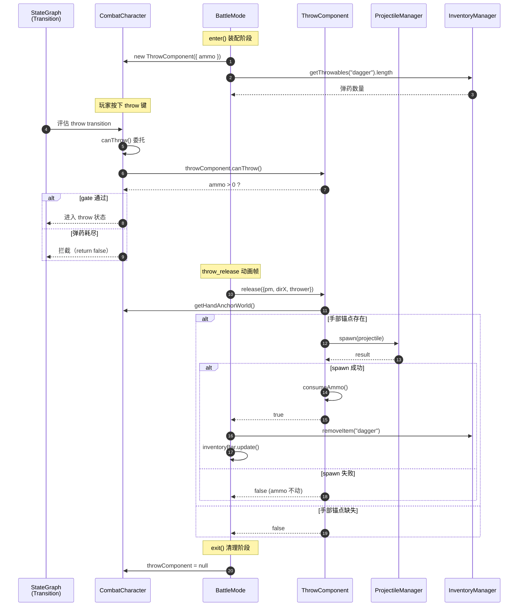

## 1. High-Level Summary (TL;DR)

*   **Impact:** **Medium** — 引入新的 **ThrowComponent** 组件重构投掷逻辑，同时修复 `ItemDef` 双源不一致问题。
*   **Key Changes:**
    *   ✨ **新增 `ThrowComponent`**：独立管理角色投掷弹药 + Projectile spawn 原子性保证。
    *   🔧 **`CombatCharacter`**：新增 `throwComponent` 字段和 `canThrow()` 委托 gate，状态机条件检查支持 throw gate。
    *   🔄 **`BattleMode`**：重构 `#onThrowRelease`，装配/清理 `ThrowComponent`，并接管 Inventory 同步职责。
    *   📦 **数据层同步**：在 `Data/ItemDefs.js` 和 `Data/SceneDefs/ep1_tavern_hall.json` 中同时为 `dagger` 添加 `throwable: true`。
    *   📝 **记录技术债**：在 `plans/BACKLOG.md` 中记录 ItemDef 双源漂移问题。

---

## 2. Visual Overview (Code & Logic Map)

### 投掷动作触发与执行流程



### 模块职责分层

```mermaid
graph TD
    subgraph "Data Layer"
        ItemDefs["Data/ItemDefs.js<br/>(集中注册表)"]
        SceneDef["Data/SceneDefs/ep1_tavern_hall.json<br/>(场景内联)"]
    end

    subgraph "scripts/Enties"
        CombatChar["CombatCharacter<br/>🎯 gate + 状态机入口"]
    end

    subgraph "scripts/Components (新增)"
        ThrowComp["ThrowComponent<br/>🎯 ammo + spawn 原子性"]
    end

    subgraph "scripts/Systems/Modes"
        BattleMode["BattleMode<br/>🎯 装配/清理 + Inventory 同步"]
        ProjMgr["ProjectileManager<br/>(实际 projectile 管理)"]
    end

    subgraph "scripts/Systems"
        InvMgr["InventoryManager<br/>(背包状态)"]
    end

    ItemDefs -.throwable: true.-> SceneDef
    SceneDef -->|PickableEntity| InvMgr

    BattleMode -->|mount/unmount| CombatChar
    BattleMode -->|enter: getThrowables| InvMgr
    BattleMode -->|exit: removeItem| InvMgr
    CombatChar -->|持有引用| ThrowComp
    BattleMode -->|release()| ThrowComp
    ThrowComp -->|spawn()| ProjMgr

    style ThrowComp fill:#c8e6c9,color:#1a5e20
    style CombatChar fill:#bbdefb,color:#0d47a1
    style BattleMode fill:#fff3e0,color:#e65100
    style InvMgr fill:#f3e5f5,color:#7b1fa2
```

---

## 3. Detailed Change Analysis

### 📦 数据层 (`Data/`)

**What Changed:** 在 `dagger` 物品定义中新增 `throwable: true` 标志位，**两处必须同步**——`Data/ItemDefs.js`（集中注册表）和 `Data/SceneDefs/ep1_tavern_hall.json`（场景内联）。

| 文件 | 字段 | 新增值 | 说明 |
|---|---|---|---|
| `Data/ItemDefs.js` | `dagger.throwable` | `true` | 集中注册表（Quest/NPC 链路使用） |
| `Data/SceneDefs/ep1_tavern_hall.json` | `dagger.throwable` | `true` | 场景内联（PickableEntity 实际消费） |

> ⚠️ **双源漂移风险**：详见 `plans/BACKLOG.md` 记录。当前两处已同步，但根因（应在运行时由 `itemId` 引用拉取）尚未根治。

---

### 🆕 新组件 (`scripts/Components/ThrowComponent.js`)

**What Changed:** 新建独立组件类，封装投掷核心逻辑（**82 行**）。职责边界清晰：

*   ✅ 维护 `ammo` 计数（带 `MAX_AMMO = 99` 上限）
*   ✅ 提供 `canThrow()` / `consumeAmmo()`
*   ✅ `release()` 内部原子性保证：**spawn 失败则 ammo 不扣**
*   ❌ **不感知** `InventoryManager`（Inventory 同步由 BattleMode 负责）
*   ❌ **不做** gate 拦截（gate 在 `CombatCharacter._matchesTransitionCondition`）

**关键 API：**

```javascript
class ThrowComponent {
    static MAX_AMMO = 99;
    constructor({ ammo = 0 })
    canThrow()         // ammo > 0
    consumeAmmo()      // ammo--
    release({ projectileManager, dirX, thrower })
        // 原子性：handAnchor 检查 → pm.spawn() → consumeAmmo()
        // 返回 true = 成功 + ammo 已扣；false = 失败（ammo 不动）
}
```

**设计亮点：** 之前散落在 `BattleMode.#onThrowRelease` 的硬编码 dagger 配置（velocity、arcHeight、gravity 等参数）原封不动迁移到此，行为保持一致。

---

### 🎭 角色层 (`scripts/Enties/CombatCharacter.js`)

**What Changed:**

*   **构造函数**（行 49-54）：新增 `this.throwComponent = null`，注释明确"非所有角色都有"。
*   **新增委托方法** `canThrow()`（行 113-119）：
    ```javascript
    canThrow() {
        return this.throwComponent?.canThrow?.() ?? false;
    }
    ```
    用途：供 StateGraph transition 评估调用。`throwComponent` 为 null 时永远返回 `false`（无投掷能力的角色）。
*   **Gate 强化**（行 161-164）：`_matchesTransitionCondition` 中针对 `command === "throw"` 添加额外 gate——弹药耗尽则连 throw 状态都不进入：

    ```javascript
    if (condition.command === "throw" && !this.canThrow()) {
        return false;
    }
    ```

---

### ⚔️ 战斗模式 (`scripts/Systems/Modes/BattleMode.js`)

**What Changed:** 重构投掷逻辑，遵循"职责分层"原则。

#### 3a. **enter 阶段**（行 60-72）：装配 ThrowComponent

```javascript
import { ThrowComponent } from "../../Components/ThrowComponent.js";
// ...
const { inventoryManager } = this.context;
for (const c of this._combatants ?? []) {
    if (c?.kind === "player" && inventoryManager) {
        const ammo = inventoryManager.getThrowables("dagger").length;
        c.throwComponent = new ThrowComponent({ ammo });
        console.log(`[BattleMode] ThrowComponent mounted on ${c.id}, ammo=${ammo}`);
    }
}
```

> 📝 **限制**：当前仅玩家装配，AI 路径延后——等 `BattleDef` 支持 `throwAmmo` 配置后再扩展。

#### 3b. **exit 阶段**（行 93）：清理 ThrowComponent

```javascript
combatant.throwComponent = null;  // 战斗 scope，不跨战斗
```

#### 3c. **`#onThrowRelease` 重构**（行 287-335）：从内联 spawn 改为委托

| 阶段 | Before | After |
|---|---|---|
| 手部锚点检查 | BattleMode 内联 | 委托给 `ThrowComponent` |
| Projectile spawn | BattleMode 内联硬编码 dagger 配置 | `ThrowComponent.release()` |
| Ammo 扣减 | ❌ 缺失 | ✅ 由 ThrowComponent 原子性保证 |
| Inventory 同步 | ❌ 缺失 | ✅ BattleMode 在 `success && player` 时调用 `inv.removeItem` |

**职责划分：**

| 模块 | 负责 |
|---|---|
| **BattleMode** | 携带 sprite 视觉、opponent → dirX 计算、Inventory 同步 |
| **ThrowComponent** | handAnchor 检查、Projectile spawn、ammo 原子性 |

**关键代码片段（新增同步逻辑）：**
```javascript
const success = tc.release({ projectileManager: this._projectileManager, dirX, thrower });

// 同步背包 — 玩家扔成功才减，AI 不走 Inventory
if (success && thrower.kind === "player") {
    const inv = this.context.inventoryManager;
    if (inv) {
        inv.removeItem("dagger");
        const game = this.context.scene?._game;
        game?.inventoryBar?.update(inv.items);
        console.log(`[BattleMode] dagger thrown — ammo=${tc.ammo}, inventory daggers=${inv.getThrowables("dagger").length}`);
    }
}
```

---

### 📋 待办记录 (`plans/BACKLOG.md`)

**What Changed:** 新增一条 ItemDef 双源不一致的技术债记录，明确根因和当前缓解措施。

| 新增条目 | 优先级 | 状态 |
|---|---|---|
| ItemDef 双源不一致（`Data/ItemDefs.js` vs `SceneDefs` JSON 内联） | 低 | 已记录；当前 dagger 两边都加，后续投掷物需手动同步 |

---

## 4. Impact & Risk Assessment

### ⚠️ Breaking Changes

*   **无对外 API 破坏**：本次为内部重构，不影响外部调用接口。
*   **行为兼容性**：dagger 配置（velocity/arcHeight/gravity 等参数）原封不动迁移到 `ThrowComponent.release()`，投掷手感应保持一致。

### 🐛 潜在风险点

| 风险 | 说明 | 缓解建议 |
|---|---|---|
| **AI 路径未实现** | 仅 `kind === "player"` 装配 ThrowComponent；敌人投掷未启用 | 待 `BattleDef.throwAmmo` 配置落地后再扩展 |
| **双源数据漂移** | `Data/ItemDefs.js` 与 `SceneDefs` JSON 必须手动同步 | 根因方案：统一改为 `itemId` 引用式（已在 BACKLOG 记录） |
| **Gate 重复检查** | `CombatCharacter` 的 gate 与 `ThrowComponent.canThrow()` 重复 | 当前是有意的双层保护（transition 评估 + release 内部）；保留 |
| **Inventory 同步副作用** | `removeItem` 失败但 `ThrowComponent.release` 已成功会造成双源不一致 | 当前未防御 Inventory 异常；建议后续在 `release()` 返回 false 时一并回滚 |

### ✅ Testing Suggestions

1.  **Gate 拦截测试**：
    *   玩家背包无 dagger（`getThrowables("dagger").length === 0`）→ 按 throw 键不应进入 throw 状态。
    *   战斗中消耗完弹药 → `throwComponent.canThrow() === false` → 后续 throw 输入被拦截。

2.  **Inventory 同步测试**：
    *   玩家投掷成功 → `InventoryManager` 中 dagger 数量应减 1，`InventoryBar` UI 同步刷新。
    *   玩家投掷失败（handAnchor 缺失）→ **背包不应减少**。

3.  **生命周期测试**：
    *   进入战斗 → `character.throwComponent` 非 null。
    *   退出战斗 → `character.throwComponent` 置 null（不跨战斗残留）。
    *   重新进入战斗 → ammo 从当前背包 dagger 数量重新初始化。

4.  **跨场景测试**：
    *   场景内捡到 dagger → 背包增加 → 进入战斗时 `ThrowComponent.ammo` 应同步正确。
    *   AI 角色（`kind !== "player"`） → `throwComponent` 应为 null。

5.  **数据同步测试**：
    *   单独修改 `Data/ItemDefs.js` 但不改 SceneDefs（或反之） → 当前实现下两边独立维护可能漂移，应作为未来重构验证项。
]<]minimax[>[