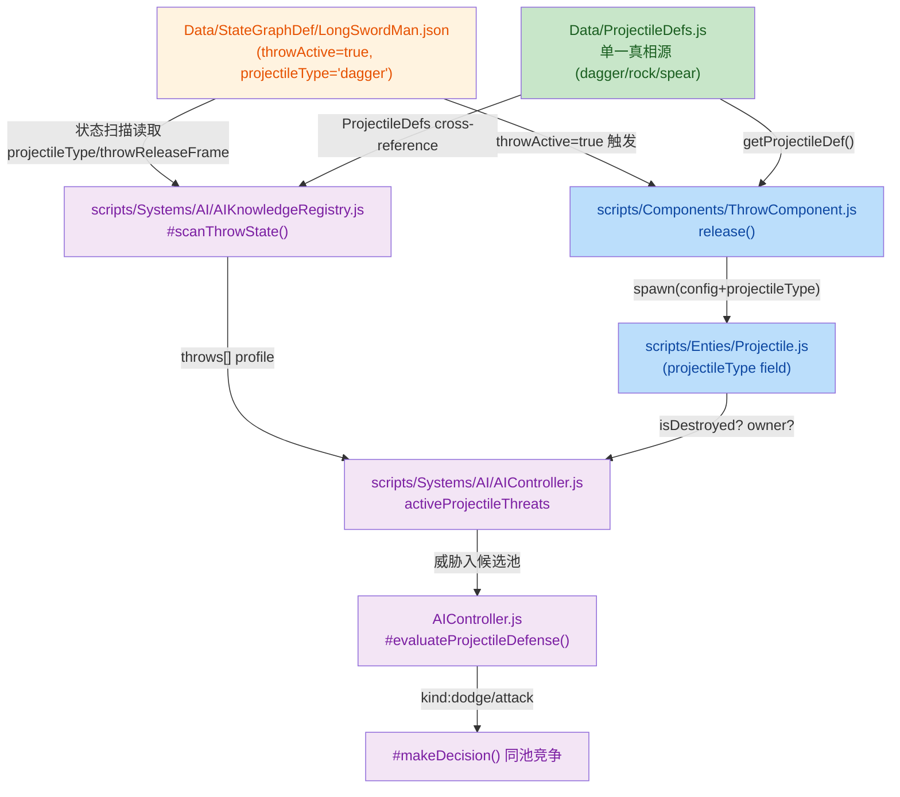
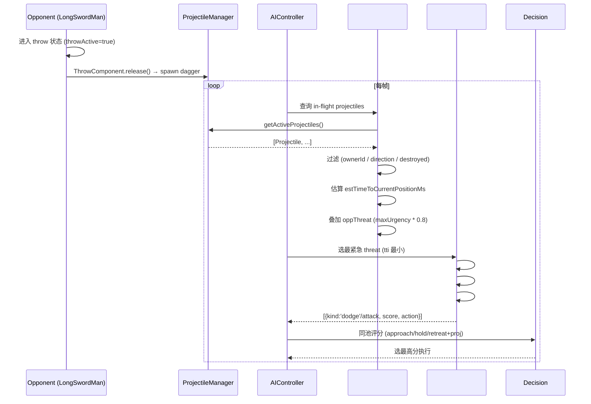

# Phase 3：投掷物系统 + AI 投掷防御 整体接入

## 1. High-Level Summary (TL;DR)

*   **Impact:** 🔴 **High** —— 引入投掷物类型定义系统（ProjectileDefs）、重构投掷组件（ThrowComponent）、新增 AI 投掷物感知与防御评分（dodge / cut）。是一次**架构级**变更，跨越资产、数据、组件、AI 与战斗模式 5 个层次。
*   **Key Changes:**
    *   ✨ **新增** `Data/ProjectileDefs.js` 作为投掷物静态属性的**单一真相源**（dagger / rock / spear）。
    *   ✨ **新增** `LongSwordMan` 的 throw 状态机配置（`throwActive`、`projectileType`、`throwReleaseFrame`）。
    *   🔧 **重构** `ThrowComponent.release()`：从硬编码 → 读取 ProjectileDefs；新增 `DEBUG_INFINITE_AMMO` 调试开关与 `setProjectileType()` 注入点。
    *   🐛 **修正** LongSwordMan 投掷动画 `duration: 300→700`、移除所有 pushbox（pushboxPng=null），并将图片元数据路径迁移到 `C:\se\BlindDuel\`。
    *   🤖 **扩展** AI：`AIKnowledgeRegistry` 新增 throw 扫描（schema v3）；`AIController` 引入 in-flight projectile 威胁评估 + `#evaluateProjectileDefense`（dodge & cut）完整评分管线。
    *   ⚡ **节奏加速**：`AITuning` 决策间隔 `200→100ms`、攻击冷却 `1000→500ms`，并新增 `threatPerPhase.throw_windup` 与 `projectileDefense` 调参块。

---

## 2. Visual Overview (Code & Logic Map)

### 2.1 投掷物系统数据流



### 2.2 AI 投掷防御决策流



---

## 3. Detailed Change Analysis

### 3.1 🎨 美术资源（longswordman_throw）

| 文件 | 变更 | 影响 |
|---|---|---|
| `Art/RawAssets/longswordman/longswordman_throw.ase` | 二进制差异 | 源 ASE 重导出 |
| `Art/Sprite/longswordman/longswordman_throw.json` | `duration: 300→700`，image path `E:\→C:\` | **节奏变慢** 2.3×；本地路径迁移 |
| `Data/CollisionMask/longswordman/longswordman_throw.json` | 同上（镜像同步） | 同上 |
| `Data/CollisionMask/longswordman/longswordman_throw.collider.json` | 4 个 `pushbox_*` 全部移除，`pushboxPng: null` | ✨ **移除物理推挤盒** |

> 💡 **解读：** `duration` 翻倍 → throw 动画明显变慢，与下文 `startupMs` 时序算法一致（`throwReleaseFrame=3` 意味着释放前的 windup 时长被计入 threat 评分）。`pushbox` 移除通常意味着该动作期间**不再参与地面挤压碰撞**。

---

### 3.2 📦 Data 模块

#### `Data/ProjectileDefs.js`（**新增文件**）

```js
export const ProjectileDefs = {
    dagger: { speed:6, launchVy:1, gravity:4, arcHeight:1.5,
              damage:1, cuttable:true, lifetimeMs:4000,
              spriteUrl:"./Art/Sprite/projectiles/proj_dagger.png",
              frame:{w:32,h:6}, sourceSize:{w:32,h:6} },
    rock:   { speed:5, launchVy:1.2, gravity:4, arcHeight:2.0,
              damage:1, cuttable:false, /*...*/ },
    spear:  { speed:8, launchVy:0.8, gravity:4, arcHeight:0.8,
              damage:2, cuttable:true, /*...*/ },
};
```

*   单一真相源：所有投掷物的动力学 / 伤害 / 渲染参数。
*   提供 `getProjectileDef(typeId)` 工具函数。
*   ⚠️ `rock` 不可斩落（`cuttable: false`），AI 仅能 dodge。

#### `Data/StateGraphDef/LongSwordMan.json` —— throw 状态配置

| 新增字段 | 值 | 含义 |
|---|---|---|
| `throwActive` | `true` | 与 `attackActive` 互斥，标识投掷态 |
| `projectileType` | `"dagger"` | 引用 ProjectileDefs |
| `throwReleaseFrame` | `3` | 第 3 帧为释放点（用于计算 `startupMs`）|

#### `Data/AITuning.js` —— AI 调参

| 参数 | 旧值 | 新值 | 说明 |
|---|---|---|---|
| `decisionIntervalMs` | 200 | **100** | 决策频率翻倍 |
| `attackCooldownMs` | 1000 | **500** | 攻击节奏翻倍 |
| `threatPerPhase.throw_windup` | — | **0.5** | 新增：对手投掷 windup 阶段的基础威胁 |

**新增模块 `projectileDefense`：**

| 键 | 值 | 用途 |
|---|---|---|
| `dodgeBase` | 0.45 | dodge 基础分 |
| `cutBase` | 0.65 | cut 基础分（高于 dodge） |
| `dodgeTimeWindowPeak` | 300 ms | dodge 完美窗口宽度 |
| `dodgeTooLateRatio` | 0.5 | 太晚衰减系数 |
| `dodgeTooEarlySpan` | 700 ms | 太早衰减跨度 |
| `cutTooSlowSpan` | 500 ms | cut 衰减跨度 |
| `nearSelfDecay` | 0.2 | 飞过身边的折扣 |
| `cutBoostBonus` | 0.1 | cut 奖励感加成 |

---

### 3.3 🛠️ 组件 & 实体

#### `scripts/Components/ThrowComponent.js`

*   ✨ 新增 `DEBUG_INFINITE_AMMO = true`（与 `canThrow` / `consumeAmmo` / `BattleMode` 库存联动）
*   ✨ 新增 `setProjectileType(typeId)` —— 装配期注入
*   🔧 `release()` 改为读取 ProjectileDefs：

```js
const typeId = this.projectileTypeId ?? "dagger";
const def = getProjectileDef(typeId);
if (!def) { console.error(...); return false; }
projectileManager.spawn({
    ...,
    velocity:   { x: dirX * def.speed, y: def.launchVy },
    frame:      def.frame,
    sourceSize: def.sourceSize,
    spriteUrl:  def.spriteUrl,
    cuttable:   def.cuttable,
    damage:     def.damage,
    lifetimeMs: def.lifetimeMs,
    arcHeight:  def.arcHeight,
    gravity:    def.gravity,
    projectileType: def.typeId,   // ★ 新增 cross-reference 字段
});
```

#### `scripts/Enties/Projectile.js`

*   ✨ 新增字段 `this.projectileType = config.projectileType ?? null;`  
    → 供 AI 侧 `projectileDefs[p.projectileType]` profile lookup。

---

### 3.4 🤖 AI 系统

#### `scripts/Systems/AI/AIKnowledgeRegistry.js`

*   Schema 版本：`2 → 3`（新增 throw 扫描，强制重缓存）。
*   ✨ 新增 `throwProfiles[]` 与 `#scanThrowState(stateName, stateDef, clipDef, warnings)`：
    *   与 `ProjectileDefs` **cross-reference**：未匹配则 warning 并跳过；
    *   `startupMs = Σ atlasFrames[0..throwReleaseFrame).durationMs`；
    *   `totalMs = Σ atlasFrames[*].durationMs`。

#### `scripts/Systems/AI/AIController.js`

**依赖注入：**

```js
this.projectileManager = null;          // 延迟注入
this.projectileDefs = ProjectileDefs;   // 静态模块直接 import
// setProjectileManager(pm) 在 BattleMode.enter() 末尾调用
```

**局面分析 `#analyzeSituation()` 扩展：**

*   新增 `oppPhase = "throw_windup"`：检测 `oppDef.throwActive === true` 且命中 `opponentKB.throws[]`。
*   新增 `oppThrowProfile` 字段，与 `oppAttackProfile` 并列。
*   新增 `activeProjectileThreats` 数组（独立于 oppPhase），过滤条件：
    1. `p.ownerId === this.opponent.id`
    2. `!p.isDestroyed`
    3. 方向：`Math.sign(dirX) === Math.sign(p.velocity.x)`（朝 self 飞）
    4. TTI 估算：`distanceToSelf / |vx| * 1000`
*   紧急度叠加：`oppThreat = max(oppThreat, maxUrgency * 0.8)`，其中 `maxUrgency = max(0, 1 - tti/1500)`。

**新增防御评分模块：**

| 方法 | 职责 |
|---|---|
| `#evaluateProjectileDefense(sit)` | 选最紧急 threat → 调用 dodge/cut 评分 |
| `#findBestDodgeForProjectile(tti, threat)` | 从 `kbProfile.dodges` 选窗口最优（不是最快） |
| `#scoreDodgeForProjectile(dodge, tti, threat)` | `dodgeBase × timeWindowFactor × defenseMult × nearSelfDecay` |
| `#findBestSlashForProjectile(tti, threat)` | 从 `kbProfile.attacks[trajectory==='slash']` 选 timingAlignment 最优 |
| `#scoreCutForProjectile(slash, tti, threat)` | `cutBase × timingAlignment × distanceAlignment × attackMult × (1+cutBoostBonus)` |

> 💡 **GPT 修订注释明确指出**："评分和执行用同一个 action"——即 `#makeDecision()` 不再重新选 action，避免与评分阶段不一致。

#### `scripts/Systems/Modes/BattleMode.js`

*   在 `enter()` 末尾向所有 `controller.setProjectileManager(_projectileManager)` 注入。
*   玩家库存扣减逻辑加门控 `&& !ThrowComponent.DEBUG_INFINITE_AMMO`，调试模式下不会误扣 dagger。

---

## 4. Impact & Risk Assessment

### ⚠️ 风险点

| 类别 | 风险 | 说明 |
|---|---|---|
| 🐛 **资产路径漂移** | 中 | sprite meta 路径 `E:\→C:\`，若他人环境仍在 `E:\` 会导致加载失败。建议保留 `${WORKSPACE}` 变量或 CI 重新生成 atlas。 |
| ⚡ **节奏突变** | 高 | `decisionIntervalMs` 与 `attackCooldownMs` 双双减半 → AI 行动频率 **2×**，可能与原有测试期望不符，需重跑战斗回归。 |
| 🧪 **DEBUG 旗标泄漏** | **关键** | `ThrowComponent.DEBUG_INFINITE_AMMO = true` 是**默认开启**的，可能影响生产逻辑。建议在打包前自动替换为 `false` 或添加构建时检查。 |
| 📦 **新投掷物未加载** | 低 | `rock` / `spear` 仅定义但无对应美术/碰撞资源，若直接引用会运行时 missing sprite。 |
| 🧠 **AI 复杂度激增** | 中 | 新增 throw_windup + projectileThreat + 4 个评分方法，单次 `#analyzeSituation` 开销明显增大，可能影响 60 FPS 目标。**建议**：对 `projectileManager.getActiveProjectiles()` 增加早退门控（例如 `length === 0` 时跳过整个 threat 计算）。 |

### ✅ 测试建议

1. **基础冒烟**：玩家对 AI LongSwordMan，AI 进入 throw 状态应正常 spawn dagger；不消耗背包（DEBUG 模式）。
2. **AI 防御覆盖**：在 AI 面前不同距离（< 0.2 / 中等 / 远）持续 throw，验证 dodge 与 cut 评分曲线与 `nearSelfDecay` 一致。
3. **节奏压测**：`decisionIntervalMs=100` 下观察 AI 是否出现"反复抖动选招"——若分数差异 < ε 应引入 hysteresis。
4. **路径兼容**：跨平台构建/打包后 sprite 是否能正确加载（验证 meta 路径与最终 runtime 路径一致）。
5. **Pushbox 移除**：碰撞测试中 throw 期间双方是否能相互穿过（不再有 pushbox 推开）。
6. **throw_windup 威胁**：近距离对峙，AI 应优先 retreat/dodge 而不是莽进 attack（验证 `threatPerPhase.throw_windup=0.5`）。
7. **ProjectileDefs cross-reference**：临时把 LongSwordMan 的 `projectileType` 改成 `"rock"`，应触发 warning 且 AI 仍能正确 dodge（cut 不可用）。

### 💡 后续建议（不在本次 diff 范围）

*   把 `DEBUG_INFINITE_AMMO` 接入构建系统（dev=true / prod=false）。
*   为 `rock` / `spear` 准备完整美术资源 + StateGraph throw 状态。
*   在 `ProjectileManager` 上提供 `getActiveProjectiles()` 的空间索引版本，避免 N×M 的 O(n²) 潜在问题（若 projectile 数量上升）。
*   提取 `release()` 中的 `startPos` / `handWorld` 计算到独立 helper，便于将来 throw 状态变体（overhead / low throw）复用。

---

> 📌 **整体评价**：本次变更架构清晰——通过 **ProjectileDefs 单一真相源** 把数据从代码中分离，AI 与组件消费同一份定义，避免重复硬编码。`#evaluateProjectileDefense` 的"评分即 action"设计也避免了双重决策的不一致风险。主要关切点是**调试旗标默认开启**与**AI 节奏参数双倍加快**对生产环境/性能的影响。