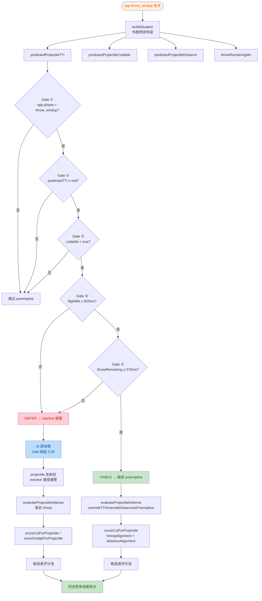
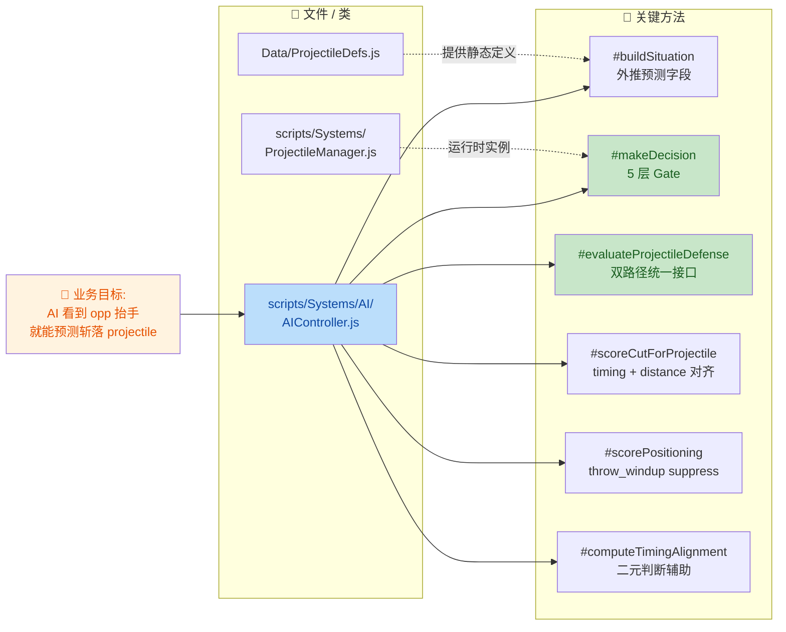

## 1. 高级摘要（TL;DR）

*   **影响：** ⚡ **高** — 核心 AI 决策逻辑新增「投掷物预测拦截」机制，从纯反应式升级为「反应式 + 预判式」双路径，影响 `AIController.js` 的 `#buildSituation` / `#makeDecision` / `#scorePositioning` 三大模块
*   **关键变化：**
    *   ✨ **预判链**：`#buildSituation` 在对手 `throw_windup` 阶段外推 4 个新字段（`predictedProjectileTTI` / `predictedProjectileCuttable` / `predictedProjectileDistance` / `throwRemainingMs`）
    *   ✨ **Evaluator 重构**：`#evaluateProjectileDefense` 增加 `options` 参数（`overrideTTI` / `overrideCuttable` / `overrideDistance` / `isPreemptive`），统一服务 reactive / preemptive 两条路径
    *   ✨ **5 层 Gate**：在 `#makeDecision` 中新增 preemptive 门控（oppPhase / TTI / cuttable / flightMs / throwRemainingMs）
    *   🐛 **Bug 修复**：`timingAlignment` 改为二元判断（消除"too-early"折扣）；`distanceAlignment` 改为预测「slash 激活时刻」projectile 距离而非当前距离
    *   🐛 **Bug 修复**：`#scorePositioning` 在 throw_windup + cuttable 时抑制 approach（×0.1）+ hold 保底 0.05，避免改变距离打乱 reactive 窗口
    *   📄 **文档同步**：`PROJECT_CONTEXT.md` / `plans/INDEX.md` / `plans/HandOff.MD`（新增 221 行设计交接文档）

---

## 2. 可视化概览（业务逻辑图）

### 2.1 投掷物防御双路径决策流



### 2.2 模块 ↔ 业务目标 ↔ 关键方法 映射



---

## 3. 详细变更分析

### 3.1 核心 AI 决策器（`scripts/Systems/AI/AIController.js`）

#### A. Step 1：预测链（`#buildSituation` 新增 4 字段）

在 `oppPhase === "throw_windup"` 时，从 `throwProfile` + `projectileDef` 外推预测字段：

| 新增字段 | 类型 | 公式 | 用途 |
|---------|------|------|------|
| `predictedProjectileTTI` | `number \| null` | `throwRemainingMs + (distance / projectileSpeed) × 1000` | 预测 projectile 到达 self 的总时间 |
| `predictedProjectileCuttable` | `boolean` | `oppThrowProfile.cuttable === true` | 是否可被斩 |
| `predictedProjectileDistance` | `number \| null` | `distance`（保守取当前 fighter 间距离） | 距离预测基线 |
| `throwRemainingMs` | `number` | `max(0, startupMs − oppNormTime × totalMs)` | 距 opp release 还剩多久 |

#### B. Step 2：Evaluator 重构（`#evaluateProjectileDefense` 签名扩展）

**Before：**
```javascript
#evaluateProjectileDefense(sit) // 只接受 reactive 真实 threat
```

**After：**
```javascript
#evaluateProjectileDefense(sit, options = {})  // 接受 override 参数
```

| `options` 字段 | 类型 | 来源路径 | 作用 |
|--------------|------|---------|------|
| `overrideTTI` | `number` | preemptive | 用预测 TTI 替代 `estTimeToCurrentPositionMs` |
| `overrideCuttable` | `boolean` | preemptive | 强制 cuttable（来自 `throwProfile`） |
| `overrideDistance` | `number` | preemptive | 预测距离 |
| `isPreemptive` | `boolean` | preemptive | 标记来源，影响 reason 字段 + 抑制 dodge 分支 |

**重要行为变化：**
*   `isPreemptive=true` 时**不产出 dodge 候选**（避免 windup 早期 commit dodge 锁死 reactive 窗口）
*   合成 `effectiveThreat` 对象统一给下游 `#findBestSlash` / `#scoreCut` 使用

#### C. Step 3：5 层 Gate（`#makeDecision` 新增 preemptive 分支）

| Gate 层 | 条件 | 不满足时行为 |
|---------|------|-------------|
| ① | `opp.phase === "throw_windup"` | 跳过整个 preemptive 路径 |
| ② | `predictedProjectileTTI != null` | 跳过（无预测数据） |
| ③ | `predictedProjectileCuttable === true` | 跳过（无法斩） |
| ④ | `predictedFlightMs ≤ viableFlightCutoff`（默认 820ms） | DEFER → 走 reactive |
| ⑤ | `throwRemainingMs ≤ bestActiveEnd` | DEFER（opp 投出时 weaponbox 已挥完） |

**Viability 公式：**
```
viableFlightCutoff = bestActiveEnd + 0.5 × cutTooSlowSpan
canPreemptive = (flightMs ≤ viableFlightCutoff) && (throwRemaining ≤ bestActiveEnd)
```

#### D. Step 4：throw_windup Suppress（`#scorePositioning`）

| 分支 | 变化 | 物理目的 |
|------|------|---------|
| `approachScore` | `× 0.1`（几乎归零，保留 tie-break 余地） | 防止 AI 改变 release 时的距离 |
| `holdScore` | `max(holdScore, 0.05)` 保底 | 让 AI 原地站住等 reactive 窗口 |

#### E. Bug 修复：评分公式

| Bug | Before | After |
|-----|--------|-------|
| `timingAlignment` 有 "too-early" 衰减 | `max(0, 1 − (activeStart − tti) / activeStart)` | 二元：`tti < activeStart → 0`，否则 `1.0` |
| `distanceAlignment` 用当前距离 | `threat.distanceToSelf` 直接对比 reach | 预测 `slash 激活时刻` projectile 距离（用 `projectileSpeed × activeStart/1000` 推算） |
| 抽公共方法 | 三段式重复写在两处 | 新增 `#computeTimingAlignment(tti, activeStart, activeEnd)` 纯函数 |

**distanceAlignment 新公式：**
```javascript
distTraveledByActive = projectileSpeed × (activeStart / 1000)
predictedDistAtActive = max(0, distanceToSelf − distTraveledByActive)
distTraveledByMid    = projectileSpeed × (activeMidpointMs / 1000)
predictedDistAtMid   = max(0, distanceToSelf − distTraveledByMid)
criticalDist         = min(predictedDistAtActive, predictedDistAtMid)  // 取最紧约束
distanceAlignment    = criticalDist ≤ slashReach ? 1.0 : max(0, 1 − (criticalDist − slashReach) / 1.0)
```

---

### 3.2 项目文档（`PROJECT_CONTEXT.md`）

**What Changed：** AI 系统说明章节更新
*   标注「投掷物防御 reactive + preemptive 双路径」
*   补充 5 个新方法的签名（`#evaluateProjectileDefense` / `#findBestSlashForProjectile` / `#scoreCutForProjectile` / `#scoreDodgeForProjectile` / `#computeTimingAlignment`）
*   新增 `AIKnowledgeRegistry` 的 `throw state cross-reference` 校验说明
*   系统拓扑图新增 `ProjectileDefs` / `ProjectileManager` 两个依赖节点

---

### 3.3 计划索引（`plans/INDEX.md`）

**What Changed：**
*   当前进行中状态从「Phase 4 aiProfile 配置落地」改为「无活跃计划」
*   新增「Update Log (2026-10-08)」章节，记录本次 5 步落地详情
*   新增「最近归档」表格，归档「26.10.7 投掷物预测-拦截机制计划」

**Update Log 要点：**

| 维度 | 内容 |
|------|------|
| 落地范围 | Step 1（预测链）+ Step 2（evaluator 重构）+ Step 3（5 层 gate）+ Step 4（positioning suppress）+ Step 5（文档同步） |
| 修的 bug | 4 个（timingAlignment 衰减、distanceAlignment 当前距离、preemptive dodge 早期产出、gate cutoff 820ms 太宽） |
| 物理边界 | reactive cut 2.5m-6.5m 80%+ 可靠；preemptive cut 仅 ≤2.5m + throwRemaining ≤100ms 1-2 tick 窗口 |
| 未解决 | 极近距离 <2.5m 物理不可能（flightMs < swing startupMs 420ms），留 BACKLOG B4「拦截 throw」处理 |

---

### 3.4 新增设计交接文档（`plans/HandOff.MD` ⭐ 新文件）

**性质：** 221 行新文件，**纯设计文档**（不涉及代码逻辑修改）

**结构：**

| 章节 | 内容 |
|------|------|
| §1 项目上下文 | 游戏类型、技术栈、AI 架构四层分离、当前进度 |
| §2 缺口描述 | 现有 2 条提前量链路（reactive 防御 / reactive TTI）都做不到 throw_windup 阶段预测 |
| §3 现有局限 | 链路 A 走 attackActive 路径不接 throw；链路 B 依赖已存在 projectile 实例 |
| §4 架构影响 | 现有预测式逻辑已存在（`#scoreDefense` / `#scoreAttack`），preemptive cut 是同一套逻辑的 2 层延伸 |
| §5 建议补法 | 数据流（`#buildSituation` + `#makeDecision`）+ 评分复用 + 调试支持 |
| §6 不在范围 | 预测 dodge / 侧移 strafe / 抛物线 / 取消检测 |
| §7 参考文件 | 4 个相关文件索引 |

---

## 4. 物理边界与影响

### 4.1 物理边界结论

| 路径 | 距离窗口 | 时间窗口 | 可靠性 |
|------|---------|---------|--------|
| **Reactive cut** | 2.5m - 6.5m | 全程 | 80%+ 成功率 |
| **Preemptive cut** | ≤ 2.5m | throwRemaining ≤ 100ms | 1-2 个决策 tick 窗口 |
| **Reactive dodge** | 全程 | projectile 飞行期内 | 高（reactive 窗口 600ms 够用） |
| **Preemptive dodge** | — | — | ❌ 禁用（会锁 recovery 耽误 reactive） |

### 4.2 风险与破坏性变更

| 风险 | 等级 | 说明 |
|------|------|------|
| **API 签名变更** | ⚠️ 中 | `#evaluateProjectileDefense` 新增可选 `options` 参数，向后兼容（默认 `{}`） |
| **Situation 字段扩展** | ✅ 低 | 4 个新字段均为可选添加，下游消费方可选读取 |
| **物理边界外的兜底** | ✅ 低 | 5 层 gate + 物理公式保证不误触发；DEFER 时走老路径 |
| **Action Commitment 风险** | ⚠️ 中 | AI 提前 commit slash，对手取消投掷则 AI 挥空 — 与现有 `preemptiveBonus` 风险对称，已在设计接受范围 |
| **Behavior 漂移** | ⚠️ 中 | `distanceAlignment` 改用预测距离，所有 cut 评分（不仅 projectile）都更严，理论上会降低部分"边界可达"切的成功率 |

### 4.3 测试建议

| 场景 | 期望行为 |
|------|---------|
| opp 距离 2.0m 抬手 throw_windup | preemptive cut 候选进评分池，AI 提前出 slash 截胡 |
| opp 距离 4.0m 抬手 throw_windup | gate ④ 触发 DEFER，AI 原地 hold 等 reactive |
| opp 距离 6.0m 抬手 throw_windup | gate ④ 拒绝，AI 继续原有 approach / attack 决策 |
| projectile 已 in-flight | reactive 路径不受影响，dodge + cut 正常产出 |
| throw_windup 早期（throwRemaining 较大） | gate ⑤ 拒绝，hold 保底 0.05 生效 |
| throw_windup 后期（throwRemaining ≤ 100ms）| gate ⑤ 通过，preemptive cut 可能胜出 |
| `debugVisible = true` 打开 | 日志应输出 `preemptive_gate` / `preemptive_cut` 两类诊断信息 |
| 物理极近（distance < 2.5m, flightMs < 420ms）| 两条路径都可能 miss，验证 BACKLOG B4 拦截 throw 是否必要 |

### 4.4 后续未解决问题

| ID | 内容 | 归属 |
|----|------|------|
| **B4** | 极近距离（<2.5m）reactive cut 物理不可能（flightMs < swing startupMs=420ms），需「拦截 throw」（直接打 opp 打断投掷） | BACKLOG |
| **B5** | preemptive strafe（侧移躲） | BACKLOG / Phase 5 |
| **B1** | 预测 opp 招式区分（不同 throw 状态映射） | Phase 5 统一预测架构 |
| **B6** | 预测能力调节（`predictionAccuracy` 旋钮） | Phase 5 统一预测架构 |

---

## 5. 关键代码片段（仅供理解算法）

### 5.1 二元 timingAlignment（新公式）

```javascript
#computeTimingAlignment(tti, activeStart, activeEnd) {
    if (tti < activeStart) {
        return 0;           // weaponbox 还没激活 projectile 就到了 → 物理上不可能
    } else {
        return 1.0;         // weaponbox 能先激活 → timing 达标
    }
}
```

### 5.2 5 层 Gate 判定（preemptive 可行性）

```javascript
const bestActiveEnd = Math.min(...slashAttacks.map(s => s.timing.startupMs + s.timing.activeMs));
const viableFlightCutoff = bestActiveEnd + 0.5 * cutTooSlowSpan;
const predictedFlightMs = (predictedProjectileDistance / projectileSpeed) * 1000;
const throwRem = sit.throwRemainingMs ?? 0;

const canPreemptiveRelease = throwRem <= bestActiveEnd;  // Gate ⑤
const canPreemptive = predictedFlightMs <= viableFlightCutoff && canPreemptiveRelease;  // Gate ④ + ⑤
```

---