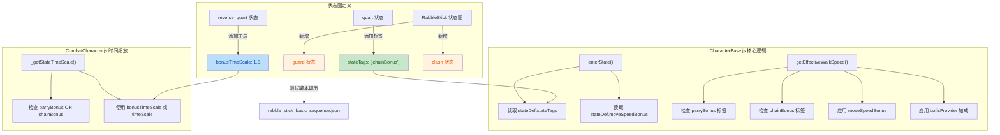

## 📋 高层摘要 (TL;DR)

**影响范围:** 🔴 **中等** - 核心战斗机制重构与新状态添加

**关键变更:**
- 🔧 **连招系统重构:** 将 `parryTimeScale` 重构为通用的 `bonusTimeScale` + 标签系统 (`parryBonus` / `chainBonus`)
- ✨ **新增防御状态:** 为 RabbleStick 添加 `guard` 和 `clash` 两个新状态
- 🚀 **速度加成机制:** 引入 `moveSpeedBonus` 属性，支持基于状态标签的移动速度加成
- 🎮 **测试脚本调整:** 修改测试场景，启用 RabbleStick 的防御行为测试
- 🧹 **代码清理:** 删除已完成的计划文档

---

## 🎨 视觉概览 (逻辑与架构图)



---

## 📊 详细变更分析

### 🎯 1. 连招系统重构 (核心战斗机制)

**变更文件:** `scripts/Enties/CombatCharacter.js`, `Data/StateGraphDef/ManatarmsSword.json`, `Data/StateGraphDef/LongSwordMan.json`

#### 🔄 命名统一与逻辑扩展

| 旧字段 | 新字段 | 变化说明 |
|--------|--------|----------|
| `parryTimeScale` | `bonusTimeScale` | 从特定的"格挡加速"变为通用的"加成加速" |
| 单一 `hasTag("parryBonus")` | `hasTag("parryBonus") \|\| hasTag("chainBonus")` | 支持多种加成类型 |

**代码变更:**

```javascript
// CombatCharacter.js - 修改前
return this.hasTag("parryBonus")
    ? (stateDef.parryTimeScale ?? stateDef.timeScale ?? 1.0)
    : (stateDef.timeScale ?? 1.0);

// CombatCharacter.js - 修改后
const hasBonus = this.hasTag("parryBonus") || this.hasTag("chainBonus");
return hasBonus
    ? (stateDef.bonusTimeScale ?? stateDef.timeScale ?? 1.0)
    : (stateDef.timeScale ?? 1.0);
```

#### 🏷️ 状态标签系统

**Manatarms 连招逻辑调整:**

| 状态 | 旧配置 | 新配置 | 说明 |
|------|--------|--------|------|
| `quart` | `chainTimeScale: 1.5` | `stateTags: ["chainBonus"]` | 用标签标记连招机会 |
| `reverse_quart` | 无 `bonusTimeScale` | `bonusTimeScale: 1.5` | 在连招中享受加速 |

**连招过渡条件变化:**

```json
// 修改前
"when": [{ "command": "reverse_quart" }]

// 修改后
"when": [
  { "command": "reverse_quart" },
  { "hasTag": "chainBonus" }
]
```

⚠️ **重要:** 现在 `reverse_quart` 只能在持有 `chainBonus` 标签时派生，即必须从 `quart` 状态触发连招。

#### ⚡ 帧速度调整

| 状态 | 旧 `frameSpeeds` | 新 `frameSpeeds` | 影响 |
|------|-----------------|-----------------|------|
| `quart` | `[0,0.2,0,-0.7]` | `[0,0.2,0,-1.4]` | 最后一帧加速翻倍 |
| `reverse_quart` | `[0,0.1,-1.4,-0.7]` | `[0,0.1,-1.7,-1]` | 整体加速更明显 |

---

### 🛡️ 2. RabbleStick 新状态添加

**变更文件:** `Data/StateGraphDef/RabbleStick.json`, `scripts/AssetManifest.js`, `scripts/CharacterFactory.js`

#### 📝 状态图更新

在 `RabbleStick.json` 中新增两个状态:

| 状态 | 用途 | 关键属性 |
|------|------|----------|
| **guard** | 防御姿态 | `guardActive: true`, `guardType: "guard"`, `moveSpeedBonus: 1.3` |
| **clash** | 拼刀反馈 | 无特殊属性，纯动画状态 |

**Guard 状态定义:**

```json
"guard": {
  "clip": "guard",
  "allowMoveInput": false,
  "guardActive": true,
  "guardType": "guard",
  "moveSpeedBonus": 1.3,
  "loop": false,
  "transitions": [...]
}
```

#### 🔗 状态过渡添加

在 `idle` 和 `move` 状态中添加到 `guard` 的过渡:

```json
{
  "to": "guard",
  "when": [{ "command": "guard" }]
}
```

#### 📦 资源配置

**AssetManifest.js 新增条目:**

| 资源类型 | guard | clash |
|----------|-------|-------|
| Sprite | `rabble_stick_guard.json` | `rabble_stick_clash.json` |
| Collider | `rabble_stick_guard.collider.json` | `rabble_stick_clash.collider.json` |

**CharacterFactory.js 新增动画配置:**

```javascript
guard: {
    spriteSheetUrl: "./Art/Sprite/rabble_stick/rabble_stick_guard.png",
    atlasData: assets.atlas.rabble.guard,
    colliderData: assets.colliders.rabble.guard,
    loop: false
},
clash: {
    spriteSheetUrl: "./Art/Sprite/rabble_stick/rabble_stick_clash.png",
    atlasData: assets.atlas.rabble.clash,
    colliderData: assets.colliders.rabble.clash,
    loop: false
}
```

---

### ⚡ 3. 速度加成机制实现

**变更文件:** `scripts/Enties/CharacterBase.js`

#### 🆕 新增属性

```javascript
// 在 reset() 中初始化
this._moveSpeedBonus = 1.0;

// 在 enterState() 中设置
this._moveSpeedBonus = stateDef.moveSpeedBonus ?? 1.0;
```

#### 🔁 有效速度计算重构

```javascript
getEffectiveWalkSpeed() {
    let speed = this.baseWalkSpeed;
    
    // 基于状态标签的速度加成
    if (this.hasTag("parryBonus") || this.hasTag("chainBonus")) {
        speed *= this._moveSpeedBonus;
    }
    
    // Buff 提供者加成
    if (this.buffsProvider && typeof this.buffsProvider.getSpeedMultiplier === "function") {
        speed *= this.buffsProvider.getSpeedMultiplier();
    }
    
    return speed;
}
```

**优势:**
- ✅ 支持多种加成源（标签系统 + Buff 系统）
- ✅ 灵活性强，易于扩展
- ✅ 符合游戏设计模式

---

### 🧪 4. 测试与场景配置

**变更文件:** `scripts/Scene.js`, `scripts/SceneDefs.js`, `Data/TestScripts/rabble_stick_basic_sequence.json`

#### 🎮 场景实体调整

| 字段 | 旧值 | 新值 | 说明 |
|------|------|------|------|
| `archetype` | `manatarms_sword` | `rabble_stick` | 恢复为 RabbleStick |
| `name` | `manatarms_sword` | `rabble_stick` | 命名统一 |

#### 📜 测试脚本优化

**旧脚本:**
```json
[
  { "command": "swing", "waitMs": 1300 },
  { "moveIntent": { "x": 1, "y": 0 }, "waitMs": 100 },
  { "command": "thrust", "waitMs": 1300 },
  ...
]
```

**新脚本:**
```json
[
  { "waitMs": 500 },
  { "command": "guard", "waitMs": 2300 },
  { "command": "dodge", ... },
  ...
]
```

🎯 **测试重点:** 验证 RabbleStick 的 `guard` 状态是否正常工作

#### 🔧 控制器适配

```javascript
// Scene.js
const archetype = rabbleDef?.archetype ?? "";
const scriptKey = archetype === "manatarms_sword" 
    ? "manatarmsBasicSequence" 
    : "rabbleBasicSequence";
const scriptConfig = assets?.testScripts?.[scriptKey] ?? {};
```

---

### 🧹 5. 代码清理与文档归档

| 文件 | 操作 | 说明 |
|------|------|------|
| `plans/COMBAT_RULES_REDESIGN_PLAN.md` | ❌ 删除 | 计划已完成，移至归档 |
| `plans/archive/COMBAT_RULES_REDESIGN_PLAN.md` | 📁 归档 | 保留历史记录 |

**ContactResolver.js 调试代码调整:**

```javascript
// 修改前 - 完全注释
// this.#dumpContacts(snapshots, frameContacts, tickCount);

// 修改后 - 条件性启用
if (frameContacts.weaponVsWeapon.length > 0 || frameContacts.weaponVsHitbox.length > 0) {
    this.#dumpContacts(snapshots, frameContacts, tickCount);
}
```

---

## ⚠️ 影响与风险评估

### 🔴 破坏性变更

| 组件 | 变更类型 | 影响 |
|------|----------|------|
| **Manatarms 连招** | 过渡条件收紧 | `reverse_quart` 现在必须在 `quart` 后立即触发，不能直接派生 |
| **速度加成** | 命名变更 | `parryTimeScale` → `bonusTimeScale`（状态图需同步更新） |

### 🟡 潜在风险

1. **连招时效性:** Manatarms 的 `quart → reverse_quart` 连招窗口期可能变短，需测试确认是否影响游戏节奏
2. **标签传递:** 确保标签系统在状态切换时正确传递和清理
3. **测试覆盖率:** 新增的 `guard` 和 `clash` 状态需要全面的碰撞测试

### ✅ 测试建议

| 测试场景 | 验证内容 |
|----------|----------|
| Manatarms 连招 | `quart` → 立即按 `reverse_quart` → 验证加速生效 |
| Manatarms 直接派生 | 尝试 `idle` → `reverse_quart` → 应该失败（无 `chainBonus` 标签） |
| RabbleStick Guard | 按 guard 键 → 验证防御盒生效、移动速度提升 1.3 倍 |
| RabbleStick Clash | 测试拼刀动画播放 |
| 速度加成叠加 | 验证 `chainBonus` + `moveSpeedBonus` 是否正确叠加 |

---

## 📦 变更文件清单

| 文件类型 | 文件路径 | 变更类型 |
|----------|----------|----------|
| **状态图** | `Data/StateGraphDef/RabbleStick.json` | ✨ 新增状态 |
| **状态图** | `Data/StateGraphDef/ManatarmsSword.json` | 🔧 连招逻辑 |
| **状态图** | `Data/StateGraphDef/LongSwordMan.json` | 🔧 命名统一 |
| **核心逻辑** | `scripts/Enties/CharacterBase.js` | ⚡ 速度加成 |
| **战斗逻辑** | `scripts/Enties/CombatCharacter.js` | 🔧 时间缩放 |
| **资源管理** | `scripts/AssetManifest.js` | ➕ 资源注册 |
| **角色工厂** | `scripts/CharacterFactory.js` | ➕ 动画配置 |
| **场景** | `scripts/Scene.js` | 🔄 实体类型 |
| **场景定义** | `scripts/SceneDefs.js` | 🔄 实体配置 |
| **判定系统** | `scripts/Systems/ContactResolver.js` | 🔧 调试代码 |
| **测试脚本** | `Data/TestScripts/rabble_stick_basic_sequence.json` | 🎬 行为调整 |
| **文档** | `plans/COMBAT_RULES_REDESIGN_PLAN.md` | 🗑️ 删除 |

---