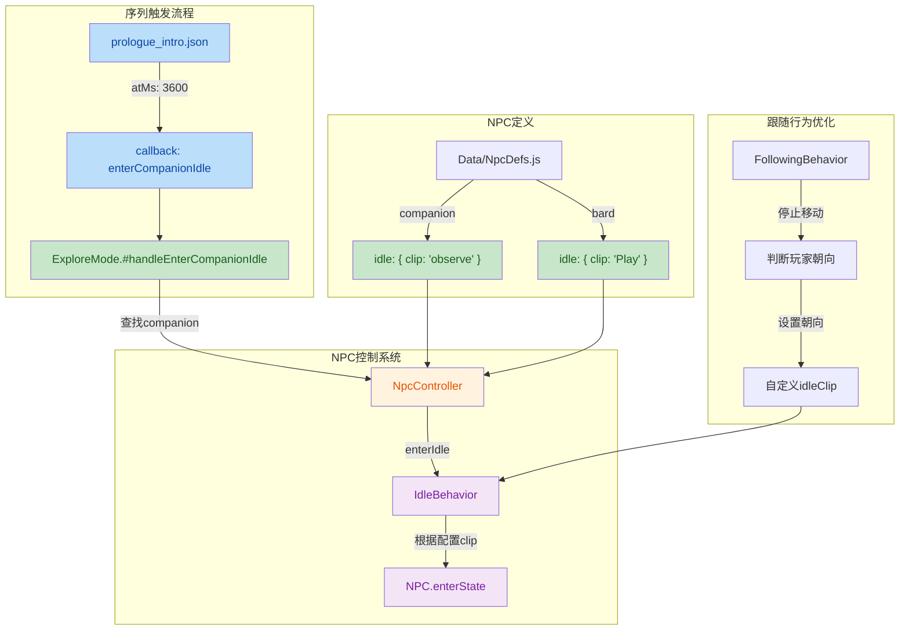

## 1. 高层摘要（TL;DR）

- **影响范围：中等** - 重构了NPC空闲状态系统，新增可配置的idle行为模式，添加了新的动画资源和开发文档

- **核心变更：**
  - ✨ 新增`IdleBehavior`类，支持自定义idle动画片段配置
  - 🎯 为`companion`和`bard`NPC配置了特定idle动画（"observe"和"Play"）
  - 🔄 序列动画系统增加回调支持，通过`enterCompanionIdle`触发idle状态
  - 🎨 新增长剑兵"inspect"动画和环境祭坛资源
  - 📝 新增碰撞盒更新工具的技能文档

---

## 2. 可视化概览（代码与逻辑映射）



---

## 3. 详细变更分析

### 🎮 NPC控制系统重构

#### 组件：`NpcController.js`

**变更说明：** 重构idle状态管理，从硬编码改为可配置模式

**核心改进：**
- 导入新的`IdleBehavior`类
- 构造函数中根据NPC定义初始化`_idleBehavior`：
  ```javascript
  const idleClip = npcDef?.idle?.clip ?? "idle";
  this._idleBehavior = new IdleBehavior({ clip: idleClip });
  ```
- `enterIdle`方法简化为调用behavior层：
  ```javascript
  // 旧代码：直接检查和切换state
  if (npc.hasState("idle")) {
      npc.enterState("idle");
  } else {
      console.warn("[NpcController] NPC has no 'idle' state!");
  }
  
  // 新代码：委托给IdleBehavior处理
  this._idleBehavior.enter(npc, {});
  ```

**好处：** 解耦了控制器与具体动画状态，支持不同NPC配置不同idle动画

---

### ✨ 新增：IdleBehavior类

#### 组件：`scripts/System/NpcBehaviors/IdleBehavior.js`（新文件）

**功能描述：** 专门处理NPC进入空闲状态的行为类

**实现逻辑：**
```javascript
enter(npc, context) {
    const clip = this.options.clip ?? "idle";
    if (npc.hasState(clip)) {
        npc.enterState(clip);
    } else if (npc.animation?.play) {
        npc.animation.play(clip, { restart: false });
    }
}
```

**特点：**
- 优先使用状态机模式（`npc.enterState`）
- 回退到直接动画播放（`npc.animation.play`）
- 支持自定义clip名称
- 避免重复播放（`restart: false`）

---

### 📋 NPC定义配置更新

#### 组件：`Data/NpcDefs.js`

**变更内容：**

| NPC ID | 名称 | 新增配置 | 说明 |
|--------|------|----------|------|
| `companion` | Charlotte | `idle: { clip: "observe" }` | 使用"观察"动画作为idle状态 |
| `bard` | 吟游诗人 | `idle: { clip: "Play" }` | 使用"演奏"动画作为idle状态 |

**影响：** 每个NPC可以有自己的idle动画，不再是统一的"idle"

---

### 🎬 序列系统增强

#### 组件：`Data/Sequences/prologue_intro.json`

**变更：** 将硬编码命令改为回调机制

| 时间 | 旧命令 | 新命令 | 说明 |
|------|--------|--------|------|
| 3600ms | `command: "observe"` | `callback: "enterCompanionIdle"` | 改为通过系统回调触发 |

#### 组件：`scripts/System/Modes/ExploreMode.js`

**新增内容：**
- 注册序列处理器：`handlers.set("enterCompanionIdle", ...)`
- 新增处理方法：
  ```javascript
  #handleEnterCompanionIdle(_ctx, _clip) {
      const companion = this.interactables.find(n => n.id === "companion");
      if (companion?.npcController) {
          companion.npcController.enterIdle(companion);
          console.log("[ExploreMode] companion enterIdle triggered by sequence");
      }
  }
  ```

**好处：** 解耦序列定义与具体实现，支持更复杂的逻辑处理

---

### 🚶 跟随行为优化

#### 组件：`scripts/System/NpcBehaviors/FollowingBehavior.js`

**变更说明：** 优化NPC停止跟随时的idle行为

**新增逻辑：**
```javascript
if (!moving) {
    npc.setMoveIntent({ x: 0, y: 0 });
    // 新增：根据玩家位置设置朝向
    const playerDx = player.root.position.x - npc.root.position.x;
    npc.setFacing(playerDx >= 0 ? 1 : -1);
    
    // 改进：支持自定义idleClip
    const idleClip = this.options.idleClip ?? "idle";
    if (npc.currentStateName !== idleClip && npc.hasState(idleClip)) {
        npc.enterState(idleClip);
    }
    return;
}
```

**改进点：**
- ⬅️➡️ NPC停止时会朝向玩家
- 🎭 支持配置的idle动画片段
- 🔄 避免重复进入相同状态

---

### 🎨 新增美术资源

#### 组件：`Art/Environment/altar.json`（新文件）

**资源信息：**
- 类型：环境物体（祭坛）
- 尺寸：192×128 像素
- 帧数：2帧
- 动画标签：
  - `init` (frame 0)
  - `completed` (frame 1)
- 源文件：`E:\se\BlindDuel\Art\RawAssets\Env\altar.png`

#### 组件：`Art/Sprite/longswordman/longswordman_inspect.json`（新文件）

**资源信息：**
| 属性 | 值 |
|------|-----|
| 角色 | 长剑兵 |
| 动作 | inspect（检查/观察） |
| 帧数 | 6帧 |
| 尺寸 | 128×128 像素 |
| 总时长 | 2200ms |
| 持久帧 | 第4帧（1500ms） |

**图层结构：**
- mainvisual, main, weapon, rightarm, lefthand, cloak
- rootmotion（根运动数据）

#### 组件：`Data/RootMotion/longswordman/longswordman_inspect.json`（新文件）

- 与sprite数据配套的根运动数据
- 用于动画物理计算

---

### 📖 新增开发文档

#### 组件：`.trae/skills/collider-occupancy-更新-skill/SKILL.md`

**文档用途：** 定义碰撞盒和NPC占用盒更新的标准化流程

**两种更新路线：**

| 脚本 | 适用角色 | 输出格式 |
|------|----------|----------|
| `extract_collision_boxes.ps1` | `longswordman`、`rabble_stick` | `.collider.json` |
| `extract_rootmotion_occupancy.ps1` | `traveller`、`merchant`、`merchant2` | `.occupancy.json` |

**颜色编码约定：**

| 颜色 | 含义 |
|------|------|
| `#FFFF00` | hitbox（受击框） |
| `#E37800` | weaponbox + subtype = strong_blade |
| `#FF0000` | weaponbox + subtype = weak_blade |
| `#7082C1` | root（根锚点） |

**关键规则：**
- 同帧连通域会自动合并（绘制时留1px间隔）
- 碰撞扫描要求≥6像素才计入
- NPC occupancy脚本支持root位置回退

---

## 4. 影响与风险评估

### ⚠️ 潜在风险

| 风险项 | 影响 | 缓解措施 |
|--------|------|----------|
| IdleBehavior缺少clip时默认行为 | 可能播放错误的动画 | 已提供默认值`"idle"`，有回退到`animation.play` |
| NPC定义缺少idle配置 | 使用默认idle状态 | 代码使用`?? "idle"`提供降级方案 |
| 序列回调名称拼写错误 | 回调无法触发 | 控制台有日志输出便于调试 |

### ✅ 测试建议

1. **基础功能测试：**
   - 验证`companion`在序列结束后进入"observe"状态
   - 验证`bard`idle时播放"Play"动画
   - 验证没有idle配置的NPC仍能正常进入默认idle状态

2. **跟随行为测试：**
   - NPC停止跟随时是否朝向玩家
   - 切换idle动画是否平滑无重复触发

3. **序列系统测试：**
   - 验证`enterCompanionIdle`回调在正确时间点触发
   - 检查控制台日志是否正确输出

4. **资源测试：**
   - 验证祭坛资源正确加载
   - 验证长剑兵inspect动画播放流畅
   - 检查根运动数据是否正确应用

---

## 5. 总结

本次变更是一次**架构优化**，主要目标是：

1. **提高灵活性** - 通过配置而非硬编码实现NPC idle行为
2. **解耦系统** - 序列系统与具体实现通过回调机制分离
3. **增强表现** - NPC行为更自然（朝向玩家、特定idle动画）
4. **扩展资源** - 新增动画资产和开发文档

变更遵循了良好的软件工程实践（单一职责、开闭原则），风险可控，建议优先测试核心NPC的idle状态切换流程。