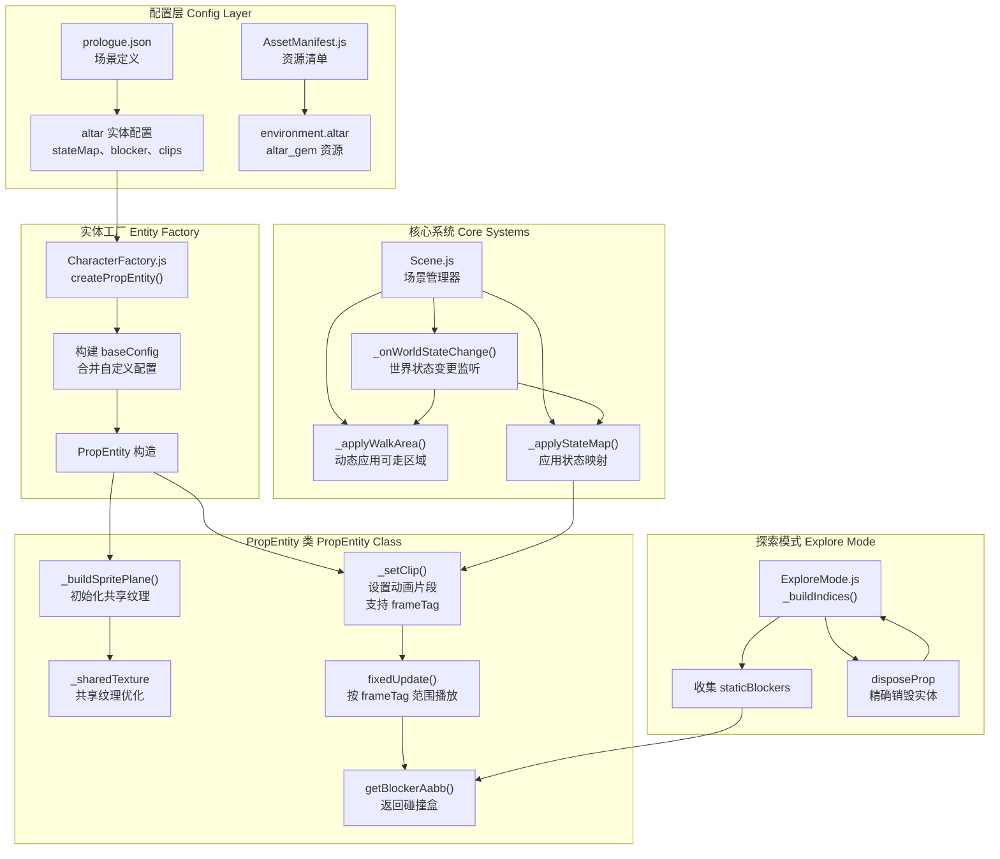

## 📋 高层摘要 (TL;DR)

- **影响级别**: **高** - 重构了 Prop 实体系统，增加了动态状态映射、共享纹理支持和精确销毁功能
- **核心变更**:
  - ✨ 为 Prop 实体添加了**状态驱动的动画切换**（stateMap）支持
  - 🎨 实现了**共享纹理和图集数据**机制，优化 GPU 资源使用
  - 🔄 增加了**条件驱动的动态 WalkArea** 切换
  - 🎯 改进了实体销毁逻辑，支持**精确的目标实体删除**
  - 📦 新增祭坛（altar）道具及其相关资源和配置

---

## 🗺️ 视觉概览 (代码与逻辑映射)



**逻辑流说明**:
1. **配置加载**: `prologue.json` 定义 altar 实体，包含 `stateMap`（状态到动画的映射）
2. **实体创建**: `CharacterFactory.createPropEntity()` 合并配置并创建 `PropEntity`
3. **状态驱动**: `Scene._onWorldStateChange()` 触发时，调用 `_applyStateMap()` 根据世界状态切换实体动画
4. **共享纹理**: 多个 Prop 可共享同一张纹理图集，通过 `frameTag` 定位各自的动画帧
5. **精确销毁**: `disposeProp` 现在支持 `actorId` 参数，只销毁指定实体

---

## 📊 详细变更分析

### 🎮 1. Prop 实体系统重构 (scripts/Enties/PropEntity.js)

#### 核心逻辑变更

**默认值调整**:
| 配置项 | 旧值 | 新值 | 说明 |
|--------|------|------|------|
| `pxToWorld` | `0.06` | `1` | 像素到世界单位转换比例 |
| `frameWidth` | `128` | `3.84` | 默认帧宽度（世界单位） |
| `frameHeight` | `128` | `3.84` | 默认帧高度（世界单位） |

**新增功能**:

```javascript
// 共享纹理支持
this._sharedTexture = null;
this._sharedAtlasData = null;

// 状态映射
this.stateMap = config.stateMap ?? null;
this._initialClip = config.initialClip ?? null;

// 碰撞盒配置
this.blocksMovement = config.blocksMovement ?? false;
this._blocker = config.blocker ?? null;
```

**关键方法改进**:

- **`_setClip()`**: 支持共享纹理和帧标签
  - 如果 `clip` 没有 `spriteSheetUrl` 且存在共享纹理，则使用共享纹理
  - 使用 `frameTag` 限制动画帧范围，而非播放整个图集
  - 只在非共享模式下重新创建纹理对象

- **`fixedUpdate()`**: 按 `frameTag` 范围播放动画
  ```javascript
  const tag = this._currentClip.frameTag;
  const to = tag ? tag.to : this._frames.length - 1;
  const from = tag ? tag.from : 0;
  ```

- **`_applyFrame()`**: 简化缩放逻辑
  - 移除了基于帧尺寸的动态缩放
  - 固定缩放为 `1`，仅通过 `facing` 控制方向

- **`getBlockerAabb()`**: 新增碰撞盒计算
  - 返回基于 `blocker` 配置的 AABB

---

### 🏭 2. 实体工厂增强 (scripts/CharacterFactory.js)

**变更点**:
- **扩展配置覆盖逻辑**: 允许 `entityDef` 覆盖所有关键配置项
- **支持 atlasKey 解析**: 自动从 `assets.atlas` 中解析嵌套的图集数据

**配置覆盖项**:
```javascript
if (entityDef?.clips) {
    const cfg = baseConfig;
    cfg.clips = entityDef.clips;
    // 可覆盖项包括：
    // spriteSheetUrl, atlasData, atlasKey, 
    // frameWidth, frameHeight, pxToWorld,
    // initialClip, blocker, depthMask, stateMap,
    // blocksMovement, renderingGroupId
}
```

---

### 🌍 3. 场景动态系统 (scripts/Scene.js)

#### 新增动态状态映射系统

**`_applyStateMap()` 方法**:
```javascript
_applyStateMap(entity) {
    for (const entry of entity.stateMap) {
        if (this._evaluateCondition(entry.if, this.worldState)) {
            if (entity.currentStateName !== entry.clip) {
                entity.enterState(entry.clip);
            }
            return;
        }
    }
    // 回退到初始状态
    const fallback = entity._initialClip ?? Object.keys(entity.clips)[0];
    if (fallback && entity.currentStateName !== fallback) {
        entity.enterState(fallback);
    }
}
```

**工作流程**:
1. 遍历 `entity.stateMap` 数组
2. 找到第一个满足条件的条目
3. 切换实体到对应动画状态
4. 无匹配时回退到初始状态

#### 新增多 WalkArea 动态切换

**`_applyWalkArea()` 方法**:
```javascript
_applyWalkArea() {
    for (const def of this._walkAreas) {
        if (this._evaluateCondition(def.if, this.worldState)) {
            // 如果区域边界变化，重新创建 WalkArea
            if (!current || 边界变化) {
                if (current) current.dispose();
                this.walkArea = new WalkArea(this.scene, def);
            }
            return;
        }
    }
}
```

**优先级顺序**:
1. `stageMaskData.walkArea`
2. `sceneDef.walkAreas` 数组
3. `sceneDef.walkArea` 单对象

---

### 🔍 4. 探索模式改进 (scripts/Systems/Modes/ExploreMode.js)

#### 精确销毁逻辑

**变更前**: `disposeProp` 销毁**所有** prop 实体
**变更后**: 支持 `actorId` 参数，只销毁**指定**实体

```javascript
// 序列配置
{ "type": "callback", "atMs": 4000, "fn": "disposeProp", "actorId": "prop_faller" }

// 实现逻辑
const targetId = clip?.actorId;
const match = (e) => e?.kind === "prop" && 
    (targetId == null || e.id === targetId || e.name === targetId);
```

#### 静态碰撞体收集改进

**新增条件检查**:
```javascript
if ((entity.kind === "npc" || entity.kind === "prop")
    && entity.blocksMovement
    && typeof entity.getBlockerAabb === "function") {
    this.staticBlockers.push(entity);
}
```

---

### 📦 5. 新增祭坛道具 (Data/SceneDefs/prologue.json)

**配置结构**:
```json
{
  "archetype": "prop",
  "id": "altar",
  "pos": [-8, 0.5, 0],
  "blocksMovement": true,
  "blocker": { "halfW": 1.9, "halfH": 0.6, "centerY": 1.4 },
  "depthMask": { "halfW": 1.3, "halfH": 2.0, "centerY": 1.0 },
  "spriteSheetUrl": "./Art/Environment/altar.png",
  "atlasKey": "environment.altar",
  "clips": {
    "init": { "tag": "init", "mode": "hold" },
    "completed": { "tag": "completed", "mode": "hold" }
  },
  "stateMap": [
    { "if": { "scenarioMin": 105 }, "clip": "completed" },
    { "if": {}, "clip": "init" }
  ]
}
```

**状态映射逻辑**:
- 当 `scenarioMin >= 105` 时，切换到 `completed` 动画
- 否则保持 `init` 动画

---

### 🎨 6. 资源清单更新 (scripts/AssetManifest.js)

**新增资源**:
| 类型 | 键名 | 路径 |
|------|------|------|
| environment | `altar` | `./Art/Environment/altar.json` |
| items | `altar_gem` | `./Art/Sprite/items/altar_gem.json` |

---

### ✨ 7. 新增工具函数 (scripts/Utils/StencilOccluder.js)

**功能**: 为平面添加模板遮罩效果，实现深度裁剪

```javascript
export function attachStencilOccluder(plane, scene) {
    const gl = scene.getEngine()._gl;
    plane.onBeforeRenderObservable.add(() => {
        // 写入模板缓冲
        gl.colorMask(false, false, false, false);
        gl.stencilOp(gl.KEEP, gl.KEEP, gl.REPLACE);
    });
    plane.onAfterRenderObservable.add(() => {
        // 读取模板缓冲进行裁剪
        gl.colorMask(true, true, true, true);
        gl.stencilFunc(gl.NOTEQUAL, 1, 0xFF);
    });
}
```

---

## ⚠️ 影响与风险评估

### 🔴 破坏性变更

| 变更项 | 影响 | 兼容性 |
|--------|------|--------|
| `pxToWorld` 默认值从 `0.06` 改为 `1` | **影响所有未显式设置该值的 Prop** | 需要检查现有场景中的 Prop 尺寸 |
| `frameWidth/frameHeight` 逻辑变更 | 移除动态缩放，改用固定值 | 可能需要调整现有配置 |

### ✅ 测试建议

1. **尺寸验证**:
   - 检查所有现有 Prop 实体的显示尺寸是否正确
   - 特别是那些依赖默认 `pxToWorld` 的实体

2. **状态映射测试**:
   - 验证祭坛在 `scenarioMin` 达到 105 时是否正确切换动画
   - 测试条件回退逻辑（无匹配时使用初始状态）

3. **精确销毁测试**:
   - 运行 `prologue_cs_rabble_flee` 序列
   - 确认只销毁 `prop_faller`，不影响其他 prop

4. **碰撞盒测试**:
   - 验证祭坛的 `blocker` 配置是否正确阻挡玩家
   - 测试 `getBlockerAabb()` 返回的 AABB 是否准确

5. **共享纹理测试**:
   - 验证多个 Prop 共享同一纹理时是否正常工作
   - 检查帧标签（frameTag）是否正确限制动画范围

6. **动态 WalkArea 测试**:
   - 测试条件满足时 WalkArea 是否正确切换
   - 验证切换时的内存清理（dispose）

---

## 📝 总结

本次重构显著增强了 **Prop 实体系统的灵活性**和**性能**：

- **🎯 状态驱动**: 通过 `stateMap` 实现了基于世界状态的动态动画切换
- **🚀 性能优化**: 共享纹理机制减少 GPU 资源占用
- **🎨 视觉增强**: 新增模板遮罩工具，支持更复杂的视觉效果
- **🔧 精确控制**: 改进了实体销毁和碰撞管理

**主要风险点**在于默认参数变更可能影响现有场景，建议全面回归测试。