# 代码变更分析报告

## 1. 高层摘要

- **影响范围**：中 - 涉及游戏核心任务系统、UI 交互和渲染相关代码
- **核心变更**：
  - 🔑 将原有匕首任务（dagger）替换为祭坛宝石任务
  - 🎨 增强 NPC 对话气泡支持富文本（图片+文本混合显示）
  - 📚 重写任务机制文档为详细的开发指南
  - 🛠 添加可拾取物调试面板工具
  - 🎬 新增主角检视动画资源
  - ⏸ 暂停道具深度遮挡（depthMask）方案

---

## 2. 可视化概览

```mermaid
graph TD
    subgraph "任务流程"
        A[玩家靠近 NPC] --> B{NpcController.resolve}
        B -->|无 giveItem| C[显示文本气泡]
        C --> D[3秒计时后执行 action]
        B -->|有 giveItem| E[设置 _needsInteract]
        E --> F[等待玩家按 J 键]
        F --> G[ExploreMode._startGiveSequence]
        G --> H[播放 give 动画]
        H --> I[物品从背包移除]
        I --> J[推进任务/剧情]
    end
    
    subgraph "UI 增强"
        K[NpcDefs.content] --> L[DialogueBubble.setContent]
        L --> M{类型判断}
        M -->|text| N[插入文本节点]
        M -->|image| O[插入图片节点]
        O --> P[应用样式参数]
    end
    
    subgraph "数据变更"
        Q[ItemDefs.js] --> R[新增 altar_gem]
        S[SceneDefs.json] --> T[dagger_01 → altar_gem_01]
        U[NpcDefs.js] --> V[更新条件与动作]
    end
    
    style A fill:#bbdefb,color:#0d47a1
    style J fill:#c8e6c9,color:#1a5e20
    style R fill:#fff3e0,color:#e65100
```



---

## 3. 详细变更分析

### 3.1 游戏内容更新

#### 物品定义变更

**文件**：`Data/ItemDefs.js`

| 物品 ID | 旧值 | 新值 | 说明 |
|---------|------|------|------|
| dagger | 存在 | 移除 | 匕首任务被替换 |
| altar_gem | - | 新增 | 祭坛宝石，consumeType: pocket |

```javascript
altar_gem: {
    id: "altar_gem",
    name: "祭坛宝石",
    consumeType: "pocket",
    atlasKey: "altar_gem",
    textureUrl: "./Art/Sprite/items/altar_gem.png",
}
```

#### 场景配置更新

**文件**：`Data/SceneDefs/prologue.json`

**可拾取物配置变更**：
```json
{
    "id": "altar_gem_01",           // 原: "dagger_01"
    "name": "altar_gem",            // 原: "dagger"
    "visualYOffset": 0,             // 原: 1.5
    "itemDef": {
        "id": "altar_gem",
        "name": "祭坛宝石"
    }
}
```

**环境纹理变更**：
- ❌ 删除：`ground_1`（animated_tile 草地基础）
- ✅ 新增：`ground`（普通 tile 泥土基础）
- ✅ 新增：`grass_deco`（草地装饰）
- 📌 调整：`ruin_main.alphaIndex` 从 3 → 4
- ✅ 新增：`ruin_floor`（废墟地板，alphaIndex: 5）

#### NPC 对话配置更新

**文件**：`Data/NpcDefs.js`

| 字段 | 旧值 | 新值 |
|------|------|------|
| condition.hasItem | dagger | altar_gem |
| action | removeItem: dagger | removeItem: altar_gem |
| giveItem | dagger | altar_gem |

**新增富文本支持**：
```javascript
{
    priority: 0,
    condition: {},
    text: "🗡️",
    content: [  // 新增字段
        { type: "text", value: "🗡️ " },
        { type: "image", src: "./Art/Sprite/items/altar_gem.png", width: 20, height: 20, alt: "altar_gem" }
    ],
    action: [{ type: "startQuest", id: "prologue_pickup_quest" }]
}
```

### 3.2 UI 系统增强

#### 对话气泡富文本支持

**文件**：`scripts/UI/DialogueBubble.js`

**新增方法**：

```javascript
setContent(segments) {
    // 支持混合文本和图片的富内容
    for (const seg of segments) {
        if (seg.type === "text") {
            this._bubble.appendChild(document.createTextNode(seg.value));
        } else if (seg.type === "image") {
            const img = document.createElement("img");
            img.src = seg.src;
            img.alt = seg.alt ?? "";
            img.style.verticalAlign = "middle";
            if (seg.width != null) img.style.width = `${seg.width}px`;
            if (seg.height != null) img.style.height = `${seg.height}px`;
            // 支持自定义样式对象
            if (seg.style) {
                for (const [k, v] of Object.entries(seg.style)) {
                    img.style[k] = v;
                }
            }
            this._bubble.appendChild(img);
        }
    }
}

_clear() {
    this._bubble.innerHTML = "";
}
```

**重构方法**：
- `setText()`: 改用 `innerHTML` 替代 `textContent`，并调用 `_clear()`

#### NPC 控制器适配

**文件**：`scripts/Systems/NpcController.js`

```javascript
// 支持新的 content 字段优先级
if (Array.isArray(entry.content)) {
    this._dialogueBubble.setContent(entry.content);
} else {
    this._dialogueBubble.setText(entry.text);
}
```

### 3.3 调试工具

#### 可拾取物调试面板

**文件**：`scripts/Enties/PickableEntity.js`

**新增功能**：
- 创建调试面板显示 Y 轴坐标、视觉偏移和 alphaIndex
- 面板实时跟随物体投影位置
- 拾取时自动清理面板

```javascript
#createDebugPanel() {
    const panel = document.createElement("div");
    panel.style.position = "absolute";
    panel.style.pointerEvents = "none";
    panel.style.background = "rgba(60, 0, 80, 0.78)";
    panel.style.color = "#e8d4ff";
    panel.style.font = "12px/1.2 Consolas, monospace";
    panel.style.padding = "4px 8px";
    panel.style.borderRadius = "4px";
    panel.style.border = "1px solid rgba(200, 160, 255, 0.5)";
    panel.style.whiteSpace = "nowrap";
    panel.style.zIndex = "1000";
    panel.style.display = "none";
    document.body.appendChild(panel);
    return panel;
}
```

**文件**：`scripts/Systems/Modes/ExploreMode.js`

```javascript
// 渲染循环中更新调试面板
for (const entity of this.renderables) {
    if (entity.kind === "pickable") {
        entity._updateDebugPanel?.();
    }
}
```

### 3.4 渲染系统调整

#### 道具深度遮挡方案暂停

**文件**：`scripts/CharacterFactory.js` & `scripts/Utils/StencilOccluder.js`

| 文件 | 变更 |
|------|------|
| CharacterFactory.js | 注释掉 `entityDef.depthMask` 处理 |
| StencilOccluder.js | 整个函数被注释，保留参考 |

**原因说明**：
> 这类 prop 不与场景画在一起，blocker 避免位置重叠 + y-fighting，靠现有 y-sort / alphaIndex 即可达到足够效果，无需 stencil plane。

### 3.5 文档与资源

#### 任务系统文档重构

**文件**：`docs/QuestMechanics.MD`

原文档仅 3 行，重写后扩展为 **270 行完整开发指南**，包含：

| 章节 | 内容 |
|------|------|
| 核心模型 | 5 个关键文件的职责说明 |
| dagger 任务案例 | 完整链路 + 数据配置 + action 用法 |
| altar_gem 任务案例 | 与 dagger 对比 + 设计限制 |
| 添加任务 Checklist | 资源、配置、布局、验证步骤 |
| 常见坑 | 6 类问题及解决方案 |
| 源码索引 | 10 个相关文件索引 |

#### 动画资源新增

**新增文件**：
- `Art/Sprite/longswordman/longswordman_inspect.json`
- `Data/RootMotion/longswordman/longswordman_inspect.json`

**动画信息**：
- 帧：6 帧
- 尺寸：128×128 px
- 总时长：2200ms
- 用途：主角检视动画

#### 技能文档新增

**文件**：`.trae/skills/collider-occupancy-更新-skill/SKILL.md`

**两条路线**：
- 路线 A：`extract_collision_boxes.ps1` → 战斗角色 collider（longswordman, rabble_stick）
- 路线 B：`extract_rootmotion_occupancy.ps1` → NPC occupancy（traveller, merchant）

**颜色约定**：
| 颜色 | 含义 |
|------|------|
| #FFFF00 | hitbox（受击框） |
| #E37800 | weaponbox + strong_blade |
| #FF0000 | weaponbox + weak_blade |
| #7082C1 | root（根锚点） |

---

## 4. 影响与风险评估

### 4.1 破坏性变更

| 变更类型 | 影响范围 | 风险等级 |
|---------|---------|---------|
| 物品 ID 变更 | 任务系统、背包 UI | 🟡 中 |
| 对话格式变更 | NPC 交互系统 | 🟢 低（向后兼容） |
| 环境纹理变更 | 视觉表现 | 🟢 低 |
| depthMask 暂停 | 渲染效果 | 🟢 低（已验证替代方案） |

### 4.2 测试建议

#### 必测场景
1. ✅ **任务流程完整性**：
   - NPC 首次靠近 → 气泡显示派任务
   - 拾取 altar_gem → 背包显示
   - 离开 NPC 范围再返回 → 进入交物待交互态
   - 按 J 键 → 动画播放 + 物品移除 + 任务完成

2. ✅ **富文本气泡显示**：
   - 验证图片+文本混合渲染
   - 检查图片尺寸和位置是否正确

3. ✅ **调试面板功能**：
   - 拾取物是否显示调试信息
   - 坐标投影是否跟随正确
   - 拾取后面板是否正确清理

4. ✅ **场景渲染**：
   - 新地面纹理是否正确显示
   - alphaIndex 排序是否正确
   - 无 y-fighting 或穿模问题

#### 边界测试
- ⚠️ 任务物品放置在 NPC 附近时的交互逻辑
- ⚠️ 快速进出 NPC 范围的状态重置
- ⚠️ 多个拾取物同时存在时的性能影响

---

## 5. 技术要点总结

| 类别 | 要点 |
|------|------|
| **数据驱动** | 任务完全由配置驱动（ItemDefs + NpcDefs + SceneDefs） |
| **状态管理** | NPC greeting 状态与背包物品联动 |
| **UI 架构** | 气泡组件支持文本/富文本双模式 |
| **调试工具** | 实时可视化坐标和渲染层级 |
| **文档化** | 270 行指南覆盖完整开发流程 |
| **技术债务** | depthMask 方案暂停但保留代码供未来参考 |

---

**变更总览**：
- 📝 13 个文件修改
- ➕ 3 个新文件（动画资源 + 技能文档）
- 🎨 1 个 UI 组件增强
- 📚 1 个文档完全重写
- ⏸ 1 个渲染方案暂停