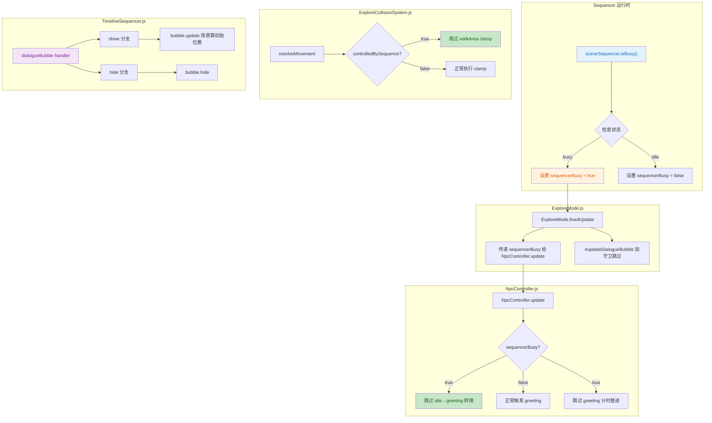
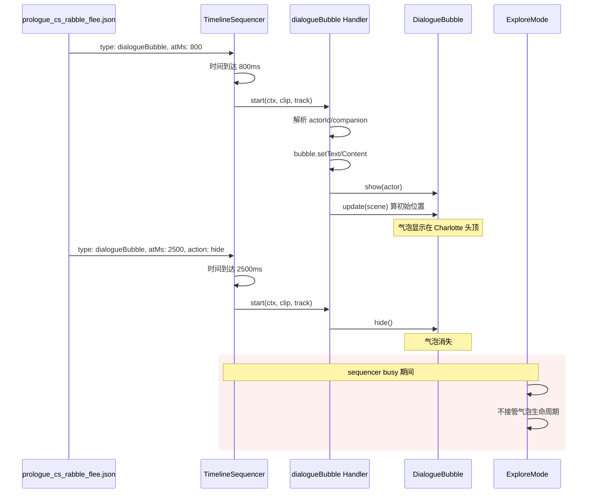

## 📋 高级摘要 (TL;DR)

*   **影响范围**：🔴 **高** - 修复了 sequencer 期间 ExploreMode 子系统的门控不一致问题，并引入通用的对话气泡控制机制
*   **核心变更**：
    *   新增 `dialogueBubble` clip 类型，替代硬编码的 `showCompanionBubble`/`hideCompanionBubble` callback
    *   在 sequencer busy 期间添加多处门控：NPC greeting 触发、ExploreMode 气泡生命周期管理、walkArea clamp
    *   修复气泡初始位置计算问题（CSS auto 定位偏移）
    *   归档 3 个已完成计划文档

---

## 🗺️ 可视化架构图

### Sequencer 期间门控逻辑流



### dialogueBubble Clip 数据流



---

## 📝 详细变更分析

### 1️⃣ 核心功能：新增 dialogueBubble Clip

#### **变更文件**：
- `scripts/Systems/TimelineSequencer.js` (新增 handler)
- `scripts/Systems/Modes/ExploreMode.js` (删除旧 callback)
- `Data/Sequences/prologue_cs_rabble_flee.json` (迁移配置)

#### **逻辑变更**：

**TimelineSequencer.js** - 新增 `dialogueBubble` action handler：

```javascript
dialogueBubble: {
    start(ctx, clip, track) {
        const bubble = ctx.dialogueBubble;
        if (!bubble) {
            console.warn("[TimelineSequencer] dialogueBubble: no bubble in ctx");
            return;
        }

        // hide 分支
        if (clip.action === "hide") {
            bubble.hide();
            return;
        }

        // show 分支：需 actorId（从 track.binding.actorId fallback）
        const actorId = clip.actorId ?? track.binding?.actorId;
        if (!actorId) {
            console.warn("[TimelineSeq] dialogueBubble show: missing actorId");
            return;
        }
        const actor = _resolveActor(ctx, { actorId });
        
        if (Array.isArray(clip.content)) {
            bubble.setContent(clip.content);
        } else {
            bubble.setText(clip.text ?? "");
        }
        bubble.show(actor);
        
        // 关键修复：立即算初始位置，避免 CSS auto 偏移出屏幕
        if (ctx.babylonScene) {
            bubble.update(ctx.babylonScene);
        }
    }
}
```

**ExploreMode.js** - 删除硬编码 callback：

| 操作 | 旧方式 | 新方式 |
|------|--------|--------|
| 显示气泡 | `showCompanionBubble` callback (硬编码 Charlotte, 文本 "!") | `dialogueBubble` clip (支持任意 NPC, 可配置文本) |
| 隐藏气泡 | `hideCompanionBubble` callback | `dialogueBubble` clip with `action: "hide"` |

**prologue_cs_rabble_flee.json** - 配置迁移：

```diff
- { "type": "callback", "atMs": 4500, "fn": "showCompanionBubble" }
+ { "type": "dialogueBubble", "atMs": 800, "actorId": "companion", "text": "!" }

- { "type": "callback", "atMs": 7200, "fn": "hideCompanionBubble" }
+ { "type": "dialogueBubble", "atMs": 2500, "action": "hide" }
```

#### **dialogueBubble Clip 配置格式**：

| 字段 | 类型 | 必填 | 说明 |
|------|------|------|------|
| `type` | string | ✅ | 固定值 `"dialogueBubble"` |
| `atMs` | number | ✅ | 触发时间（毫秒） |
| `actorId` | string | show 时 | 目标 NPC ID（可从 `track.binding.actorId` fallback） |
| `text` | string | ❌ | 单行文本（与 content 二选一） |
| `content` | object[] | ❌ | 富文本片段数组（支持图片等） |
| `action` | string | ❌ | `"show"` (默认) 或 `"hide"` |

---

### 2️⃣ Sequencer 期间门控机制

#### **变更文件**：
- `scripts/Systems/Modes/ExploreMode.js`
- `scripts/Systems/NpcController.js`

#### **门控点汇总**：

| 门控点 | 位置 | 条件 | 行为 |
|--------|------|------|------|
| NPC greeting 触发 | `NpcController.update:55` | `!sequencerBusy` | busy 期间不触发 idle→greeting |
| greeting 计时推进 | `NpcController.update:66` | `!sequencerBusy` | busy 期间不推进计时 |
| ExploreMode 气泡接管 | `ExploreMode.#updateDialogueBubble:868` | `!isBusy()` | busy 期间 ExploreMode 不管理气泡生命周期 |
| walkArea clamp | `ExploreCollisionSystem.resolveMovement:6` | `!entity.controlledBySequence` | sequencer 驱动时不 clamp |

#### **代码变更**：

**ExploreMode.js** - 透传 `sequencerBusy`：

```javascript
const sequencerBusy = !!this.context.sceneSequencer?.isBusy();
for (const npc of this.interactables) {
    const controller = npc.npcController;
    if (controller) {
        controller.update(dtMs, npc, {
            player: character,
            questManager: this.context.questManager,
            inventoryManager: this.context.inventoryManager,
            dialogueBubble: this.context.dialogueBubble,
            sequencerBusy,  // ← 新增透传
        });
    }
}
```

**ExploreMode.js** - `#updateDialogueBubble` 守卫：

```javascript
#updateDialogueBubble() {
    const { dialogueBubble, sceneSequencer } = this.context;
    if (!dialogueBubble) return;

    if (this._giveSequence) return;

    // sequencer 期间不接管气泡生命周期
    if (sceneSequencer?.isBusy()) return;

    // 原有逻辑...
}
```

**NpcController.js** - greeting 触发守卫：

```javascript
// sequencer 期间不触发 greeting（避免 intro 中 hero 路过 Charlotte 误弹气泡）
if (this.state === "idle" && inGreetingRange && !this.hasGreetedInRange && !sequencerBusy) {
    this.enterGreeting(npc);
    this.hasGreetedInRange = true;
    return;
}

// sequencer 期间不推进 greeting 计时
if (this.state === "greeting" && !sequencerBusy) {
    this._dialogueTimerMs += dtMs;
    // ...
}
```

---

### 3️⃣ 气泡位置计算修复

#### **变更文件**：
- `scripts/UI/DialogueBubble.js`
- `scripts/Systems/TimelineSequencer.js` (在 dialogueBubble handler 中)

#### **问题与根因**：

1. **原问题**：气泡显示后不可见，偏移出屏幕
2. **根因 1**：`#updateDialogueBubble` 在 sequencer busy 期间被跳过，导致气泡位置不更新
3. **根因 2**：`bubble.show(actor)` 后未立即计算投影坐标，`left`/`top` 为空被 CSS auto + `translate(-50%,-100%)` 偏移出屏幕

#### **修复方案**：

**TimelineSequencer.js** - 在 dialogueBubble handler 中立即计算位置：

```javascript
bubble.show(actor);
// 立即算一次初始位置：sequencer 期间 #updateDialogueBubblePosition 被守卫跳过
if (ctx.babylonScene) {
    bubble.update(ctx.babylonScene);
}
```

**DialogueBubble.js** - 优化变量提取：

```javascript
const inView = projected.z > 0 && projected.z < 1;
if (inView) {
    this._bubble.style.display = "block";
    this._bubble.style.left = `${projected.x}px`;
    this._bubble.style.top = `${projected.y}px`;
}
```

#### **预期行为**：

| 时间点 | 行为 |
|--------|------|
| t=0~1000ms (explore 相机) | 气泡在 Charlotte 头顶显示，位置随相机变化 |
| t=1000~2000ms (cameraBlend 过渡) | 气泡位置跟随相机插值 |
| t=2000ms 后 (scripted 相机) | Charlotte 出视锥 → 气泡自动隐藏（视锥剔除正常生效） |

---

### 4️⃣ 文档更新

#### **PROJECT_CONTEXT.md**：

| 变更 | 位置 | 内容 |
|------|------|------|
| 文档名修正 | §6.14 | `docs/TimelineSequencer.md` → `docs/TimelineSequencer User Guide.md` |
| 门控说明扩展 | §6.14 | 补充 `ExploreCollisionSystem.resolveMovement` 的 `controlledBySequence` 守卫 |
| 新增条目 | §6.15 | sequencer 期间 ExploreMode 子系统门控约定 |

#### **docs/TimelineSequencer User Guide.md**：

- **§5.10**：删除旧气泡 callback `showCompanionBubble`/`hideCompanionBubble`
- **§5.12**：新增 `dialogueBubble` clip 详细文档（字段、行为细节、依赖说明）
- **§8.1**：示例改为使用 `dialogueBubble` clip
- **§10**：更新已知限制（新增 `dialogueBubble` 依赖、单例限制）

#### **plans/INDEX.md**：

- 新增 **最近归档（2026-07-15）** 区块
- 归档 3 个计划：
  - `Sequencer 期间门控修复（NPC 气泡 + walkArea clamp）.MD`
  - `Prologue 内容与演出流程实施计划.MD`
  - `祭坛状态物件设计.MD`
- 新增 **Update Log (2026-07-15)** 区块

---

### 5️⃣ 新增资源与归档文档

#### **新增 Sprite 动画**：

| 文件 | 用途 | 帧数 |
|------|------|------|
| `Art/Sprite/longswordman/longswordman_inspect.json` | 长剑士 inspect 动作图集 | 6 帧 |
| `Data/RootMotion/longswordman/longswordman_inspect.json` | 根运动数据 | 6 帧 |

#### **归档计划文档**：

| 文档 | 目标 | 完成内容 |
|------|------|----------|
| `plans/archived/Sequencer 期间门控修复...` | sequencer 期间 ExploreMode 子系统门控不一致 | ①walkArea clamp 守卫 ②NPC greeting 门控 ③dialogueBubble clip ④气泡初始位置修复 |
| `plans/archived/Prologue 内容与演出流程...` | Prologue 完整流程落地 | Step 1-9 主体已全部落地 |
| `plans/archived/祭坛状态物件设计.MD` | PropEntity 扩展为状态物件 | blocker/depthMask/stateMap + walkArea 动态扩展 |

#### **新增技能文档**：

`.trae/skills/collider-occupancy-更新-skill/SKILL.md` - collider 与 occupancy 数据提取流程规范

---

## ⚠️ 影响与风险评估

### 🔴 破坏性变更

| 变更 | 影响范围 | 兼容性 |
|------|----------|--------|
| 删除 `showCompanionBubble`/`hideCompanionBubble` callback | 所有引用这两个 callback 的 sequence | **不兼容** - 需迁移到 `dialogueBubble` clip |

### ✅ 无风险项

| 项 | 说明 |
|----|------|
| `controlledBySequence` 守卫 | 已有 `_resetControlledActors` 兜底清理，无新增风险 |
| sequencerBusy 门控 | 只挡 idle→greeting 转换，不影响 FollowingBehavior |
| 视锥剔除 | 照常生效，NPC 出视野时气泡自动隐藏 |

### 🧪 测试建议

| 场景 | 验证点 |
|------|--------|
| **Prologue intro** | hero 走过 Charlotte 时不触发气泡 |
| **Prop cutscene** | 800ms 时显示 "!"，2500ms 时隐藏 |
| **位置计算** | 气泡不偏移出屏幕，相机切换时跟随正常 |
| **sequencer 结束** | 再次靠近 Charlotte 正常触发 greeting |
| **walkArea clamp** | sequencer 期间 hero 不被 clamp，结束后恢复 clamp |

---

## 📊 变更统计

| 类别 | 文件数 | 说明 |
|------|--------|------|
| **核心脚本** | 4 | ExploreMode, NpcController, TimelineSequencer, DialogueBubble |
| **配置文件** | 1 | prologue_cs_rabble_flee.json |
| **文档** | 4 | PROJECT_CONTEXT, User Guide, INDEX, 技能文档 |
| **归档文档** | 3 | 3 个已完成计划归档 |
| **资源文件** | 2 | longswordman inspect 动画数据 |
| **总计** | **14** | - |

---

## 🎯 设计亮点

1. **统一门控机制**：通过 `sequencerBusy` + `controlledBySequence` 双层门控，彻底解决 sequencer 期间子系统冲突
2. **数据驱动**：`dialogueBubble` clip 替代硬编码 callback，支持任意 NPC 和自定义文本
3. **问题根因定位**：三层根因逐步排查（ExploreMode 误 hide → 位置未计算 → 视锥剔除预期行为）
4. **向后兼容**：`walkArea` 单对象自动转为 `walkAreas` 数组，不破坏现有场景配置