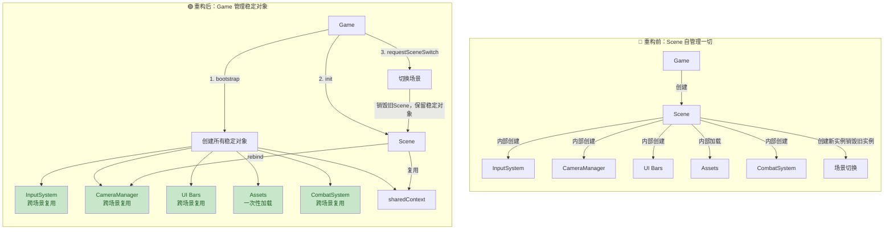
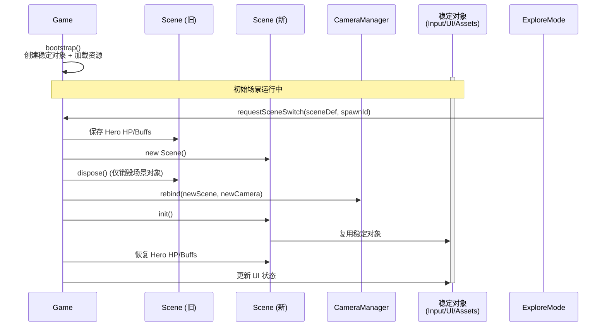

## 1. 高层摘要（TL;DR）

- **影响级别**：🔴 **高** - 核心架构重构，重新设计 Scene 与 Game 的职责边界
- **主要变更**：
  - 将跨场景的稳定对象（InputSystem、CameraManager、UI Bars 等）从 **Scene** 迁移到 **Game** 层
  - 新增 **bootstrap()** 初始化流程，在 Scene 创建前一次性加载资源和创建稳定对象
  - 重构场景切换机制，支持平滑切换并复用稳定对象
  - InputSystem 改用原生游戏手柄 API，移除对 Babylon 的依赖

---

## 2. 可视化架构图

### 重构前后架构对比



### 场景切换流程



---

## 3. 详细变更分析

### 📦 组件 1：Game.js - 核心重构

#### 变更内容

**新增 bootstrap() 初始化流程**

在 `init()` 之前引入 `bootstrap()` 方法，负责创建所有跨场景的稳定对象：

```javascript
async bootstrap() {
    // B2: 一次性加载所有资源
    this.assets = await loadDataAssets(ASSET_MANIFEST);
    
    // 创建系统级对象（跨场景复用）
    this.inputSystem = new InputSystem({ debugEnabled: true });
    this.combatSystem = new CombatSystem({ debugTrace: true });
    this.playerController = new PlayerController(this.inputSystem, null);
    
    // 创建相机 Rigs
    this.cameraRig = new DuelCameraRig(DEFAULT_DUEL_CAMERA);
    this.exploreCameraRig = new ExploreCameraRig();
    this.scriptedCameraRig = new ScriptedCameraRig();
    
    // 创建 UI 组件
    this.inventoryBar = new InventoryBar(...);
    this.buffBar = new BuffBar(...);
    this.hpBar = new HpBar(...);
    
    // 创建 sharedContext（全局共享上下文）
    this.sharedContext = { /* 包含所有稳定对象 */ };
    
    // 创建管理器
    this.cameraManager = new CameraManager(this.sharedContext);
    this.gameModeManager = new GameModeManager();
    this.sceneSequencer = new SceneSequencer(this.sharedContext);
}
```

**新增场景切换机制**

| 方法 | 职责 | 调用时机 |
|------|------|----------|
| `requestSceneSwitch(sceneDef, spawnId)` | 公开接口，标记加载状态并调用内部方法 | ExploreMode 触发场景切换时 |
| `_loadSceneInternal(sceneDef, spawnId)` | 内部实现，执行实际的场景创建和状态迁移 | 由 requestSceneSwitch 调用 |

**优化 dispose() 逻辑**

```javascript
dispose() {
    this.scene?.dispose();  // 仅销毁当前场景
    this.cameraManager?.dispose();
    this.inputSystem?.dispose();
    this.cameraRig?.dispose?.();
    // ... 清理其他稳定对象
}
```

**检查点恢复逻辑重构**

- 将 `_pendingRestore` 和 `_pendingSceneLoad` 从 Scene 移到 Game
- 使用 `requestSceneSwitch()` 替代 Scene 内部的 `_loadScene()`

---

### 📦 组件 2：Scene.js - 精简与复用

#### 变更内容

**移除重复导入和创建**

删除了 15 个导入语句（如 `InputSystem`, `CameraManager`, `UI Bars` 等），不再在 Scene 内创建这些对象。

**复用 Game 层资源**

| 对象类型 | 旧实现 | 新实现 |
|----------|--------|--------|
| 资源加载 | `await loadDataAssets(ASSET_MANIFEST)` | `this._game?.assets` |
| InputSystem | `new InputSystem(this.scene)` | `this._game.inputSystem` |
| PlayerController | `new PlayerController(...)` | `this._game.playerController` |
| CombatSystem | `new CombatSystem(...)` | `this._game.combatSystem` |
| Camera Rigs | 每次创建新实例 | 复用 `this._game.cameraRig` 等 |
| UI Bars | 每次创建新实例 | 复用 `this._game.inventoryBar` 等 |
| sharedContext | 每次构建新对象 | 复用 `this._game.sharedContext` |

**相机系统优化**

```javascript
// 创建场景自己的相机实例
this.camera = new BABYLON.UniversalCamera("main_camera", new BABYLON.Vector3(0, 8, -25), this.scene);

// 复用 Game 的 CameraManager，并重新绑定
this.cameraManager = this._game.cameraManager;
this.cameraManager.rebind(this.scene, this.camera);

// 注册 rigs（复用 Game 的实例）
this.cameraManager.registerRig("duel", this.cameraRig);
```

**智能 dispose() 逻辑**

```javascript
// 只销毁 Scene 自己创建的对象，不销毁 Game 提供的共享对象
if (this.inputSystem && this.inputSystem !== this._game?.inputSystem) {
    this.inputSystem.dispose();
}
if (this.cameraRig && this.cameraRig !== this._game?.cameraRig) {
    this.cameraRig.dispose();
}
```

**移除 _loadScene() 方法**

- 删除了 44 行的内部场景加载方法
- 现在由 Game 的 `_loadSceneInternal()` 统一处理

---

### 📦 组件 3：CameraManager.js - 跨场景绑定

#### 变更内容

**新增 rebind() 方法**

```javascript
rebind(newScene, newCamera) {
    const oldSceneId = this.camera?.getScene?.()?.uid ?? null;
    const newSceneId = newScene?.uid ?? null;
    console.log(`[CameraManager] rebind scene ${oldSceneId} → ${newSceneId}, camera=`, !!newCamera);
    
    this.camera = newCamera;
    if (newScene && newCamera) {
        newScene.activeCamera = newCamera;
        this._applyToBabylonCamera(this.state);
    }
}
```

**增强 dispose() 方法**

```javascript
dispose() {
    // ... 原有逻辑
    for (const rig of this.rigs.values()) {
        if (rig && typeof rig.dispose === "function") {
            rig.dispose();
        }
    }
    this.rigs.clear();
    this.activeRig = null;
    this.activeRigId = null;
}
```

---

### 📦 组件 4：InputSystem.js - 手柄 API 改造

#### 变更内容

| 变更项 | 旧实现 | 新实现 | 原因 |
|--------|--------|--------|------|
| 构造函数参数 | `constructor(scene, options)` | `constructor(options)` | 移除对 Babylon scene 的依赖 |
| 手柄管理器 | `new BABYLON.GamepadManager(scene)` | 原生 `window` 事件监听 | 减少依赖，提升稳定性 |
| 连接事件 | `onGamepadConnectedObservable` | `gamepadconnected` 事件 | 使用标准 Web API |
| 断开事件 | `onGamepadDisconnectedObservable` | `gamepaddisconnected` 事件 | 使用标准 Web API |

**代码对比**

```javascript
// 旧代码
this.gamepadManager = typeof BABYLON !== "undefined" ? new BABYLON.GamepadManager(scene) : null;
if (this.gamepadManager) {
    this.gamepadManager.onGamepadConnectedObservable.add((pad) => { /* ... */ });
}

// 新代码
this._onGamepadConnected = (event) => {
    const pad = event.gamepad;
    this.gamepad.connected = true;
    this.gamepad.id = pad?.id ?? "unknown";
    this.gamepad.index = typeof pad?.index === "number" ? pad.index : 0;
};
window.addEventListener("gamepadconnected", this._onGamepadConnected);
```

---

### 📦 组件 5：ExploreMode.js - 场景切换调用

#### 变更内容

```javascript
// 旧实现：设置 Scene 的内部标志
scene._pendingSceneLoad = { sceneDef: targetDef, spawnId: triggerDef.targetSpawn };

// 新实现：调用 Game 的公开接口
const game = this.context.game;
game.requestSceneSwitch(targetDef, triggerDef.targetSpawn);
```

---

### 📦 组件 6：WorldState.js - 默认场景调整

#### 变更内容

```javascript
// 旧值
this.currentSceneId = "prologue";

// 新值
this.currentSceneId = "outdoor_village";
```

---

### 📦 组件 7：SKILL.md - 新增开发文档

新增了一份 131 行的开发规范文档，定义了碰撞盒（Collider）和 NPC 占位盒（Occupancy）的更新规则：

| 脚本路径 | 适用角色 | 输出格式 |
|----------|----------|----------|
| `scripts/tools/extract_collision_boxes.ps1` | 战斗角色：`longswordman`、`rabble_stick` | `.collider.json` |
| `scripts/tools/extract_rootmotion_occupancy.ps1` | NPC：`traveller`、`merchant`、`merchant2` | `.occupancy.json` |

---

## 4. 影响与风险评估

### ✅ 优势

1. **性能提升**：场景切换时不再重复加载资源和创建稳定对象
2. **内存优化**：减少了对象的频繁创建和销毁
3. **架构清晰**：Game 负责全局状态，Scene 负责场景特定逻辑
4. **可维护性**：集中管理稳定对象，减少重复代码

### ⚠️ 风险点

| 风险 | 位置 | 影响 | 缓解措施 |
|------|------|------|----------|
| 稳定对象状态污染 | Game 层共享对象 | 新场景可能继承旧场景的脏状态 | 确保 Scene 初始化时重置相关状态 |
| 资源加载失败 | `bootstrap()` | 整个游戏无法启动 | 添加错误处理和回退机制 |
| 手柄事件泄漏 | InputSystem | 多次初始化可能导致重复监听 | dispose() 中正确移除事件监听 |
| 相机重绑失败 | `CameraManager.rebind()` | 场景切换后相机不工作 | 添加空值检查和日志记录 |

### 🧪 测试建议

1. **场景切换测试**
   - 从 "outdoor_village" 切换到其他场景
   - 验证 Hero HP 和 Buffs 正确迁移
   - 检查 UI 状态（物品栏、Buff 栏）是否更新

2. **内存泄漏测试**
   - 多次切换场景（≥ 10 次）
   - 使用浏览器 DevTools 检查内存增长

3. **手柄测试**
   - 连接/断开手柄，验证事件正确触发
   - 确认手柄输入在场景切换后仍然可用

4. **稳定对象复用测试**
   - 验证 CameraManager 在新场景中正确 rebind
   - 检查 InputSystem 在场景切换后继续工作

---

## 5. 配置变更汇总

| 配置项 | 旧值 | 新值 | 影响范围 |
|--------|------|------|----------|
| `WorldState.currentSceneId` | `"prologue"` | `"outdoor_village"` | 游戏初始场景 |

---

## 6. 依赖关系变更

| 模块 | 移除依赖 | 新增依赖 | 说明 |
|------|----------|----------|------|
| `Scene.js` | `InputSystem`、`CameraManager`、`UI Bars` 等 | 无（通过 Game 间接获取） | Scene 不再直接导入这些类 |
| `InputSystem.js` | `BABYLON.GamepadManager` | 原生 `window` 事件 | 减少对 Babylon 的依赖 |
| `Game.js` | - | 所有稳定对象的导入 | 集中管理所有依赖 |