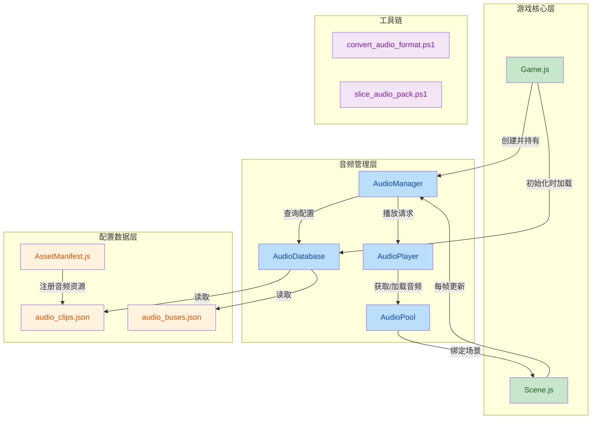
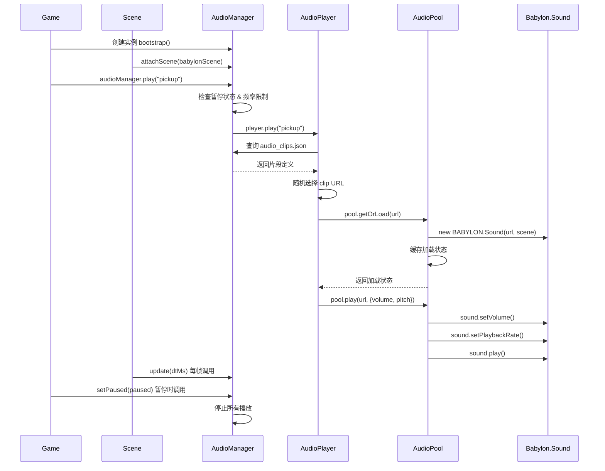

## 1. 高级摘要

**影响范围**：🔴 **高** - 新增完整的音频系统架构，涉及核心游戏循环集成

**关键变更**：
- ✨ 新增 **AudioManager** 音频系统架构，支持 SFX 播放、频率限制和暂停控制
- 📦 集成 **AudioPool** 音频资源池，基于 Babylon.js 实现懒加载和缓存管理
- 🛠️ 新增音频处理工具链（格式转换 + 音频切片）
- 📝 新增音频系统设计文档和碰撞盒更新技能文档

---

## 2. 可视化架构图



**业务流程图**：



---

## 3. 详细变更分析

### 3.1 核心系统集成

#### **Game.js** (Source: `scripts/Game.js`)

**变更内容**：
- 新增 `AudioManager` 导入和实例化
- 在 `bootstrap()` 中创建 `audioManager` 并注入到 `sharedContext`
- 在 `shutdown()` 中调用 `audioManager.dispose()` 清理资源
- 在 `togglePause()` 中同步音频暂停状态

**新增关键代码**：
```javascript
// 导入
import { AudioManager } from "./Systems/AudioManager.js";

// 构造函数初始化
this.audioManager = null;

// bootstrap 中创建
this.audioManager = new AudioManager(this.assets.audio ?? {});
this.sharedContext.audioManager = this.audioManager;

// shutdown 中清理
this.audioManager?.dispose();
this.audioManager = null;

// 暂停同步
togglePause() {
    const paused = !this.scene.paused;
    this.scene.togglePause();
    this.audioManager?.setPaused(paused);
}
```

#### **Scene.js** (Source: `scripts/Scene.js`)

**变更内容**：
- 构造函数中调用 `audioManager.attachScene(this.scene)` 绑定 Babylon 场景
- `updateRender()` 中每帧调用 `audioManager.update(dtMs)`
- `dispose()` 中调用 `audioManager.detachScene()` 清理场景绑定

**新增关键代码**：
```javascript
// 构造函数绑定
this._game?.audioManager?.attachScene(this.scene);

// 每帧更新
this._game?.audioManager?.update(dtMs);

// 销毁时解绑
this._game?.audioManager?.detachScene();
```

#### **AssetManifest.js** (Source: `scripts/AssetManifest.js`)

**变更内容**：
- 在 `ASSET_MANIFEST` 中新增 `audio` 分组，包含 `clips` 和 `buses` 配置路径

**新增配置**：
```javascript
audio: {
    clips: "./Data/Audio/audio_clips.json",
    buses: "./Data/Audio/audio_buses.json"
}
```

---

### 3.2 音频系统核心模块

#### **AudioManager.js** (新增文件)

**职责**：音频系统的统一入口，管理播放请求、频率限制、暂停状态

**核心方法**：

| 方法名 | 功能 | 实现状态 |
|--------|------|----------|
| `play(id, options)` | 播放音频事件 | ✅ 已实现 |
| `stop(id)` | 停止指定音频 | ⚠️ 空实现 |
| `playMusic(id, options)` | 播放音乐 | ⚠️ 空实现 |
| `stopMusic()` | 停止音乐 | ⚠️ 空实现 |
| `setBusVolume(busName, value)` | 设置总线音量 | ⚠️ 空实现 |
| `update(deltaTimeMs)` | 每帧更新 | ⚠️ 空实现 |
| `setPaused(paused)` | 暂停/恢复 | ✅ 已实现 |
| `dispose()` | 资源清理 | ✅ 已实现 |

**关键特性**：
- **频率限制**：默认 50ms 内同一音频 ID 只触发一次，防止声音叠加
- **暂停感知**：暂停时拒绝所有播放请求
- **生命周期管理**：通过 `attachScene/detachScene` 跟随场景生命周期

#### **AudioDatabase.js** (新增文件)

**职责**：纯查询层，管理音频片段和总线配置

**核心方法**：
```javascript
getClipDef(id)          // 查询音频片段定义
getBusVolume(busName)   // 查询总线音量
hasClip(id)             // 检查音频 ID 是否存在
```

**特点**：
- 无 Babylon.js 依赖，纯数据层
- 音量默认值处理（空值返回 1.0）

#### **AudioPlayer.js** (新增文件)

**职责**：处理播放逻辑，包括随机选择、音量/音调设置

**核心逻辑**：
```javascript
play(id, options = {}) {
    // 1. 查询定义
    const def = this._database.getClipDef(id);
    
    // 2. 随机选择 clip URL
    const clipUrl = def.clips[Math.floor(Math.random() * def.clips.length)];
    
    // 3. 触发懒加载
    this._pool.getOrLoad(clipUrl);
    
    // 4. 解析音调（支持固定值或区间随机）
    const pitch = this._resolvePitch(options.pitch ?? def.pitch);
    
    // 5. 播放
    return this._pool.play(clipUrl, { volume, pitch });
}
```

**音调处理**：
- 支持数字：固定音调
- 支持 `[min, max]`：线性随机音调

#### **AudioPool.js** (新增文件)

**职责**：缓存和管理 BABYLON.Sound 实例，避免频繁创建

**加载状态管理**：

| 状态 | 值 | 说明 |
|------|-----|------|
| `PENDING` | 0 | 加载中 |
| `LOADED` | 1 | 已加载，可播放 |
| `FAILED` | 2 | 加载失败 |

**核心方法**：
```javascript
getOrLoad(url)        // 获取或加载音频（懒加载）
play(url, options)    // 播放音频
attachScene(scene)    // 绑定场景
detachScene()         // 解绑场景，清空缓存
```

**生命周期特性**：
- Scene 切换时自动清空缓存（BABYLON.Sound 随 scene.dispose 销毁）
- 支持懒加载，首次播放可能失败（简化实现）

---

### 3.3 音频配置文件

#### **audio_clips.json** (新增)

| 配置项 | 示例值 | 说明 |
|--------|--------|------|
| `clips` | `["./Audio/sfx/player/pickup_01.wav"]` | 音频文件路径数组（随机选择） |
| `volume` | `0.8` | 默认音量 0.0~1.0 |
| `pitch` | `[0.96, 1.04]` | 音调区间，随机选择 |

#### **audio_buses.json** (新增)

| 总线 | 默认音量 | 用途 |
|------|----------|------|
| `master` | 1.0 | 主音量 |
| `music` | 0.8 | 背景音乐 |
| `sfx` | 1.0 | 音效 |
| `ui` | 1.0 | UI 音效 |
| `ambient` | 0.6 | 环境音 |

---

### 3.4 音频处理工具链

#### **convert_audio_format.ps1** (新增)

**功能**：WAV 音频格式转换工具

**支持的转换**：

| 参数 | 默认值 | 说明 |
|------|--------|------|
| `-TargetSampleRate` | 44100 | 目标采样率（Hz） |
| `-TargetBitsPerSample` | 16 | 目标位深度（8/16/24） |
| `-TargetChannels` | 1 | 目标声道数（1=单声道, 2=立体声） |
| `-Recurse` | $false | 递归扫描子目录 |
| `-Force` | $false | 覆盖已存在文件 |

**核心算法**：
- **WAV 头部解析**：读取 RIFF/WAVE 格式
- **采样转换**：支持 8/16/24/32 位 PCM
- **声道转换**：单声道 ↔ 立体声
- **重采样**：线性插值算法
- **输出**：标准 WAV 格式输出

#### **slice_audio_pack.ps1** (新增)

**功能**：音频切片工具，支持三种模式

**模式对比**：

| 模式 | 用途 | 参数 |
|------|------|------|
| `Scan` | 扫描静音区域（已弃用） | `-WavPath`, `-SilenceThreshold` 等 |
| `Slice` | 按 slice.json 切片 | `-SliceJson` |
| `EvenSplit` | 等分切分 | `-WavPath`, `-Count` |
| `EvenSplitBatch` | 批量等分切分 | `-BatchDir`, `-SliceInfo` |

**EvenSplit 模式特性**：
- 将单个 WAV 文件等分为 N 段
- 自动计算每段的峰值音量（`_peak`）
- 生成 `.slice.json` 元数据文件

**生成的 JSON 结构**：
```json
{
    "source": "原始文件名.wav",
    "outputDir": "../输出目录/",
    "_scanMeta": {
        "mode": "EvenSplit",
        "sampleRate": 192000,
        "channels": 2,
        "bitsPerSample": 24,
        "duration": 12.96,
        "count": 6
    },
    "slices": [
        {
            "name": "slice_1.ToString('00')",
            "start": 0,
            "end": 2.16,
            "_peak": 0.078
        }
    ]
}
```

---

### 3.5 美术资源更新

#### **longswordman_inspect.json** (新增)

**内容**：长剑手检查动画的精灵图集配置

**帧信息**：

| 帧名 | 位置 (x,y) | 尺寸 | 持续时间 |
|------|------------|------|----------|
| `longswordman_inspect 0.ase` | (0, 0) | 128×128 | 100ms |
| `longswordman_inspect 1.ase` | (128, 0) | 128×128 | 100ms |
| `longswordman_inspect 2.ase` | (256, 0) | 128×128 | 200ms |
| `longswordman_inspect 3.ase` | (384, 0) | 128×128 | 200ms |
| `longswordman_inspect 4.ase` | (512, 0) | 128×128 | 1500ms |
| `longswordman_inspect 5.ase` | (640, 0) | 128×128 | 100ms |

**图层结构**：
- `mainvisual`、`main`、`weapon`、`rightarm`、`lefthand`、`cloak`、`rootmotion`

#### **Data/RootMotion/longswordman/longswordman_inspect.json** (新增)

**内容**：与精灵图集同步的根运动数据，用于动画驱动

---

### 3.6 文档变更

#### **AudioSystemDesign.MD** (新增，1005 行)

**核心内容**：

| 章节 | 主题 |
|------|------|
| Design Goals | 事件驱动、数据驱动、无状态 Gameplay |
| 系统结构 | AudioManager、AudioDatabase、AudioPlayer、AudioPool、MusicPlayer |
| Audio Event | `play(id, options)` 接口定义 |
| 推荐事件 | Player、Combat、NPC、Environment 音效列表 |
| 与 Sequencer 集成 | `playAudio` Timeline Clip |
| 与 Animation 集成 | 帧事件映射（`Data/Audio/frame_events.json`） |
| Music | SceneDef 条件化音乐选择 |
| 第一阶段不做 | 3D 空间音频、混响、动态音乐等 |
| 与现有系统集成 | AssetManifest、Game/Scene 生命周期 |

**设计原则**：
1. **事件驱动**：业务代码不依赖具体音频文件
2. **数据驱动**：音效配置全部 JSON 化
3. **无状态 Gameplay**：Gameplay 不维护音频状态
4. **生命周期独立**：AudioManager 由 Game 持有，Scene 通过 `this._game.audioManager` 访问

#### **SKILL.md** (新增)

**用途**：碰撞盒 / NPC 占用盒更新技能说明

**支持的更新路线**：

| 脚本 | 适用角色 | 输出格式 |
|------|----------|----------|
| `extract_collision_boxes.ps1` | 战斗角色（longswordman、rabble_stick） | `.collider.json` |
| `extract_rootmotion_occupancy.ps1` | NPC（traveller、merchant、merchant2） | `.occupancy.json` |

**颜色约定**：

| 颜色 | 含义 |
|------|------|
| `#FFFF00` | hitbox（受击框） |
| `#E37800` | weaponbox + subtype = strong_blade |
| `#FF0000` | weaponbox + subtype = weak_blade |
| `#7082C1` | root（根锚点） |

---

### 3.7 其他变更

#### **ExploreMode.js.rej** (新增)

**内容**：一个被拒绝的补丁文件，记录了尝试修改物品渲染帧尺寸的变更

---

## 4. 影响与风险评估

### 4.1 破坏性变更

| 变更 | 影响 | 兼容性 |
|------|------|--------|
| 新增 `audio` 配置到 AssetManifest | 需要提供 `audio_clips.json` 和 `audio_buses.json` | ✅ 可选（`?? {}` 兜底） |
| Scene 构造函数调用 `audioManager.attachScene` | 依赖 Game 先创建 AudioManager | ✅ 可选链（`?.` 保护） |
| Game.pause 同步 AudioManager | 暂停时音频也会停止 | ✅ 符合预期行为 |

### 4.2 潜在风险

⚠️ **懒加载首次播放失败**：当前实现首次播放因加载未完成会静默失败，可能导致第一声音效丢失

⚠️ **空实现方法**：`playMusic`、`stopMusic`、`setBusVolume` 等方法为空实现，调用无效

⚠️ **Scene 切换缓存清空**：场景切换会清空音频缓存，可能影响连续播放

⚠️ **频率限制固定值**：50ms 硬编码，无法通过配置调整

### 4.3 测试建议

| 测试场景 | 预期行为 |
|----------|----------|
| 基本播放 | `audioManager.play("pickup")` 应播放音效 |
| 频率限制 | 连续快速调用同一 ID，应只触发一次 |
| 暂停同步 | 暂停游戏时音频应停止，恢复后可播放 |
| 场景切换 | 切换场景后应自动解绑旧场景、绑定新场景 |
| 无效 ID | 播放未配置的 ID 应警告并返回 false |
| 随机选择 | 配置多个 clips 时应随机选择 |
| 音调随机 | 配置 pitch 区间时应产生不同音调 |

---

## 5. 工具使用示例

### 5.1 音频格式转换

```powershell
# 转换单个文件为 44.1kHz 单声道 16bit
powershell -ExecutionPolicy Bypass -File scripts/tools/convert_audio_format.ps1 `
  -InputPath "Audio/sfx/_raw/source.wav" `
  -OutputDir "Audio/sfx/player/" `
  -TargetSampleRate 44100 `
  -TargetBitsPerSample 16 `
  -TargetChannels 1

# 递归转换目录
powershell -ExecutionPolicy Bypass -File scripts/tools/convert_audio_format.ps1 `
  -InputPath "Audio/sfx/_raw/" `
  -OutputDir "Audio/sfx/" `
  -Recurse `
  -Force
```

### 5.2 音频等分切分

```powershell
# 将 WAV 等分为 6 段
powershell -ExecutionPolicy Bypass -File scripts/tools/slice_audio_pack.ps1 `
  -Mode EvenSplit `
  -WavPath "Audio/sfx/_raw/pack.wav" `
  -Count 6

# 批量等分
powershell -ExecutionPolicy Bypass -File scripts/tools/slice_audio_pack.ps1 `
  -Mode EvenSplitBatch `
  -BatchDir "Audio/sfx/_raw/" `
  -SliceInfo "Audio/sfx/_raw/sliceinfo.txt"
```

`sliceinfo.txt` 格式：
```
"file with spaces.wav" 6
simple_file.wav 4
```

---

## 6. 总结

本次变更建立了完整的音频系统基础架构，包括：

✅ **核心模块**：AudioManager（入口）、AudioDatabase（配置）、AudioPlayer（播放）、AudioPool（缓存）

✅ **游戏集成**：Game 生命周期管理、Scene 场景绑定、暂停同步

✅ **配置系统**：audio_clips.json（片段定义）、audio_buses.json（总线配置）

✅ **工具链**：音频格式转换、等分切片工具

✅ **文档**：详细的系统设计文档和更新技能文档

⚠️ **待完善**：音乐播放、总线音量控制、预加载机制、3D 空间音频

整个系统遵循事件驱动和数据驱动原则，为后续扩展预留了良好架构。