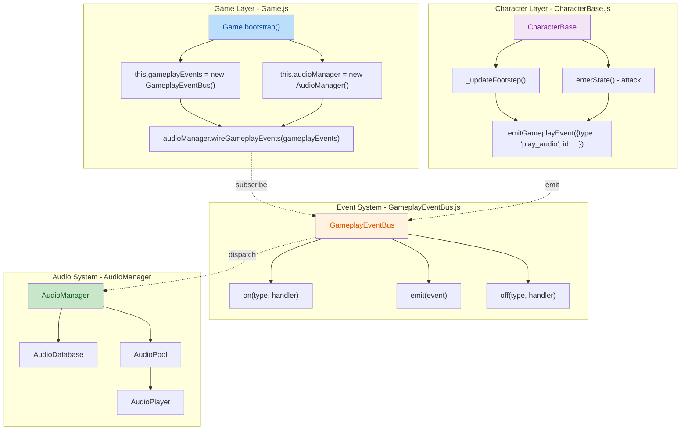
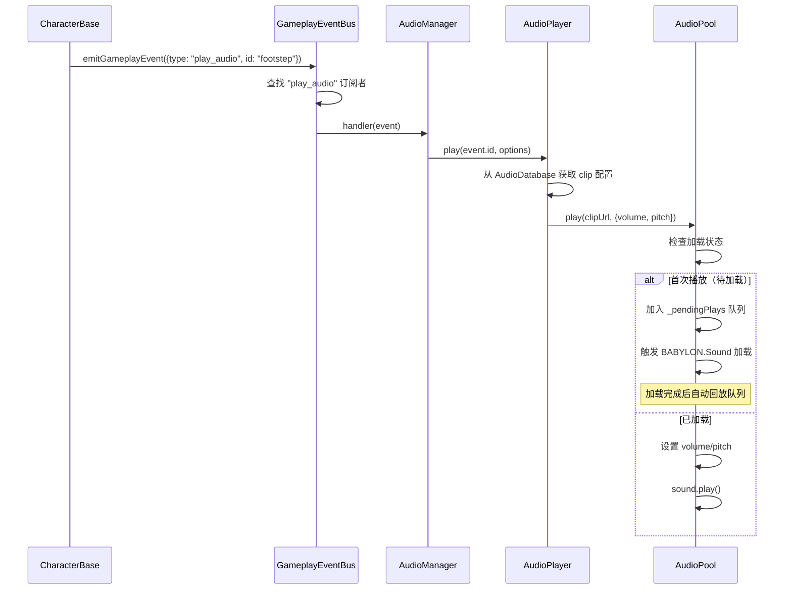

## 1. 高层摘要 (TL;DR)

*   **影响范围:** 中等 - 新增音频播放事件系统，重构游戏内事件通信架构
*   **关键变更:**
    *   ✨ 新增 **GameplayEventBus** 事件总线，实现游戏内事件的发布/订阅模式
    *   🔊 新增完整的 **AudioSystem**（AudioManager/AudioDatabase/AudioPool/AudioPlayer）
    *   🔗 在 **Game.bootstrap()** 中完成音频系统与事件总线的集成
    *   👣 **CharacterBase** 通过事件总线触发脚步声和攻击音频
    *   📦 音频资源采用延迟加载（lazy load）策略，优化启动性能

---

## 2. 可视化架构图



**事件流程序列图:**



---

## 3. 详细变更分析

### 3.1 事件系统 - GameplayEventBus.js

**新增文件:** `scripts/Systems/GameplayEventBus.js`

这是一个轻量级的事件总线实现，使用 Map + Set 存储事件订阅者。

| 方法 | 功能 | 关键逻辑 |
|------|------|----------|
| `on(type, handler)` | 订阅事件 | 返回取消订阅函数 |
| `off(type, handler)` | 取消订阅 | 自动清理空 Set |
| `emit(event)` | 发布事件 | 使用 try-catch 包装，防止单个处理器错误影响全局 |
| `clear()` | 清空所有订阅 | 用于场景切换或游戏重置 |

**设计亮点:**
- 错误隔离：handler 执行失败时输出警告但不会中断其他处理器
- 自动清理：Set 为空时自动删除 Map 中的 key
- 函数式取消订阅：`on()` 返回 unsubscribe 函数，支持链式调用

---

### 3.2 音频系统架构

#### 3.2.1 AudioDatabase.js (数据层)

**职责:** 纯数据查询层，无 BABYLON 依赖

| 方法 | 返回值 | 说明 |
|------|--------|------|
| `getClipDef(id)` | `clipDef \| null` | 获取音频配置 |
| `getBusVolume(busName)` | `number` | 获取音轨音量 |
| `hasClip(id)` | `boolean` | 判断音频 ID 是否存在 |

**数据结构示例** (来自 `Data/Audio/audio_clips.json`):
```json
{
  "footstep": {
    "clips": ["./Audio/sfx/footstep/...slice_06.wav"],
    "volume": 0.7,
    "pitch": [0.92, 1.08]
  }
}
```

---

#### 3.2.2 AudioPool.js (资源管理)

**核心特性:**

| 功能 | 实现方式 |
|------|----------|
| **延迟加载** | 首次调用 `getOrLoad()` 时才创建 BABYLON.Sound |
| **场景生命周期绑定** | `attachScene/detachScene` 随 Scene 切换清空缓存 |
| **待播放队列** | 音频加载中的请求暂存到 `_pendingPlays`，加载后自动回放 |
| **加载状态跟踪** | `PENDING → LOADED/FAILED` 三态管理 |

**关键代码片段:**
```javascript
// 待播放队列处理
if (entry.state === LOAD_STATE.PENDING) {
    entry._pendingPlays.push(opts);
    return true;
}
// 加载完成后自动回放
if (entry._pendingPlays && entry._pendingPlays.length > 0) {
    const pending = entry._pendingPlays.splice(0);
    for (const opts of pending) {
        // 应用 volume/pitch 并播放
    }
}
```

---

#### 3.2.3 AudioPlayer.js (播放控制)

**职责:** 协调 Database 和 Pool，处理随机 clip 和音调变化

| 特性 | 说明 |
|------|------|
| **随机 Clip 选择** | `def.clips[Math.floor(Math.random() * def.clips.length)]` |
| **音调随机化** | 支持 `pitch: [min, max]` 数组格式 |
| **体积合并** | options.volume 优先于 def.volume |

---

#### 3.2.4 AudioManager.js (对外接口)

**核心功能:**

| 方法 | 功能 |
|------|------|
| `wireGameplayEvents(bus)` | 订阅 `play_audio` 事件 |
| `play(id, options)` | 播放指定音频（含节流控制） |
| `attachScene/detachScene` | 绑定/解绑 Babylon 场景 |
| `setPaused(paused)` | 全局暂停音频 |

**节流机制:**
```javascript
const DEFAULT_THROTTLE_MS = 50;
const now = performance.now();
const last = this._lastPlayAt.get(id) ?? 0;
if (now - last < throttleMs) return false;  // 防止同一音频过于频繁播放
```

**音频引擎解锁:**
- 监听 `pointerdown` 和 `keydown` 事件
- 调用 `BABYLON.Engine.audioEngine.unlock()` 和 `resume()`
- 解决浏览器自动播放策略限制

---

### 3.3 Game.js 集成

**变更位置:** `Game.bootstrap()` 方法

**新增初始化代码:**
```javascript
this.audioManager = new AudioManager(this.assets.audio ?? {});
this.sharedContext.audioManager = this.audioManager;

this.gameplayEvents = new GameplayEventBus();
this.sharedContext.gameplayEvents = this.gameplayEvents;

this.audioManager.wireGameplayEvents(this.gameplayEvents);
```

**资源清理 (Game.dispose):**
```javascript
this.audioManager?.dispose();
this.audioManager = null;
this.gameplayEvents?.clear();
this.gameplayEvents = null;
```

---

### 3.4 CharacterBase.js 音频触发

**新增方法:**

| 方法 | 触发时机 | 事件类型 |
|------|----------|----------|
| `_updateFootstep(dtMs)` | 行走状态，每 380ms | `{type: "play_audio", id: "footstep"}` |
| `enterState()` | 攻击状态进入时 | `{type: "play_audio", id: "swing_heavy" \| "swing_light"}` |

**脚步声实现:**
```javascript
const FOOTSTEP_INTERVAL_MS = 380;
this._footstepAccumMs += dtMs;
if (this._footstepAccumMs >= FOOTSTEP_INTERVAL_MS) {
    this._footstepAccumMs -= FOOTSTEP_INTERVAL_MS;
    this.emitGameplayEvent({ type: "play_audio", id: "footstep" });
}
```

**攻击音频:**
```javascript
if (stateDef.attackActive === true) {
    const audioId = stateDef.attackWeight === "heavy" ? "swing_heavy" : "swing_light";
    this.emitGameplayEvent({ type: "play_audio", id: audioId });
}
```

**emitGameplayEvent 辅助方法:**
```javascript
emitGameplayEvent(event) {
    if (!this.gameplayEvents || !event || typeof event.type !== "string") return;
    try {
        this.gameplayEvents.emit(event);
    } catch (err) {
        console.warn(`[CharacterBase] emitGameplayEvent failed for "${event.type}"`, err);
    }
}
```

---

### 3.5 ExploreMode.js 物品渲染优化

**注意:** 根据提供的 `.rej` 文件，此变更已被拒绝，但当前代码中已包含类似实现。

**变更内容:** `_startGiveSequence()` 方法

| 变更前 | 变更后 |
|--------|--------|
| `pxToWorld = character.pxToWorld ?? 0.03` | `pxToWorld = 0.02` (固定值) |
| 固定 32x32 像素 | 从 `assets.items` 图集中读取实际帧尺寸 |

**当前实现代码:**
```javascript
const assets = this.context.assets ?? {};
const atlas = assets.items?.[itemDef.atlasKey ?? "ham"];
let frameWidth = 32;
let frameHeight = 32;
if (atlas?.frames) {
    const firstFrame = Object.values(atlas.frames)[0];
    if (firstFrame?.frame) {
        frameWidth = firstFrame.frame.w;
        frameHeight = firstFrame.frame.h;
    }
}
const pxToWorld = 0.02;
const planeW = frameWidth * pxToWorld;
const planeH = frameHeight * pxToWorld;
```

---

## 4. 影响与风险评估

### 4.1 破坏性变更

| 组件 | 变更类型 | 风险等级 |
|------|----------|----------|
| 新增 GameplayEventBus | ✅ 向后兼容 | 🟢 低 |
| 新增音频系统 | ✅ 新增模块，无破坏性 | 🟢 低 |
| CharacterBase.emitGameplayEvent | ✅ 新增方法，现有逻辑不变 | 🟢 低 |

**无破坏性 API 变更**

---

### 4.2 潜在风险

| 风险点 | 描述 | 缓解措施 |
|--------|------|----------|
| 🔇 音频加载失败 | 网络或文件问题导致音频无法播放 | AudioPool 有 `FAILED` 状态，不会阻塞游戏 |
| 🔊 首次播放延迟 | Lazy Load 导致首次音频播放有 50-200ms 延迟 | 待播放队列自动回放机制 |
| 🔄 内存泄漏 | Scene 切换时音频资源未正确释放 | `detachScene()` 清空 AudioPool 缓存 |
| ⚡ 事件总线滥用 | 过多事件订阅影响性能 | 当前仅用于音频，可控 |

---

### 4.3 测试建议

| 测试场景 | 验证要点 |
|----------|----------|
| 🚶 **行走音频** | 角色行走时每 380ms 触发一次脚步声，音调随机变化 |
| ⚔️ **攻击音频** | 轻攻击/重攻击分别触发 `swing_light` / `swing_heavy` |
| 🎧 **音频节流** | 快速连续调用同一音频 ID，确认 50ms 节流生效 |
| 🌐 **首次加载延迟** | 清除缓存后首次播放音频，验证待播放队列机制 |
| 🔄 **场景切换** | 切换场景时确认旧音频资源已释放，新场景音频正常播放 |
| 🔒 **浏览器自动播放** | 首次交互前无音频，pointerdown/keydown 后解锁 |
| 📦 **物品渲染** | NPC 给予物品时，物品平面尺寸与图集帧尺寸匹配 |

---

## 5. 数据资源变更

### 5.1 新增音频资源配置

**文件:** `Data/Audio/audio_clips.json`

| 音频 ID | 文件路径 | 音量 | 音调范围 |
|---------|----------|------|----------|
| `pickup` | `./Audio/sfx/player/pickup_01.wav` | 0.8 | [0.96, 1.04] |
| `swing_light` | `./Audio/sfx/weapon/slice_04.wav` | 0.8 | [0.96, 1.04] |
| `swing_heavy` | `./Audio/sfx/weapon/slice_04.wav` | 0.9 | [0.93, 1.07] |
| `footstep` | `./Audio/sfx/footstep/slice_06.wav` | 0.7 | [0.92, 1.08] |

**文件:** `Data/Audio/audio_buses.json` (已存在，本次未变更)

---

## 6. 总结

本次代码变更为 **BlindDuel** 项目引入了完整的音频事件系统，主要贡献包括：

1. **架构解耦**: 通过 GameplayEventBus 实现角色与音频系统的松耦合
2. **性能优化**: 采用延迟加载和待播放队列，优化游戏启动体验
3. **可扩展性**: 事件总线设计支持未来添加更多游戏内事件类型
4. **鲁棒性**: 完善的错误处理和资源生命周期管理

**建议后续优化方向:**
- 添加音频预加载机制，减少首次播放延迟
- 实现音频音量渐变（fade in/out）效果
- 添加音频调试面板，实时监控音频播放状态
- 支持空间音效（3D spatial sound）以增强沉浸感