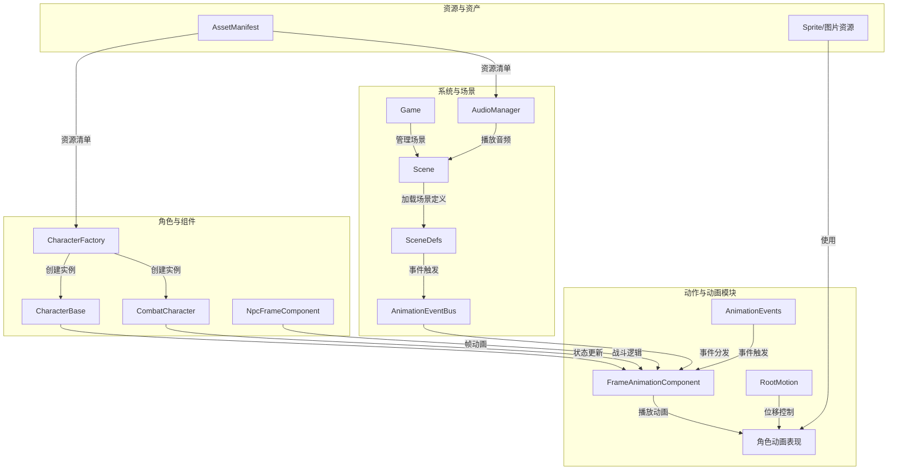

## 1. 高层摘要 (TL;DR)
- **影响范围：** 中等 - 涉及动画播放、角色行为、场景流程与资源管理
- **关键变更：**
  1. 为长剑与木棍角色添加/更新攻击与行走动画事件，提升动作表现力
  2. 调整长剑角色inspect动作的根运动数据，优化位移节奏
  3. 更新角色工厂、组件与角色基类，强化动画事件分发与状态处理
  4. 完善序章场景定义，统一场景流程管理
  5. 优化资产清单与音频管理脚本，提升资源加载效率

## 2. 可视化概览 (代码与逻辑图)

## 3. 详细变更分析

### 🎬 动画与事件系统
- **模块：** 动画事件与根运动
- **变更说明：**
  - 新增/调整长剑与木棍角色的`thrust`、`swing`、`walk`等动作动画事件
  - 更新长剑角色inspect动作的根运动数据，改善位移与动画同步
  - 相关文件：
    - `Data_AnimationEvents_longswordman_longswordman_thrust.events.json`
    - `Data_AnimationEvents_rabble_stick_rabble_stick_thrust.events.json`
    - `Data_AnimationEvents_rabble_stick_rabble_stick_swing.events.json`
    - `Data_AnimationEvents_longswordman_longswordman_walk.events.json`
    - `Data_RootMotion_longswordman_longswordman_inspect.json`
    - `scripts_Systems_AnimationEventBus.js`
    - `scripts_Components_FrameAnimationComponent.js`
    - `scripts_Components_NpcFrameComponent.js`

### 🧍 角色与组件系统
- **模块：** 角色工厂与角色基类
- **变更说明：**
  - 更新角色工厂（`CharacterFactory`）对角色实例的初始化流程，集成动画事件与资源引用
  - 优化角色基类（`CharacterBase`）与战斗角色（`CombatCharacter`）的状态管理与事件响应
  - 改进`FrameAnimationComponent`与`NpcFrameComponent`的动画播放与帧同步逻辑
  - 相关文件：
    - `scripts_CharacterFactory.js`
    - `scripts_Enties_CharacterBase.js`
    - `scripts_Enties_CombatCharacter.js`
    - `scripts_Components_FrameAnimationComponent.js`
    - `scripts_Components_NpcFrameComponent.js`

### 🌍 场景与游戏主控
- **模块：** 场景定义与游戏主脚本
- **变更说明：**
  - 更新序章场景定义（`SceneDefs`）的场景配置与事件触发流程
  - 优化`Scene`脚本对场景加载、事件分发与资源引用的处理
  - 在`Game`主脚本中增强对场景切换与全局事件的管理
  - 相关文件：
    - `Data_SceneDefs_prologue.json`
    - `scripts_SceneDefs.js`
    - `scripts_Scene.js`
    - `scripts_Game.js`

### 🔊 资源与音频管理
- **模块：** 资产清单与音频系统
- **变更说明：**
  - 更新`AssetManifest`资产清单，确保动画、精灵图与音频资源的正确注册与加载
  - 优化`AudioManager`的音频播放逻辑，提升场景切换时的音频衔接流畅度
  - 相关文件：
    - `scripts_AssetManifest.js`
    - `scripts_Systems_AudioManager.js`
    - `Art_Sprite_longswordman_longswordman_inspect.json`

## 4. 影响与风险评估

### ⚠️ 潜在风险
- **动画事件变更：** 如果动画事件的触发时机或参数与原有逻辑不匹配，可能导致角色动作不连贯或状态异常
- **资源引用变更：** 资产清单的更新需确保所有新增资源的引用路径正确，避免加载失败
- **场景流程调整：** 序章场景定义变更可能影响开场动画与角色初始化流程，需完整测试

### 🧪 测试建议
- 测试长剑与木棍角色的攻击、行走动作，确保动画事件触发及时且表现自然
- 验证长剑角色inspect动作的根运动位移是否与动画同步，无抖动或滑步
- 检查序章场景的加载流程与事件触发顺序，确认无资源缺失或逻辑冲突
- 测试音频在场景切换与动作触发时的播放是否流畅，无延迟或错位

## 5. 补充说明
- 本次变更整体围绕动作动画的完善、角色行为与状态管理的强化，以及场景流程的统一展开
- 建议在后续开发中持续关注动画事件与角色状态之间的解耦，确保系统可维护性与扩展性