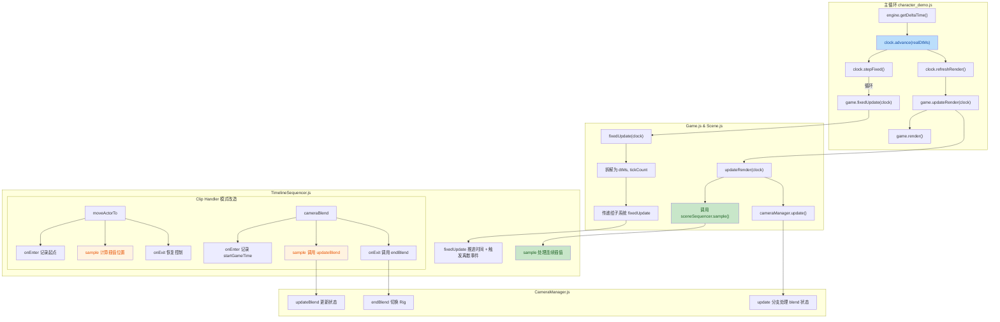

## 1. 高层摘要 (TL;DR)

**影响范围**: **高** — 核心架构重构，涉及全局时间管理、序列化播放系统和相机混合机制

**关键变更**:
- ⏱️ **引入统一时间源** `FrameClock`，实现固定频率物理更新与渲染插值的分离
- 🎬 **序列化播放系统采样化** - TimelineSequencer 改造为 `onEnter/sample/onExit` 模式，支持精确的时间回放
- 🎥 **相机混合机制重构** - CameraManager 新增 `updateBlend`/`endBlend` API，支持时间驱动的平滑过渡
- 🛡️ **修复相机切换 Bug** - 处理 BattleMode 上下文未就绪时的相机状态漂移问题
- 📝 **新增设计文档** - Handoff.MD 交接文档 + Collider 更新 Skill 指南

---

## 2. 可视化概览 (代码与逻辑映射)



**架构核心变化**:
- **双时间流** → **单时间源**：所有系统现在共享 `FrameClock` 实例
- **Step-based 更新** → **Sample 采样**：Timeline Sequencer 支持基于时间的精确回放
- **相机混合** 从固定步长更新改为时间因子驱动

---

## 3. 详细变更分析

### 📦 组件 1: FrameClock 统一时间源 (新增)

**文件**: `scripts/Systems/FrameClock.js` (新建)

**职责**: 全局权威时钟，管理游戏时间的统一推进

| 字段 | 类型 | 说明 |
|------|------|------|
| `fixedDeltaMs` | number | 固定更新间隔 (默认 16.67ms, 60fps) |
| `tick` | number | 当前 tick 计数 |
| `fixedTime` | number | 累计固定时间 |
| `accumulator` | number | 时间累加器 |
| `renderAlpha` | number | 渲染插值因子 (0-1) |
| `renderTime` | number | 渲染时间 (fixedTime + accumulator) |
| `timeScale` | number | 时间缩放因子 |
| `paused` | boolean | 暂停状态 |
| `realDtMs` | number | 实际帧时间差 |

**关键方法**:
```javascript
// 推进时间 (每帧调用一次)
advance(realDtMs) {
    this.realDtMs = realDtMs;
    if (this.paused) return;
    this.accumulator += realDtMs * this.timeScale;
    // 防止雪崩效应，限制最大 5 帧
    if (this.accumulator > this.fixedDeltaMs * 5) {
        this.accumulator = this.fixedDeltaMs * 5;
    }
}

// 执行固定步长更新 (返回是否执行)
stepFixed() {
    if (this.accumulator < this.fixedDeltaMs) return false;
    this.accumulator -= this.fixedDeltaMs;
    this.tick++;
    this.fixedTime = this.tick * this.fixedDeltaMs;
    return true;
}

// 刷新渲染时间 (渲染前调用)
refreshRender() {
    this.renderAlpha = this.accumulator / this.fixedDeltaMs;
    this.renderTime = this.fixedTime + this.accumulator;
}
```

---

### 📦 组件 2: 主循环改造

**文件**: `character_demo.js`

**变更内容**:
- **移除**: 手动实现的 `FIXED_DT`, `accumulator`, `tickCount`
- **新增**: `FrameClock` 实例管理
- **改造**: 主循环使用统一的时钟 API

**核心变更**:
```javascript
// 旧代码
const FIXED_DT = 1000 / 60;
let accumulator = 0;
let tickCount = 0;

engine.runRenderLoop(() => {
    const dtMs = engine.getDeltaTime();
    accumulator += dtMs;
    if (accumulator > 100) accumulator = 100;
    
    while (accumulator >= FIXED_DT) {
        tickCount++;
        game.fixedUpdate(FIXED_DT, tickCount);
        accumulator -= FIXED_DT;
    }
    
    game.updateRender(dtMs);
    game.render();
});

// 新代码
const clock = new FrameClock(1000 / 60);

engine.runRenderLoop(() => {
    try {
        const dtMs = engine.getDeltaTime();
        clock.advance(dtMs);
        
        while (clock.stepFixed()) {
            game.fixedUpdate(clock);
        }
        
        clock.refreshRender();
        game.updateRender(clock);
        game.render();
    } catch (e) {
        console.error("[runRenderLoop] EXCEPTION:", e);
    }
});
```

**改进点**:
- ✅ 统一时间源，避免多个累加器不同步
- ✅ 增加 try-catch 长期护栏，捕获 BABYLON 吞掉的异常
- ✅ 简化主循环逻辑

---

### 📦 组件 3: Game & Scene 层改造

**文件**: `scripts/Game.js`, `scripts/Scene.js`

**变更内容**:
- `fixedUpdate(dtMs, tickCount)` → `fixedUpdate(clock)`
- `updateRender(dtMs)` → `updateRender(clock)`

**Game.js**:
```javascript
// 新增 clock 持有
constructor(engine, canvas) {
    this.clock = null;  // 新增
    // ... 其他初始化
}

// 改造方法签名
fixedUpdate(clock) {
    this.clock = clock;
    this.scene.fixedUpdate(clock);
}

updateRender(clock) {
    this.clock = clock;
    this.scene.updateRender(clock);
}

// 暂停同步
togglePause() {
    const paused = !this.scene.paused;
    this.scene.togglePause();
    if (this.clock) this.clock.paused = paused;  // 新增
    this.audioManager?.setPaused(paused);
}
```

**Scene.js**:
```javascript
fixedUpdate(clock) {
    this.clock = clock;
    if (this.sharedContext) this.sharedContext.clock = clock;  // 注入时钟
    const dtMs = clock.fixedDeltaMs;
    const tickCount = clock.tick;
    // ... 传递给子系统
    sceneSequencer.fixedUpdate(clock);
    this._game.gameModeManager.fixedUpdate(dtMs, tickCount);
}

updateRender(clock) {
    this.clock = clock;
    if (this.sharedContext) this.sharedContext.clock = clock;
    const dtMs = clock.realDtMs;
    
    // 新增：采样 timeline sequencer
    sceneSequencer.sample(clock.renderTime);
    sceneSequencer.updateRender(dtMs);
    
    // ... 其他更新
}
```

**设计考虑**: 采用 Surgical 方案，子系统签名暂不变，Scene 层负责拆解 clock

---

### 📦 组件 4: TimelineSequencer 采样化重构

**文件**: `scripts/Systems/TimelineSequencer.js`

**核心架构变更**:

| 模式 | 旧实现 | 新实现 |
|------|--------|--------|
| 时间推进 | `currentTimeMs += dtMs` | `currentTimeMs = clock.fixedTime - sequenceStartGameTime` |
| 更新方式 | `update` | `sample` |
| 边界检测 | `>` | `>=` |

**关键变更 1: 新增 sample 方法**
```javascript
sample(renderTimeMs) {
    if (!this.busy || this.sequenceStartGameTime === null) return;
    const localTime = renderTimeMs - this.sequenceStartGameTime;
    
    for (const [clipId, state] of this.activeClipStates) {
        const clip = state.clip;
        const handler = this._getHandler(clip.type);
        if (handler && typeof handler.sample === "function") {
            const clipLocalTime = localTime - startMs;
            if (clipLocalTime < 0) continue;
            handler.sample(this.context, clip, state, clipLocalTime);
        }
    }
}
```

**关键变更 2: moveActorTo 改造**
```javascript
// onEnter - 只记录起点，不写位置
onEnter(ctx, clip, state) {
    if (Array.isArray(clip.startPos)) {
        state.startX = clip.startPos[0];
        state.startY = clip.startPos[1];
    } else {
        state.startX = actor.root.position.x;
        state.startY = actor.root.position.y;
    }
    // ... 设置目标
}

// sample - 计算插值位置
sample(ctx, clip, state, time) {
    const t = Math.min(time / durationMs, 1);
    actor.root.position.x = state.startX + (state.targetX - state.startX) * t;
    actor.root.position.y = state.startY + (state.targetY - state.startY) * t;
}

// end - 不 snap，sample 已在 time=duration 算到目标
end(ctx, clip, state) {
    // onExit 不 snap（sample 在 time=duration 时已算到 target）
    if ("controlledBySequence" in actor) {
        actor.controlledBySequence = false;
    }
}
```

**关键变更 3: cameraBlend 改造**
```javascript
// onEnter - 记录开始时间
onEnter(ctx, clip, state) {
    state.startGameTime = ctx.clock ? ctx.clock.fixedTime : 0;
    // ... 调用 startBlend
}

// sample - 调用 updateBlend
sample(ctx, clip, state, time) {
    const t = Math.min(time / (clip.durationMs || 1), 1);
    cm.updateBlend(t);
}

// end - 调用 endBlend
end(ctx, clip, state) {
    const cm = state.cameraManager;
    if (cm && typeof cm.endBlend === "function") {
        cm.endBlend();
    }
}
```

**关键变更 4: 边界检测优化**
```javascript
// 边界含等号：确保 blend1.endMs == blend2.startMs 时
// blend1 在该帧 END、blend2 同帧 START
const justCrossedStart = prevTimeMs <= startMs && currentTimeMs >= startMs;
const justCrossedEnd = prevTimeMs <= endMs && currentTimeMs >= endMs;
```

---

### 📦 组件 5: CameraManager Blend 机制重构

**文件**: `scripts/Systems/CameraManager.js`

**新增字段**:
```javascript
_blend = {
    durationMs: 0,
    fromState: null,
    toState: null,
    toRigId: null,
    sampleDriven: false  // 新增：区分 timeline / step-based 路径
};
```

**新增方法**:
```javascript
// 时间驱动的混合更新
updateBlend(t) {
    if (!this._blend.active) return;
    this._blend.sampleDriven = true;
    const s = this._blend.easing(Math.min(t, 1));
    this.state = _lerpState(this._blend.fromState, this._blend.toState, s);
}

// 结束混合，切换 Rig
endBlend() {
    if (!this._blend.active) return;
    this._blend.active = false;
    this._blend.sampleDriven = false;
    if (this._blend.toRigId) {
        this.switchRig(this._blend.toRigId);
    }
}
```

**update 方法分支处理**:
```javascript
if (this._blend.active) {
    if (this._blend.sampleDriven) {
        // timeline 路径：sample 已写入 this.state，只 clone
        baseState = _cloneState(this.state);
    } else {
        // step-based 路径：靠 _updateBlend(dtMs) 推进
        this.state = this._updateBlend(dtMs);
        baseState = _cloneState(this.state);
    }
}
```

---

### 📦 组件 6: BattleMode 相机切换优化

**文件**: `scripts/Systems/Modes/BattleMode.js`

**问题**: Sequence 期间，`BattleMode.enter` 的 `switchRig("duel")` 会与 `cameraBlend` clip 的 `endBlend` 互相覆盖

**修复**:
```javascript
enter(ctx) {
    // 设计规范：sequence 期间 rig 切换由 cameraBlend clip 全权负责
    // mode.enter 不重复切 rig，避免互相覆盖
    if (this.context.sceneSequencer?.isBusy?.()) {
        console.log(`[BattleMode] enter during sequence — skip switchRig`);
    } else {
        cameraManager?.switchRig("duel");
    }
    // ... 其他初始化
}
```

---

### 📦 组件 7: DuelCameraRig 安全网

**文件**: `scripts/DuelCameraRig.js`

**问题**: Mode 上下文未就绪时（BattleMode 未 enter，`fighterDistance` 未写入），默认值 `0` 导致 `zoomT→0` 漂移

**修复**:
```javascript
compute(dtMs, context, prevState) {
    const basePosition = context?.basePosition;
    const target = context?.target;
    const fighterDistance = context?.fighterDistance;  // 移除 ?? 0
    
    // 安全网：未就绪时 hold 上一帧状态，不 fallback 到 0
    if (!basePosition || !target || fighterDistance == null) {
        return prevState ? this.#stateFromPrev(prevState) : this.#defaultState();
    }
    // ... 正常计算
}
```

---

### 📦 组件 8: ScriptedCameraRig 回归修复

**文件**: `scripts/ScriptedCameraRig.js`

**问题**: `enter()` 清除 `_followTarget` 会与 `setCameraFollow` 时序冲突

**修复**:
```javascript
enter(ctx) {
    // 移除: this._followTarget = null;
    const state = ctx?.cameraManager?.state;
    if (state) {
        this._center.copyFrom(state.target);
    }
}
```

---

### 📦 组件 9: 配置数据更新

**文件**: `Data/SceneDefs/prologue.json`, `scripts/SceneDefs.js`

| 配置项 | 旧值 | 新值 | 说明 |
|--------|------|------|------|
| `cameraBlend` durationMs | 1800 | 1500 | 调整进战斗混合时长 |
| `rabble_stick` controller | `"ai"` | `"dummy"` | prologue 敌人改为假人 |
| `setCameraFollow` offset | `offset : 0` | `offsetZ: 0` | 修复拼写错误 |

---

### 📦 组件 10: 新增资源文件

| 文件 | 说明 |
|------|------|
| `Art/Sprite/longswordman/longswordman_inspect.json` | 检查动画精灵图集数据 |
| `Data/RootMotion/longswordman/longswordman_inspect.json` | 检查动画根运动数据 |
| `.trae/skills/collider-occupancy-更新-skill/SKILL.md` | Collider/Occupancy 更新操作指南 |

---

### 📦 组件 11: 新增文档

**文件**: `plans/Handoff.MD` (新建)

**内容要点**:
- 📋 Phase 1 & Phase 2 实施总结
- 🐛 进出战斗相机 Blend Bug 根因分析
- 🔧 已提出的修复方案（待实施）
- 📌 下一轮实施入口和验收标准
- ⚠️ 注意事项和关键代码位置

**文件**: `scripts/Systems/TimeControlSystem.js` (文档更新)

**新增注释**: 说明角色级冻结/停滞状态机与全局 `FrameClock` 的正交关系

---

## 4. 影响与风险评估

### ⚠️ 破坏性变更

1. **接口签名变更**
   - `Game.fixedUpdate(dtMs, tickCount)` → `fixedUpdate(clock)`
   - `Scene.fixedUpdate(dtMs, tickCount)` → `fixedUpdate(clock)`
   - `TimelineSequencer.fixedUpdate(dtMs, tickCount)` → `fixedUpdate(clock)`
   
   **影响**: 任何直接调用这些方法的代码需要适配

2. **时间计算方式变更**
   - `TimelineSequencer.currentTimeMs` 从累加改为 `clock.fixedTime - sequenceStartGameTime`
   
   **影响**: 依赖时间点的逻辑需要验证

### ✅ 测试建议

| 场景 | 验证要点 |
|------|----------|
| **开场 Sequence** | 相机平滑过渡，无抖动和回跳 |
| **进出战斗** | blend 时序正确，相机平滑切到战斗位置 |
| **暂停/恢复** | tick 停止推进，恢复后无跳跃 |
| **长帧处理** | accumulator 上限（5 帧）防止雪崩 |
| **同帧 Blend 切换** | `justCrossedStart`/`justCrossedEnd` 的 `>=` 边界处理 |
| **BattleMode 窗口期** | `fighterDistance` 未就绪时相机定格在 blend 终值 |

### 🔍 已知问题（待下一轮修复）

根据 `Handoff.MD`，当前残留一个相机 Blend 时序 Bug：
- **症状**: 进出战斗时相机先 blend 到目标位置，然后立刻挪回，等模式切换后又突然切
- **根因**: 700ms 空窗期，`duelRig` 已 active 但 `fighterDistance` 未设置
- **修复方案**: 调整 sequence 时序，将 `switchMode` 提前到第一个 blend 结束时（t=500）

---

## 5. 总结

本次重构实现了游戏引擎核心时间管理架构的现代化：

✅ **统一时间源** - `FrameClock` 提供权威时间管理，消除多个累加器的同步问题  
✅ **采样架构** - Timeline Sequencer 支持基于时间的精确回放，为后续渲染插值奠定基础  
✅ **相机混合优化** - 时间驱动的混合机制，提供更平滑的相机过渡  
✅ **稳定性增强** - 多处安全网和边界条件修复，提升系统健壮性  

**后续工作**: 修复进出战斗相机 Blend 时序 Bug，清理调试日志，实施 Phase 3 (Render 插值)。