## 1. 高层摘要（TL;DR）

- **影响范围：中高** - 实现了渲染插值系统，改善了高刷新率屏幕上的视觉效果，同时启用了AI控制器并添加了新动画
- **核心变更：**
  - 🎨 实现角色位置插值系统，消除144Hz屏幕上的视觉阶梯感
  - 🤖 序章场景启用AI控制器替换dummy控制器
  - ⚔️ 新增长矛兵"检查"动画（Sprite + RootMotion数据）
  - 📝 新增项目交接文档，记录Phase 2收尾和Phase 3规划

---

## 2. 可视化概览（代码与逻辑映射）

```mermaid
graph TD
    subgraph "Scene.js 场景管理"
        A["Scene.fixedUpdate()"] --> B["_restoreEntityPositions()"]
        A --> C["gameModeManager.fixedUpdate()"]
        A --> D["_snapshotEntityPositions()"]
        
        E["Scene.updateRender()"] --> F["sceneSequencer.sample()"]
        E --> G["_interpolateEntities()"]
        E --> H["gameModeManager.updateRender()"]
    end
    
    subgraph "CharacterBase.js 角色基类"
        I["supportsRenderSampling 标志"] --> J{是否走插值路径?}
        J -->|false| K["插值路径: previous/current"]
        J -->|true| L["采样路径: sample(renderTime)"]
        
        M["snapshotRenderTransform()"] --> N["保存位置快照"]
        O["restoreRenderTransform()"] --> P["恢复位置"]
        
        Q["_interpolateEntities()"] --> R["lerp位置插值"]
    end
    
    subgraph "TimelineSequencer.js 序列控制"
        S["moveActorTo START"] --> T["supportsRenderSampling=true"]
        S --> U["controlledBySequence=true"]
        
        V["moveActorTo END"] --> W["supportsRenderSampling=false"]
        V --> X["controlledBySequence=false"]
        
        Y["moveActorByDirection START"] --> T
        Y --> U
        Z["moveActorByDirection END"] --> W
        Z --> X
    end
    
    subgraph "业务目标"
        AA["高刷新率屏幕平滑渲染"] --> I
        AB["序列动画精确控制"] --> S
        AC["场景AI敌人启用"] --> AD["prologue.json"]
    end
    
    E --> R
    C --> M
```



---

## 3. 详细变更分析

### 3.1 渲染插值系统实现

#### **CharacterBase.js** - 角色渲染变换支持

**变更内容：**
- 新增渲染采样相关属性：
  ```javascript
  this.supportsRenderSampling = false;
  this.renderTransform = {
      previous: new BABYLON.Vector3(0, 0, 0),
      current: new BABYLON.Vector3(0, 0, 0)
  };
  this._renderTransformSynced = false;
  ```

- 新增方法 `snapshotRenderTransform()`：
  - 首次调用时初始化 previous 和 current 为当前位置
  - 后续调用时：previous ← current, current ← 当前位置

- 新增方法 `restoreRenderTransform()`：
  - 将角色位置恢复到 current 快照位置

#### **Scene.js** - 实体插值管理

**变更内容：**

| 方法 | 功能描述 | 关键逻辑 |
|------|----------|----------|
| `_restoreEntityPositions()` | 恢复实体位置到快照 | 遍历 entityPool，排除 supportsRenderSampling=true 的实体 |
| `_snapshotEntityPositions()` | 保存当前位置快照 | 遍历 entityPool，排除 supportsRenderSampling=true 的实体 |
| `_interpolateEntities()` | 执行位置插值 | 使用 renderAlpha 在 previous/current 间插值 |

**固定更新流程修改：**
```javascript
// 修改前
sceneSequencer.fixedUpdate(clock);
this._game.gameModeManager.fixedUpdate(dtMs, tickCount);

// 修改后
sceneSequencer.fixedUpdate(clock);
this._restoreEntityPositions();        // 1. 恢复快照位置
this._game.gameModeManager.fixedUpdate(dtMs, tickCount);
this._snapshotEntityPositions();       // 2. 保存新位置快照
```

**渲染更新流程修改：**
```javascript
// 修改前
sceneSequencer.sample(clock.renderTime);
this._game.gameModeManager.updateRender(dtMs);

// 修改后
sceneSequencer.sample(clock.renderTime);
this._interpolateEntities(clock.renderAlpha);  // 新增插值步骤
this._game.gameModeManager.updateRender(dtMs);
```

#### **TimelineSequencer.js** - 序列采样标志同步

**变更内容：**
在三个关键位置同步 `supportsRenderSampling` 标志：

| 位置 | 动作 | controlledBySequence | supportsRenderSampling |
|------|------|---------------------|------------------------|
| `stopSequence()` | 停止序列 | false | false |
| `moveActorTo.START` | 开始移动 | true | true |
| `moveActorTo.END` | 结束移动 | false | false |
| `moveActorByDirection.START` | 开始方向移动 | true | true |
| `moveActorByDirection.END` | 结束方向移动 | false | false |

**核心设计：**
- **Sampleable 对象**（sequencer 控制）：走 `sample(renderTime)` 纯函数路径，不插值
- **Simulation Driven 对象**（玩家走位、普通NPC）：走 `lerp(previous, current, renderAlpha)` 插值路径

---

### 3.2 场景配置更新

#### **Data/SceneDefs/prologue.json**

| 配置项 | 原值 | 新值 | 说明 |
|--------|------|------|------|
| rabble_stick.controller | `"dummy"` | `"ai"` | 序章场景的敌人从dummy控制器启用为AI控制器 |

**生成条件：**
```json
"spawnIf": { "scenarioMin": 105, "flagNot": "prologue_battle" }
```

---

### 3.3 游戏内容更新

#### **新增长矛兵检查动画**

**两个新文件：**
1. **Art/Sprite/longswordman/longswordman_inspect.json**
2. **Data/RootMotion/longswordman/longswordman_inspect.json**

**动画规格：**

| 帧索引 | 文件名 | 持续时间(ms) | 累计时间 |
|--------|--------|--------------|----------|
| 0 | longswordman_inspect 0.ase | 100 | 100 |
| 1 | longswordman_inspect 1.ase | 100 | 200 |
| 2 | longswordman_inspect 2.ase | 200 | 400 |
| 3 | longswordman_inspect 3.ase | 200 | 600 |
| 4 | longswordman_inspect 4.ase | 1500 | 2100 |
| 5 | longswordman_inspect 5.ase | 100 | 2200 |

**总时长：2200ms**

**图层结构（Sprite vs RootMotion）：**
- Sprite文件：8层（含重复的rootmotion层）
- RootMotion文件：7层（去重）

---

### 3.4 项目文档

#### **plans/Handoff.MD**

新增长达94行的交接文档，主要内容包括：

**本轮产出（Phase 2 收尾）：**
- 相机 Blend 时序 Bug 修复（`justCrossedEnd` 改用 `>=`）
- Mode 切换设计规范落地
- 文档同步
- 调试日志清理

**下一轮规划（Phase 3）：**
- 为 Simulation Driven 对象提供 previous/current 插值
- 消除144Hz屏幕上的阶梯感
- 验收标准：144Hz屏幕上玩家走位无阶梯感

**验证清单：**
1. prologue enter_battle blend交接平滑
2. flee序列两次摄像机下移稳定执行
3. switchMode到battle相机follow正常

---

### 3.5 美术资源

**二进制文件变更：**
- `Art/RawAssets/Env/arrow.ase` - 箭头资源更新
- `Art/RawAssets/Env/floor.kra` - 地板资源更新（Krita源文件）

---

## 4. 影响与风险评估

### ⚠️ 破坏性变更
无

### 🔴 高风险点
1. **渲染插值系统性能影响：**
   - 每帧遍历 `entityPool` 执行插值计算，需确认性能开销
   - 建议：监控渲染帧率，特别是实体数量较多时

2. **标志位同步正确性：**
   - `supportsRenderSampling` 和 `controlledBySequence` 必须严格同步
   - 若出现不一致，可能导致位置跳变或重复平滑

### ✅ 测试建议
1. **功能测试：**
   - [ ] 验证序章中 rabble_stick 敌人启用AI后行为正常
   - [ ] 播放 longswordman 检查动画，确认持续时间为2200ms且播放流畅
   
2. **渲染插值测试：**
   - [ ] 在144Hz屏幕上测试玩家走位，确认无阶梯感
   - [ ] 测试 sequencer 控制的角色移动，确认不走插值路径
   - [ ] 测试 sequencer 控制结束后角色切换回插值路径，无位置跳变

3. **兼容性测试：**
   - [ ] 验证旧存档（如有）的兼容性
   - [ ] 确认其他角色的移动逻辑不受影响

---

## 5. 技术亮点

✨ **双路径渲染架构：**
- 创新性地将渲染采样分为两条路径：Sampleable（序列控制）vs Simulation Driven（物理模拟）
- 通过 `supportsRenderSampling` 标志优雅地控制路径选择

✨ **时序安全设计：**
- 在 `fixedUpdate` 中先恢复快照、更新逻辑、再保存快照，确保插值的 previous/current 始终对应连续的逻辑帧
- 避免"插值跨度超过1帧"导致的视觉效果异常

✨ **文档驱动开发：**
- Handoff.MD 清晰记录了 Phase 2 的修复内容和 Phase 3 的验收标准
- 为后续开发和代码审查提供了明确指导

---

## 6. 相关文件变更统计

| 文件类型 | 变更文件数 | 新增行数 | 修改行数 |
|----------|------------|----------|----------|
| JavaScript | 3 | ~30 | ~40 |
| JSON | 3 | 72 | 1 |
| Markdown | 1 | 94 | 0 |
| 二进制资源 | 2 | - | - |
| **总计** | **9** | **~196** | **~41** |