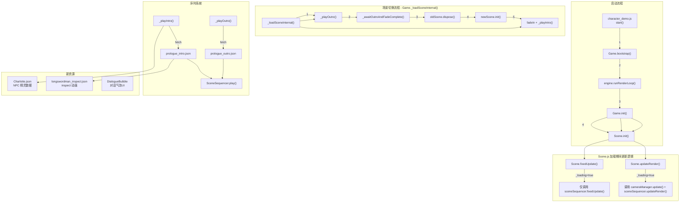

## 📋 高层概要 (TL;DR)

- **影响范围**: **高** - 涉及游戏核心场景管理、序列播放和过渡动画系统
- **主要变更**:
  - ✨ 实现场景切换的 fade/intro/outro 三段式流程
  - 🎬 新增序章（prologue）的入场和退场序列系统
  - 🎨 添加 Charlotte NPC 角色资源和长剑士 inspect 动画
  - 🔧 重构 Game.bootstrap 与 Game.init 分离，优化主循环时序
  - 🔄 修复加载期间 sequencer 和 cameraManager 的更新机制

## 🗺️ 视觉概览（代码与逻辑映射）



## 📊 详细变更分析

### 🎮 1. 核心游戏系统重构 (scripts/Game.js)

**变更内容**: 实现场景过渡系统，分离初始化流程

**关键变更**:

| 方法/属性 | 旧实现 | 新实现 | 说明 |
|-----------|--------|--------|------|
| `init()` | 调用 `bootstrap()` + 加载场景 | 仅加载场景 + 调用 `_playIntro()` | 职责分离，初始化时播放开场序列 |
| 新增 `_playIntro()` | 不存在 | 加载并播放 introSequenceUrl | 播放场景入场动画，使用 flagKey 防重播 |
| 新增 `_playOutro()` | 不存在 | 加载并播放 outroSequenceUrl + fadeOut | 播放场景退场动画 |
| 新增 `_awaitOutroAndFadeComplete()` | 不存在 | 轮询等待序列和特效完成 | 确保过渡完成后再切换 |
| `_loadSceneInternal()` | 直接切换场景 | 执行 outro → fadeOut → dispose → init → fadeIn → intro | 三段式场景切换流程 |

**代码片段** - 三段式场景切换核心逻辑:

```javascript
// scripts/Game.js:256-318
async _loadSceneInternal(sceneDef, spawnId) {
    const oldScene = this.scene;
    const oldSceneId = this.worldState.currentSceneId;
    const oldSceneDef = oldSceneId ? await resolveSceneDef(oldSceneId) : null;
    
    // ... 保存主角状态 ...
    
    const newScene = new Scene(this.sharedContext, { game: this });
    newScene._loading = true;
    
    // 步骤 1: 播放退场序列 + 淡出
    const transition = sceneDef.transition || {};
    await this._playOutro(oldSceneDef, { fadeOutMs: transition.fadeOutMs ?? 400 });
    await this._awaitOutroAndFadeComplete();
    
    // 步骤 2: 切换场景引用
    this.scene = newScene;
    oldScene.dispose();
    await newScene.init(sceneDef, BATTLE_DEFS);
    
    // 步骤 3: 淡入 + 播放入场序列
    this.cameraManager.enqueueEffect({
        type: "fade",
        durationMs: transition.fadeInMs ?? 600,
        params: { from: 1, to: 0, color: "black" }
    });
    this._playIntro(sceneDef);
    newScene._loading = false;
}
```

### 🎬 2. 场景加载期间更新机制 (scripts/Scene.js)

**变更内容**: 允许在 `_loading` 状态下更新 sequencer 和 cameraManager

**关键变更**:

```javascript
// 旧实现：_loading 时直接返回，什么都不更新
fixedUpdate(dtMs, tickCount) {
    if (this.paused || this._loading) {
        return;  // ❌ 阻塞了序列播放
    }
    // ...
}

// 新实现：_loading 时只更新必要的子系统
fixedUpdate(dtMs, tickCount) {
    if (this.paused) return;
    
    if (this._loading) {
        if (this.sceneSequencer) 
            this.sceneSequencer.fixedUpdate(dtMs, tickCount);  // ✅ 允许序列推进
        return;
    }
    // ...
}

updateRender(dtMs) {
    if (this._loading) {
        if (this.cameraManager) 
            this.cameraManager.update(dtMs, this.sharedContext);  // ✅ 允许相机特效更新
        if (this.sceneSequencer) 
            this.sceneSequencer.updateRender(dtMs);
        return;
    }
    // ...
}
```

### 📁 3. 序列配置文件 (新增)

#### prologue_intro.json - 序章入场序列

| Track | 内容 | 时长 | 说明 |
|-------|------|------|------|
| `fx.fadein` | 淡入效果 | 0-1200ms | 黑色淡入 (opacity 1→0) |
| `fx.letterbox` | 电影遮罩 | 0-5500ms | 高度 72px，电影感开场 |
| `camera.scripted` | 脚本相机 | 0-5000ms | 正交相机，高度 4.5 |
| `hero.walk` | 主角行走 | 200-3200ms | 从 x=0 移动到 x=2，输入锁定 |
| `companion.walk` | 伴侶行走 | 600-3600ms | 从 x=0 移动到 x=-2 |
| `camera.back` | 切回探索相机 | 5000-6000ms | 平滑切换回探索模式 |

#### prologue_outro.json - 序章退场序列

| Track | 内容 | 时长 | 说明 |
|-------|------|------|------|
| `fx.letterbox` | 电影遮罩 | 0-2000ms | |
| `fx.fadeout` | 淡出效果 | 1600-3000ms | 黑色淡出 (opacity 0→1) |
| `camera.scripted` | 脚本相机 | 全程 | 中心点 (8,0,0) |
| `hero.walk` | 主角行走 | 0-1800ms | 移动到 x=20，出场 |

### 🎨 4. 资产文件变更

#### 新增 Charlotte NPC 资源

**文件**: `Art/Sprite/NPCs/Charlotte.json` 和 `Data/RootMotion/NPCs/Charlotte.json`

| 动画标签 | 帧范围 | 用途 |
|---------|--------|------|
| `walk` | 帧 1-2 | 行走动画 |
| `idle` | 帧 3 | 待机动画 |
| `observe` | 帧 4-6 | 观察动画 |

**时长分配**:
- 帧 5 (observe 结束): 3000ms - 强调观察动作
- 帧 6 (恢复): 1500ms - 平滑过渡

#### 新增 longswordman inspect 动画

**文件**: `Art/Sprite/longswordman/longswordman_inspect.json` 和 `Data/RootMotion/longswordman/longswordman_inspect.json`

- 总计 6 帧，主要用于角色检查动画
- 帧 4 为关键帧，持续时间 1500ms

### 🗺️ 5. 场景配置更新 (Data/SceneDefs/prologue.json)

**新增配置项**:

| 字段 | 值 | 说明 |
|------|-----|------|
| `transition.fade` | `true` | 启用过渡效果 |
| `transition.fadeOutMs` | `400` | 淡出时长 |
| `transition.fadeInMs` | `600` | 淡入时长 |
| `introSequenceUrl` | `Data/Sequences/prologue_intro.json` | 入场序列路径 |
| `outroSequenceUrl` | `Data/Sequences/prologue_outro.json` | 退场序列路径 |

**新增 Spawn 点**:

| Spawn ID | 坐标 | 用途 |
|----------|------|------|
| `from_prologue` | `[6, 0, 0]` | 从序章进入时的生成点 |

**新增触发器** (仅开发用):

```json
{
    "_devNote": "DEV ONLY: 验证 Step 2f-2 场景切换 fade 包裹...",
    "type": "sceneSwitch",
    "id": "dev_to_outdoor",
    "pos": [9, 0, 0],
    "targetScene": "outdoor_village",
    "targetSpawn": "house_door"
}
```

### 🔄 6. 其他系统变更

#### CameraManager 新增方法

```javascript
// scripts/Systems/CameraManager.js:233-235
hasActiveEffects() {
    return this._effects.length > 0;
}
```

用于 `_awaitOutroAndFadeComplete()` 轮询检查特效是否完成。

#### WorldState 初始场景变更

```javascript
// scripts/WorldState.js:7
this.currentSceneId = "prologue";  // 从 "outdoor_village" 改为 "prologue"
```

#### 启动流程调整 (character_demo.js)

```javascript
// 旧流程
await game.init();  // 在主循环前完成所有初始化
engine.runRenderLoop(...);

// 新流程
await game.bootstrap();  // 仅初始化稳定对象
engine.runRenderLoop(...);  // 先启动主循环
await game.init();  // 再初始化场景（期间主循环可继续）
```

#### 日志清理

- `TimelineSequencer.js:74` - 注释掉详细 tick 日志
- `ExploreMode.js:502-504` - 注释掉序列期间的相机目标日志

## ⚠️ 影响与风险评估

### 🔴 高风险点

1. **主循环时序变更**
   - **风险**: `game.init()` 移到 `runRenderLoop` 后，可能导致初始化期间逻辑与渲染不同步
   - **缓解措施**: 通过 `_loading` 标志控制更新逻辑，仅更新必要的子系统
   - **测试建议**: 验证序章入场动画播放流畅，无闪烁或卡顿

2. **异步序列播放**
   - **风险**: `_awaitOutroAndFadeComplete()` 轮询可能阻塞或死锁
   - **缓解措施**: 轮询条件检查 `sequencer.isBusy()` 和 `cameraManager.hasActiveEffects()`
   - **测试建议**: 多次切换场景，确保无无限等待

### 🟡 中风险点

3. **加载期间访问脏对象**
   - **风险**: `oldScene.dispose()` 后 `sharedContext` 仍指向旧 Scene 的局部对象
   - **当前保护**: `_loading=true` 时 Scene.fixedUpdate/updateRender 早退
   - **测试建议**: 确认 cameraManager.update 和 sceneSequencer 不访问 sharedContext 的 Scene 局部字段

4. **资源加载失败**
   - **风险**: `introSequenceUrl` 或 `outroSequenceUrl` 加载失败
   - **缓解措施**: `_playOutro` 有 catch 回退到普通 fade 效果
   - **测试建议**: 模拟网络错误或文件缺失场景

### 🟢 低风险点

5. **日志减少**
   - **影响**: 调试信息减少
   - **测试建议**: 需要时可重新启用

## ✅ 测试建议

### Layer 0: 基础功能
- [ ] 游戏启动后自动进入 prologue 场景
- [ ] 序章入场序列正常播放（淡入、letterbox、主角移动、相机切换）
- [ ] 主角移动完成后 regain 控制

### Layer 1: 场景切换
- [ ] 从 prologue 切换到 outdoor_village 时播放退场序列
- [ ] 淡出效果平滑，无突兀跳转
- [ ] 切换后 outdoor_village 正常加载，主角出现在正确位置

### Layer 2: 边界情况
- [ ] 序列播放时禁止玩家输入
- [ ] 序列播放中断（如快速切换场景）不会导致状态混乱
- [ ] 网络错误或序列文件缺失时回退到普通 fade 效果

### Layer 3: 资源验证
- [ ] Charlotte NPC 动画帧数据正确
- [ ] longswordman inspect 动画播放流畅
- [ ] 精灵图集和根运动数据一致

### Layer 4: 性能
- [ ] 加载期间帧率稳定（不低于 30fps）
- [ ] 序列播放无内存泄漏
- [ ] 多次切换场景后无资源堆积

## 📝 配置变更汇总

### 场景定义配置 (prologue.json)

| 配置项 | 旧值 | 新值 | 用途 |
|--------|------|------|------|
| `transition` | 不存在 | `{fade: true, fadeOutMs: 400, fadeInMs: 600}` | 启用过渡效果 |
| `introSequenceUrl` | 不存在 | `Data/Sequences/prologue_intro.json` | 入场序列 |
| `outroSequenceUrl` | 不存在 | `Data/Sequences/prologue_outro.json` | 退场序列 |
| `spawns.from_prologue` | 不存在 | `[6, 0, 0]` | 序章进入点 |

### 世界状态配置

| 配置项 | 旧值 | 新值 | 用途 |
|--------|------|------|------|
| `currentSceneId` | `outdoor_village` | `prologue` | 初始场景 |

### 里程碑配置

| 里程碑 | 值 | 说明 |
|--------|-----|------|
| `PROLOGUE_CHARLOTTE_JOIN` | `105` | Charlotte 加入队伍 |