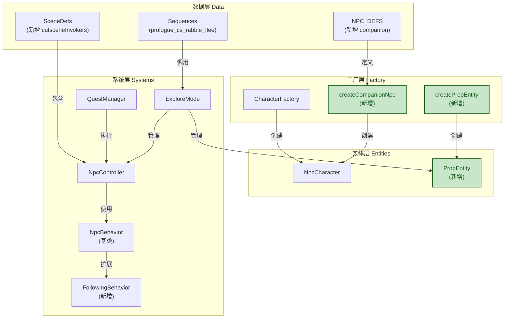
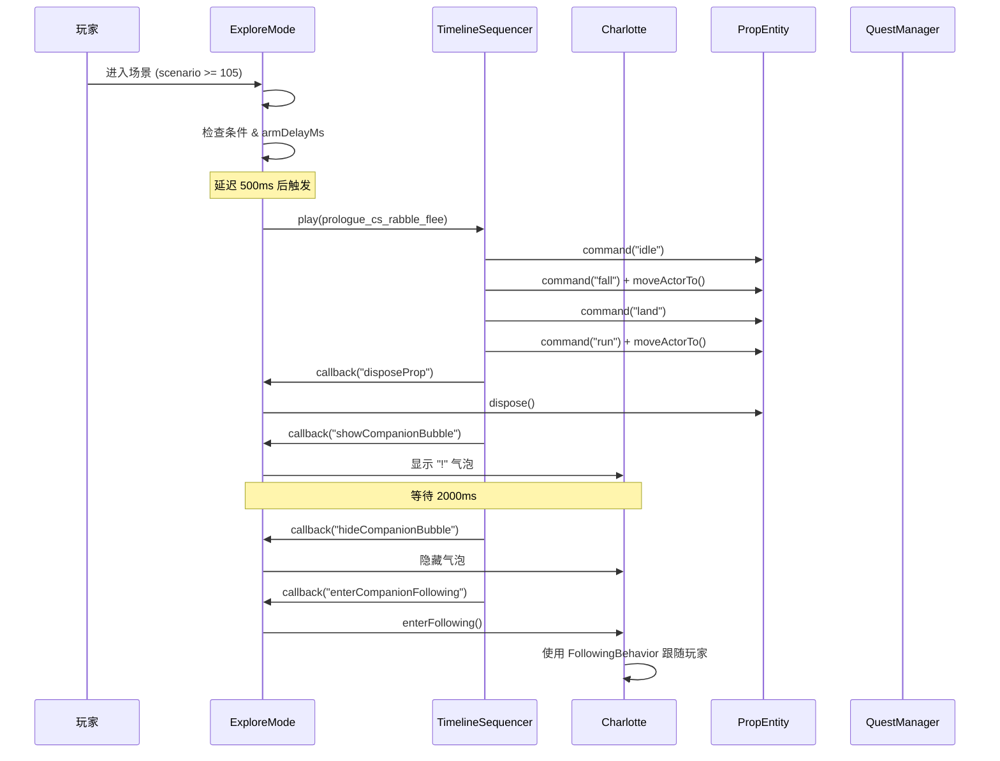
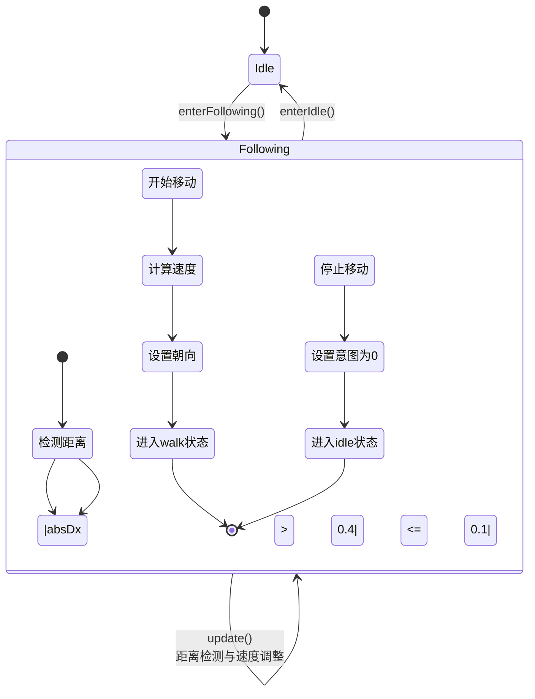
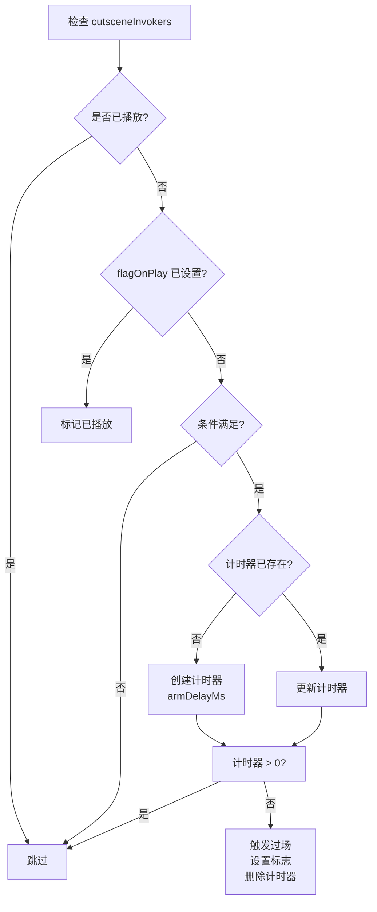

## 1. 高层摘要

**影响：** 🔴 **高** - 核心功能扩展，新增同伴系统和过场动画基础设施

**关键变更：**
- ✨ 新增 Charlotte 伴随角色，实现 NPC 跟随玩家功能
- 🎬 创建 `PropEntity` 系统，支持过场动画中的道具实体
- 🔄 重构 NPC 行为架构，引入 `NpcBehavior` 基类和 `FollowingBehavior`
- 📋 扩展任务系统，支持批量指令执行（`executeDirectives`）
- 🎯 新增过场动画触发器系统（`cutsceneInvokers`）

---

## 2. 可视化概览

### 2.1 系统架构关系图



### 2.2 过场动画执行流程



### 2.3 NPC 跟随行为状态机



---

## 3. 详细变更分析

### 3.1 📦 数据定义层

#### NPC 定义扩展 (`Data/NpcDefs.js`)

**变更内容：** 新增 `companion` NPC 定义，包含三级对话系统

| 优先级 | 触发条件 | 文本 | 动作 |
|--------|----------|------|------|
| 100 | `scenarioMin: 105` | 👍 | 无 |
| 90 | `quest: prologue_pickup_quest, stage: 1, hasItem: dagger` | 👍 | 移除 dagger、推进场景到 105 |
| 0 | 默认 | 🗡️ | 开始任务 `prologue_pickup_quest` |

---

#### 场景配置扩展 (`Data/SceneDefs/prologue.json`)

**新增实体：**

| ID | 类型 | 位置 | 说明 |
|----|------|------|------|
| `companion` | NPC | `[-10, 0, 0]` | Charlotte 角色实例 |
| `prop_faller` | Prop | `[-1.2, 1, 0]` | 过场动画中的坠物（条件性生成） |

**新增过场触发器配置：**

```json
{
  "id": "prologue_prop_and_follow",
  "sequenceUrl": "Data/Sequences/prologue_cs_rabble_flee.json",
  "armDelayMs": 500,
  "flagOnPlay": "prologue_prop_played",
  "condition": {
    "scenarioMin": 105,
    "flagNot": "prologue_prop_played"
  }
}
```

**行走区域扩展：** `minX` 从 `-6.75` 扩展到 `-10.75`，为同伴提供更多移动空间。

---

### 3.2 🏭 实体工厂层

#### 角色工厂新增 (`scripts/CharacterFactory.js`)

**新增函数：** `createCompanionNpc(scene, assets)`

**配置要点：**
- `walkSpeed: 1.1` - 较慢的行走速度（玩家约为 1.5）
- `blocksMovement: false` - 不阻挡玩家移动（避免穿模）
- 支持动画状态：`idle`、`walk`、`observe`

---

#### 道具实体工厂 (`scripts/CharacterFactory.js`)

**新增函数：** `createPropEntity(scene, assets, entityDef)`

**功能特性：**
- 支持多帧动画序列（idle、fall、land、run）
- 支持两种播放模式：`hold`（保持末帧）、`loop`（循环）
- 通过 `propKey` 配置可复用不同道具资源

**代码示例：**
```javascript
const pos = entityDef?.pos ?? [0, 0, 0];
return new PropEntity(scene, {
    id: entityDef?.id ?? `prop_${Date.now()}`,
    pos,
    initialClip: entityDef?.initialClip ?? "idle",
    clips: {
        idle: buildClip(0, "hold"),
        fall: buildClip(1, "loop"),
        land: buildClip(2, "hold"),
        run:  buildClip(3, "loop")
    }
});
```

---

### 3.3 🎮 实体系统层

#### 道具实体实现 (`scripts/Enties/PropEntity.js`) 🆕

**核心职责：** 为过场动画中的道具提供轻量级动画实体

**关键方法：**

| 方法 | 功能 |
|------|------|
| `_setClip(clipName)` | 切换动画片段，加载图集纹理 |
| `fixedUpdate(dtMs)` | 每帧更新动画状态，处理帧切换逻辑 |
| `enterState(name)` | 序列控制器调用，切换动画状态 |
| `pushCommand(name)` | 序列控制器调用，状态转换接口 |
| `getVisualBottomY()` | 返回 Y 轴底部坐标，用于深度排序 |

**渲染配置：**
```javascript
this.material.disableLighting = true;
this.material.disableDepthWrite = true;
this.spritePlane.renderingGroupId = 1;  // 前景层渲染
this.spritePlane.alphaIndex = 0;         // 透明度排序优先级
```

---

### 3.4 🧠 系统层

#### NPC 控制器重构 (`scripts/System/NpcController.js`)

**架构变更：** 从单一控制器改为控制器 + 行为模式组合

**新增成员变量：**
```javascript
this._behavior = null;           // 当前激活的行为对象
this._followingBehavior = null;  // FollowingBehavior 实例缓存
```

**新增方法：** `enterFollowing(npc)`

```javascript
enterFollowing(npc) {
    this.state = "following";
    if (!this._followingBehavior) {
        this._followingBehavior = new FollowingBehavior();
    }
    this._behavior = this._followingBehavior;
    this._behavior.enter(npc, { dialogueBubble: this._dialogueBubble });
}
```

**更新逻辑：**
```javascript
update(dtMs, npc, context) {
    // ... 上下文初始化
    
    if (this._behavior) {
        this._behavior.update(dtMs, npc, context);  // 委托给行为对象
        return;
    }
    
    // 原有的 idle/greeting 逻辑...
}
```

---

#### NPC 行为基类 (`scripts/System/NpcBehaviors/NpcBehavior.js`) 🆕

**设计模式：** 策略模式（Strategy Pattern）

```javascript
export class NpcBehavior {
    constructor(options = {}) {
        this.options = { ...options };
    }
    
    enter(npc, context) {}   // 进入行为时调用
    update(dtMs, npc, context) {}  // 每帧更新
    exit(npc, context) {}    // 退出行为时调用
}
```

---

#### 跟随行为实现 (`scripts/System/NpcBehaviors/FollowingBehavior.js`) 🆕

**核心算法：** 基于距离的动态速度调整

**参数配置表：**

| 参数 | 默认值 | 说明 |
|------|--------|------|
| `targetOffsetX` | 1.0 | 跟随目标相对玩家的 X 轴偏移 |
| `followStart` | 0.4 | 开始移动的距离阈值 |
| `followStop` | 0.1 | 停止移动的距离阈值（滞后带） |
| `speedMin` | 0.7 | 最小移动速度倍率 |
| `speedMax` | 1.4 | 最大移动速度倍率 |
| `baseSpeed` | 1.1 | 基础速度 |
| `speedMapSpan` | 1.5 | 速度映射范围 |
| `speedMapAnchor` | 1.0 | 速度映射锚点 |

**速度计算公式：**
```javascript
const m = clamp((absDx - speedMapAnchor) / speedMapSpan, speedMin, speedMax);
npc.baseWalkSpeed = baseSpeed * m;
```

---

#### 任务系统扩展 (`scripts/System/QuestManager.js`)

**新增方法：** `executeDirectives(directives)`

**支持的指令类型：**

| 指令类型 | 参数 | 功能 |
|----------|------|------|
| `advanceScenario` | `value` | 推进场景里程碑 |
| `setScenario` | `value` | 设置场景里程碑 |
| `setFlag` | `key, value` | 设置全局标志 |
| `clearFlag` | `key` | 清除全局标志 |
| `startQuest` | `id` | 开始任务 |
| `setQuestStage` | `id, stage` | 设置任务阶段 |
| `completeQuest` | `id` | 完成任务 |
| `removeItem` | `item` | 移除物品 |
| `addItem` | `item` | 添加物品 |

**应用场景：** NPC 对话中的批量动作执行
```javascript
// Data/NpcDefs.js 中
{
    action: [
        { type: "removeItem", item: "dagger" },
        { type: "advanceScenario", value: 105 }
    ]
}
```

---

#### 探索模式过场集成 (`scripts/System/Modes/ExploreMode.js`)

**新增数据结构：**
```javascript
this._playedCutsceneIds = new Set();  // 已播放的过场ID
this._cutsceneTimers = new Map();      // 过场计时器
this.props = [];                       // 道具实体列表
```

**核心方法：**

| 方法 | 功能 |
|------|------|
| `#updateCutsceneInvokers(dtMs)` | 每帧检查并触发符合条件的过场 |
| `_registerSequenceHandlers()` | 注册过场回调处理器 |
| `#handleDisposeProp()` | 销毁道具实体 |
| `#handleShowCompanionBubble()` | 显示同伴提示气泡 |
| `#handleHideCompanionBubble()` | 隐藏同伴提示气泡 |
| `#handleEnterCompanionFollowing()` | 激活同伴跟随行为 |

**过场触发逻辑流程：**


---

#### 时间轴序列扩展 (`scripts/System/TimelineSequencer.js`)

**新增动作类型：** `callback`

**功能：** 支持在序列中注册回调函数，实现游戏逻辑与时间轴的解耦

**实现代码：**
```javascript
callback: {
    start(ctx, clip, track) {
        const fn = clip.fn;
        let handler;
        if (typeof fn === "function") {
            handler = fn;
        } else if (typeof fn === "string" && ctx.sequenceHandlers) {
            handler = ctx.sequenceHandlers.get(fn);  // 从 Map 获取
        }
        if (typeof handler === "function") {
            handler(ctx, clip);
        }
    }
}
```

**命令处理器优化：**
```javascript
// 支持 PropEntity 等无状态机转换的实体
if (typeof actor.pushCommand === "function") {
    const accepted = actor.pushCommand(clip.command);
    if (!accepted && typeof actor.enterState === "function") {
        actor.enterState(clip.command);  // Fallback 到 enterState
    }
}
```

---

### 3.5 📚 资源清单更新 (`scripts/AssetManifest.js`)

**新增资源分类：**

| 分类 | 资源项 | 文件路径 |
|------|--------|----------|
| `companion` | charlotte | `./Art/Sprite/NPCs/Charlotte.json` |
| `csChars` | prologue_rabble_flee[0-3] | `./Art/Sprite/CS_Chars/` |
| `companion` | charlotte | `./Data/RootMotion/NPCs/Charlotte.json` |
| `csChars` | prologue_rabble_flee[0-3] | `./Data/RootMotion/CS_Chars/` |
| `companion` | charlotte | `./Data/RootMotion/NPCs/Charlotte.occupancy.json` |

---

### 3.6 🎬 过场序列配置 (`Data/Sequences/prologue_cs_rabble_flee.json`) 🆕

**时间轴总时长：** 7000ms

**关键事件时间点：**

| 时间 (ms) | 事件 | 说明 |
|-----------|------|------|
| 0 | `prop_faller` 进入 idle 状态 | 道具静止待机 |
| 500 | `prop_faller` 开始 fall 动画 | 道具下落 |
| 900 | `prop_faller` 进入 land 状态 | 道具落地 |
| 1200 | `prop_faller` 进入 run 状态并移出场景 | 道具逃跑 |
| 4000 | 销毁道具实体 | 释放资源 |
| 4200 | 显示同伴气泡 "!" | 提示玩家 |
| 6200 | 隐藏同伴气泡 | 清除提示 |
| 6400 | 同伴进入跟随模式 | 开始跟随玩家 |

---

## 4. 影响与风险评估

### 4.1 ⚠️ 破坏性变更

**无** - 本次变更为增量功能扩展，未修改现有接口。

---

### 4.2 🧪 测试建议

| 场景 | 测试步骤 | 预期结果 |
|------|----------|----------|
| **同伴初始状态** | 加载 prologue 场景（scenario < 105） | Charlotte 存在但不跟随，无气泡提示 |
| **过场触发** | 推进场景到 scenario = 105 | 500ms 后自动播放过场动画，道具从上方坠落并逃跑 |
| **道具销毁** | 过场动画播放到 4s 处 | `prop_faller` 实体被正确移除 |
| **同伴跟随** | 过场结束后移动主角 | Charlotte 在主角右侧约 1 单位处跟随 |
| **动态速度** | 快速移动主角远离 Charlotte | Charlotte 加速追赶 |
| **停止跟随** | 主角停止移动 | Charlotte 在距离 0.1-0.4 范围内停止并进入 idle 状态 |
| **任务对话** | 与 Charlotte 交互（scenario = 105，无 dagger） | 显示 👍，执行 `advanceScenario(105)` |
| **任务启动** | 与 Charlotte 交互（scenario < 105） | 显示 🗡️，启动 `prologue_pickup_quest` |
| **物品传递** | 完成任务阶段 1 并拥有 dagger | Charlotte 接收 dagger，移除玩家物品 |

---

### 4.3 📝 已知问题（来自 BACKLOG.md）

| 问题 | 严重程度 | 说明 |
|------|----------|------|
| 实体隐藏机制不完善 | 中 | 当前使用 `spawnIf` 控制生成，但部分场景需要实体已存在但不可见 |
| Charlotte 跟随穿模 | 低 | `blocksMovement: false` 导致 Charlotte 可能穿过玩家 |
| NPC 行为未完全解耦 | 中 | idle 和 greeting 逻辑仍在 `NpcController` 内部 |

---

### 4.4 🔮 未来扩展方向

根据 BACKLOG.md 中的规划：

1. **实体可见性控制：** 添加 `visibleIf` 字段，支持动态显示/隐藏
2. **行为系统完善：** 抽离 `IdleBehavior` 和 `GreetingBehavior`
3. **数据驱动装配：** 支持通过配置文件组合多个行为
4. **路径规划：** 解决跟随穿模问题

---

## 5. 配置变更汇总

### 5.1 场景配置变更表

| 配置项 | 旧值 | 新值 | 说明 |
|--------|------|------|------|
| `entities[0].pos` | `[0, 0]` | `[-8, 0]` | 主角初始位置左移 |
| `walkArea.minX` | `-6.75` | `-10.75` | 扩展左侧活动区域 |
| `entities` | 1 项 | 3 项 | 新增 companion 和 prop_faller |
| `cutsceneInvokers` | 无 | 新增 | 添加过场触发器配置 |

---

### 5.2 过场序列变更表

| 文件 | 类型 | 说明 |
|------|------|------|
| `prologue_intro.json` | 修改 | 主角移动目标从 `x: 2` 改为 `x: -3` |
| `prologue_intro.json` | 修改 | 同伴移动目标从 `x: -2` 改为 `x: -4` |
| `prologue_cs_rabble_flee.json` | 新增 | 完整的道具坠落到同伴跟随流程 |

---

## 6. 技术亮点

✨ **架构设计优化：**
- 引入策略模式重构 NPC 行为系统，提高可扩展性
- 过场回调机制实现游戏逻辑与时间轴的解耦

✨ **性能优化：**
- 使用 `Set` 和 `Map` 管理过场状态，查询效率高
- 道具实体采用轻量级实现，仅保留必要功能

✨ **用户体验：**
- 动态速度调整让跟随行为更自然
- 滞后带设计（followStart/followStop）避免抖动

✨ **可维护性：**
- 工厂模式统一实体创建逻辑
- 配置驱动过场触发，易于扩展新场景

---

**总结：** 本次变更实现了一个完整的同伴系统，从数据定义、实体创建、行为控制到过场集成，形成了完整的闭环。代码架构清晰，扩展性强，为后续 NPC 系统的演进奠定了良好基础。