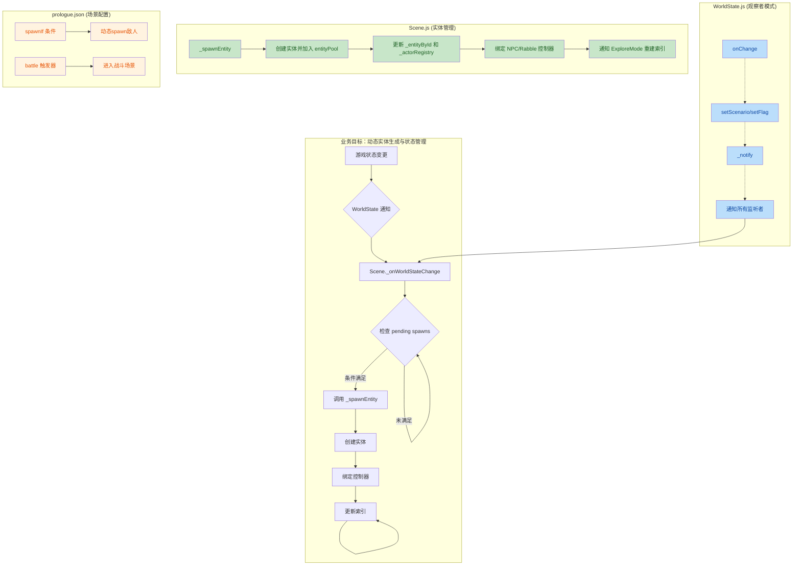
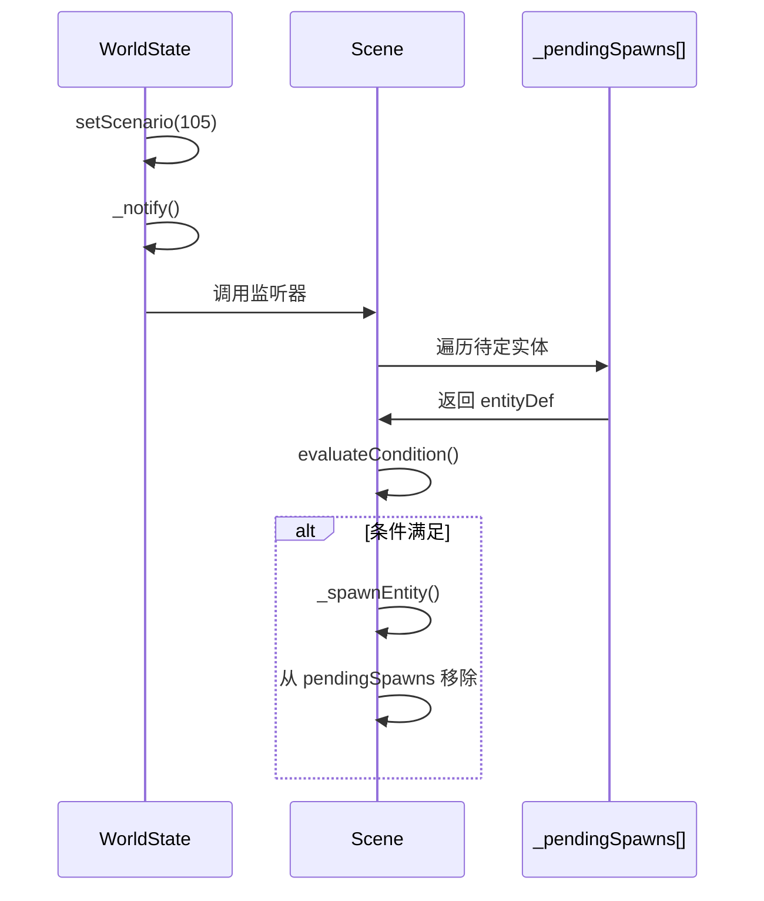

## 1. 高级总结（TL;DR）

- **影响：高** - 实现了一个完整的**动态实体生成系统**，支持基于游戏状态的条件延迟spawn，并引入**观察者模式**管理全局状态变更通知。
- **核心变更：**
  - ✨ **Scene.js 重构**：新增 `_spawnEntity()`、`_onWorldStateChange()` 方法，支持条件延迟生成实体
  - 🔔 **WorldState 观察者模式**：实现 `onChange()`、`setScenario()`、`setFlag()` 等方法，触发状态变更通知
  - ⚔️ **序章战斗系统**：添加战斗触发器、敌人spawn点和专用战斗定义
  - 🐛 **内存泄漏修复**：PropEntity和ExploreMode改进dispose逻辑，防止已释放对象继续更新
  - 🎨 **新增动画资产**：longswordman的inspect动作精灵表和根运动数据

---

## 2. 可视化概览（代码与逻辑图）



---

## 3. 详细变更分析

### 🎮 核心系统：动态实体生成与状态管理

#### **WorldState.js** - 观察者模式实现
- **变更内容**：引入观察者模式，支持状态变更监听
  - 新增 `onChange(fn)`：注册监听器，返回取消订阅函数
  - 新增 `setScenario(value)`：替代直接赋值，触发 `_notify()`
  - 新增 `setFlag(key, value)`：替代直接赋值，触发 `_notify()`
  - 新增 `_notify()`：遍历调用所有监听器，包含错误处理

```javascript
// 关键实现
onChange(fn) {
    this._listeners.push(fn);
    return () => { this._listeners = this._listeners.filter(f => f !== fn); };
}

setScenario(value) {
    if (this.scenario === value) return;
    this.scenario = value;
    this._notify();
}
```

#### **Scene.js** - 动态实体生成系统（⚠️ 重大重构）
- **变更内容**：重构实体初始化流程，支持条件延迟spawn
  - 新增 `_pendingSpawns[]`：存储未满足条件的实体定义
  - 新增 `_spawnEntity(entityDef)`：统一的实体生成方法，处理控制器绑定和索引更新
  - 新增 `_onWorldStateChange()`：响应WorldState变更，检查并spawn待定实体
  - 新增 `_initRabbleController()`：提取敌人控制器初始化逻辑
  - `init()` 方法：条件不满足时推入 `_pendingSpawns`，而非直接跳过

| 新增字段 | 类型 | 用途 |
|---------|------|------|
| `_pendingSpawns` | Array | 待生成的实体定义列表 |
| `_unsubscribeWorldState` | Function | 取消WorldState订阅的函数 |
| `_actorRegistry` | Map | 实体注册表（id/name → 实体） |
| `_entityById` | Map | 实体索引表 |
| `_sceneAssets` | Object | 场景资产引用 |
| `_sceneDef` | Object | 场景定义引用 |
| `_rabbleControllerBound` | Boolean | 敌人控制器是否已绑定 |

**动态Spawn流程**：


#### **Game.js** - 场景加载同步
- **变更内容**：场景加载完成时同步当前场景ID和spawn点到WorldState
  ```javascript
  this.worldState.currentSceneId = sceneDef.id;
  this.worldState.currentSpawnId = spawnId;
  ```

---

### ⚔️ 序章战斗系统

#### **Data/SceneDefs/prologue.json** - 战斗配置
| 配置项 | 类型 | 说明 |
|--------|------|------|
| `enemy_1` | 实体 | rabble_stick敌人，位置[6,0,0]，spawnIf: `{scenarioMin: 105, flagNot: "prologue_battle"}` |
| `intro_start` | spawn点 | 位置[-20, 0, 0] |
| `bt_prologue` | battle触发器 | 位置[4,0,0]，battleId: "prologue_battle" |

#### **scripts/SceneDefs.js** - 战斗定义
- **新增内容**：`PROLOGUE_BATTLE` 战斗定义
  ```javascript
  export const PROLOGUE_BATTLE = {
      id: "prologue_battle",
      combatants: ["hero", "enemy_1"],
      stageBounds: { minX: -4, maxX: 8, minY: -0.05, maxY: 0.05 },
      onVictory: { scenario: SCENARIO.BATTLE_1_COMPLETED, flags: ["prologue_battle"] },
  };
  ```

---

### 🐛 Bug修复与资源管理

#### **scripts/Enties/PropEntity.js** - Dispose安全检查
```javascript
fixedUpdate(dtMs) {
    if (this.isDisposed) return;  // 🔒 防止已释放对象继续更新
    if (!this._currentClip || !this._frames.length) return;
    // ...
}
```

#### **scripts/Systems/Modes/ExploreMode.js** - 完整的Prop清理
- **变更内容**：`#handleDisposeProp()` 增强清理逻辑
  1. 从 `exploreMode.props` 移除
  2. 从 `exploreMode.renderables` 移除
  3. **新增**：从 `scene.entityPool` 移除（防止 `_buildIndices` 重新收集已dispose的prop）
- **变更内容**：`_buildIndices()` 增加 `!entity.isDisposed` 检查

```javascript
// 从 scene.entityPool 彻底移除
if (entityPool) {
    for (let i = entityPool.length - 1; i >= 0; i--) {
        if (entityPool[i].kind === "prop") {
            entityPool.splice(i, 1);
        }
    }
}
```

#### **scripts/Systems/QuestManager.js** - 使用WorldState setter
- **变更内容**：改用 `world.setScenario()` 和 `world.setFlag()` 替代直接赋值
  - 确保状态变更触发通知，驱动动态spawn

#### **scripts/Systems/TimelineSequencer.js** - 日志优化
- **变更内容**：注释掉部分详细日志，减少控制台输出

---

### 🎨 动画资产

#### **Art/Sprite/longswordman/longswordman_inspect.json**
- **新增内容**：longswordman inspect动作的精灵表
  - 6帧动画，总时长2200ms
  - 第4帧为观察关键帧（1500ms）

#### **Data/RootMotion/longswordman/longswordman_inspect.json**
- **新增内容**：longswordman inspect动作的根运动数据

---

### 📚 文档

#### **.trae/skills/collider-occupancy-更新-skill/SKILL.md**
- **新增内容**：AI辅助脚本更新碰撞盒和占用盒的操作指南
  - 路线A：更新战斗角色collider（longswordman、rabble_stick）
  - 路线B：更新NPC occupancy（traveller、merchant、merchant2）
  - 提供批量处理PowerShell脚本模板

---

## 4. 影响与风险评估

### ⚠️ 破坏性变更
无API破坏性变更，但存在架构调整风险。

### 🔍 测试建议
- ✅ **动态Spawn流程**：
  - 启动游戏，验证敌人初始不出现
  - 推进scenario到105，验证敌人自动spawn
  - 完成战斗设置flag，验证敌人不再spawn
- ✅ **内存泄漏**：
  - 触发prop释放，验证entityPool、renderables、props均被清理
  - 检查控制台无已释放对象的更新警告
- ✅ **状态通知**：
  - 修改scenario/flag，验证pending实体正确spawn
  - 多次切换场景，验证订阅正确取消（无内存泄漏）
- ✅ **序章战斗**：
  - 验证战斗触发器正确激活
  - 验证战斗完成后的状态更新

### 🎯 关键风险点
1. **Scene.init() 中的 sharedContext 同步**：在init阶段spawn的enemy_1需要延迟同步到sharedContext（代码已处理）
2. **ExploreMode._buildIndices() 调用时机**：动态spawn后需确保索引重建，否则新生成实体无法交互（代码已处理）
3. **WorldState监听器生命周期**：Scene dispose时必须取消订阅，否则内存泄漏（代码已处理）

---

**变更文件总计**：12个文件  
**新增代码行数**：约350行  
**核心架构变更**：观察者模式 + 动态实体生成系统