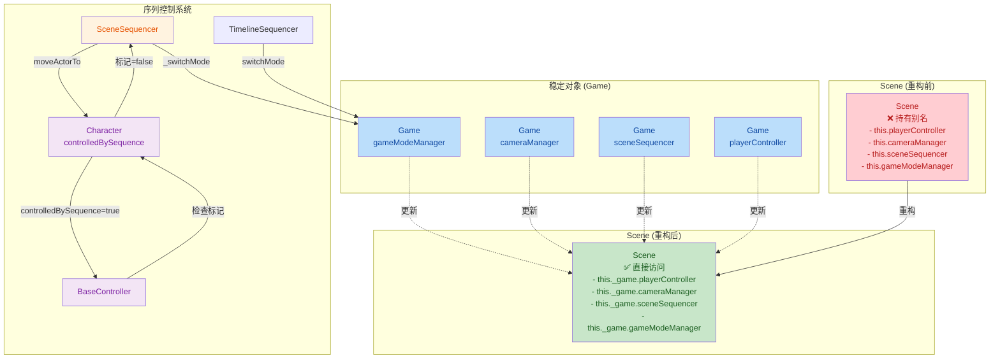
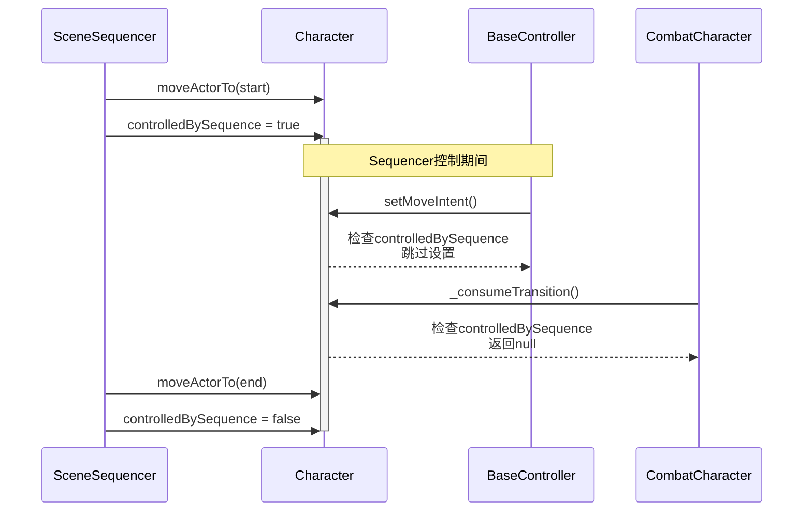

## 1. 高层摘要 (TL;DR)

**影响范围：** 🔴 **高** - 涉及核心架构重构、序列控制系统和游戏内容

**关键变更：**
- 🏗️ **Scene生命周期清理**：移除Scene类中所有稳定对象别名字段，统一通过`this._game.xxx`访问
- 🎮 **序列控制优化**：添加`controlledBySequence`标记机制，防止sequencer移动角色时被controller覆盖
- 🐛 **Bug修复**：TimelineSequencer重叠检查bug（Set→Map）和context路径遗漏
- 🎒 **新内容**：添加可拾取物品匕首，更新prologue开场序列

---

## 2. 可视化架构图



---

## 3. 详细变更分析

### 🏗️ 组件一：Scene生命周期回归清理

#### 变更说明
移除Scene类中所有稳定对象的别名字段，改为统一通过`this._game.xxx`访问。确保稳定对象的生命周期完全由Game管理，避免重复赋值和dispose死代码。

**源文件：** `scripts/Scene.js`

| 移除的别名字段 | 新的访问方式 |
|---|---|
| `this.inputSystem` | `this._game.inputSystem` |
| `this.playerController` | `this._game.playerController` |
| `this.combatSystem` | `this._game.combatSystem` |
| `this.cameraRig` | `this._game.cameraRig` |
| `this.exploreCameraRig` | `this._game.exploreCameraRig` |
| `this.scriptedCameraRig` | `this._game.scriptedCameraRig` |
| `this.cameraManager` | `this._game.cameraManager` |
| `this.sceneSequencer` | `this._game.sceneSequencer` |
| `this.gameModeManager` | `this._game.gameModeManager` |
| `this.inventoryBar` | `this._game.inventoryBar` |
| `this.buffBar` | `this._game.buffBar` |
| `this.hpBar` | `this._game.hpBar` |

**核心修改示例：**

```javascript
// ❌ 重构前
this.playerController = this._game.playerController;
this.playerController.setCharacter(character);
sharedContext.playerController = this.playerController;

// ✅ 重构后
this._game.playerController.setCharacter(character);
// sharedContext中不再重复赋值
```

**移除的dispose死代码：**
```javascript
// 已移除（stable对象不由Scene dispose）
if (this.cameraRig && this.cameraRig !== this._game?.cameraRig) {
    this.cameraRig.dispose();
}
// ... 其他类似的dispose检查
```

---

### 🎮 组件二：序列控制系统优化

#### 变更说明
添加`controlledBySequence`标记机制，确保sequencer移动角色时不会被controller覆盖moveIntent和transition评估。

**涉及的文件：**
- `scripts/Enties/CharacterBase.js` - 添加标记字段
- `scripts/Enties/CombatCharacter.js` - 在transition评估中检查标记
- `scripts/Systems/BaseController.js` - 在moveIntent设置中检查标记
- `scripts/Systems/SceneSequencer.js` - 管理标记的设置和重置
- `scripts/Systems/TimelineSequencer.js` - 在moveActorTo中管理标记

**控制流程：**



**代码实现：**

**1. CharacterBase.js** - 添加标记
```javascript
constructor(config) {
    // ...
    this.controlledBySequence = false;  // 新增
}
```

**2. CombatCharacter.js** - transition评估检查
```javascript
_consumeTransition() {
    if (this.controlledBySequence) return null;  // 新增
    // 原有逻辑...
}
```

**3. BaseController.js** - moveIntent设置检查
```javascript
setMoveIntent(moveIntent) {
    // ...

    if (this.character.controlledBySequence) {  // 新增
        return;
    }

    // 原有逻辑...
}
```

**4. SceneSequencer.js** - 标记管理
```javascript
// 添加成员变量
this._sequencerActorSet = new Set();

// 重置所有受控角色
_resetControlledActors() {
    for (const actor of this._sequencerActorSet) {
        if ("controlledBySequence" in actor) {
            actor.controlledBySequence = false;
        }
    }
    this._sequencerActorSet.clear();
}

// moveActorTo开始时设置标记
_moveActorTo() {
    if (!this._sequencerActorSet.has(actor)) {
        this._sequencerActorSet.add(actor);
        if ("controlledBySequence" in actor) {
            actor.controlledBySequence = true;
        }
    }
    // ...
}

// moveActorTo结束时清除标记
if (t >= 1) {
    this._sequencerActorSet.delete(actor);
    if ("controlledBySequence" in actor) {
        actor.controlledBySequence = false;
    }
    return true;
}
```

**5. TimelineSequencer.js** - 在moveActorTo动作中管理标记
```javascript
start(ctx, clip, state) {
    // ...
    if ("controlledBySequence" in actor) {
        actor.controlledBySequence = true;
    }
}

end(ctx, clip, state) {
    // ...
    if ("controlledBySequence" in actor) {
        actor.controlledBySequence = false;
    }
}
```

---

### 🐛 组件三：Bug修复

#### TimelineSequencer重叠检查Bug

**文件：** `scripts/Systems/TimelineSequencer.js`

**问题：** 原实现使用Set存储已使用的binding+channel，只能检测是否被使用，无法检测时间重叠。

**修复：** 改用Map存储时间区间，进行真正的重叠检查。

```javascript
// ❌ 修复前
const intervalKeys = new Set();
for (const clip of track.clips) {
    const key = `${JSON.stringify(track.binding)}|${track.channel}`;
    for (const existingKey of intervalKeys) {
        if (existingKey === key) {
            console.warn(`overlapping interval clips...`);
        }
    }
    intervalKeys.add(key);
}

// ✅ 修复后
const intervalMap = new Map();
for (const clip of track.clips) {
    const key = `${JSON.stringify(track.binding)}|${track.channel}`;
    const intervals = intervalMap.get(key) || [];
    for (const iv of intervals) {
        if (startMs < iv.endMs && endMs > iv.startMs) {
            console.warn(`overlapping interval clips on same binding+channel: ${key} [${startMs},${endMs}] vs [${iv.startMs},${iv.endMs}]`);
        }
    }
    intervals.push({ startMs, endMs });
    intervalMap.set(key, intervals);
}
```

#### Context路径遗漏修复

**文件：** `scripts/Systems/SceneSequencer.js`, `scripts/Systems/TimelineSequencer.js`

**问题：** `switchMode` handler使用错误路径访问gameModeManager

**修复：** 

```javascript
// ❌ 修复前
this.context.scene.gameModeManager.switchMode(step.modeId, payload);

// ✅ 修复后
this.context.gameModeManager.switchMode(step.modeId, payload);
```

**sharedContext更新：** 在`Game.js`中添加gameModeManager到sharedContext

```javascript
// scripts/Game.js
this.gameModeManager = new GameModeManager();
this.sharedContext.gameModeManager = this.gameModeManager;  // 新增
```

---

### 🎒 组件四：游戏内容更新

#### 新增可拾取物品：匕首

**文件：** `Data/SceneDefs/prologue.json`

| 属性 | 值 | 说明 |
|---|---|---|
| archetype | `pickable` | 可拾取物品 |
| id | `dagger_01` | 唯一标识 |
| name | `dagger` | 名称 |
| pos | `[-3.0, -1.5]` | 位置 |
| visualYOffset | `1.5` | 视觉Y偏移 |
| itemDef.id | `dagger` | 物品定义ID |
| itemDef.name | `匕首` | 中文名称 |
| itemDef.consumeType | `pocket` | 消费类型（口袋） |
| itemDef.atlasKey | `dagger` | 精灵图集键 |
| itemDef.textureUrl | `./Art/Sprite/items/dagger.png` | 纹理路径 |

#### Prologue开场序列更新

**文件：** `Data/Sequences/prologue_intro.json`

**主角移动调整：**

| 属性 | 旧值 | 新值 |
|---|---|---|
| 添加command | 无 | `{"type": "command", "atMs": 200, "command": "walk"}` |
| 目标Y | `0` | `1` |

**同伴移动调整：**

| 属性 | 旧值 | 新值 |
|---|---|---|
| 添加command | 无 | `{"type": "command", "atMs": 600, "command": "walk"}` |
| 结束command | 无 | `{"type": "command", "atMs": 3600, "command": "observe"}` |

---

### 📚 组件五：文档与资源

#### 新增工具文档

**文件：** `.trae/skills/collider-occupancy-更新-skill/SKILL.md`

提供两个脚本的详细使用指南：

| 脚本 | 适用角色 | 输出格式 |
|---|---|---|
| `extract_collision_boxes.ps1` | 战斗角色：`longswordman`、`rabble_stick` | `.collider.json` |
| `extract_rootmotion_occupancy.ps1` | NPC：`traveller`、`merchant`、`merchant2` | `.occupancy.json` |

**颜色约定：**
- `#FFFF00` - hitbox（受击框）
- `#E37800` - weaponbox + subtype = strong_blade
- `#FF0000` - weaponbox + subtype = weak_blade
- `#7082C1` - root（根锚点）

#### 新增动画资源

| 文件 | 描述 | 帧数 |
|---|---|---|
| `Art/Sprite/longswordman/longswordman_inspect.json` | 精灵图集定义 | 6帧 |
| `Data/RootMotion/longswordman/longswordman_inspect.json` | 根运动数据 | 6帧 |

**动画时长：** 100ms + 100ms + 200ms + 200ms + 1500ms + 100ms = **2200ms**

#### 文档更新

**PROJECT_CONTEXT.md：**
- 添加Scene生命周期回归清理记录
- 添加controlledBySequence机制说明

**plans/INDEX.md：**
- 记录清理完成和附带修复

---

## 4. 影响与风险评估

### ⚠️ 破坏性变更

| 类别 | 变更内容 | 影响范围 |
|---|---|---|
| 架构 | Scene不再持有稳定对象别名 | 所有依赖`this.playerController`等别名的代码 |
| 行为 | 添加controlledBySequence标记控制角色行为 | 所有使用sequencer移动角色的场景 |

### 🧪 测试建议

1. **场景切换测试**
   - [ ] 验证场景切换时buff正确保留（`Game.js`中的buff赋值已修复）
   - [ ] 验证UI元素正确更新（inventoryBar、buffBar）
   
2. **序列控制测试**
   - [ ] 验证sequencer移动角色时controller不会干扰
   - [ ] 验证moveActorTo结束后角色恢复正常控制
   - [ ] 验证transition评估在sequencer控制期间被正确跳过

3. **新内容测试**
   - [ ] 验证匕首可以正常拾取并进入物品栏
   - [ ] 验证prologue开场序列中的角色移动路径正确
   - [ ] 验证command指令（walk、observe）正确执行

4. **回归测试**
   - [ ] 验证战斗模式下相机系统正常
   - [ ] 验证探索模式下角色控制正常
   - [ ] 验证所有UI功能（HP条、buff条、物品栏）正常

### 💡 注意事项

- **NpcCharacter和PropEntity不需要controlledBySequence标记**，因为它们没有transition评估的覆盖问题
- **TimelineSequencer的moveActorTo**也会设置controlledBySequence标记，确保两个sequencer行为一致
- **重叠检查的日志**现在会输出具体的时间区间，便于调试

---

**文档生成时间：** 2026-07-09  
**涉及文件数：** 14个文件  
**核心变更：** Scene架构重构 + 序列控制优化