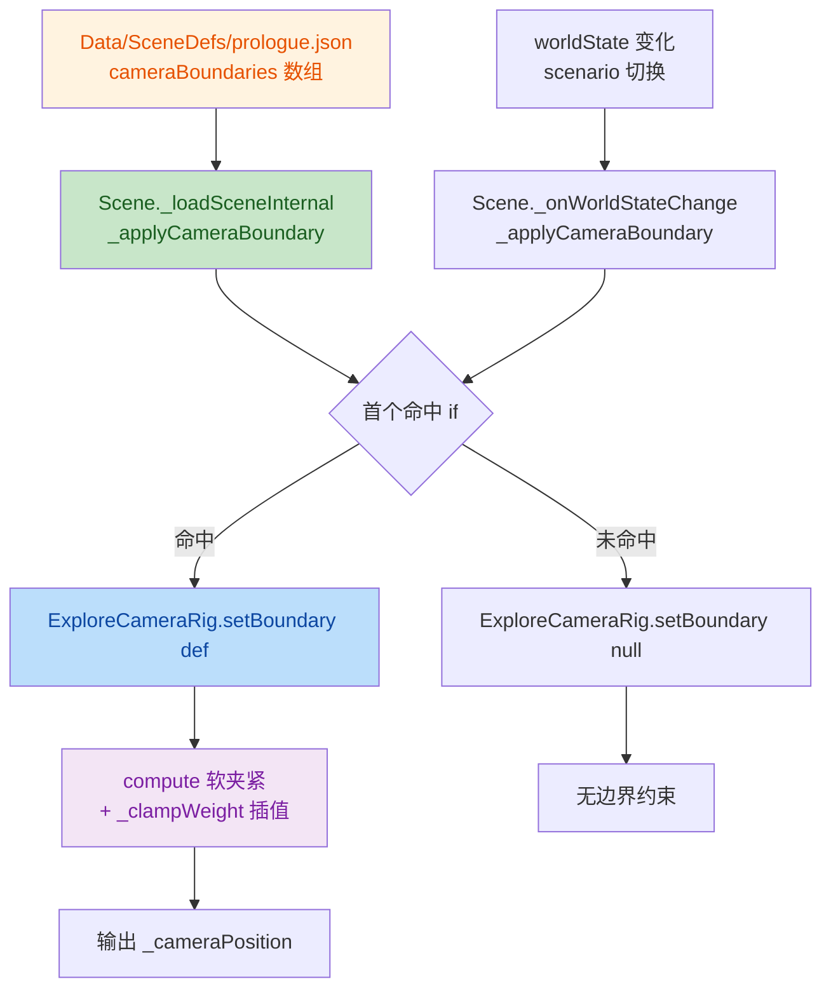
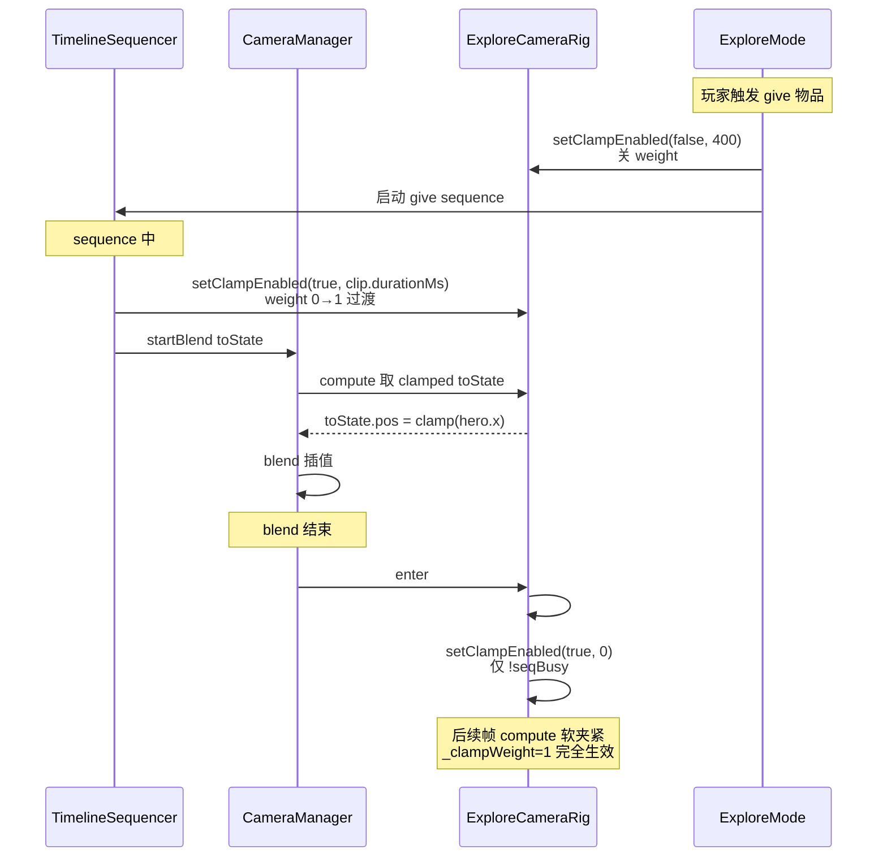
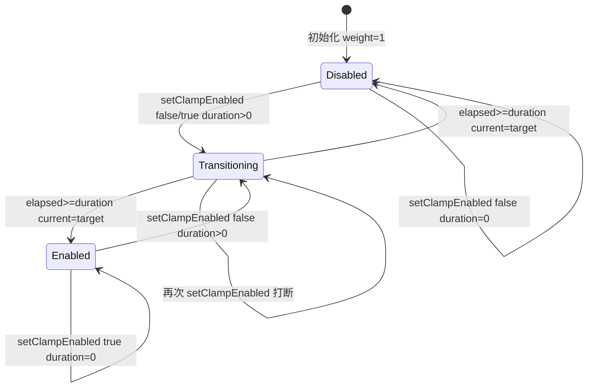

## 1. 高级摘要 (TL;DR)

*   **影响程度：** 🟡 **中高** — 核心引入了 **Explore 相机边界（Camera Boundary）** 新机制，同时修复了 **cameraBlend to explore** 后相机不切换 / 抖动的严重回归，并扩展了 `clampWeight` 软夹紧权重机制。
*   **关键变更：**
    *   ✨ **新增功能**：Explore 正交相机可视化范围边界约束（与 `walkAreas` 对称，按 scenario 命中）。
    *   🐛 **修复回归**：TimelineSequencer cameraBlend handler 误用 `this.context` 导致 `TypeError` 被静默吞掉，使 cameraBlend to explore 完全失效。
    *   🐛 **修复抖动**：Explore 相机 enter 阶段漏做硬夹紧（hard clamp），导致 flee sequence 结束后相机从 blend 终值跳到 desired 再被 followBlend 慢慢拉回的视觉抖动。
    *   🛠 **新增 API**：`ExploreCameraRig.setBoundary(def)` / `setClampEnabled(enabled, duration)` + 四角 debug 面板。
    *   📦 **数据/资源**：更新 `prologue.json` 场景边界、新增 `longswordman_inspect` 动画资源、新增 3 个策划/工具文档。

---

## 2. 可视化概览（代码 & 逻辑图）

### 2.1 相机边界系统数据流



### 2.2 Explore 相机夹紧时序（含 sequence 协调）



### 2.3 clampWeight 三态机



---

## 3. 详细变更分析

### 3.1 🆕 核心代码：`scripts/ExploreCameraRig.js`

**新增字段（构造器）**

| 字段 | 用途 |
|------|------|
| `_boundary` | `{ minX?, maxX?, minY?, maxY? } \| null` 边界定义 |
| `_axisWarnedX / Y` | 区间不足警告的去重标志 |
| `_debugVisible` / `_cornerPanels` | 四角 debug 面板 |
| `_clampWeightCurrent/Target/Start/Elapsed/Duration` | 软夹紧权重插值状态机 |
| `config.clampDuration` | 默认 4000ms |

**新增方法**

| 方法 | 行为 |
|------|------|
| `setBoundary(def)` | 提取存在的 min/max 字段，全缺省视为无约束；重置 warn 标志 |
| `setClampEnabled(enabled, duration=4000)` | `duration<=0` 瞬时切换；否则启动 weight 线性插值 |
| `setDebugVisible(value)` | 切换四角 debug 面板显示 |
| `#computeClamped(desiredX, desiredY)` | 计算夹紧后位置，按 `_clampWeightCurrent` 软混 |
| `#clampCameraPositionHard()` | 纯几何硬夹紧（不读 weight） |
| `#createCornerPanels()` / `#updateCornerPanels()` | 4 个固定 DOM div，显示 TL/TR/BL/BR 的 world space 坐标 |

**重写 `compute(dtMs, context, prevState)`**
- 拆分 `desiredX/Y/Z` 与 `finalTargetX/Y`（夹紧后）。
- 仅当 `projection==="orthographic"` 且有 `_boundary` 时启动 clamp weight 插值 + clamped 计算。
- 末尾追加 `#updateCornerPanels()` 调用。
- Z 轴仍不夹紧（2D 横版，深度由 `followDistance` 决定）。

**重写 `enter(ctx)`**（关键修复点）
- 检测 `ctx?.sceneSequencer?.isBusy?.()` 决定是否跳过 `setClampEnabled`。
- **无论 seqBusy 都执行 `#clampCameraPositionHard()`**（修复 flee 抖动），仅 `!seqBusy` 时调 `setClampEnabled(true, 0)`。

**`resetConfig()`** 末尾追加 `setBoundary(null)`，保持"恢复默认=无边界"语义。

---

### 3.2 🆕 `scripts/Scene.js`

**新增字段**：`this._cameraBoundaryDefs = sceneDef.cameraBoundaries ?? []`

**新增方法 `_applyCameraBoundary()`**（仿 `_applyWalkArea`）
- 遍历 `cameraBoundaries` 数组，按 `_evaluateCondition(def.if, worldState)` 首个命中生效。
- 空数组 / 全不命中 → `setBoundary(null)`。

**调用时机**
- `_loadSceneInternal` 在 `exploreCamera` 配置之后立即调用一次。
- `_onWorldStateChange` 与 `_applyWalkArea()` 同段调用（scenario 变化时自动切换 boundary）。
- `onKeyDown` X 键回调追加 `exploreCameraRig.setDebugVisible(nextVisible)`（与 collision/walkArea/stageBoundary/triggers/npc 同步）。

---

### 3.3 🐛 修复回归：`scripts/Systems/TimelineSequencer.js` (L611)

```diff
- this.context.game?.exploreCameraRig?.setClampEnabled?.(true, clip.durationMs);
+ ctx.game?.exploreCameraRig?.setClampEnabled?.(true, clip.durationMs);
```

**根因**：`ACTION_HANDLERS.cameraBlend.start(ctx, clip, state)` 以普通函数方式被调用，`this` 指向 handler 的 plain object 而非 `TimelineSequencer` 实例，`this.context` 为 `undefined` → 抛 `TypeError` → 被 `_updateClip` 的 try-catch 静默吞掉 → `setClampEnabled` / `cameraManager.startBlend` / `state.cameraManager` 全部未执行 → END handler 拿到 `cm=undefined` → `switchRig("explore")` 未调 → 相机停在 scripted rig 最后 follow 位置。

> ⚠️ 教训：加诊断 log 必须覆盖整条调用链入口/出口，不能只在下游 rig 上加 log。

---

### 3.4 ⚙️ ExploreMode 给物序列：`scripts/Systems/Modes/ExploreMode.js` (L872)

`_startGiveSequence()` 末尾新增：

```js
this.context.game?.exploreCameraRig?.setClampEnabled?.(false, 400);
```

**意图**：give 动作期间临时关掉 clamp，400ms 平滑过渡 → 交给 sequence 接管（sequence 内 `cameraBlend to scripted` 会自己控制 weight）。

---

### 3.5 📦 场景数据：`Data/SceneDefs/prologue.json`

**`walkAreas` 调整**

| scenario | 字段 | 旧值 | 新值 |
|----------|------|------|------|
| `scenarioMin: 105` | minX | -22 | **-27** |
| fallback | maxX | -18 | **-16** |

**新增 `cameraBoundaries` 数组**

| 条件 | minX | maxX | minY | 用途 |
|------|------|------|------|------|
| `scenarioMin: 105` | -32 | (无) | -2.56 | 战后扩大视野 |
| fallback | -36 | -10 | -2.56 | 初始视野 |

---

### 3.6 🎨 资源与新增文件

| 文件 | 变更类型 | 说明 |
|------|----------|------|
| `Art/RawAssets/Env/arrow.ase` | 二进制更新 | 箭头资产 |
| `Art/RawAssets/Env/floor.kra` | 二进制更新 | 地板资产 |
| `Art/RawAssets/Env/treeline_pine.kra` | 二进制更新 | 远景松树 |
| `Art/Sprite/longswordman/longswordman_inspect.json` | 🆕 新增 | 6 帧 128×128 inspect 动画 |
| `Data/RootMotion/longswordman/longswordman_inspect.json` | 🆕 新增 | 配套 rootmotion 数据 |
| `.trae/skills/collider-occupancy-更新-skill/SKILL.md` | 🆕 新增 | 碰撞盒/占用盒生成工具说明（PowerShell 脚本路线 A/B） |
| `plans/Explore 相机边界（Camera Boundary）设计.MD` | 🆕 新增 | 完整设计文档（430 行） |
| `plans/Handoff.MD` | 🆕 新增 | 交接文档（306 行，记录回归与修复全过程） |

**`plans/BACKLOG.md`** 追加一条：  
`prologue_cs_rabble_flee.json 摄像机移向 prop 时会有 jitter`（区分本次修复的 "flee 结束后" 抖动，BACKLOG 保留 flee 期间的抖动待查）。

---

## 4. 影响与风险评估

### 4.1 ⚠️ 破坏性变更

**无 API 破坏**。但行为变更如下：
- 旧场景（未声明 `cameraBoundaries`）：行为与改动前**完全一致**（`setBoundary(null)` 不约束）。
- 已有 `prologue.json`：现在会应用边界 clamp，**相机可视范围会被收紧到 `cameraBoundaries` 内**，需要 QA 验证视觉是否合理。

### 4.2 🐛 行为变更与潜在风险

| 风险点 | 说明 | 缓解 |
|--------|------|------|
| **boundary < walkArea** | 玩家在 walkArea 内但相机 viewport 超出 boundary → 黑屏边缘 | 策划保证 boundary ≥ walkArea + viewsize；load 时不强制校验 |
| **Y 轴 pitch** | clamp camera.y 后 target 仍跟玩家 Y，轻微 pitch | Y 范围通常很小（prologue -1~0.7）暂不明显 |
| **scenario→sequence 窗口期** | `_onWorldStateChange` 同步切 boundary，sequence 启动前 seqBusy 仍为 false | clamp 采用软平滑（按 `smoothing` 系数） |
| **cameraBlend 期间** | CameraManager.update 走 blend 路径不调 activeRig.compute，clamp 失效 | 设计接受，blend 自身控制 |
| **四角 debug 面板跨场景** | 首次创建后跨场景复用，dispose 在 `dispose()` 时清理 | rig 是 game 级单例，跨场景复用无泄漏 |

### 4.3 ✅ 测试建议

按设计文档 §9 验证方案：

1. **基础 clamp**：prologue 边界生效，左右边缘相机不越界。
2. **viewsize 不足警告**：故意配 `minX:0, maxX:5`（< orthoWidth），控制台应打一次 X 轴警告，X 轴冻结，Y 轴正常。
3. **per-direction 缺省**：只配 `minX/maxX` 不配 Y，Y 方向自由跟随。
4. **scenario 切换**：完成 `prologue_battle` 后 scenario 变化，boundary 自动切换。
5. **无声明场景**：outdoor_village 不配 `cameraBoundaries`，相机无 clamp 行为。
6. **透视跳过**：按 `toggleProjection()` 切透视，boundary 不生效；切回正交恢复。
7. **sequence 优先**：sequence 期间相机交由 sequence 控制，不受 clamp 干扰。
8. **场景切换不泄漏**：从 prologue 切到 outdoor_village，确认 boundary 已清空。
9. **resize**：拖动浏览器改变 aspect，halfWidth/halfHeight 自动适配。
10. **回归验证**：
    - intro sequence 播完后相机正确切换到 explore rig 位置。
    - flee sequence 播完后相机正常停在 hero（无"先到 clamped 再回 desired"的抖动）。
    - X 键切换 debug 面板可见性。

### 4.4 📋 后续清理项

- `ExploreCameraRig` 内的 `[ExploreCam]` 诊断 log（L64, L80, L88）可移除或降级为 verbose。
- 建议全局排查 `ACTION_HANDLERS` 其它 handler 是否存在 `this.context` / `this.xxx` 误用。
- BACKLOG 中 "flee 期间" 抖动（t=2000-5500 setCameraFollow prop_faller）保留待查，与本次修复无关。