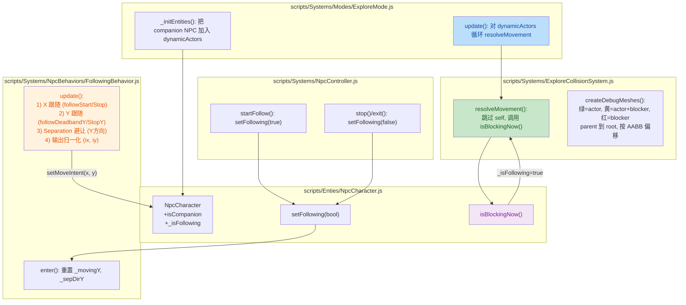
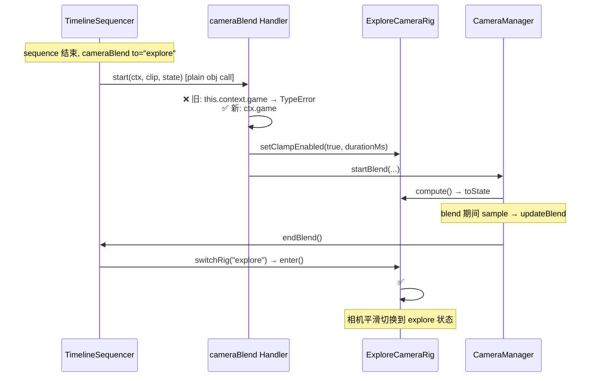

# 代码评审摘要

## 1. 高级摘要 (TL;DR)

*   **影响等级：** ⚡ **Medium-High** —— 主要涉及战斗同伴 NPC 的**碰撞系统、跟随 AI、根运动数据**及配套工具链；并附带一些环境美术与相机 bug 修复。
*   **核心变更：**
    *   ✨ **同伴 NPC 物理化**：Companion NPC 从"非碰撞体"升级为带占用盒的动态实体，可与玩家相互阻挡。
    *   🤖 **跟随行为升级**：从纯 X 轴追位扩展为**双轴 (X+Y) 跟随 + 距离 Separation 避让**。
    *   🐛 **相机 bug 修复**：`TimelineSequencer.cameraBlend` handler 中 `this.context.game` 误用导致 `intro/flee` 后相机不切换。
    *   🛠 **占用盒高度修正**：Charlotte 占用盒高度 `24 → 16`，相关 PowerShell 脚本同步。
    *   🎨 **新资源与工具**：新增 `longswordman_inspect` 动作图集、`.trae/skills/collider-occupancy` Skill 文档、环境美术二进制更新。

---

## 2. 可视化总览 (Code & Logic Map)

### 2.1 跟随行为架构图



### 2.2 相机修复时序图（Bug Fix）



---

## 3. 详细变更分析

### 3.1 🧱 NpcCharacter：实体属性升级
**源文件：** `scripts/Enties/NpcCharacter.js`

*   **新增字段：** `isCompanion`（配置传入，默认 `false`）、`_isFollowing`（跟随状态标志）。
*   **新增方法：**
    *   `setFollowing(value)`：切换跟随态。
    *   `isBlockingNow()`：智能碰撞判断 —— 如果 `_isFollowing=true` 则**不阻挡**（避免同伴在跟随时与玩家互卡）。

> 💡 **设计意图：** 把"碰撞性"与"跟随行为"解耦。NPC 默认会阻挡，但一旦进入跟随态就主动让位。

---

### 3.2 ⚙️ CharacterFactory：同伴配置变更
**源文件：** `scripts/CharacterFactory.js`（行 438-446）

| 字段 | 旧值 | 新值 | 说明 |
|---|---|---|---|
| `blocksMovement` | `false` | **`true`** | 同伴现在有物理占用 |
| `isCompanion` | (无) | **`true`** | 标记为同伴，启用特殊行为 |
| 其他 (interactable/capabilities/...) | 保持 | 保持 | 交互/战斗能力不变 |

---

### 3.3 🔁 FollowingBehavior：双轴跟随 + 避让
**源文件：** `scripts/Systems/NpcBehaviors/FollowingBehavior.js`

| 新增/修改 | 行为含义 |
|---|---|
| `targetOffsetY: 0` | Y 方向目标偏移（默认 0） |
| `followDeadbandY: 0.15` / `followStopY: 0.05` | Y 轴死区（启动阈值 / 停止阈值） |
| `separationRadius: 0.6` / `separationStrength: 1.0` | Separation 半径与强度 |
| `_movingY` / `_sepDirY` | Y 轴状态与避让方向记忆 |
| **setFacing 逻辑** | 仅在 `movingX` 时跟随目标，否则面向玩家 |
| **moveIntent 输出** | 归一化向量 `(ix, iy)`，分离 vs 主动跟随 Y 时优先 separation |

**核心算法：**
```js
if (sepForce > 0)       iy = sepIy;          // 避让优先
else if (movingY)       iy = Math.sign(dy);  // 主动跟随
else                    iy = 0;
```

> ⚠️ **注意：** Y 方向 Separation 会持续施加力，**不会自动消失**直到 `sepDist >= separationRadius`，可避免同伴贴脸。

---

### 3.4 🛡 ExploreCollisionSystem：碰撞与 Debug 升级
**源文件：** `scripts/Systems/ExploreCollisionSystem.js`

| 变更点 | 说明 |
|---|---|
| 新增 `this._debugMeshByEntity: Map` | 按实体索引 debug mesh（用于 dispose 配对） |
| `resolveMovement()` 增加 `blocker === entity` 跳过 | **避免自我碰撞** |
| `resolveMovement()` 增加 `isBlockingNow()` 检查 | **动态让位**（同伴跟随时主动让玩家穿过） |
| `createDebugMeshes()` 颜色规则 | 绿=纯 dynamic、黄=既是 dynamic 又是 blocker、红=纯 blocker |
| Debug mesh **parent 到 entity.root** | 跟随角色移动，无需每帧重算 |

> 💡 **好处：** Debug 可视化时角色移动 wireframe 也会同步移动，定位碰撞问题更直观。

---

### 3.5 🎮 ExploreMode：把同伴纳入物理仿真
**源文件：** `scripts/Systems/Modes/Modes/ExploreMode.js`

*   **`update()`**（行 63-69）：把单次 `resolveMovement(character, ...)` 改为遍历 `dynamicActors` 逐个解算。
*   **`_initEntities()`**（行 490-494）：companion NPC（`kind==="npc" && isCompanion && hasAabb`）加入 `dynamicActors`。

```js
} else if (entity.kind === "npc" && entity.isCompanion && typeof entity.getBlockerAabb === "function") {
    this.dynamicActors.push(entity);
}
```

---

### 3.6 🎬 NpcController：状态机钩子
**源文件：** `scripts/Systems/NpcController.js`（行 119-135）

| 位置 | 调用 |
|---|---|
| `stop()` / 退出跟随态 | `npc.setFollowing(false)` |
| `startFollow()` | `npc.setFollowing(true)` |

> 🛡 **安全写法：** 用 `typeof === "function"` 防御性调用，保持向后兼容（旧 NPC 不实现该方法不会崩）。

---

### 3.7 📦 占用盒数据修正（Charlotte）
**源文件：** `Data/RootMotion/NPCs/Charlotte.occupancy.json`

| 项 | 旧 | 新 |
|---|---|---|
| `occupancyHeightPx` | `24` | **`16`** |
| 每帧 `blocker.h` | `24` | **`16`** |
| 路径分隔符 | `/` | `\`（Windows 工具生成） |
| `generatedAtUtc` | 2026-07-05 | 2026-08-14 |

> ⚠️ **风险提示：** 如果运行时其他模块按 `24px` 硬编码计算碰撞尺寸，需同步检查（如场景定义、调试可视化等）。

---

### 3.8 🛠 PowerShell 工具同步更新
**源文件：** `scripts/tools/extract_rootmotion_occupancy.ps1`

| 变更 | 说明 |
|---|---|
| `$OCCUPANCY_H = 16` | 与新数据保持一致 |
| 新增 `Write-Diag()` + `$script:DiagWriter` | 每次运行输出 `<OutJson>.diag.log`，含帧/区域/像素/质心全链路 |
| `Extract-Root` 接受 `$frameName, $colorName` | 警告/日志可读性提升 |
| `try/finally` 中 `Close()` writer | 资源清理 |

**诊断日志输出示例：**
```
=== Frame 'traveller_walk 0.ase' color='root' ===
  frameRect: x=0 y=0 w=40 h=128
  regions found: 1
  region[0]: 18 pixels
  centroid: (20.111, 96.222)
  -> final anchor: (20.111, 96.222)
```

---

### 3.9 🆕 新增资源文件
| 路径 | 类型 | 说明 |
|---|---|---|
| `Art/Sprite/longswordman/longswordman_inspect.json` | Sprite Atlas | 6 帧 128×128，**注意 layers 中 `rootmotion` 出现两次**（疑似工具 bug） |
| `Data/RootMotion/longswordman/longswordman_inspect.json` | Root Motion Atlas | 同样 6 帧，时长 100/100/200/200/1500/100 ms |

> ⚠️ **瑕疵：** `Art/Sprite/.../longswordman_inspect.json` 比 `Data/RootMotion/.../longswordman_inspect.json` **多一个 `"rootmotion"` 图层**。建议检查 LibreSprite 导出设置或重新生成。

---

### 3.10 🐛 相机 Bug 修复 + Handoff 文档
**新文件：** `plans/Handoff.MD`（306 行）

**真实根因：** `TimelineSequencer.js` L611 `cameraBlend.start` handler 是 `ACTION_HANDLERS.cameraBlend` 的 plain object 方法，被当普通函数调用 → `this` 指向 plain object 而非 TimelineSequencer 实例 → `this.context` 为 `undefined` → `TypeError: can't access property "game"` → 被 `_updateClip` try-catch 静默吞掉 → 相机停在 scripted rig。

**修复（已应用）：**
```diff
- this.context.game?.exploreCameraRig?.setClampEnabled?.(true, clip.durationMs);
+ ctx.game?.exploreCameraRig?.setClampEnabled?.(true, clip.durationMs);
```

**第二处修复（flee 结束后抖动）：** `ExploreCameraRig.enter` 中把 `#clampCameraPositionHard()` 提到 `if (this.projection === "orthographic" && this._boundary)` 分支内、`if (!seqBusyEnter)` 分支外，**无论 seqBusy 都执行硬 clamp**。

> 💡 **教训：** 静默 try-catch 吞掉 TypeError 是最大杀手。后续加诊断 log 应覆盖整条调用链入口。

---

### 3.11 📐 场景几何微调
**源文件：** `Data/SceneDefs/prologue.json`（行 173-174）

| 实体 | 字段 | 旧 | 新 |
|---|---|---|---|
| `altar` | `blocker.centerY` | `1.4` | `1.3` |

> 配合 3.7 Charlotte 占用盒变扁，调低 0.1 让 altar 阻挡位置更贴合视觉。

---

### 3.12 📚 新增 Skill 文档
**新文件：** `.trae/skills/collider-occupancy-更新-skill/SKILL.md`（131 行）

把"更新 collider/occupancy"的人工流程固化为 AI 可触发的 Skill，包含：
*   两条路线：`extract_collision_boxes.ps1`（战斗角色）vs `extract_rootmotion_occupancy.ps1`（NPC）。
*   完整 powershell 命令模板 + 批量处理脚本。
*   颜色约定表（`#FFFF00` hitbox / `#7082C1` root 等）。
*   5 条常见问题清单（ExecutionPolicy、同帧连通域合并等）。

---

### 3.13 🎨 二进制资源更新
| 文件 | 类型 | 状态 |
|---|---|---|
| `Art/RawAssets/Env/arrow.ase` | Aseprite | 内容变更 |
| `Art/RawAssets/Env/floor.kra` | Krita | 内容变更 |
| `Art/RawAssets/Env/treeline_pine.kra` | Krita | 内容变更 |

> 二进制差异无内容对比，仅索引变化提示文件被重生成。

---

## 4. 风险与影响评估

### 4.1 ⚠️ 破坏性变更
*   **Charlotte 占用盒高度 24→16**：任何依赖旧尺寸的下游（场景碰撞可视化、战斗 AoE 排除、UI 提示）需复核。
*   **altar blocker `centerY` 1.4→1.3**：与 Charlotte 同步调整，独立看是 breaking，但配套 OK。
*   **Companion 变为可阻挡**：若旧关卡/剧情假设同伴不占格子，可能导致玩家被卡在角落。

### 4.2 🧪 测试建议
| 场景 | 关注点 |
|---|---|
| 同伴未激活（默认 idle） | 是否会挡路 / 卡玩家 |
| 同伴 follow 启动 | 是否会立刻让位、Y 避让是否过度 |
| 玩家与同伴 Y 接近 | Separation 力度是否合适、是否反复抖动 |
| 多个同伴并存 | Separation 互避是否生效 |
| Charlotte 出现 + altar 阻挡 | 24→16 + centerY 1.4→1.3 后贴合度 |
| intro 完整播放 | 相机是否平滑切到 explore rig（不再停在 scripted） |
| flee 完整播放 | 结束后相机是否无抖动 |
| `extract_rootmotion_occupancy.ps1` 跑一遍 | 检查 `.diag.log` 是否正常输出、Charlotte 输出 height=16 |
| longswordman inspect 帧播放 | 检查 rootmotion 图层是否正常（**注意重复图层**） |

### 4.3 🔍 潜在问题
1. **`Art/Sprite/longswordman/longswordman_inspect.json` 重复 `rootmotion` 图层** —— 建议检查 LibreSprite 导出或重新生成。
2. **`plans/Handoff.MD` 提到诊断 log 仍在代码中**（`ExploreCameraRig.js:64, 80, 88`）—— 问题已定位，建议清理或降低为 verbose。
3. **`ACTION_HANDLERS` 其他 handler** —— Handoff 提示应排查其他 handler 是否有同样的 `this.context` 误用问题。
4. **旧 `suppressClamp` 等字段已回退** —— 文档记录完整，但应确认 git 历史无残留。
5. **`Data/RootMotion/.../longswordman_inspect.png` 路径使用绝对 `E:\se\BlindDuel\...`** —— 多人协作时需修改为相对路径。