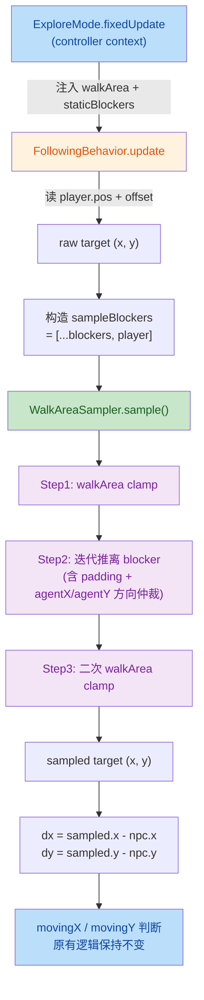
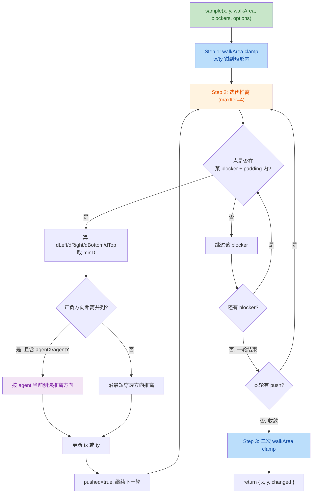

## 1. High-Level Summary (TL;DR)

*   **Impact:** **Medium** — 核心是新增 `WalkAreaSampler` 工具类，修复 Companion（Charlotte）跟随玩家时因目标点落在障碍物/walkArea 边界/玩家身上而"卡死在 walk 状态"的两个具体 bug；同时补充设计文档、Handoff、Skill 文档以及若干美术资源。
*   **Key Changes:**
    *   ✨ **新增** `scripts/Systems/WalkAreaSampler.js`：静态 `sample(x, y, walkArea, blockers, options)`，对标 Unity `NavMesh.SamplePosition`，三步算法（walkArea clamp → blocker 推离 → 二次 clamp）。
    *   🐛 **修复** `FollowingBehavior.update` 中目标点不可达问题，引入 `agentX/agentY` 参数解决推离方向震荡 bug。
    *   🛠 **修改** `ExploreMode.fixedUpdate`：向 controller context 注入 `walkArea` 和 `staticBlockers`。
    *   📚 **新增/更新** 3 份文档（设计稿、Handoff 修复记录、Collier/Occupancy 更新 Skill）。
    *   🎨 **新增/更新** 5 个美术资源（2 个 longswordman inspect 动画 + 3 个环境 .ase/.kra 二进制资产）。

---

## 2. Visual Overview (Code & Logic Map)

### Companion 目标采样流程



### WalkAreaSampler.sample 算法（核心三步）



---

## 3. Detailed Change Analysis

### 🆕 新增组件: `WalkAreaSampler`（核心）

*   **What Changed:** 新建 `scripts/Systems/WalkAreaSampler.js`，纯静态方法，无实例状态。
*   **算法核心（三步）:**
    1. **walkArea clamp**：把 raw target 钳到矩形内（解决"目标落在 walkArea 外 → companion 永远到不了"）。
    2. **blocker 迭代推离**：若点落在某 blocker（含 padding 扩张）内，沿最短穿透方向推离。多个 blocker 叠加时迭代 `maxIter=4` 次收敛。
    3. **二次 walkArea clamp**：推离后可能越过 walkArea 边界，再 clamp 一次。
*   **关键参数:**
    *   `padding = max(NPC AABB 半宽)` — 保证 NPC 中心到达 target 时其 AABB 不与 blocker 重叠，`resolveMovement` 不会再推她。
    *   `agentX / agentY` — 实施期发现的震荡 bug 修复：当某轴正负方向穿透距离并列时（如 player 在 walkArea 右墙 + rawTargetY 居中），按 agent 当前所在侧选推离方向，避免与 Separation 软避让冲突。
    *   复用 `isBlockingNow()` 接口 —— companion 自己在 following 时 `isBlockingNow=false`，自动跳过，不会自己挡自己 target。

---

### ✏️ `FollowingBehavior.update`（核心修改）

*   **What Changed:** 在算 `dx/dy` 之前对 raw target 走一次 `WalkAreaSampler.sample`。
*   **关键代码逻辑（来源：`FollowingBehavior.js:47-67`）:**

    ```javascript
    const rawTargetX = playerPos.x + this.options.targetOffsetX;
    const rawTargetY = playerPos.y + this.options.targetOffsetY;

    const sampleBlockers = [...(context.blockers ?? [])];
    if (typeof player.getBlockerAabb === "function") sampleBlockers.push(player);

    const npcAabb = npc.getBlockerAabb?.();
    const padX = npcAabb ? (npcAabb.maxX - npcAabb.minX) * 0.5 : 0;
    const padY = npcAabb ? (npcAabb.maxY - npcAabb.minY) * 0.5 : 0;
    const padding = Math.max(padX, padY);

    const sampled = WalkAreaSampler.sample(
        rawTargetX, rawTargetY,
        context.walkArea ?? null, sampleBlockers,
        { padding, agentX: npcPos.x, agentY: npcPos.y }
    );
    const targetX = sampled.x;
    const targetY = sampled.y;
    ```

*   **关键设计点:**
    *   **player 临时进 sampleBlockers（不进 staticBlockers）**——只在 sample 阶段软处理 target 避让，不改变 `resolveMovement` 物理推开行为。
    *   `typeof player.getBlockerAabb === "function"` 守卫 —— `CharacterBase` 基类返回 `null`，理论上 player 一定是 `CombatCharacter` 子类，但守卫更稳。
    *   后续 `dx/dy` 与 `movingX/movingY` 判断逻辑**保持不变**，只换 target 来源。

---

### ✏️ `ExploreMode.fixedUpdate`（轻量修改）

*   **What Changed:** `controller.update(...)` context 新增两个字段。
*   **Diff 位置:** `scripts/Systems/Modes/ExploreMode.js:59-60`

    | 字段 | 值 | 说明 |
    |---|---|---|
    | `walkArea` | `this.context.walkArea` | 行走区域，用于 sample Step1/Step3 |
    | `blockers` | `this.staticBlockers` | 静态障碍物列表，传入 FollowingBehavior |

---

### 📚 新增/更新文档

| 文件 | 类型 | 说明 |
|---|---|---|
| `plans/Companion 目标采样（WalkAreaSampler）设计.MD` | 🆕 设计稿 | 313 行完整设计文档：背景/根因/算法/数据流/边界情况/实施步骤/遗留项 |
| `plans/Handoff.MD` | 🆕 Handoff 文档 | 306 行：cameraBlend to explore 出 sequence 后相机不动的修复记录（**注：此文档记录的是另一轮已修复 bug，与本次 diff 主体无直接代码关联**） |
| `.trae/skills/collider-occupancy-更新-skill/SKILL.md` | 🆕 Skill 文档 | 131 行：碰撞盒/占用盒更新操作指南（两条路线：战斗角色 collider + NPC occupancy） |
| `plans/BACKLOG.md` | ✏️ 微调 | 删除"全局雾""np移动采样"两条，新增"配音归属""面包屑路径" |
| `plans/INDEX.md` | ✏️ 新增条目 | 追加 2026-08-15 Update Log，说明本次 WalkAreaSampler 实施 |

---

### 🎨 美术资源变更

| 文件 | 类型 | 说明 |
|---|---|---|
| `Art/Sprite/longswordman/longswordman_inspect.json` | 🆕 新建 | longswordman inspect 动作的 sprite atlas（6 帧，128×128，768×128） |
| `Data/RootMotion/longswordman/longswordman_inspect.json` | 🆕 新建 | longswordman inspect 动作的根运动 atlas（同 6 帧） |
| `Art/RawAssets/Env/arrow.ase` | 🔧 二进制更新 | 箭头贴图（无文字 diff，二进制变更） |
| `Art/RawAssets/Env/floor.kra` | 🔧 二进制更新 | 地板贴图（二进制变更） |
| `Art/RawAssets/Env/treeline_pine.kra` | 🔧 二进制更新 | 松树林贴图（二进制变更） |

*   **注:** longswordman_inspect 两个 JSON 结构几乎相同，仅 layers 中 `rootmotion` 数量不同（Sprite 版有 2 层，RootMotion 版有 1 层）。

---

## 4. Impact & Risk Assessment

### ⚠️ 风险与回归点

| 风险点 | 说明 | 缓解 |
|---|---|---|
| **方向反转** | 边界处 sample 后 target 落在 player 非预期侧 | 当前 `targetOffsetX=1.0`（正数）不触发；若未来做双向跟随（负 offset），需在 §7.2 加方向校验 |
| **路径阻断** | sample 只能解决"目标点不可达"，不能解决"路径被堵"（如墙隔开） | 遗留 §7.1 auto-braking 方案待后续实施 |
| **handler 误用** | `Handoff.MD` 提示：`ACTION_HANDLERS` 其它 handler 可能还有 `this.context` / `this.xxx` 误用 | 推荐做一次全量排查 |
| **震荡边界** | sample 推离方向由 agentX/agentY 决定，理论上极端场景仍有退化可能 | `maxIter=4` 限制开销，监控 logs 观察 |

### ✅ 验证建议（测试场景）

*   🧪 **玩家紧贴障碍物（prop/stageMask pushbox）左侧站立** —— Charlotte 应能正常停下，不卡 walk 状态。
*   🧪 **玩家走到 walkArea 右端** —— Charlotte 应停在 player 身侧正常停下。
*   🧪 **player 在 walkArea 右墙 + rawTargetY 居中** —— 验证 Y 方向震荡 bug 修复（不原地踏步）。
*   🧪 **sequencer 期间** —— Charlotte 位置仍由 `moveActorTo` 控制（sample 路径不应干扰）。
*   🧪 **正常移动回归** —— Charlotte 跟随行为与改造前一致，无视觉/手感变化。

### 🔄 Breaking Changes

*   **API 变更:** `FollowingBehavior.update` 现在依赖 `context.walkArea` 和 `context.blockers` —— **但仅当 state === "following" 时才被调用**，且 `ExploreMode.fixedUpdate` 已注入这两字段。**理论上其它调用方（若存在）需同步注入，否则 sample 退化为"无 walkArea 无 blocker"模式**（仍可工作，但失去新功能保护）。
*   **schema/data:** 无 schema 变更；新增 `longswordman_inspect` 动作（需配合 collider/rootmotion 更新流程使用）。
*   **二进制资源:** 3 个环境贴图更新，需美术确认无视觉回归。

### 📋 文件清单汇总

| 文件 | 改动类型 | 来源 diff |
|---|---|---|
| `scripts/Systems/WalkAreaSampler.js` | 🆕 新建 68 行 | 核心实现 |
| `scripts/Systems/NpcBehaviors/FollowingBehavior.js` | ✏️ +import +13 行 | 接入 sample |
| `scripts/Systems/Modes/ExploreMode.js` | ✏️ +2 行 | 注入 context |
| `plans/Companion 目标采样（WalkAreaSampler）设计.MD` | 🆕 313 行 | 设计稿 |
| `plans/Handoff.MD` | 🆕 306 行 | 历史修复记录 |
| `.trae/skills/collider-occupancy-更新-skill/SKILL.md` | 🆕 131 行 | 操作指南 |
| `plans/BACKLOG.md` | ✏️ 4 行 | 微调 |
| `plans/INDEX.md` | ✏️ +3 行 | 追加日志 |
| `Art/Sprite/longswordman/longswordman_inspect.json` | 🆕 72 行 | 动作资源 |
| `Data/RootMotion/longswordman/longswordman_inspect.json` | 🆕 71 行 | 根运动资源 |
| `Art/RawAssets/Env/arrow.ase` | 🔧 二进制 | 美术 |
| `Art/RawAssets/Env/floor.kra` | 🔧 二进制 | 美术 |
| `Art/RawAssets/Env/treeline_pine.kra` | 🔧 二进制 | 美术 |