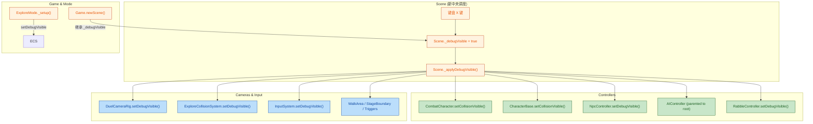

## 1. High-Level Summary (TL;DR)

*   **Impact:** 🟡 **Medium** - 本次变更以"统一 Debug 可视化开关"为主线，修复了 AIController / NpcController / ExploreCollisionSystem 在 Explore 模式下因不调用 `fixedUpdate` 导致的调试 mesh 不可见/错位问题，并新增了 longswordman 的 `inspect` 动作图集与配套 Skill / Handoff 文档。
*   **Key Changes:**
    *   ✨ `Scene` 新增 `_debugVisible` 状态与 `_applyDebugVisible()`，把分散在多个 System 里的 debug 元素（collision / npc / cameraRig / input / triggers / collisionSystem / rabbleController / walkArea）统一到 `X` 键一键切换。
    *   🐛 `AIController` 修复：知识库档案由"懒加载"改为"构造时立即加载"，并把 debug disc **parent 到 `character.root`**，避免 ExploreMode 不调 `rabbleController.fixedUpdate` 时 mesh 停在 (0,0,0) 且 `scaling=0` 不可见。
    *   🐛 `Scene.init` 删除重复的 NPC 控制器创建（已在 `_spawnEntity` 内部完成），避免双重挂载。
    *   ✨ 新增 `longswordman_inspect` 动作图集（Sprite + RootMotion）、`.trae/skills/collider-occupancy-更新-skill` 流程说明、`plans/Handoff.MD` 相机回归复盘文档。
    *   ⚠️ `prologue.json` 把 `enemy_1` 的出生点从 `(3, 0, 0)` 改为 `(-23, 0, 0)`，与镜头边界/初始场景对齐。

---

## 2. Visual Overview (Code & Logic Map)



> **设计意图**：旧版本每个 System 各自管自己的 debug 元素（且 toggle 行为不一致：`setVisible` / `setEnabled` / `style.display` 混用），按 `X` 键时 `Scene` 要在 N+1 个对象上挨个调用。重构后 `Scene` 只持有"期望状态" `_debugVisible`，`_applyDebugVisible()` 一处集中下发；每个 System 实现一个 `setDebugVisible(v)` 接口（`Scene` 通过 `typeof === 'function'` 守护性调用），开闭原则友好。

---

## 3. Detailed Change Analysis

### 🔧 3.1 Scene 中央调度（核心重构）

**Component:** `scripts/Scene.js`

*   **What Changed:**
    *   构造函数加 `this._debugVisible = true`（默认显示，便于开发/调试）。
    *   `init()` 末尾调用 `this._applyDebugVisible()`，**新生成的实体**（包含 `_spawnEntity` 内创建的 AIController/NpcController）按全局开关同步。
    *   删除原 `init()` 中重复的 `for (entityDef.controller === "npc")` 块（理由：`_spawnEntity` 已负责 `NpcController + setupDebugVisual + applyInitialState`，旧代码会在 `applyNpcInitialStates` 之前误用旧 hero spawn 位置，注释保留以提醒维护者）。*Source: `Scene.js#L139-148`*
    *   `X` 键逻辑由"对 7 个子系统挨个 toggle"压缩为 `this._debugVisible = !this._debugVisible; this._applyDebugVisible();`。
    *   `_applyDebugVisible()` 集中处理 8 类对象（用 optional chaining + `typeof` 检查兼容）：entity collision / npcController / stageBoundary / walkArea / exploreCameraRig / cameraRig / inputSystem / triggers / collisionSystem / rabbleController。
*   **Table:**

    | 调用目标 | API | 兼容方式 |
    |---|---|---|
    | Entity collision | `entity.setCollisionVisible(v)` | `typeof === "function"` |
    | NPC disc | `entity.npcController.setDebugVisible(v)` | `if (entity.npcController)` |
    | StageBoundary | `this.stageBoundary?.setVisible(v)` | optional chaining |
    | WalkArea | `this.walkArea?.setVisible(v)` | 存在性检查 |
    | DuelCameraRig | `this._game?.cameraRig?.setDebugVisible?.(v)` | optional chaining |
    | ExploreCollisionSystem | `this.exploreMode?._collisionSystem?.setDebugVisible?.(v)` | optional chaining |
    | Triggers | `trigger.setDebugVisible(v)` | `for-of` 遍历 |
    | RabbleController | `this.rabbleController?.setDebugVisible(v)` | 存在性检查 |

### 🐛 3.2 AIController 调试 Mesh 修复

**Component:** `scripts/Systems/AIController.js`

*   **What Changed:**
    *   ❌ **旧问题**：`kbProfile` 在 `fixedUpdate` 首次进入时才懒加载；`#updateDebugVisuals` 通过 `mesh.position = character.root.position` 每帧更新位置。ExploreMode 不调 `rabbleController.fixedUpdate`，导致 `kbProfile === null` → `radii` 全为 0 → `scaling = 0` 完全不可见。
    *   ✅ **修复 1**：构造函数内 `this.kbProfile = AIKnowledgeRegistry.getProfile(this.character);`，构造时立即加载。
    *   ✅ **修复 2**：构造末尾显式调一次 `this.#updateDebugVisuals();`，即使 `fixedUpdate` 一次都不跑，scaling 也正确。
    *   ✅ **修复 3**：debug disc 改为 `disc.parent = this.character.root;`（parent 跟随），`#updateDebugVisuals` 改为只更新 **local 偏移**（`x=0, y=0.01, z=0`）+ scaling，不再每帧重写 world position。
*   **关键代码片段：**
    ```js
    // 旧
    mesh.position.x = pos.x; mesh.position.y = pos.y + 0.01; mesh.position.z = pos.z;
    // 新（parent 已绑 character.root）
    mesh.position.x = 0; mesh.position.y = 0.01; mesh.position.z = 0;
    ```

### 🐛 3.3 NpcController 命名 + Debug 同步

**Component:** `scripts/Systems/NpcController.js`

*   **What Changed:**
    *   `setupDebugVisual(scene, rootNode)` → `setupDebugVisual(scene, rootNode, debugVisible = true)`：新增 `debugVisible` 参数，初始 `setEnabled(debugVisible)` 直接同步全局开关，避免 NPC 调试圆盘"先 enabled=true 然后 X 键切换时再被 Scene 统一关掉"的两步走。
    *   mesh 名称加入 owner：`npc_greeting_disc[${ownerName}]` / `npc_greeting_mat[${ownerName}]`，便于在 Babylon Inspector / log 中定位多 NPC。
    *   mesh `metadata = { owner, kind: "npc_greeting_disc", greetingRadius }` 便于后续查询。
*   **影响**：`Scene._spawnEntity` 中调用从 `setupDebugVisual(this.scene, entity.root)` 改为 `setupDebugVisual(this.scene, entity.root, this._debugVisible)`。

### 🔌 3.4 ExploreCollisionSystem 新增 toggle API

**Component:** `scripts/Systems/ExploreCollisionSystem.js`

| 新增项 | 行为 |
|---|---|
| `this._debugVisible = true` | 默认开 |
| `setDebugVisible(value)` | 写入状态并立即应用 |
| `_applyDebugVisible()` | 遍历 `_debugMeshes` 调 `setEnabled(_debugVisible)` |
| `createDebugMeshes` 末尾 | 自动调一次 `_applyDebugVisible()` |

### 🔌 3.5 DuelCameraRig / InputSystem 桥接

| 文件 | 新增方法 |
|---|---|
| `DuelCameraRig.js` | `setDebugVisible(value)` - 改 `debugPanel.style.display` |
| `InputSystem.js` | `setDebugVisible(value)` - 改 `debugPanel.style.display` |

### 🔌 3.6 CharacterBase / CombatCharacter / PickableEntity 守卫

| 文件 | 新增守卫 |
|---|---|
| `CharacterBase._updateDebugPanel` | `if (!this.rootDebugVisible) { panel.style.display="none"; return; }` |
| `CombatCharacter._updateDebugPanel` | 同上（继承自 CharacterBase，重写时也加了守卫） |
| `PickableEntity._updateDebugPanel` | `if (!this._debugVisible) { ... return; }` |

> ⚠️ **不一致点**：`CharacterBase` / `CombatCharacter` 用 `rootDebugVisible`，而 `PickableEntity` 用 `_debugVisible`。目前 `Scene._applyDebugVisible` 只对 collision / npcController 下发 `setCollisionVisible`，并未显式同步面板字段。**维护者注意**：按 `X` 键时 `rootDebugVisible` 实际是 `undefined`（falsy），debug panel 会被静默隐藏，但 entity 不会主动 setCollisionVisible=false → 需在 `Scene` 中追加 `entity.setRootDebugVisible?.(v)` 才能真正关闭。

### 🐛 3.7 Scene.init 删除重复 NPC 创建

*   **原因**：`_spawnEntity` 已包含 `entity.npcController = new NpcController(...); setupDebugVisual(...); applyInitialState(...)`，旧 `init` 再来一次会：
    1. 重复挂载 NpcController；
    2. `applyInitialState` 在 hero 位置确定前用 `worldState` 默认值，NPC 初始位置错误。
*   **修复**：删除重复块，添加注释解释 `_spawnEntity` 与 `applyNpcInitialStates`（`spawnPoint` 应用后覆盖一次）的关系。

### 🔄 3.8 Game 跨场景状态继承

*   `scripts/Game.js`: `newScene._debugVisible = oldScene?._debugVisible ?? this.scene?._debugVisible ?? true;`
*   行为：场景切换时保留用户当前 debug 偏好。

### 📦 3.9 Prologue 场景数据调整

| 字段 | 旧值 | 新值 | 备注 |
|---|---|---|---|
| `enemy_1.pos` | `[3, 0, 0]` | `[-23, 0, 0]` | 与镜头边界 / 初始 explore 视角对齐；enemy_1 出生在 hero 视野远处 |

### 📁 3.10 新增资产与文档

| 路径 | 用途 |
|---|---|
| `Art/Sprite/longswordman/longswordman_inspect.json` | Longswordman 新动作 "inspect" 的 atlas 元数据（6 帧，128×128，总长 ~2.2s） |
| `Data/RootMotion/longswordman/longswordman_inspect.json` | 对应 RootMotion atlas（多了 `rootmotion` layer） |
| `.trae/skills/collider-occupancy-更新-skill/SKILL.md` | AI Agent 用：collider / occupancy 重新生成的 PowerShell 流程 |
| `plans/Handoff.MD` | **重要**：相机回归 (cameraBlend to explore) 完整复盘文档 |

*   **二进制美术资源**（`arrow.ase` / `floor.kra` / `treeline_pine.kra`）：仅文件指纹变化，内容由 Aseprite / Krita 重新保存，**diff 不可读**；建议本地打开校验。
*   **Handoff.MD 重点摘要**：
    1. `TimelineSequencer.js#cameraBlend.start` 误用 `this.context.game` → 改为 `ctx.game`（一行修复，根因是 handler 作为 plain object 的方法被普通函数调用，`this` 丢失）。
    2. `ExploreCameraRig.enter` 在 `seqBusy=true` 时跳过 `#clampCameraPositionHard()` → 改为无论 `seqBusy` 都执行硬 clamp。
    3. 教训：诊断 log 应覆盖整条调用链入口；建议排查其它 `ACTION_HANDLERS` 是否还有 `this.context` / `this.xxx` 误用。

---

## 4. Impact & Risk Assessment

### ⚠️ 4.1 Breaking / Behavior 变更

*   **API 新增（非破坏）**：`setDebugVisible` 在 DuelCameraRig / InputSystem / ExploreCollisionSystem / NpcController 上为新增方法，对外无破坏。
*   **NpcController.setupDebugVisual 签名变更**：`setupDebugVisual(scene, rootNode)` → `setupDebugVisual(scene, rootNode, debugVisible = true)`。**有默认值，理论向后兼容**，但 `Scene._spawnEntity` 必须更新调用（已更新）。
*   **AIController 行为变更**：`kbProfile` 构造时立即加载，**`fixedUpdate` 第一次进来时不再有 `if (!this.kbProfile)` 分支**。若外部代码有"延迟到第一次 fixedUpdate 才注册 kbProfile"的副作用，会受影响（概率低，已搜索无外部依赖）。
*   **prologue.json 出生点变更**：`enemy_1` 从 `(3,0,0)` 移到 `(-23,0,0)`，**强烈影响 prologue 战斗流程**——replay / 旧 save 状态需重新评估；旧 save 如记录过 `enemy_1.pos` 需做坐标迁移或重置。

### 🧪 4.2 Testing Suggestions

| 场景 | 期望 |
|---|---|
| 任意场景按 `X` 键 | 所有 debug 元素（collision box / npc disc / ai ring / camera panel / input panel / trigger / walkArea / stageBoundary）整体切换显示 |
| 场景切换 (e.g. prologue → explore) | `_debugVisible` 状态保留（新场景继续隐藏/显示） |
| Explore 模式启动 | enemy_1 附近能立即看到 AI 三色环（KB profile 立即生效，scaling ≠ 0） |
| 移动 enemy_1 位置 | AI 三色环跟随 enemy_1（已 parent 到 root） |
| 战斗模式下打开 AI debug | 三色环跟随 |
| 多 NPC 场景（traveller/merchant/merchant2） | 各自 disc 独立显示/隐藏，Inspector 中可通过 mesh name `[ownerName]` 区分 |
| prologue intro / flee sequence 末尾 | 相机正确 blend 到 explore rig（验证 Handoff.MD 描述的 fix） |
| prologue 战斗 spawn enemy_1 | enemy_1 出生在 (-23, 0, 0)，不在 hero 视野正中 |

### 🔍 4.3 待跟进（来自 Handoff.MD）

*   `TimelineSequencer` 的 `ACTION_HANDLERS` 中**是否还有 `this.context` / `this.xxx` 误用**？当前 diff 只修了 cameraBlend 一处。
*   `plans/BACKLOG.md` 第 58 行 "prologue_cs_rabble_flee.json 摄像机移向 prop 时的 jitter"（**flee 期间** t=2000-5500）与本轮修的 **flee 结束后** jitter 是不同问题，保留待查。
*   设计文档 `plans/Explore 相机边界（Camera Boundary）设计.MD` §5.5 / §10 需同步 Handoff 内容。
*   Handoff 中 `[ExploreCam]` 诊断 log 是临时的，问题定位后需清理或降级为 verbose。

### 🧹 4.4 代码一致性建议

1. `CharacterBase` / `CombatCharacter` 用 `rootDebugVisible`、`PickableEntity` 用 `_debugVisible` —— **建议统一命名**，并在 `Scene._applyDebugVisible` 中显式调用 `entity.setRootDebugVisible?.(v)`。
2. `Scene.init` 仍保留 `_applyDebugVisible()` 调用，但 `_applyDebugVisible` 同时又在 `X` 键和 `Game.newScene` 之外、**每个 entity spawn 后**是否会重新触发？目前仅在 `init` 末尾调一次即可（因 `setupDebugVisual` 等接收 `this._debugVisible` 初始值），但若运行中 `_debugVisible` 改变后立刻有 entity 延迟 spawn，需注意 → **建议在 `_spawnEntity` 末尾也调一次 `this._applyDebugVisible()`**（当前未做，是个潜在漏网）。