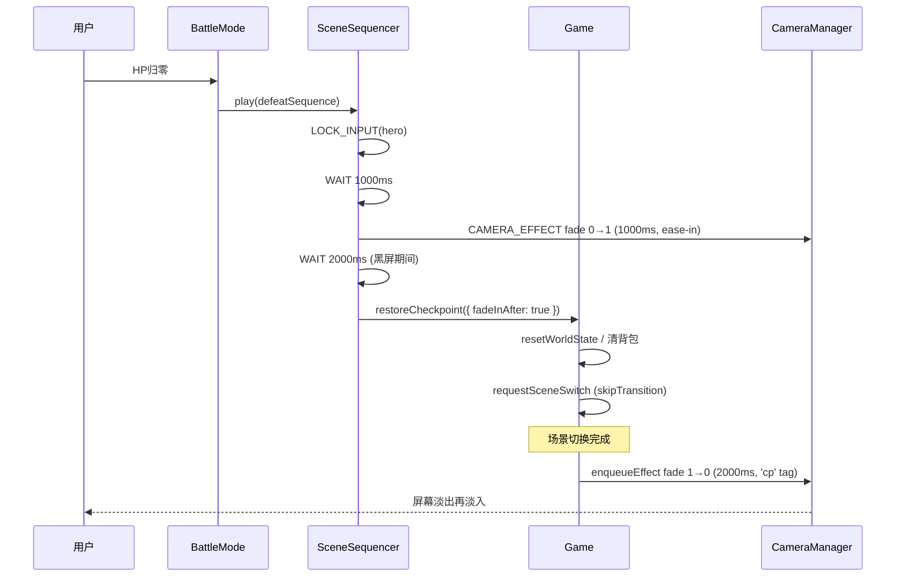
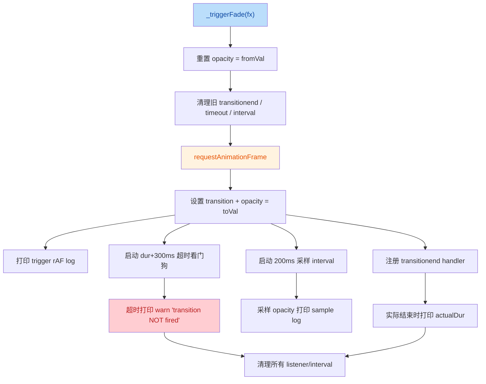
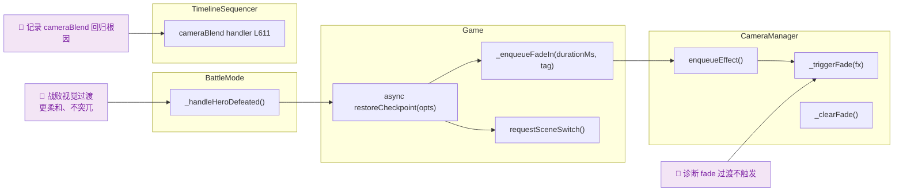

## 1. 高层摘要 (TL;DR)

*   **影响：** 中等
*   **范围：** 涉及战败重置流程的视觉过渡、相机淡入淡出系统诊断、相机混合（blend）回归问题的交接文档，以及美术资源的少量新增。
*   **关键变更：**
    *   ✨ **战败淡入淡出：** `BattleMode` 战败序列增加"淡黑屏 → 等待 → 恢复检查点 → 淡入"流程。
    *   ✨ **异步检查点恢复：** `Game.restoreCheckpoint()` 改为 `async`，支持 `fadeInAfter` 选项在场景切换后入队淡入效果。
    *   🐛 **相机淡入强化诊断：** `CameraManager._triggerFade` 加入 rAF 包装、transitionend 监听、200ms 采样、duration+300ms 超时看门狗，定位过渡不触发问题。
    *   📄 **新增交接文档：** `plans/Handoff.MD` 记录 `cameraBlend to explore` 出 sequence 后相机不动的回归调查全过程（根因已定位为 `TimelineSequencer.js` L611 `this.context` 误用，但修复 diff 未在本批提交中）。
    *   📄 **新增 SKILL 文档：** `collider-occupancy-更新-skill` 描述战斗角色 collider / NPC occupancy 更新脚本使用方法。
    *   🖼️ **资源新增：** `longswordman_inspect` 6 帧 128×128 sprite atlas，新增至 `Art/Sprite/longswordman/` 与 `Data/RootMotion/longswordman/`；环境层贴图（arrow.ase、floor.kra、treeline_pine.kra）二进制更新。

---

## 2. 视觉概览（代码与逻辑图）

### 2.1 战败淡入淡出新流程



### 2.2 _triggerFade 诊断流程



### 2.3 业务目标 ↔ 模块 ↔ 关键方法 映射



---

## 3. 详细变更分析

### 3.1 战斗模式 `scripts/Systems/Modes/BattleMode.js`

*   **战败序列重写：** 旧的 2 步序列（WAIT 2500ms → CALLBACK restoreCheckpoint）改为 4 步，引入 **淡黑屏过渡**。

| 步骤 | 类型 | 参数 | 作用 |
|---|---|---|---|
| 1 | `LOCK_INPUT` | actor: hero | 锁死玩家操作 |
| 2 | `WAIT` | 1000ms | 给玩家看到战败动作的缓冲 |
| 3 | `CAMERA_EFFECT` | `fade 0→1, 1000ms, black, ease-in` | 屏幕淡黑 |
| 4 | `WAIT` | 2000ms | 黑屏期间（避免与场景切换冲突） |
| 5 | `CALLBACK` | `restoreCheckpoint({ fadeInAfter: true })` | 恢复存档 + 入队淡入 |

> **设计意图：** 把"重置场景"放在黑屏期间，**新场景在玩家看不见时完成加载**，再用 2s 淡入将玩家带回游戏世界。

---

### 3.2 核心游戏 `scripts/Game.js`

*   **`restoreCheckpoint` 签名变更：** `restoreCheckpoint()` → **`async restoreCheckpoint(opts = {})`**
    *   新增 `opts.fadeInDurationMs`，默认 `2000`（战败淡入 2s）。
    *   新增 `opts.fadeInAfter` 开关，决定是否在 `requestSceneSwitch` 完成后入队淡入。
*   **两处 `requestSceneSwitch` 调用都加了 `await`**：确保场景切换完毕后再入队 fade 效果，避免 fade 与场景切换逻辑竞争。
*   **新增 `_enqueueFadeIn(durationMs, tag)` 私有方法：**
    ```js
    _enqueueFadeIn(durationMs, tag) {
        this.cameraManager?.enqueueEffect({
            type: "fade",
            durationMs,
            params: { from: 1, to: 0, color: "black" }
        });
    }
    ```
    注意是 **from=1 → to=0**（淡出黑屏 → 还原画面）。
*   **`_pendingRestore` 初始化**：`hp/maxHp = 3, buffs = [], heroPos = null`（代码上下文已存在，仅作为对照）。

---

### 3.3 相机管理 `scripts/Systems/CameraManager.js`

*   **过期效果识别新增 `fade` 分支：**
    ```js
    if (fx.type === "fade") {
        console.log(`[Fade] expired elapsed=... dur=... — splice only, CSS opacity retained (no _clearFade call)`);
    }
    ```
    > **关键设计：** fade 效果到期时 **不调用 `_clearFade()`**，仅从队列 splice，**保留 CSS opacity**——因为 `from/to` 可能是任意值，不能假定终态为 0。

*   **`_triggerFade` 大幅强化（诊断改造）：**
    *   **rAF 包装：** 在 `requestAnimationFrame` 回调内才设置 `transition` + `opacity`，**避免连续触发时 transition 被打断**。
    *   **transition 改为 `ease-in`**（原来是 `linear`），符合战败"逐渐绝望"的情绪。
    *   **transitionend 监听器：**
        *   过滤 `propertyName !== "opacity"` 的事件（避免 transform 等事件误触）。
        *   打印 `actualDur`（实际持续时间）和 `finalOpacity`。
        *   监听器自动清理（避免重复绑定）。
    *   **200ms 采样 interval：** 打印 `sample t=... opacity=...` 用于绘制 opacity 时间曲线。
    *   **`dur + 300ms` 超时看门狗：** 若 transitionend 未触发，打印 **`[Fade] NO transitionend after ... — transition NOT fired!`** 警告。

*   **`_clearFade` 增加日志：**
    ```js
    console.log(`[Fade] _clearFade called — setting opacity=0 (was ${el.style.opacity})`);
    ```
    便于追踪谁在调用清屏。

---

### 3.4 交接文档 `plans/Handoff.MD`（新文件，306 行）

> ⚠️ **重要：** 文档声称根因已修复（`TimelineSequencer.js` L611 `this.context.game` → `ctx.game`），**但本批次提交中并未包含 `TimelineSequencer.js` 的改动**。可能是已合入但本批 diff 不在范围内，或修复尚未提交。

*   **核心根因 #1：handler this 误用**
    *   位置：`scripts/Systems/TimelineSequencer.js:611`（cameraBlend to explore START 分支）
    *   症状：intro / flee 结束后相机停在 scripted rig 最后位置，不进入 explore rig。
    *   原因：`this.context.game` 在 plain object method 中 `this` 不指向实例 → `undefined` → `TypeError` 被 try-catch 静默吞掉。
*   **核心根因 #2：enter 未硬 clamp**
    *   位置：`scripts/ExploreCameraRig.js:55-60`
    *   症状：flee 结束后相机抖动（从 -20 → -20.94 → 慢慢回 -20）。
    *   修复：把 `#clampCameraPositionHard()` 提到 `if (!seqBusyEnter)` 分支外，无论 seqBusy 都执行。
*   **关键文件清单：**

| 文件 | 行 | 内容 |
|---|---|---|
| `scripts/ExploreCameraRig.js` | 22-26 | weight 字段定义 |
| `scripts/ExploreCameraRig.js` | 48-72 | `enter`（已加 log） |
| `scripts/ExploreCameraRig.js` | 74-92 | `setClampEnabled`（已加 log） |
| `scripts/ExploreCameraRig.js` | 102-160 | `compute`（weight 过渡 + clamp） |
| `scripts/Systems/Modes/ExploreMode.js` | 872 | `_startGiveSequence` 末尾 `setClampEnabled(false, 0)` |
| `scripts/Systems/TimelineSequencer.js` | **611** | cameraBlend to explore START `setClampEnabled`（**根因位置**） |
| `scripts/Systems/CameraManager.js` | 135-154 | `switchRig` |
| `scripts/Systems/CameraManager.js` | 243-289 | `startBlend` / `updateBlend` / `endBlend` |

---

### 3.5 工具技能文档 `.trae/skills/collider-occupancy-更新-skill/SKILL.md`（新文件，131 行）

*   关键词触发规则：用户提到 "更新 collider" / "更新 occupancy" / 角色名 + 上述意图。
*   两条脚本路线：

| 脚本路径 | 适用角色 | 输出格式 |
|---|---|---|
| `scripts/tools/extract_collision_boxes.ps1` | 战斗角色 `longswordman`, `rabble_stick` | `*.collider.json` |
| `scripts/tools/extract_rootmotion_occupancy.ps1` | NPC `traveller`, `merchant`, `merchant2` | `*.occupancy.json` |

*   **碰撞遮罩颜色约定：**

| 颜色 | 含义 |
|---|---|
| `#FFFF00` | hitbox（受击框） |
| `#E37800` | weaponbox subtype = strong_blade |
| `#FF0000` | weaponbox subtype = weak_blade |
| `#7082C1` | root（根锚点） |

*   **5 条 FAQ**：ExecutionPolicy、同帧连通域合并、最小 6 像素、root 缺失回退、旧脚本路径废弃。

---

### 3.6 美术 / 数据资源

| 文件 | 变更 | 说明 |
|---|---|---|
| `Art/RawAssets/Env/arrow.ase` | 二进制更新 | 环境贴图 |
| `Art/RawAssets/Env/floor.kra` | 二进制更新 | 地板贴图 |
| `Art/RawAssets/Env/treeline_pine.kra` | 二进制更新 | 树木贴图 |
| `Art/Sprite/longswordman/longswordman_inspect.json` | **新增** | 6 帧 128×128 inspect 动画 |
| `Data/RootMotion/longswordman/longswordman_inspect.json` | **新增** | 根运动版（多一个 `rootmotion` layer） |

*   **帧时长（ms）：** `[100, 100, 200, 200, 1500, 100]`，总 2200ms，符合"长 inspect 中间帧 + 短回弹"模式。
*   **图层列表（Art 版本）：** mainvisual, main, weapon, rightarm, lefthand, cloak, rootmotion×2
*   **图层列表（Data 版本）：** mainvisual, main, weapon, rightarm, lefthand, cloak, rootmotion×1
    *   ⚠️ 两份 JSON 的 `layers` 不一致（Art 多一个 `rootmotion` layer，Data 只有 7 个，Art 有 8 个），可能是导出工具差异，建议后续对齐。

---

## 4. 影响与风险评估

### 4.1 破坏性变更

*   **API 签名变更：** `Game.restoreCheckpoint()` 从同步变为 async，**任何调用方必须 `await` 或 `.then()`**，否则拿不到"恢复完成"信号。
    *   当前 `BattleMode.js` 中 `ctx.game?.restoreCheckpoint({ fadeInAfter: true })` 是 **CALLBACK 类型**——可能不等待 Promise resolve，但 `SceneSequencer` 不知道此 promise 的状态，存在"序列已结束但 fade 还在跑"的窗口期。
    *   ⚠️ **建议审查：** `SceneSequencer` 的 `CALLBACK` step 是否需要 await fn 返回的 promise。
*   **新增参数：** `opts` 默认值 `{}`，向后兼容老调用（仅 `restoreCheckpoint()` 不传参），旧行为不变。
*   **资源新增：** `longswordman_inspect` 引用但未在代码 diff 中看到 `inspect` 动作的注册——可能后续会接入，需关注 Playable 端是否引用此资源。

### 4.2 风险点

*   🐛 **`_triggerFade` 频繁触发时可能泄漏：** 旧 transitionend/timeout/interval 在新 rAF 触发前已清理，但若在 rAF 回调执行期间又来一次 `_triggerFade` 调用，**新值会进入下一个 rAF 周期**——逻辑是对的，但日志会重叠。
*   🐛 **fade 队列叠加风险：** 战败序列的淡出（to=1）+ 淡入（from=1 to=0）会先后入队；若玩家**在战败淡出期间死亡/触发其他 sequence**，可能出现 fade 互相覆盖。
*   🐛 **`200ms` 采样 interval 即使不触发 transition 也会跑到超时**：本批次未修复——一旦 `requestAnimationFrame` 后没设置新 transition，旧 interval 不会停止，会持续打印 sample。
*   ⚠️ **`plans/Handoff.MD` 与本批次 diff 不完全对应**：文档描述的 L611 修复在 diff 中**未出现**，需确认是否已合并到主分支。

### 4.3 测试建议

*   **战败流程回归：**
    1. 触发战败 → 验证 1s 后开始淡黑屏（10s 内完成）。
    2. 验证黑屏期间新场景已正确加载。
    3. 验证 2s 淡入后玩家能看到新场景，HP=3，包空，无 buff。
    4. 连续战败两次 → 验证两个 fade 不会相互打断（看 console 日志）。
*   **相机 fade 诊断日志：**
    1. 触发任意 fade → 应在 console 看到 `[Fade] trigger(rAF)` / `sample` / `transitionend` 三类日志。
    2. 故意在 fade 期间修改 `_overlay.fade` 样式（如 dev tools）→ 应看到 `NO transitionend` 警告。
*   **cameraBlend 回归（与 Handoff.MD 对照）：**
    1. 播放 prologue_intro → 相机应在 explore rig 正常跟随玩家（不是停在 scripted rig）。
    2. 触发 rabble flee sequence → 结束后相机应 blend 回 explore rig，无抖动。
*   **资源加载：**
    1. 确认 `longswordman_inspect` 在角色动画表中正确注册。
    2. 确认 inspector 工具能正常识别 `longswordman_inspect.collider.json`（如果后续提取碰撞）。