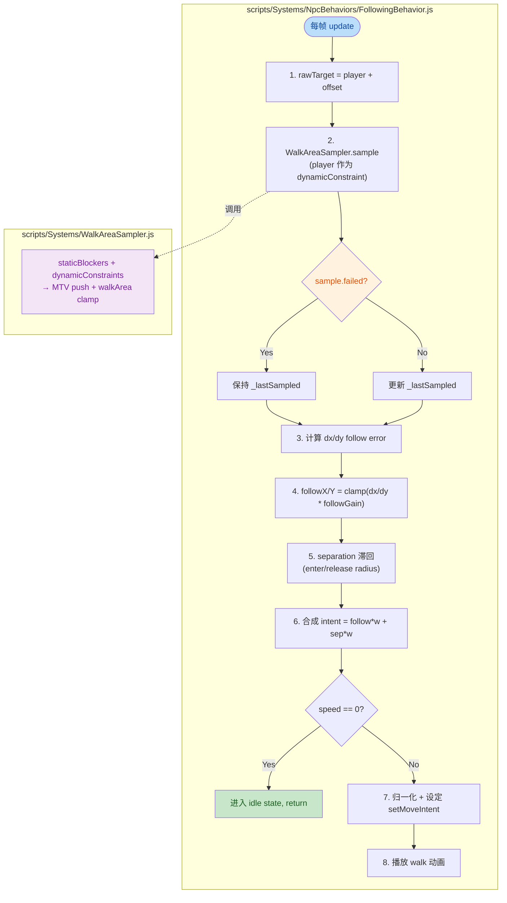
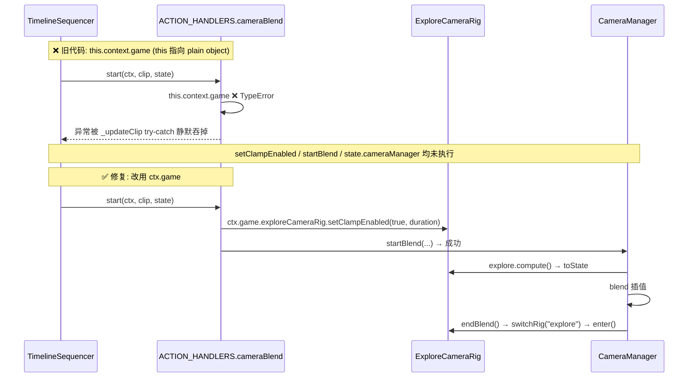

<markdown_report>
## 1. 高层概览 (TL;DR)

*   **影响程度:** 🟡 **Medium-High** — 本次提交对 NPC 伴随行为（Companion Steering）系统进行了较为深入的算法重构，并配套了多项数据/资源更新。
*   **核心改动:**
    *   ✨ **重写 `FollowingBehavior.js`**：从「优先级树」改为「力合成（Steering Force Synthesis）」模型，解决「Wave Bug」（跟随与分离力在 Y 轴形成极限环）。
    *   ✨ **重写 `WalkAreaSampler.js`**：引入「动态跟随约束」概念，新增 `failed` 字段以支持失败时回退到上一采样点，并保持与旧调用方（`ExploreMode`）的向后兼容。
    *   🐛 **修复相机交接 Bug**：在 `TimelineSequencer` 的 `cameraBlend` handler 中，`this.context` 误用导致 `TypeError` 被静默吞掉，相机会停在 scripted rig 的最后位置。
    *   🎨 **新增资源与文档**：为 `longswordman` 角色新增 `inspect` 动作的 Sprite/RootMotion 图集，新增 Skill 文档与 Handoff 交接文档。

---

## 2. 视觉概览 (代码与逻辑地图)

### 2.1 重构后的 NPC 跟随流程

下图展示了 `FollowingBehavior.update` 重构后的核心流程以及它与 `WalkAreaSampler` 的协作关系：



### 2.2 Bug 修复链路（相机交接）



---

## 3. 详细变更分析

### 3.1 🐛 跟随行为算法重构 (`FollowingBehavior.js`)

**位置:** `scripts/Systems/NpcBehaviors/FollowingBehavior.js`

#### 3.1.1 算法范式转变

| 维度 | 🔴 旧版 (优先级树) | 🟢 新版 (力合成) |
|---|---|---|
| 决策模式 | `if movingX` / `if movingY` 互斥分支 | `intent = follow*w + separation*w` 线性叠加 |
| Follow 力 | `Math.sign(dx)` 阶跃式 (`bang-bang`) | `clamp(dx * followGain, -1, 1)` 连续比例 |
| 速度判断 | 仅基于 `absDx` (Y-only 移动时失速) | 基于 `max(absDx, absDy)` |
| Y 抖动抑制 | `followDeadbandY` / `followStopY` 死区 | 速度死区 + 连续 force (无符号翻转) |
| 分离力方向 | 每帧重新计算 `Math.sign(sepDy)` (会振荡) | `_sepDirY` 进入/释放滞回 |

#### 3.1.2 关键 Bug：Wave Bug（极限环）

> 注释原文：*without player-as-constraint, Follow Force and Separation Force would compete for the same point and form a limit cycle (the "wave" bug)*

**根因：**
* 玩家被当作「静态阻挡物 (`staticBlocker`)」处理
* 当玩家处于 walkArea 边界时，原始目标点会被 clamp 到玩家 AABB 上
* Follow 力想靠近玩家，但 Separation 力同时把 NPC 推开
* 两者在 `Math.sign(dy)` 边界反复翻转 → 持续震荡

**修复：**
* 玩家改为 `dynamicConstraints`（动态跟随约束），与 `staticBlockers` 解耦
* Separation 方向用 `_sepDirY` 滞回机制（`enterRadius=0.6`, `releaseRadius=0.72`），方向锁定后不再随 `sepDy` 符号翻转

#### 3.1.3 新增配置项

| 新参数 | 默认值 | 作用 |
|---|---|---|
| `followGain` | `5.0` | 跟随力增益（越大越「硬」，越小越「软」） |
| `followWeight` | `1.0` | 跟随力权重 |
| `separationWeight` | `1.0` | 分离力权重 |
| `separationEnterRadius` | `0.6` | 进入避让的半径（方向锁定） |
| `separationReleaseRadius` | `0.72` | 释放避让的半径（方向解锁） |
| `separationStrength` | `1.4` | 分离力强度系数（>1 更明显避让） |

> 💡 速度范围与旧版保持兼容：`speedMin=0.77`, `speedMax=1.87`, `followStart=0.4`, `followStop=0.1`。

#### 3.1.4 鲁棒性增强

* **`sampled.failed` 回退机制**：当采样失败（例如玩家卡墙 + 大 padding），保持 `_lastSampled` 上一帧目标，避免 NPC 跳到异常位置。
* **新增 `speed===0` 早退保护**：`followGain` 在 `dx=0.05` 时会产生约 `0.25` 的力，导致 `ixRaw !== 0`，若仅靠 `intent===0` 判定无法触发 idle。新增显式 `speed===0` 判定强制进入 idle 状态。

---

### 3.2 🐛 采样器重构 (`WalkAreaSampler.js`)

**位置:** `scripts/Systems/WalkAreaSampler.js`

#### 3.2.1 函数签名变更

```diff
- static sample(x, y, walkArea, blockers, options = {})
+ static sample(x, y, walkArea, staticBlockers, dynamicConstraints, options = {})
```

**向后兼容处理：**
```js
if (dynamicConstraints && !Array.isArray(dynamicConstraints) && typeof dynamicConstraints === "object") {
    options = dynamicConstraints;
    dynamicConstraints = [];   // 旧调用方（ExploreMode）传 options 当作第 5 个参数
}
```

#### 3.2.2 返回值扩展

| 字段 | 旧版 | 新版 |
|---|---|---|
| `x`, `y` | ✅ | ✅ |
| `changed` | ✅ | ✅ |
| `failed` | ❌ | ✅ 新增，标识是否有未解决的阻挡物 |

#### 3.2.3 循环退出条件优化

```diff
- if (!pushed || unresolved) break;
+ if (!pushed) break;
+ if (unresolved) break;   // 分离判断，防止在 unresolved 状态下被 !pushed 误吞掉
```

#### 3.2.4 日志限流

`console.warn` 改为每 500ms 最多输出一次，避免在持续失败场景下刷屏。

---

### 3.3 🐛 相机交接 Bug 修复（来自 `plans/Handoff.MD`）

**位置:** `scripts/Systems/TimelineSequencer.js` L611

**根因:**
* `ACTION_HANDLERS.cameraBlend` 是 `plain object` 上的方法
* `start(ctx, clip, state)` 以普通函数方式被调用，`this` 指向 plain object 而非 `TimelineSequencer` 实例
* `this.context` 为 `undefined` → 抛 `TypeError: can't access property "game"`
* 异常被 `_updateClip` try-catch **静默吞掉** → `setClampEnabled` / `cameraManager.startBlend` / `state.cameraManager` 全部未执行

**修复（一行改动）:**
```diff
- this.context.game?.exploreCameraRig?.setClampEnabled?.(true, clip.durationMs);
+ ctx.game?.exploreCameraRig?.setClampEnabled?.(true, clip.durationMs);
```

> ⚠️ 同一文件 `enter` 方法的硬 clamp 行为已同步修改：把 `#clampCameraPositionHard()` 移出 `if (!seqBusyEnter)` 分支，确保 blend 结束后相机位置立即对齐到 clamped 位置（避免从 blend 终值跳到 desired 位置再慢慢拉回造成的抖动）。

---

### 3.4 📦 配置与数据变更

#### 3.4.1 场景配置 (`Data/SceneDefs/prologue.json`)

| Key | 旧值 | 新值 | 说明 |
|---|---|---|---|
| `camera.orthoWidth` | `24` | `26` | 正交相机宽度增大（视野变宽） |
| `cameraBoundaries[0].maxX` | (无) | `16` | 为 `scenarioMin >= 105` 的边界新增 X 上限 |

#### 3.4.2 新增资源

| 文件 | 类型 | 说明 |
|---|---|---|
| `Art/Sprite/longswordman/longswordman_inspect.json` | Sprite Atlas | 新增 inspect 动作的图集（6 帧 128×128，宽度 768） |
| `Data/RootMotion/longswordman/longswordman_inspect.json` | Root Motion | 对应根运动数据（缺少 rootmotion layer，与 Sprite 文件有 1 行差异） |
| `Art/RawAssets/Env/arrow.ase` | Binary | 资源更新（具体差异不可读） |
| `Art/RawAssets/Env/floor.kra` | Binary | 资源更新（具体差异不可读） |
| `Art/RawAssets/Env/treeline_pine.kra` | Binary | 资源更新（具体差异不可读） |

#### 3.4.3 新增文档

| 文件 | 说明 |
|---|---|
| `.trae/skills/collider-occupancy-更新-skill/SKILL.md` | 碰撞盒/占用盒更新工作流 Skill，区分战斗角色（`extract_collision_boxes.ps1`）和 NPC（`extract_rootmotion_occupancy.ps1`）两条路线 |
| `plans/Handoff.MD` | 相机交接 Bug 的完整诊断与修复交接文档（306 行） |

---

## 4. 影响与风险评估

### 4.1 ⚠️ 破坏性变更 (Breaking Changes)

| 影响面 | 风险等级 | 说明 |
|---|---|---|
| `WalkAreaSampler.sample` 签名 | 🟡 低 | 新增 `dynamicConstraints` 参数；旧调用方若把 `options` 误传为 `dynamicConstraints`，会被自动降级为 options，**行为兼容** |
| `FollowingBehavior` 内部状态 | 🟢 低 | `_sepDirY` 初始值从 `1` 改为 `0`（需触发进入条件才锁定方向），新行为更安全 |
| `FollowingBehavior` 行为可观察变化 | 🟡 中 | 跟随响应从「阶跃」变「连续」，AI 表现会有明显差异——特别是在 `dx` 较小时，旧版可能停止移动，新版仍会缓慢移动直到 `speed===0` 触发 |
| 配置默认值 | 🟢 低 | `separationStrength` 从 `1.0` 升到 `1.4`，Y 方向避让更明显 |

### 4.2 ✅ 行为改进

* 解决了 Charlotte（NPC）跟随玩家时的「Wave Bug」——Y 轴持续震荡
* 解决了 Y-only 移动时 Charlotte 失速问题（使用 `max(absDx, absDy)` 速度算法）
* 解决了 sample 失败时 NPC 跳到异常位置的问题（保持 `_lastSampled`）
* 解决了 intro/flee 序列播完后相机不切换到 explore rig 的问题

### 4.3 🧪 测试建议

| 场景 | 预期表现 |
|---|---|
| 玩家水平移动，NPC 在右后方 | NPC 平滑向右靠近，无 Y 抖动 |
| 玩家卡在 walkArea 边界，NPC 想靠近 | NPC 应被 separation 推开到 Y 方向，不应持续震荡 |
| 玩家只做 Y 轴移动（垂直方向），NPC X 已对齐 | NPC 应跟随 Y 方向移动（`maxAbs` 速度算法） |
| 玩家贴着静态阻挡物，NPC 想跟到玩家 AABB 边缘 | 采样 `failed=true`，NPC 保持上一帧目标 |
| `prologue_intro.json` 播放完毕 | 相机应正确切到 explore rig 并应用 boundary clamp |
| `prologue_cs_rabble_flee.json` 播放完毕 | 相机应平滑过渡到 explore rig，不停在 scripted rig 位置 |
| inspect 动作（`longswordman_inspect`） | 应能正常播放 6 帧动画，根运动正确应用 |

### 4.4 🧹 待清理项

* `plans/Handoff.MD` 中提到的 `[ExploreCam]` 诊断 log 是临时的，应移除或改为 verbose 级别
* 建议审查 `ACTION_HANDLERS` 其他 handler 是否还有 `this.context` / `this.xxx` 误用（这是同类 bug 的高发地）
* BACKLOG 中 `prologue_cs_rabble_flee.json` 摄像机在 `t=2000-5500` 期间的 jitter 是**不同问题**（flee 期间，非 flee 结束），与本次修复无关，保留待查