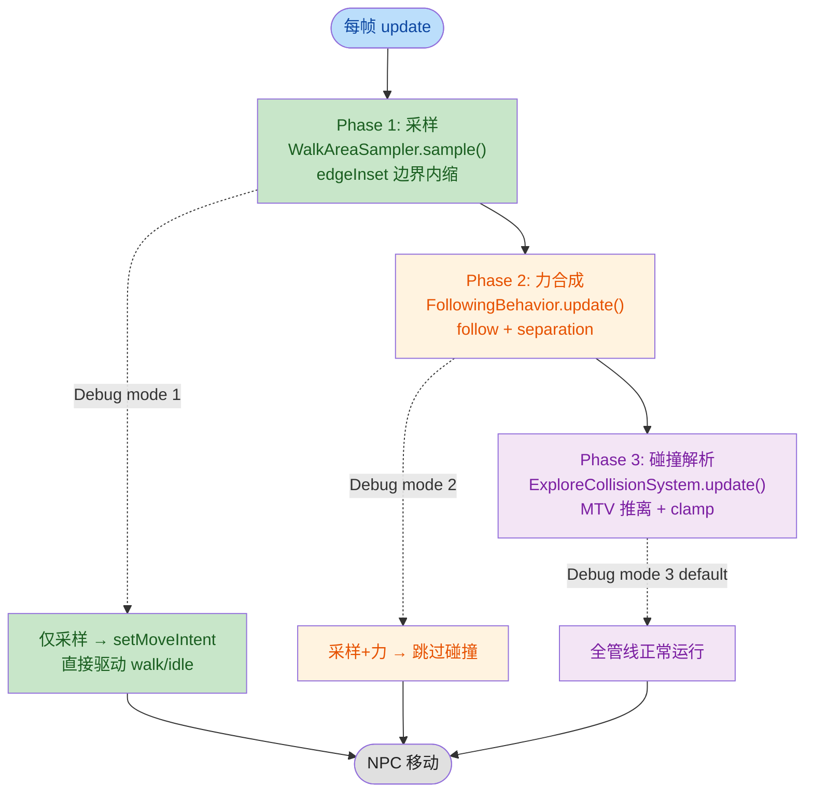
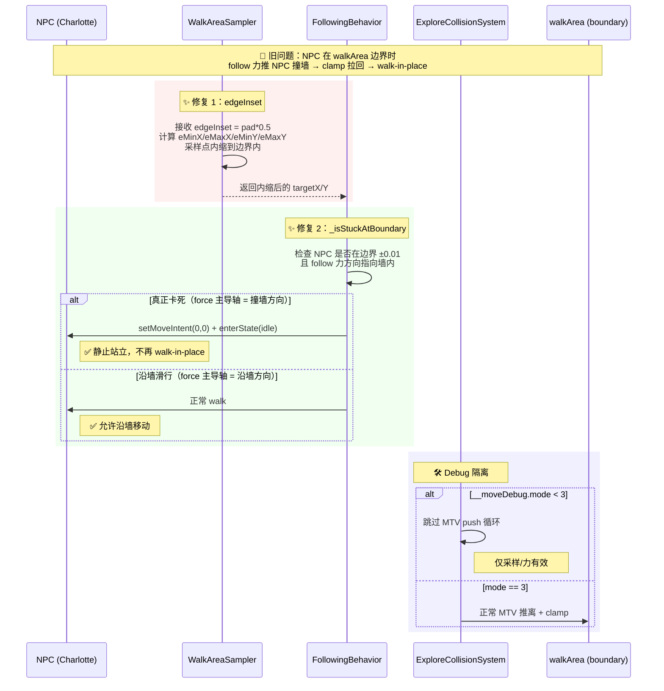
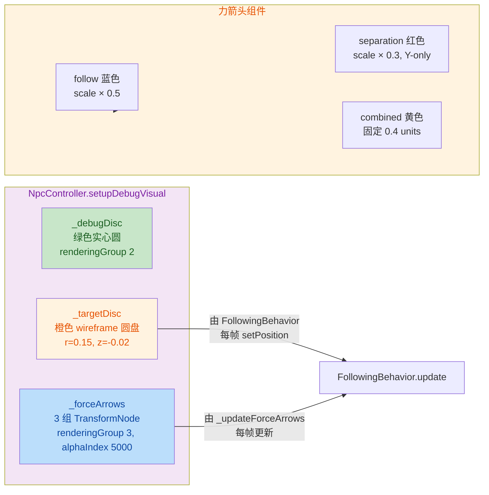

## 1. 高层摘要 (TL;DR)

*   **影响范围：** 🟡 **中等** — 核心改动集中在 NPC 跟随行为管线（采样 / 力合成 / 碰撞三阶段），同时新增调试可视化、新增长剑兵 `inspect` 动画资源与相关文档。
*   **核心修改：**
    *   🐛 修复 **"角落卡死"（walk-in-place）** 缺陷：NPC 到达 `walkArea` 边界时不再播放走路动画却原地不动。
    *   🛠️ 引入 **分阶段调试框架**（`globalThis.__moveDebug.mode`），可在控制台切换 Phase1 / Phase2 / Phase3 隔离运行。
    *   🎨 新增调试可视化：橙色采样目标圆盘 + 蓝/红/黄力学箭头（follow / separation / combined）。
    *   ✨ 新增长剑兵 `inspect` 动画资源 + 碰撞 / 根运动刷新流程文档。

---

## 2. 可视化概览（逻辑流图）

### 2.1 移动管线三阶段架构



### 2.2 角落卡死修复原理



### 2.3 调试可视化资产布局



---

## 3. 详细变更分析

### 3.1 🎯 跟随行为核心（FollowingBehavior.js）

| 变更点 | 说明 |
|---|---|
| **采样边界内缩（edgeInset）** | 调用 `WalkAreaSampler.sample()` 时新增 `edgeInset: padX/Y * 0.5`，采样点永远不落在 `walkArea` 边界上，从源头避免"卡边界"。 |
| **分阶段调试模式（Phase 1）** | `dbgMode === 1` 时：直接用采样点归一化方向驱动 `setMoveIntent`，跳过力合成与碰撞；进入 `walk` / `idle` 状态机；填充 `_debugData`。 |
| **方向箭头显示（Phase 1）** | 复用 `_updateForceArrows()`，把归一化后的采样方向绘制为蓝色 follow 箭头。 |
| **力可视化（正常模式）** | 在 `ixRaw/iyRaw` 计算之后调 `_updateForceArrows()`，传入 follow / separation / combined 三个分量。 |
| **角落卡死检测 `_isStuckAtBoundary()`** | 新增方法：若 NPC 处于边界 ±0.01 内 **且** 主轴力指向墙内（`absFx >= absFy` 或 `absFy >= absFx`），则切换到 `idle` 状态。沿墙滑行（主轴力平行于墙）不触发。 |
| **代码清理** | 删除过时的注释段（pure Y 移动说明、speed=0 提前返回的旧注释），行为不变。 |

> 关键算法 — 卡死判定：
> ```js
> if ((atLeft  && ixRaw < 0) || (atRight && ixRaw > 0)) {
>     if (absFx >= absFy) return true;  // 撞墙 → stuck
>     // 沿墙滑行 → 允许
> }
> if ((atBottom && iyRaw < 0) || (atTop && iyRaw > 0)) {
>     if (absFy >= absFx) return true;  // 撞墙 → stuck
> }
> ```

### 3.2 🛠️ 采样器（WalkAreaSampler.js）

| 变更点 | 说明 |
|---|---|
| **新增 `edgeInset` 选项** | `options.edgeInset ?? 0`；当 `> 0` 时计算 `eMinX/MaxX/MinY/MaxY`，所有 clamp 点（初始 / 单方向预览 / 最终）都使用内缩后的边界。 |
| **NaN 哨兵初始化** | `eMinX = NaN, eMaxX = NaN, eMinY = NaN, eMaxY = NaN`：在 `walkArea` 为 null 时这些值永不被读取（已有 `if (walkArea)` 保护），NaN 让意外访问立即可见。 |
| **inset 边界防过界** | `insX = min(edgeInset, (maxX - minX) * 0.5)`：避免 inset 超过区域一半时反向收缩。 |

### 3.3 🎨 调试可视化（NpcController.js）

| 元素 | 几何 | 颜色 | 渲染层 | 更新方 |
|---|---|---|---|---|
| `_targetDisc` | `Disc r=0.15`, `tessellation=16`, 双面, 旋转 π/2 | 橙 `(1.0, 0.55, 0.0)` wireframe α=0.85 | `renderingGroupId=2`, `z=-0.02` | `FollowingBehavior.update()` 每帧 setPosition |
| `_forceArrows.follow` | Box shaft + Cylinder tip | 蓝 `(0.1, 0.3, 1.0)` 自发光 | group 3, alphaIndex 5000 | `_updateForceArrows()` |
| `_forceArrows.separation` | 同上 | 红 `(1.0, 0.2, 0.2)` 自发光 | group 3, alphaIndex 5000 | 同上 |
| `_forceArrows.combined` | 同上 | 黄 `(1.0, 0.9, 0.1)` 自发光 | group 3, alphaIndex 5000 | 同上 |

> **新增字段：** `this._debugVisible = true`（默认可见），`setDebugVisible(value)` 同时控制 disc 和 arrows（仅在 `state === "following"` 时显示 arrows）。

### 3.4 🐞 碰撞系统（ExploreCollisionSystem.js）

*   在 MTV push 循环外层包了 `if (dbgMode >= 3)` 守卫。
*   当 `__moveDebug.mode < 3`（即 mode 1 或 2）时，**完全跳过碰撞解析**。
*   `walkArea` clamp 仍保留 — 调试模式下不破坏边界保护。
*   内部缩进调整（4 → 5 层）以保持逻辑块结构清晰。

### 3.5 🎮 调试控制台 API（Game.js）

| API | 行为 |
|---|---|
| `globalThis.__moveDebug = { mode: 3 }` | 初始化（默认 Full pipeline） |
| `debug.setMoveMode(1)` | Phase1-only：采样→setMoveIntent，**跳过** 力合成与碰撞 |
| `debug.setMoveMode(2)` | Phase1+2：采样+力合成，**跳过** 碰撞解析 |
| `debug.setMoveMode(3)` | Full pipeline（默认） |
| `debug.getMoveMode()` | 返回 `{ mode, label }` 并打印 |

> 启动横幅追加 4 行新指令提示，方便开发者直接控制台切换。

### 3.6 🗺️ 场景配置（Data/SceneDefs/prologue.json）

| 字段 | 旧值 | 新值 | 影响 |
|---|---|---|---|
| `camera.orthoWidth` | `24` | `26` | 视口略宽，约 +8% 视野 |
| `cameraBoundaries[0].maxX` | *(未设)* | `16` | scenario ≥ 105 时相机右边界限制 |

> 配合 `boundary.minX=-32, minY=-2.56` 和 `orthoWidth=26`（halfWidth=13），相机右移上限从 0.7 附近扩展到约 -16（仍受 maxX=16 约束）。

### 3.7 🎨 美术资源

| 文件 | 类型 | 说明 |
|---|---|---|
| `Art/RawAssets/Env/arrow.ase` | 二进制 | Aseprite 源文件更新（具体内容不可读） |
| `Art/RawAssets/Env/floor.kra` | 二进制 | Krita 源文件更新 |
| `Art/RawAssets/Env/treeline_pine.kra` | 二进制 | Krita 源文件更新 |
| `Art/Sprite/longswordman/longswordman_inspect.json` | 新增 | 6 帧 128×128 sprite atlas，总宽 768×128，frame 时长 100/100/200/200/1500/100 ms |
| `Data/RootMotion/longswordman/longswordman_inspect.json` | 新增 | 与 sprite 同结构，缺一层 `rootmotion`（可能后续手动补） |

### 3.8 📚 文档与 Skill

*   **`.trae/skills/collider-occupancy-更新-skill/SKILL.md`（新增）** — 完整记录两条碰撞刷新路径（战斗角色 `.collider.json` / NPC `.occupancy.json`），含 PowerShell 单条 / 批量命令模板、目录约定、颜色规范、常见问题排查。
*   **`plans/Handoff.MD`（新增，306 行）** — 详细的相机 blend 修复交接文档。涵盖：
    *   已落地的 `setClampEnabled` weight 机制。
    *   回归问题（intro 结束相机不动 / flee 结束相机停 enemy_1）根因。
    *   关键一行修复 `this.context.game` → `ctx.game`（handler 内 this 绑定错误）。
    *   flee 结束抖动修复（`#clampCameraPositionHard()` 提到 `if` 外面）。

---

## 4. 影响 & 风险评估

### 4.1 ⚠️ 破坏性变更
*   **无对外 API 破坏**。`globalThis.__moveDebug` 为新增全局对象，默认 mode=3 行为与原版一致。
*   **NPC 行为变化**：`edgeInset = padX/Y * 0.5` 使采样点主动内缩，对外表现为 NPC 跟随距离在边界附近略有"保守" — 玩家感受上更稳定，但边界附近 NPC 不会"贴边站"。

### 4.2 🐛 潜在风险

| 风险 | 描述 | 缓解 |
|---|---|---|
| 调试模式遗留 | `__moveDebug` 全局变量若上线未移除，可能在用户控制台看到 `[debug]` 输出 | 模式 3 与原行为完全一致；正式版应清理或加 `__DEV__` 守卫 |
| 诊断 log 残留 | `Handoff.MD` 提到 ExploreCameraRig 入口有临时 log | 已记录需清理 |
| 角落判定边界值 | `_isStuckAtBoundary` 阈值 `tol=0.01` 可能因帧率波动误判 | 实测中可调，建议留 backlog |
| longswordman inspect 资源 | 缺一层 `rootmotion`（与 sprite 相比），可能为绘制遗漏 | 后续手动补帧或重新导出 |

### 4.3 🧪 测试建议

*   ✅ **核心场景回归**：
    *   测试 Charlotte（companion NPC）在 prologue 边界处跟随玩家来回移动 — 验证无 walk-in-place。
    *   测试玩家紧贴 walkArea 上边界时 Charlotte 是否正确切到 idle。
    *   测试玩家在 walkArea 中央移动时 Charlotte 正常跟随（force 主导轴不为撞墙方向）。
*   ✅ **调试控制台**：
    *   `debug.setMoveMode(1)` → NPC 应直接朝采样点走，无碰撞阻挡。
    *   `debug.setMoveMode(2)` → NPC 可重叠穿模（因为跳过 MTV push）。
    *   `debug.setMoveMode(3)` → 完全正常模式。
*   ✅ **可视化**：
    *   检查 X 键切换 `_debugVisible` 时 disc + arrows 同时显隐。
    *   检查 entering `following` 状态时 targetDisc 显示；切回 idle 时隐藏。
*   ✅ **场景配置**：
    *   prologue 第 105 个 scenario 之后，相机右边界是否正确限制在 `maxX=16`。
    *   视口略宽（24→26）是否影响 UI/HUD 布局。
*   ✅ **资源完整性**：
    *   长剑兵 `inspect` 动画播放流畅度、根运动是否正确叠加。

### 4.4 📋 关键文件清单

| 文件 | 类型 | 备注 |
|---|---|---|
| `scripts/Systems/NpcBehaviors/FollowingBehavior.js` | 核心 | 改动最多（+200 行） |
| `scripts/Systems/WalkAreaSampler.js` | 核心 | 新增 edgeInset |
| `scripts/Systems/ExploreCollisionSystem.js` | 核心 | 加 mode 守卫 |
| `scripts/Systems/NpcController.js` | 核心 | 新增 _targetDisc / _forceArrows |
| `scripts/Game.js` | 入口 | 新增 debug API |
| `Data/SceneDefs/prologue.json` | 数据 | orthoWidth / boundary |
| `plans/Handoff.MD` | 文档 | 新增 306 行 |
| `.trae/skills/collider-occupancy-更新-skill/SKILL.md` | 文档 | 新增 Skill |
| `Art/Sprite/longswordman/longswordman_inspect.json` | 资源 | 新增 sprite atlas |
| `Data/RootMotion/longswordman/longswordman_inspect.json` | 资源 | 新增 root motion |
| `Art/RawAssets/Env/arrow.ase` / `floor.kra` / `treeline_pine.kra` | 二进制 | 仅变更 |