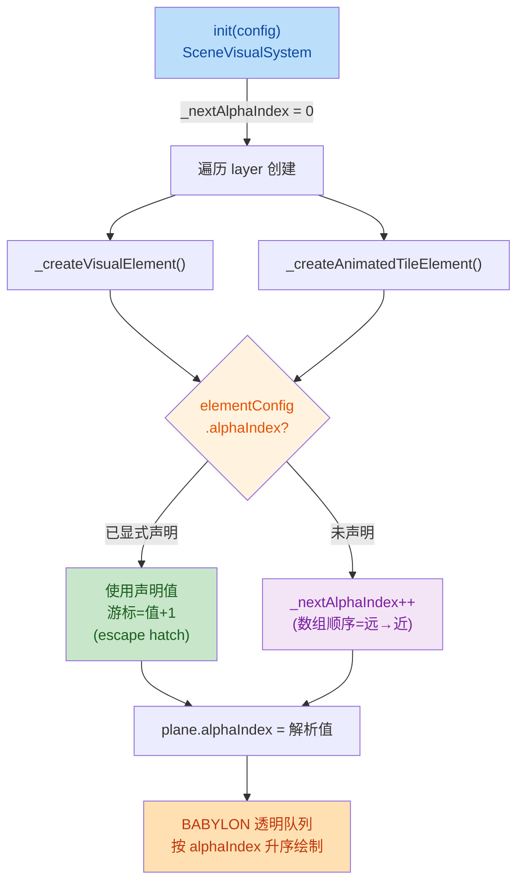
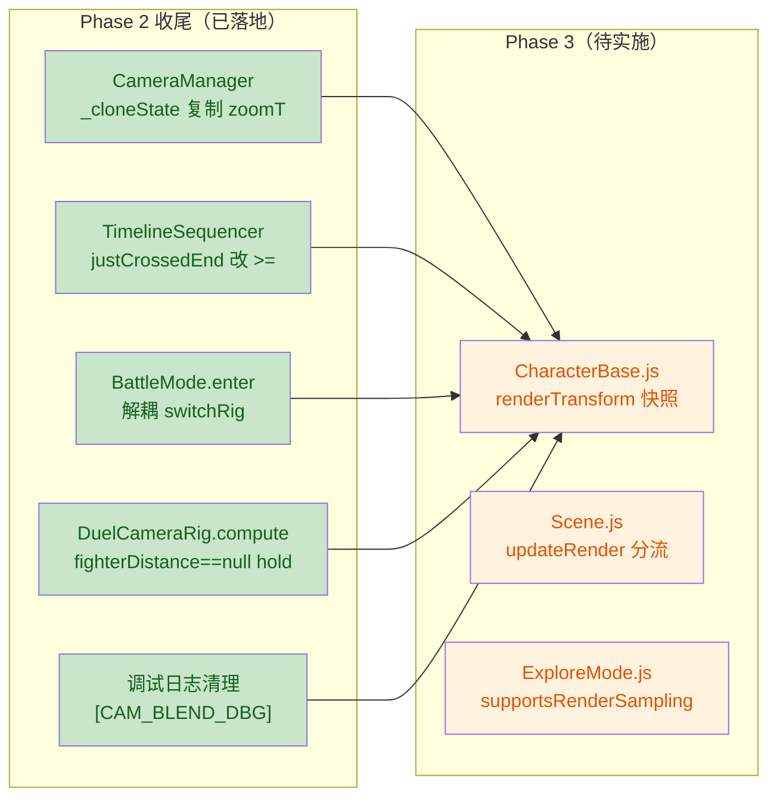

## 1. High-Level Summary (TL;DR)

*   **Impact:** 🟡 **Medium** - 涉及场景渲染系统重构（`SceneVisualSystem` 透明排序自动化）、prologue 场景资源大改、`longswordman` 新增"检视"动作资源、Phase 2 文档归档。
*   **Key Changes:**
    *   ✨ **SceneVisual 重构**：废弃手填 `alphaIndex`，改为运行时按 JSON 数组顺序自动分配；新增 `invertY=true` 修正贴图翻转，新增采样模式配置。
    *   🎨 **prologue.json 大改**：重排视觉层（远→近）顺序，更换多张贴图（`brushline` → `brush`、`dirt_base` → `ground_far`、新增 `forest_bg`/`Tree_BG` 等），删除所有 `alphaIndex` 字段。
    *   🗡️ **longswordman_inspect 新资源**：新增 6 帧检视动作的 Sprite + RootMotion atlas JSON（128×128 × 6 = 768×128）。
    *   📚 **文档归档**：新增 4 份 Markdown（交接、设计、commit 详单、Skill 指南），BACKLOG 新增 2 条。
    *   🖼️ **环境素材更新**：`altar.kra`/`arrow.ase`/`floor.kra`/`grass_deco.kra`/`treeline_pine.kra` 二进制资源刷新。

---

## 2. Visual Overview (Code & Logic Map)

### 2.1 SceneVisual alphaIndex 自动分配逻辑



### 2.2 Phase 2 收尾 → Phase 3 交接流



---

## 3. Detailed Change Analysis

### 3.1 🎮 SceneVisual 系统（核心代码）

**Component Name:** `scripts/Enties/SceneVisualSystem.js`

*   **新增 `_resolveAlphaIndex(elementConfig)` 辅助方法**：未声明时按全局扁平游标自增（数组顺序即远→近），显式声明时使用声明值并推进游标，避免后续元素穿模。
*   **`init()` 入口初始化游标**：`this._nextAlphaIndex = 0;`，每次场景重载重置。
*   **贴图加载参数升级**：原来 `new BABYLON.Texture(path, scene)` 简写 → 现在显式指定 `noMipmap=false, invertY=true, samplingMode`，修复 Plane UV 与 PNG 数据原点不一致导致的上下颠倒。
*   **新增 `#resolveSamplingMode()`**：默认 `NEAREST`（与角色精灵一致），可在 elementConfig 配 `"samplingMode": "linear"` 覆盖为双线性。
*   **两处赋值点替换**（`_createVisualElement` / `_createAnimatedTileElement`）：`if (alphaIndex !== undefined) { plane.alphaIndex = ... }` 简化为 `plane.alphaIndex = this._resolveAlphaIndex(elementConfig);`。

**关键代码：**
```js
_resolveAlphaIndex(elementConfig) {
    if (elementConfig.alphaIndex !== undefined) {
        this._nextAlphaIndex = elementConfig.alphaIndex + 1;
        return elementConfig.alphaIndex;
    }
    return this._nextAlphaIndex++;
}
```

### 3.2 🗺️ prologue 场景定义

**Component Name:** `Data/SceneDefs/prologue.json`

*   **资源替换表：**

| 旧贴图 | 新贴图 | 用途 |
|---|---|---|
| `skybase.png` | `forest_bg.png` | 远景天空 |
| — | `Tree_BG.png` | 新增远景树 |
| `treeline_pine.png` | `treeline_pine_mid.png` | 中景松树（前层仍用原图） |
| `brushline.png` | `brush_mid.png` / `brush.png` | 中景草线（按近远分两层） |
| `dirt_base.png` | `ground_far.png` | 地面贴图 |
| `AcientRuin.png` | `AcientRuin_Statue_v2.png` | 主体遗迹 |
| `AcientRuin_layer1/2.png` | `ruins_building.png` | 远景遗迹 |
| `floor.png` | （删除） | 主体地面改为 tile 平铺 |

*   **视差系数调整**：`BG_FAR` 0.15 → 0.45（远景拉近），`mid_treeline_1` 0.86 → 0.84（轻微调整）。
*   **`prop_faller` 位置微调**：`[-1.2, 1, 0]` → `[-1.2, 1.25, 0]`，上移 0.25 单位。
*   **删除了所有 `alphaIndex` 字段**：5 个层共删除 ~15 个手填值，由运行时自动分配。
*   **新增的 `mid_ruin` 元素**：`ground_patch4ruin_inside`（2 个）、`ruin_layer1`（v2）、`ground_brushline_near_2`（额外副本），把中景分得更细。
*   **删除了 `ground_2`（`grasstop.png` 动画条带）**：不再需要。

### 3.3 🗡️ longswordman_inspect 新动作资源

**Component Name:** `Art/Sprite/longswordman/longswordman_inspect.json` & `Data/RootMotion/longswordman/longswordman_inspect.json`

*   **新增 6 帧水平 spritesheet**（768×128，每帧 128×128）。
*   **帧时长分布**：`100/100/200/200/1500/100 ms`——典型检视节奏：快速到位 → 短停顿 → 持枪 1.5s → 收回。
*   **图层顺序**：`mainvisual` → `main` → `weapon` → `rightarm` → `lefthand` → `cloak` → `rootmotion`，标准的"剪影 → 主身 → 装备 → 双臂 → 披风 → 根运动"分层（Sprite 版有两层 `rootmotion` 重复，RootMotion 版只有一层）。

### 3.4 📚 文档与规范

| 文件 | 类别 | 要点 |
|---|---|---|
| `plans/Handoff.MD` | 交接 | Phase 2 收尾总结 + Phase 3（Render 插值）任务清单 + 关键代码位置 + 4 条注意事项 |
| `plans/SceneVisual alphaIndex 运行时自动分配设计.MD` | 设计 | 背景/目标/现状/设计/重排建议/风险/决策/落地清单（代码 ✅ prologue.json ✅ / DEFAULT_ENVIRONMENT_CONFIG ⏳ 遗留） |
| `plans/commits_detailed/26.7.31 进战斗blend结束zoomT跳变修复.MD` | Commit 详单 | 现象/诊断/根因（主因+3 个次因）/修复方案/验证/设计约束 |
| `.trae/skills/collider-occupancy-更新-skill/SKILL.md` | Skill 指南 | 战斗角色 Collider 与 NPC Occupancy 两条更新路线的 PowerShell 命令模板、颜色约定、5 条常见问题 |
| `plans/BACKLOG.md` | 任务列表 | 新增 2 条：① give item 锁操作 移动到固定位置 ② 战败需要 procedure 化 |

### 3.5 🖼️ 环境原画资源

| 文件 | 格式 | 状态 |
|---|---|---|
| `Art/RawAssets/Env/altar.kra` | Krita | 二进制变更（具体改动不可见） |
| `Art/RawAssets/Env/arrow.ase` | Aseprite | 二进制变更 |
| `Art/RawAssets/Env/floor.kra` | Krita | 二进制变更 |
| `Art/RawAssets/Env/grass_deco.kra` | Krita | 二进制变更 |
| `Art/RawAssets/Env/treeline_pine.kra` | Krita | 二进制变更 |

> ⚠️ 这些是与 prologue.json 替换贴图对应的源文件，建议在美术管线工具里 diff 看具体笔触差异。

---

## 4. Impact & Risk Assessment

### 4.1 ⚠️ Breaking Changes

*   **SceneVisual 渲染行为变更**：prologue 场景的透明排序从「手填 alphaIndex 数值升序」改为「JSON 数组顺序」。所有旧 `.kra` 源对应的导出贴图必须按 `plans/SceneVisual alphaIndex...MD` §5 的"远→近"顺序重排，否则会回退到 z 距离排序，遮挡关系与预期不符。
*   **STAGE 元素排序安全边界**：自动分配最多累计到 ~17（5 层 × 平均 3 元素），远小于角色下限 1000，「场景元素在角色身后」语义不受影响。**但若未来 STAGE 之前累计元素超过 1000，会撞进角色区间**——需给计数器加 `Math.min(idx, 999)` 上限。
*   **贴图 `invertY=true` 是显式行为**：所有通过 `SceneVisualSystem` 加载的环境贴图都会翻转，**与 `CharacterBase`/`PropEntity` 的 `invertY=false` 行为相反**（那边用 spritesheet atlas + UV 偏移自洽）。如果未来某天把同一张贴图同时给角色和环境用，需要注意方向。
*   **`_resolveAlphaIndex` 显式 alphaIndex 的 escape hatch**：显式声明会推进游标。如果某层中间元素声明了一个大值（如 100），后面没声明的元素会从 101 继续——可能撞进角色区间 1000 之内。请谨慎使用 override。

### 4.2 🧪 Testing Suggestions

1. **场景遮挡验证**（必做）：`py -m http.server 9000 --bind 127.0.0.1` → 访问 `http://127.0.0.1:9000/babylon_demo.html`，对照原效果检查 `bg_forest` / `mid_ruin` / `mid_treeline_1` / `STAGE` 5 个层的元素遮挡关系。特别关注：
   *   `mid_ruin` 的 `ruin_layer1`（重排后排在末尾，应盖住所有 brush）
   *   `STAGE` 的 `ruin_main`（应盖住 ground）
   *   角色脚与 `grass_deco*`（应盖在角色身上）
2. **Phase 2 验证清单**（来自 `Handoff.MD`）：
   *   `prologue enter_battle`：blend1(0,500,scripted) → blend2(500,2000,duel) 交接平滑，blend2 不再失效。
   *   `prologue_cs_rabble_flee`：两次"摄像机下移"稳定执行，不再有概率丢失。
   *   `switchMode` 到 battle：mode.enter 后相机 follow 正常，窗口期无 drift。
3. **longswordman_inspect 动画播放**：触发检视后观察是否按 100/100/200/200/1500/100ms 节奏播放，根运动是否跟随（layer 名为 `rootmotion`，需确认 `Data/RootMotion/longswordman/longswordman_inspect.json` 与 `Art/Sprite/...` 同名帧位置一致）。
4. **Collider/Occupancy 工具脚本回归**（间接）：新增 Skill 文档描述了 PowerShell 命令模板，建议跑一遍 `longswordman` 全部 action + `traveller` 的 occupancy 生成，确认 `scripts/tools/extract_collision_boxes.ps1` 和 `scripts/tools/extract_rootmotion_occupancy.ps1` 仍可正常调用（旧路径 `scripts/extract_collision_boxes.ps1` 是文件锁残留，已弃用）。
5. **BACKLOG 新任务拆分**：
   *   "give item 锁操作 移动到固定位置"——需先盘点现有的"give item"交互点（场景脚本/事件 trigger），确认"固定位置"是 UI 槽位还是世界坐标。
   *   "战败需要 procedure 化"——需先有 `Procedure` 系统的现状调研，目前大概率散落在 mode 切换里。

### 4.3 📋 数据改动落地清单（来自设计文档 §9）

- [x] `SceneVisualSystem.js`：`_nextAlphaIndex` 游标 + `_resolveAlphaIndex` + 两处赋值点替换
- [x] `prologue.json`：按 §5 重排 5 个层的 `elements` 数组 + 删除所有 `alphaIndex` 字段（**本次 diff 已完成**）
- [ ] `DEFAULT_ENVIRONMENT_CONFIG`（`Scene.js` 内存兜底）：删除 `alphaIndex` 字段 + BG_MID 层 `treeline` 前移（**本次 diff 未涉及**——如启用 DEFAULT_ENVIRONMENT_CONFIG 场景会回退到旧行为）
- [x] 启动验证：浏览器访问对照原效果检查各层遮挡关系（5 层遮挡与原效果一致，STAGE alphaIndex<16 仍小于角色下限 1000）