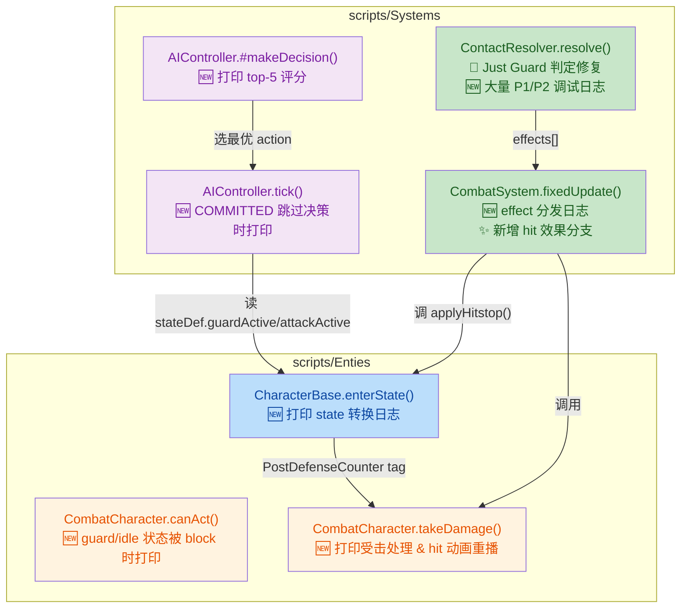
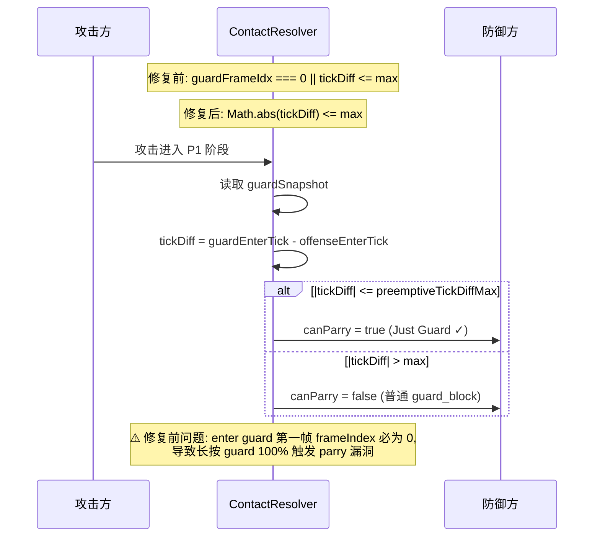

## 1. 高级摘要 (TL;DR)

*   **影响等级：⚡ 中高** — 本次提交围绕"**Nachschlag（反击）机制**"展开，新增了大量调试日志、修复了一处 **Just Guard parry 漏洞**、补全了普通 `hit` 的 hitstop 效果，并新增了 longswordman 的反击动作雪碧图与配套文档。
*   **主要变更**：
    *   🐛 **修复 Just Guard 漏洞**：`ContactResolver.js` 的 `isPreemptiveGuard` 判定由 `guardFrameIdx === 0 || tickDiff <= max` 改为 `Math.abs(tickDiff) <= max`，防止"长按 guard → 100% parry"。
    *   ✨ **普通 hit 效果补全**：`CombatSystem.js` 新增 `hit` 效果分支，给攻击者与被击者双方各加 8 帧 `hitstop`。
    *   🛠️ **大量 debug 埋点**：在 `CharacterBase / CombatCharacter / AIController / CombatSystem / ContactResolver` 全链路添加 `[nachschlag-dbg]` 日志。
    *   🎨 **新增资产**：`longswordman_nachschlag` 雪碧图（5 帧）+ `nachschlag.json` atlas。
    *   📄 **新增文档**：`plans/Handoff.MD`（交接记录）、`.trae/skills/collider-occupancy-更新-skill/SKILL.md`（碰撞盒更新指南）。

---

## 2. 可视化总览（代码 & 逻辑图）

### 2.1 战斗判定全链路（含 debug 埋点）



### 2.2 Just Guard 判定修复（关键 Bug 修复）



---

## 3. 详细变更分析

### 3.1 🐛 Combat 判定修复 — `scripts/Systems/ContactResolver.js`

#### Just Guard 漏洞修复
*   **位置**：`ContactResolver.js` 第 109-118 行
*   **旧逻辑**：
    ```js
    const isPreemptiveGuard = guardFrameIdx === 0 || tickDiff <= this.tuning.parry.preemptiveTickDiffMax;
    ```
*   **新逻辑**：
    ```js
    const isPreemptiveGuard = Math.abs(tickDiff) <= this.tuning.parry.preemptiveTickDiffMax;
    ```
*   **根因**：`animation.play(restart: true)` 之后 `frameIndex` 一定是 0，**不管距离进入 guard 状态过了多久**，兜底条件都成立 → 玩家长按 guard 可 100% 触发 parry。
*   **效果**：现在严格按"双方进入 committed 状态的时间差绝对值"判断。

#### 调试日志全面铺设
*   在 `resolve()` 增加 `_dbg = !!context.debugTrace` 开关。
*   关键节点均加 `[nachschlag-dbg] P1/P2 tick=...` 日志：
    *   P1 guard 命中 / Just Guard / 普通 guard_block 全路径
    *   P2 contact 跳过原因（dodgeActive / dedupe / invalidated）
    *   P2 hit 触发的 `HIT-FIRE` 行
*   `effects.push()` 改为使用 `type: "hit"`（见 3.3）。

---

### 3.2 ✨ 普通 Hit 效果补全 — `scripts/Systems/CombatSystem.js`

| 项 | 变更前 | 变更后 |
|---|---|---|
| `hit` 效果处理 | ❌ 无独立分支，走兜底 `takeDamage` | ✅ 新增独立 `if (effect.type === "hit")` 分支 |
| 攻击者 hitstop | ❌ 无 | ✅ 通过 `attackerId` 查找并 `applyHitstop(hitstopFrames)` |
| 被击者 hitstop | ❌ 无 | ✅ `target.applyHitstop(hitstopFrames)` |
| 帧数来源 | — | `CombatTuning.hit.hitstopFrames`（默认 8） |
| `defenseSuccess` durationFrames | 在 if/else 内重复计算 | ✅ **提到外层共享**，消除重复 |

**配套配置变更**（`Data/CombatTuning.js`）：
```js
hit: {
    victimKnockbackX: 0.12,
+   hitstopFrames: 8,    // 🆕 普通 hit 双方 hitstop
    freezeImpactFrames: 24,
}
```

---

### 3.3 🛠️ 调试埋点矩阵（Debug Instrumentation）

| 文件 | 关键方法 | 新增日志内容 |
|---|---|---|
| `CharacterBase.js` | `enterState()` | 状态转换 `prev → next`，含 tick/serial/pendingCounter/tags |
| `CombatCharacter.js` | `canAct()` | 仅在 `guard/idle` 状态 + 有 command 时打印 blocked |
| `CombatCharacter.js` | `takeDamage()` | invincible 拦截、HP 变化、hit 重播、enterState 跳转 |
| `CombatCharacter.js` | `triggerCooldown()` | `oldState → idle` 触发时打印（含 `debugTrace` 开关） |
| `AIController.js` | `tick()` | `COMMITTED` 跳过决策时打印 stateDef 各项 active 标记 |
| `AIController.js` | `#makeDecision()` | top-5 评分打印 + 最终 SELECT 决策 |
| `CombatSystem.js` | `fixedUpdate()` | effects 全列表 + APPLY 详情 + 兜底/未知 type 标记 |
| `ContactResolver.js` | `resolve()` | P1 拦截 / Just Guard / P2 dedupe / HIT-FIRE 全打印 |

---

### 3.4 🎨 Cooldown 触发条件扩展 — `scripts/Enties/CombatCharacter.js`

| 旧条件 | 新条件 |
|---|---|
| `oldStateDef?.attackActive === true` | `attackActive === true`<br/>**OR** `guardActive === true`<br/>**OR** `oldState === "hit"` |
| 仅 attack → idle 触发 cooldown | **attack / guard / hit → idle** 都会触发 |

*   **目的**：guard 解除后也有冷却，避免 AI 100% 连续 guard。
*   `wasCommittedState` 局部变量新增，但实际判断仍用原内联条件（重复定义 `wasCommittedState` 变量**未被使用**——见 4.2 风险评估）。

#### Hit 动画重播
*   **位置**：`takeDamage()` 第 221-228 行
*   **行为**：若角色**已经在 `hit` 状态**，调用 `this.animation.play(this.currentStateDef.clip, { restart: true })` 重播 hit 动画，视觉上表示"又挨了一下"。

---

### 3.5 🎨 新增资产

#### `Art/Sprite/longswordman/longswordman_nachschlag.json`
*   **用途**：longswordman 反击动作（nachschlag）的雪碧图 atlas。
*   **规格**：5 帧 × 240×192 px，纹理由 `LibreSprite` 导出，PNG 路径 `E:\se\BlindDuel\Art\RawAssets\longswordman\longswordman_nachschlag.png`。

#### 二进制美术资源
*   `Tavern.ase`、`arrow.ase`、`floor.kra`、`treeline_pine.kra` 均为二进制更新（环境美术素材），无文本差异可读。

---

### 3.6 📄 新增文档

#### `.trae/skills/collider-occupancy-更新-skill/SKILL.md` (131 行)
*   **功能**：Trae AI Skill 说明文档，教 AI 如何调用 PowerShell 脚本重新生成战斗角色 collider / NPC occupancy。
*   **两条路线**：
    | 路线 | 适用角色 | 脚本 | 输出 |
    |---|---|---|---|
    | A | `longswordman`、`rabble_stick` | `extract_collision_boxes.ps1` | `.collider.json` |
    | B | `traveller`、`merchant` 等 NPC | `extract_rootmotion_occupancy.ps1` | `.occupancy.json` |
*   **颜色约定表**：包含 `#FFFF00`（hitbox）、`#E37800`（strong_blade）、`#FF0000`（weak_blade）、`#7082C1`（root）。

#### `plans/Handoff.MD` (38 行)
*   **用途**：把当前重构进度交接给下一轮会话。
*   **核心信息**：
    *   已完成：PostDefenseCounter trait 接入、AI 知识更新、AssetManifest 注册。
    *   **遗留阻塞**：`clash → nachschlag` 不触发，怀疑 `clash` transitions 顺序问题（`time >= 1.0` 在 command 之前匹配）。
    *   建议：把 command 条件的 transitions 挪到 idle time transition 前面。
    *   旧 `parryBonus` 硬编码尚未清理。

---

## 4. 影响 & 风险评估

### 4.1 ⚠️ 破坏性变更 / 行为变更

| 变更 | 影响 | 风险等级 |
|---|---|---|
| Just Guard 判定改用 `Math.abs(tickDiff)` | 玩家不再能"长按 guard 100% parry" | ✅ 期望修复 |
| `hit` 效果新增双方 hitstop | 普通命中时双方各停 8 帧 | ⚠️ 节奏感变化，需要手感测试 |
| Cooldown 触发扩到 `guard / hit → idle` | guard 解除后强制冷却 | ⚠️ 可能影响 AI 节奏 |
| 已在 hit 状态再次受击 → 重播 hit 动画 | 同帧连续命中可视化 | ✅ 视觉增强 |

### 4.2 ⚠️ 潜在代码问题

1. **`CombatCharacter.js` 未使用变量**：第 448-451 行定义 `wasCommittedState`，但实际判定逻辑（第 454-458 行）又重新写了一遍内联条件。`wasCommittedState` 死代码，建议删除。
    ```js
    const wasCommittedState = oldStateDef?.attackActive === true
        || oldStateDef?.guardActive === true
        || oldStateDef?.hitstunFrames !== undefined
        || this.currentStateName === "hit";
    // ↑ 这个变量后面没用
    ```

2. **调试日志未做生产清理**：所有 `[nachschlag-dbg]` 日志通过 `debugTrace / debugVisible / _dbg` 开关控制，开关状态取决于外部配置；如果调试面板打开，会**产生大量 console 输出**影响性能。

3. **`ContactResolver` 内调试日志密度高**：每次 P2 contact 触发都打印 4-5 行（SKIP / dedupe / HIT-FIRE），高频率战斗中可能刷屏。

4. **handoff 文档暴露未完成项**：`plans/Handoff.MD` 明确指出 `clash → nachschlag` 仍存在 bug，**本次提交未修复**，需要后续会话跟进。

### 4.3 🧪 测试建议

| 场景 | 验证点 |
|---|---|
| 长按 guard 不再 parry | 在 P1 阶段防御方先于攻击方很多帧进入 guard，应走 `guard_block` 而非 `defenseSuccess(parry)` |
| 普通 hit 双方停帧 | 一次命中后，攻击者和被击者是否都冻结 8 帧（约 133ms@60fps） |
| Clash 动画期间的输入 | clash normalizedTime 接近 1.0 时按 zornhut 是否能进 nachschlag（handoff 中提到此 case 仍失败） |
| guard 解除后冷却 | 防御一次后立即松开 guard，角色是否能立即再防御还是被 `cooldownRemaining` 锁住 |
| 已在 hit 状态受击 | 角色受击未起身时再次被攻击，hit 动画是否从头播放 |
| AI 决策可观察 | 开启 `debugVisible`，在浏览器 console 看到 `[nachschlag-dbg] AI ... DECIDE ...` 日志，验证评分合理 |
| 雪碧图加载 | longswordman 反击时，5 帧动画（50/300/200/350/200 ms）切换是否流畅 |

### 4.4 🔄 后续工作（依据 `plans/Handoff.MD`）

*   **Step 5 待做**：清理旧 `parryBonus` 硬编码（涉及 `ContactResolver.js:121`、`CombatSystem.js:28-35`、`CharacterBase._collectSpeedModifiers`、`CombatCharacter._getStateTimeScale`）。
*   **clash → nachschlag 修复**：调整 `Data/StateGraphDef/LongSwordMan.json` 的 `clash` transitions 顺序，把 command 条件挪到 `time >= 1.0` 之前。
*   **正式发布前**：删除或收紧所有 `[nachschlag-dbg]` 日志的触发开关。