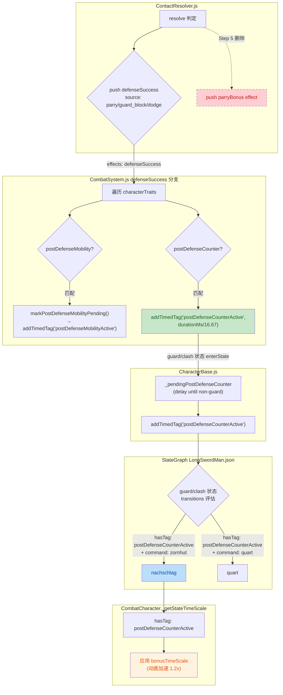
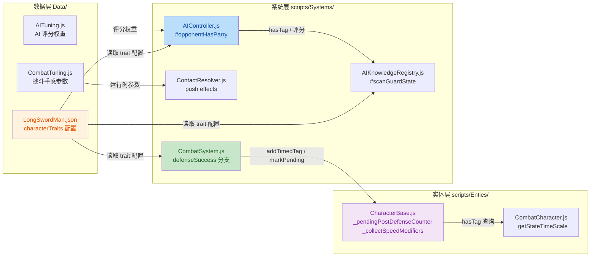

<markdown_report>
## 1. High-Level Summary (TL;DR)

*   **Impact:** 🟡 **Medium-High** — 重构战斗系统核心反击机制，移除隐式 `parryBonus` 标签，引入正式 `characterTraits.postDefenseCounter` 配置；新增 LongSwordMan 的 `nachschlag` 反击动画；建立 `Data/CombatTuning.js` 与 `Data/AITuning.js` 配置中心化；修正若干手感数值与配置化 backlog。
*   **Key Changes:**
    *   ✨ **新增反击 trait**：`postDefenseCounter` 接管原 `parryBonus` 的反击出招资格职责（Source: `LongSwordMan.json`）
    *   ⚔️ **新增动画状态 `nachschlag`**：作为 `zornhut` 之外的独立反击招式（Source: `LongSwordMan.json`）
    *   🔧 **拆分 `_collectSpeedModifiers`**：`parryBonus` 不再叠加移动速度（修复 RabbleStick parry 1.95x 双倍加速 bug）
    *   🎯 **AI 能力检测从 transition 扫描改为查 trait 配置**：更显式稳定（Source: `AIKnowledgeRegistry.js` / `AIController.js`）
    *   📦 **新增 `Data/CombatTuning.js` 与 `Data/AITuning.js`**：将 hitstop/knockback/AI 评分权重等手感参数集中化
    *   🐛 **清理调试日志**：`TimeControlSystem.js` 的 `console.log` 全部删除
    *   🆕 **新增 `longswordman_inspect` RootMotion**：为后续 inspect 动作准备根运动数据
    *   🛠️ **新增 Collider/Occupancy 更新 Skill 文档**：规范 `.collider.json` / `.occupancy.json` 重新生成流程

---

## 2. Visual Overview (Code & Logic Map)

### 2.1 新反击机制数据流（重构后）



### 2.2 模块协作关系



---

## 3. Detailed Change Analysis

### 3.1 🆕 新增反击 Trait 机制（核心重构）

**Component Name:** `postDefenseCounter` Trait 系统

**What Changed:**
将原 `parryBonus` tag 的反击资格从状态机条件中剥离，升级为 `characterTraits` 正式配置。同时拆分为两个独立 trait（`postDefenseMobility` 管移速，`postDefenseCounter` 管反击出招）。

| 改动点 | 文件 | 说明 |
|---|---|---|
| 新增 trait 配置 | `Data/StateGraphDef/LongSwordMan.json` | `characterTraits.postDefenseCounter` 字段 |
| 防御结算处理 | `scripts/Systems/CombatSystem.js` | `defenseSuccess` 分支新增 `postDefenseCounter` 处理 → `addTimedTag("postDefenseCounterActive")` |
| 延迟激活 | `scripts/Enties/CharacterBase.js` | 新增 `_pendingPostDefenseCounter` + `markPostDefenseCounterPending()`；`enterState` 中 `stateName !== "guard"` 时激活（绕过 freezeImpact） |
| 攻击动画加速 | `scripts/Enties/CombatCharacter.js` | `_getStateTimeScale` 同时识别 `postDefenseCounterActive` |
| 移速加成剥离 | `scripts/Enties/CharacterBase.js` | `_collectSpeedModifiers` 不再识别 `parryBonus`，仅 `chainBonus`（**修复 1.95x 双重加速 bug**） |
| AI 检测改查 trait | `scripts/Systems/AIKnowledgeRegistry.js` | `#scanGuardState` 新增 `characterTraits` 参数，`canParry` 改查 `postDefenseCounter.enabled` |
| AI 战斗决策 | `scripts/Systems/AIController.js` | `#opponentHasParry` 不再扫描 `parryBonus` 标签条件，改查 `characterTraits.postDefenseCounter.enabled` |
| 移除旧 effect 推送 | `scripts/Systems/CombatSystem.js` | 删除 `parryBonus` effect 处理分支（line 28-35） |
| 移除旧 effect 生成 | `scripts/Systems/ContactResolver.js` | 删除 `parryBonus` effect push（line 121） |

**新 trait schema（来源：`Data/StateGraphDef/LongSwordMan.json`）：**
```json
"characterTraits": {
  "postDefenseCounter": {
    "enabled": true,
    "triggers": ["guard_block", "parry"],
    "durationMs": 500,
    "allowedCommands": ["zornhut", "quart"]
  }
}
```

> ⚠️ 注意：`allowedCommands` 字段**当前未在代码中消费**（plan 第 110 行明确说明只给 AI 读取，但本次 AI 改动未使用此字段做命令过滤，仅做 `enabled` 布尔判断）。

---

### 3.2 ⚔️ 新增 nachschlag 反击动画

**Component Name:** `LongSwordMan` 状态图扩展

**What Changed:**
为 LongSwordMan 新增独立反击动作 `nachschlag`（德语 HEMA 用语，"追击"），区别于原有的 `zornhut`。

| 改动点 | 文件 | 说明 |
|---|---|---|
| Atlas 注册 | `scripts/AssetManifest.js` | `atlas.hero.nachschlag` + `colliders.hero.nachschlag` |
| 工厂方法装配 | `scripts/CharacterFactory.js` | `createHeroCharacter` 新增 `nachschlag` clip 配置 |
| 状态定义 | `Data/StateGraphDef/LongSwordMan.json` | 新增 `nachschlag` 状态：heavy 攻击、slash 轨迹、`attackActiveFrames: [2]` |
| guard 路由 | `Data/StateGraphDef/LongSwordMan.json` | guard → zornhut 的 `command: zornhut` 改为路由到 `nachschlag` |
| clash 路由 | `Data/StateGraphDef/LongSwordMan.json` | clash → zornhut 的 `command: zornhut` 改为路由到 `nachschlag` |
| tag 守卫改 | `Data/StateGraphDef/LongSwordMan.json` | `parryBonus` → `postDefenseCounterActive`（4 处） |

**关键 snippet（`nachschlag` 状态）：**
```json
"nachschlag": {
  "clip": "nachschlag",
  "allowMoveInput": false,
  "attackActive": true,
  "attackWeight": "heavy",
  "attackTrajectory": "slash",
  "attackActiveFrames": [2],
  "bonusTimeScale": 1.0,
  "frameSpeeds": [0, 0, 0.2, 0.1, -0.1]
}
```

---

### 3.3 🎛️ 战斗手感参数外部配置化

**Component Name:** `Data/CombatTuning.js`（全新）

**What Changed:**
将原硬编码在 `ContactResolver` 中的 hitstop / knockback 等手感参数集中到独立配置模块。

| 配置分类 | 字段 | 默认值 | 来源（参考） |
|---|---|---|---|
| **hit** | `victimKnockbackX` | 0.12 | `ContactResolver` |
| **hit** | `freezeImpactFrames` | 24 | `CombatSystem` |
| **block** | `knockbackX` | 0.2 | `ContactResolver` |
| **block** | `hitstopFrames` | 4 | `ContactResolver` |
| **block** | `blockstunFrames` | 10 | `ContactResolver` |
| **parry** | `hitstopFrames` | 8 | `ContactResolver` |
| **parry** | `preemptiveTickDiffMax` | 16 | `ContactResolver`（Just Guard 阈值，原硬编码 ≤7） |
| **parry** | `bonusDurationFrames` | 40 | `ContactResolver` parryBonus context |
| **parry** | `bonusDefaultDurationFrames` | 15 | `CombatSystem` effect fallback |
| **clash** | `tieHitstopFrames` | 8 | `ContactResolver` |
| **clash** | `loseLoserHitstopFrames` | 6 | `ContactResolver` |
| **clash** | `loseWinnerHitstopFrames` | 4 | `ContactResolver` |

> ⚠️ **重要**：`CombatTuning.js` 文件已创建，但代码中**尚未替换硬编码引用**——根据 `plans/BACKLOG.md` 删除记录显示这些原本是 backlog 中的中优先级任务。配置虽存在但仍是"配置孤儿"。

---

### 3.4 🤖 AI 评分参数配置化

**Component Name:** `Data/AITuning.js`（全新）

**What Changed:**
将 AI Utility 评分的所有权重/阈值/节奏参数集中。

| 分组 | 字段示例 | 用途 |
|---|---|---|
| 节奏 | `decisionIntervalMs: 100`, `attackCooldownMs: 800` | 决策周期 |
| 距离模型 | `rangeBuffer: 0.2` | 统一安全 margin |
| 性格门控 | `committedScoreThreshold: 0.15`, `reactionVariance: 0.15` | 评分阈值 + 随机扰动 |
| 威胁感知 | `threatPerPhase: {active:1.0, startup:0.6, recovery:0.1}` | opp 阶段威胁值 |
| 攻击偏好 | `attack.baseWeight: 0.4`, `parryRiskPenalty: 0.9` 等 8 项 | attack 评分权重 |
| 防御偏好 | `defense.activationThreshold: 0.3` 等 5 项 | defense 评分权重 |
| 距离后果 | `distanceConsequence.multiplier: 0.3`, `clamp: 0.25` | 防御后位置代价 |
| Positioning | `retreat.normalThreat: 0.6`, `mobilityBoostThreat: 0.8` | 后撤阈值 |

> 与 `CombatTuning` 同样的状况：文件已建，代码中**未替换硬编码引用**。

---

### 3.5 🔢 数值微调（手感平衡）

| 改动点 | 文件 | 旧值 | 新值 | 含义 |
|---|---|---|---|---|
| 反击动画加速 | `LongSwordMan.json` | `bonusTimeScale: 1.75` | `bonusTimeScale: 1.2` | 反击招式不需过激加速 |
| 攻击判定窗口 | `LongSwordMan.json` | `attackActiveFrames: [3, 4]` | `attackActiveFrames: [3]` | 收窄 zornhut/thrust 命中窗口 |
| 攻击判定窗口 | `LongSwordMan.json` | `attackActiveFrames: [3, 4]` | `attackActiveFrames: [3]` | 收窄 thrust 命中窗口 |
| Just Guard 阈值 | `Data/CombatTuning.js` | 硬编码 ≤7 | `preemptiveTickDiffMax: 16` | 放宽预判窗口（从 7 → 16 tick） |

---

### 3.6 🧹 调试日志清理

**Component Name:** `TimeControlSystem.js`

*   移除 `console.log("[freezeImpact] ...")` 两处
*   移除 `console.log("[fixedUpdate] ... impactContext end ...")` 一处

> 影响：生产环境日志输出减少；不影响逻辑（`if (tc.impactContext) return;` 守卫已保留）。

---

### 3.7 🆕 新增资源 & Skill 文档

| 类型 | 文件 | 用途 |
|---|---|---|
| 动画源 | `Art/RawAssets/longswordman/longswordman_*.ase` | nachschlag / 已有动作的源文件 |
| Sprite Atlas | `Art/Sprite/longswordman/longswordman_nachschlag.json` + 5 已有 atlas | 切片信息 |
| Collision Mask | `Data/CollisionMask/longswordman/longswordman_nachschlag.collider.json` 等 6 个 | 碰撞盒 |
| PushBox | `Data/PushBox/longswordman/longswordman_nachschlag.json` 等 5 个 | 推动盒 |
| RootMotion | `Data/RootMotion/longswordman/longswordman_nachschlag.json` 等 5 个 | 根运动 |
| 新增 inspect RootMotion | `Data/RootMotion/longswordman/longswordman_inspect.json` | 6 帧 inspect 预备数据 |
| Skill 文档 | `.trae/skills/collider-occupancy-更新-skill/SKILL.md` | 规范 collider/occupancy 重新生成流程 |

---

### 3.8 📝 计划与文档

| 文件 | 类型 | 内容 |
|---|---|---|
| `plans/反击机制重构计划.MD` | 新建 | 反击机制重构详细计划（357 行） |
| `plans/post_defense_advantage_guideline.md` | 新建 | `parryBonus` → Trait 的设计 guideline（540 行） |
| `plans/Handoff.MD` | 新建 | 重构进度交接文档，标记遗留问题 |
| `plans/BACKLOG.md` | 更新 | 删除已完成的"规则配置化"和"NPC 行为架构"章节 |

---

## 4. Impact & Risk Assessment

### ⚠️ 4.1 已知阻塞 Bug（来自 `Handoff.MD`）

**症状：** 用户报告 `quart` 能正常出招，但 `nachschlag` 出不来；guard→clash 后直接走 clash→idle，没有 clash→nachschlag。

**怀疑根因：** `clash` 状态 transitions 顺序问题——`to: idle`（`time >= 1.0`）在最前面：
```json
"transitions": [
  { "to": "idle",    "when": [{ "time": "normalized", "op": ">=", "value": 1.0 }] },
  { "to": "nachschlag", "when": [{ "command": "zornhut" }, { "hasTag": "postDefenseCounterActive" }] },
  { "to": "quart",     "when": [{ "command": "quart" }, { "hasTag": "postDefenseCounterActive" }] }
]
```
`clash` 动画的 `normalizedTime` 可能已 ≥ 1.0，第一条 transition 直接命中，command 分支被跳过。

**修复方向（plan 已给出）：** 把 `command` 条件的 transitions 移到 `idle` 之前，让玩家输入优先响应。`guard` 状态同理。

> 注：现有 diff **未修复此 bug**——属遗留待办事项。

### ⚠️ 4.2 遗留工作（Step 5 未完成）

`Handoff.MD` 明确记录以下**老 parryBonus 路径**还未删除：
- `ContactResolver.js:121`（parryBonus effect push）
- `CombatSystem.js:28-35`（parryBonus effect 处理）
- `CharacterBase._collectSpeedModifiers` 中的 parryBonus 检查
- `CombatCharacter._getStateTimeScale` 中的 parryBonus 检查

**风险：** 当前为"新 path 接管 + 老 path 已删除/剥离"状态。`_collectSpeedModifiers` 已不识别 parryBonus（双倍加速 bug 修复），但 `CombatCharacter._getStateTimeScale` 的 diff 中只字未提 `parryBonus` 移除——**建议下一轮清理彻底删除**。

### ⚠️ 4.3 配置孤儿

`Data/CombatTuning.js` 和 `Data/AITuning.js` 已新建，但代码中**未引用**。`BACKLOG.md` 中相应章节（hitstop/knockback/AI 参数配置化）被删除但实际替换工作未完成。

**风险：** 误以为已配置化但实际仍走硬编码。**建议立即在代码中接入**或从 backlog 标记回归。

### 🔍 4.4 Breaking Changes & 兼容性

| 维度 | 影响 |
|---|---|
| State Graph | `guard`/`clash` 的 `hasTag: "parryBonus"` 已替换为 `"postDefenseCounterActive"`，旧 tag 不再生效 |
| AI 行为 | 检测方式改变（transition 扫描 → trait 查表），外部行为一致但内部实现不同 |
| 角色配置 | LongSwordMan 已有 `characterTraits.postDefenseCounter`；其他角色（RabbleStick 等）**未配置**该 trait，将无法反击 |
| 动画 | 玩家在 guard 后按 `zornhut` 看到的是 `nachschlag` 动作而非原 zornhut |

### 🧪 4.5 Testing Suggestions

| # | 测试场景 | 期望 |
|---|---|---|
| 1 | LongSwordMan parry 成功后 500ms 内按 zornhut | 进入 `nachschlag` 反击（修复后） |
| 2 | LongSwordMan guard_block 后 500ms 内按 quart | 进入 `quart`（已确认可用） |
| 3 | LongSwordMan parry 成功时移动速度加成 | **只** 1.5x（mobility trait），**不应**叠加 1.3x |
| 4 | RabbleStick parry 成功时移动速度 | 1.5x（与 LongSwordMan 一致，无双倍 bug） |
| 5 | 反击状态机的 bonusTimeScale 应用 | nachschlag 自身 1.0x（原 1.75x 已改 1.2x 在通用 bonus 路径） |
| 6 | AI 评估 RabbleStick 是否会反击 | 不应判定有反击能力（无 `postDefenseCounter` trait） |
| 7 | clash 状态 normalizedTime=1.0 时按 zornhut | （bug 修复后）应进入 nachschlag 而非 idle |
| 8 | dodge 后按 zornhut | 不应进入反击（`postDefenseCounter` 的 `triggers` 不含 dodge） |

---

### 📊 总体评分

| 维度 | 评分 | 说明 |
|---|---|---|
| 架构清晰度 | ⭐⭐⭐⭐⭐ | 拆分 mobility/counter 两个 trait，职责清晰 |
| 完整性 | ⭐⭐⭐ | Step 5 清理 + clash transition bug 待修 |
| 文档完整度 | ⭐⭐⭐⭐ | 三份计划/Handoff 文档齐全 |
| 风险可控性 | ⭐⭐⭐ | 有一处明确阻塞 + 配置孤儿需关注 |