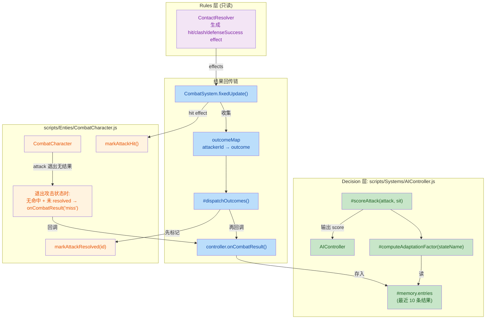

## 1. 高级摘要 (TL;DR)

*   **影响**: **高** —— 引入 AI 决策反馈闭环（Feedback Memory），让 AI 在被连续 parry / guard / miss 后能逐渐改变策略；同时补充设计文档与工具使用规范。
*   **核心改动**:
    *   ✨ **CombatSystem 新增结果回传**：把 hit / parried / guard_blocked / clash / miss 五种战斗结果回传给攻击者的 Controller。
    *   ✨ **AIController 新增战术记忆**：记录最近 10 条结果，连续失败扣分、连续成功加分，维持成功招式的"惯性"。
    *   🐛 **CombatCharacter 新增 miss 检测**：攻击动画播完未命中时主动判定 miss（避免依赖 CombatSystem 漏报）。
    *   📚 **新增 4 份计划/规范文档**：Feedback Memory 实施计划、AI 决策适配指南、AI 模式化问题分析、Collider/Occupancy 更新 SKILL。
    *   🖼️ **4 个二进制美术资源更新**（Tavern、arrow、floor、treeline_pine）。

---

## 2. 视觉概览 (逻辑图)



---

## 3. 详细变更分析

### 🎯 3.1 战斗结果回传链 (Rules → Decision)

#### `scripts/Systems/ContactResolver.js`
*   **变更**: `pushDefenseSuccess` 私有方法签名扩展，新增 `offenseCharId` 和 `attackId`。
*   **关键修改**: Parry 路径生成的 clash effect 现在带 `attackerId: defenseCharId` 字段（且**没有 contactType**），用作 parry vs 普通 clash 的区分标志。
*   **影响**: 让 CombatSystem 能区分出"被 parry"与"普通拼刀"，从而分别回传 `parried` 和 `clash` outcome。

#### `scripts/Systems/CombatSystem.js`
*   **新增**:
    *   `outcomeMap: Map<attackerId, {outcome, attackInstanceId, counteredBy}>` — 收集本帧每名攻击者的首个 outcome。
    *   `#collectOutcomeFromEffect()` — 从 effect 提取 outcome，分类映射：
        *   `hit` → `outcome: "hit"`
        *   `clash` + 无 `contactType` → `outcome: "parried"`（parry 来源）
        *   `clash` + 有 `contactType` → `outcome: "clash"`（输方）
        *   `defenseSuccess` + `source="guard_block"` → `outcome: "guard_blocked"`
    *   `#dispatchOutcomes()` — 统一回传给 attacker 的 controller，同时调用 `markAttackResolved` 防止重复回传 miss。
*   **新增** (Source: `CombatSystem.js:90-97`): hit 分支调用 `attackerChar.markAttackHit()`，让 CombatCharacter 自己也知道命中了。

### 🧠 3.2 AI 战术记忆 (Decision 层内部)

#### `scripts/Systems/AIController.js`
*   **新增字段**:
    *   `#memory = { entries: [], maxEntries: 10, decayMs: 5000 }`
    *   `#lastCommittedState` —— 上一次成功执行的 stateName。
*   **新增方法**:
    *   `onCombatResult({ outcome, targetState, counteredBy })` — Step 2 存入 `#memory`，并更新 `#lastCommittedState`。
    *   `#computeAdaptationFactor(stateName)` — 返回 `{consecutiveFail, consecutiveSuccess}`，从近往远数。
*   **修改** `#scoreAttack()`: 在范围评分后追加三段 (Source: `AIController.js:404-426`):
    *   失败惩罚：≥2 次连续失败 → `-0.15 × n`；1 次 → `-0.075`。
    *   成功奖励：≥1 次连续成功 → `+0.05 × n`。
    *   Continuity 奖励：当前招与 `#lastCommittedState` 相同，且连续失败 < 2 → `+0.05`。

#### `Data/AITuning.js`
新增三个 tuning 字段：

| 参数 | 默认值 | 含义 |
|---|---|---|
| `feedbackFailPenalty` | `0.15` | 每次失败扣多少分（第 1 次 ×0.5） |
| `feedbackSuccessBonus` | `0.05` | 每次成功加多少分（连续累积） |
| `continuityBonus` | `0.05` | 上一招成功过的惯性加分（连续失败 ≥2 则不给） |

### ⚔️ 3.3 CombatCharacter 的 miss 判定

#### `scripts/Enties/CombatCharacter.js`
*   **新增字段**:
    *   `_lastAttackHadHit` —— 本次攻击是否命中。
    *   `_currentAttackInstanceId` —— 当前攻击实例 ID。
    *   `_resolvedAttackIds` —— 已 resolved 的攻击 ID 集合（容量控制 ≤20，保留最近 10）。
*   **新增方法**:
    *   `markAttackResolved(attackInstanceId)` —— CombatSystem 回调后标记。
    *   `markAttackHit()` —— 标记命中。
*   **修改** 状态机推进逻辑 (Source: `CombatCharacter.js:435-500`):
    *   旧/新 `attackActive` 状态捕获前置移至循环开头，避免"先消费 transition 再判定"导致 `oldAttackActive` 失效。
    *   **进入 attack 状态**: 重置 `_lastAttackHadHit = false`，记录 `_currentAttackInstanceId`，容量控制清理已 resolved ID。
    *   **退出 attack 状态**: 若 `_lastAttackHadHit=false` 且 `!_resolvedAttackIds.has(id)` → 调用 `controller.onCombatResult({outcome: "miss"})`，重置 instance id。

### 🔌 3.4 控制器绑定 (新增依赖)

#### `scripts/Scene.js`
两行关键绑定（之前缺失）：

| 行 | 作用 |
|---|---|
| `character.controller = this._game.playerController;` | 玩家角色能通过 `controller.onCombatResult` 上报 miss |
| `rabbleStick.controller = this.rabbleController;` | 敌方角色同样能上报 outcome |

> 💡 **没有这两行，Feedback Memory 链路对人类玩家与敌方都是断的** —— 这是 CombatCharacter 主动 miss 检测能工作的必要前置。

### 🖼️ 3.5 二进制资源

四个 `.ase` / `.kra` 文件被修改但 diff 显示为二进制差异，未提供可读细节：
*   `Art/RawAssets/Env/Tavern.ase`
*   `Art/RawAssets/Env/arrow.ase`
*   `Art/RawAssets/Env/floor.kra`
*   `Art/RawAssets/Env/treeline_pine.kra`

### 📚 3.6 新增文档

| 文件 | 用途 |
|---|---|
| `.trae/skills/collider-occupancy-更新-skill/SKILL.md` | 工具脚本使用规范：路线 A（战斗角色 collider）、路线 B（NPC occupancy），含颜色约定与常见问题 |
| `plans/26.9.11 AI模式化问题/26.9.14 Feedback Memory 实施计划.MD` | Phase 1 实施步骤（Step 1~4），含验证标准 |
| `plans/26.9.11 AI模式化问题/AI_Decision_Adaptation_Guideline.md` | 设计指南：原则（行为惯性 vs 适应）、优先级（反馈闭环 → 距离平滑 → startup → 防御距离后果）、模式化分档（tutorial / normal / elite / boss） |
| `plans/26.9.11 AI模式化问题/AI问题分析.MD` | 问题诊断：三个设计缺口（距离硬门槛、无记忆随机、无反馈闭环）+ 修复方向 L1/L2/L3 |
| `plans/Handoff.MD` | 内容与 `AI问题分析.MD` 完全相同的交接稿 |

---

## 4. 影响与风险评估

### ⚠️ 破坏性变更
*   **`AIController` 私有字段语法**: 使用了 `#memory` / `#lastCommittedState` 私有字段，依赖现代 JS 引擎（>2020）支持；老旧浏览器/打包器需要确认 target。
*   **`#pushDefenseSuccess` 签名变更**: 内部调用点已全部更新，但若有外部/测试直接调用此私有方法会破坏。
*   **`defenseSuccess` effect context 扩展**: 新增 `attackerId` / `attackInstanceId` 字段，旧的下游 effect 消费者应忽略未知字段，但若有严格 schema 检查会失败。

### 🧪 测试建议

1. **基础连通性**: 跑一场完整战斗，确认控制台无报错，特别关注 `controller is undefined` —— Scene.js 的绑定是关键。
2. **反馈闭环正确性**:
    *   让 AI 连续 swing 被玩家 parry 2 次 → 第三次决策时观察 swing 的 utility 评分应明显下降。
    *   AI 连续命中 → 评分应保持高位（continuity + feedback success）。
    *   玩家 dodge 后 AI swing → 应记为 miss（需确认 dodge 不被回传 outcome —— 注释明示"dodge 暂不回传"，但会被算入 miss）。
3. **miss 判定去重**: 给同一攻击制造双重 outcome（例如 hit + miss 同时触发），确认 `_resolvedAttackIds` 集合能正确去重，不会双倍扣分。
4. **parry vs clash 区分**: 测试 parry 与普通 clash_tie，确认 outcomeMap 分别写入 `parried` / `clash`，不被混淆。
5. **容量控制**: 长时间战斗测试 `_resolvedAttackIds.size > 20` 的清理分支是否生效（不应持续增长导致内存泄漏）。
6. **AI 行为对比**: 记录同一场景下、连续 parry 5 次前后 AI 的招选择分布，应观察到从单一 swing 转向多样化。

### 📊 评分公式新增项一览

```
旧 score = baseWeight
          - cooldownPenalty
          + interaction bonuses
          + preemptiveBonus / rangeEdgeBonus
          × (1 ± rand)

新 score = 旧 score
          - feedbackFailPenalty × consecutiveFail  (第1次 ×0.5)
          + feedbackSuccessBonus × consecutiveSuccess
          + continuityBonus  (仅当 lastCommittedState 一致且 fail<2)
          × (1 ± rand)
```