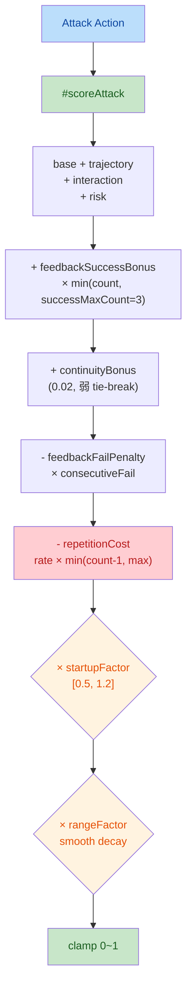
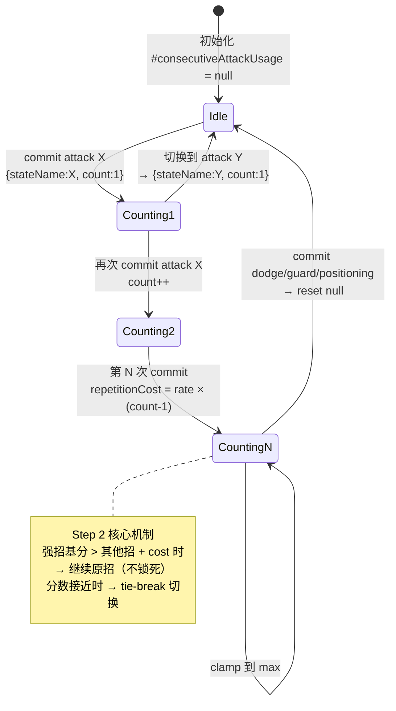
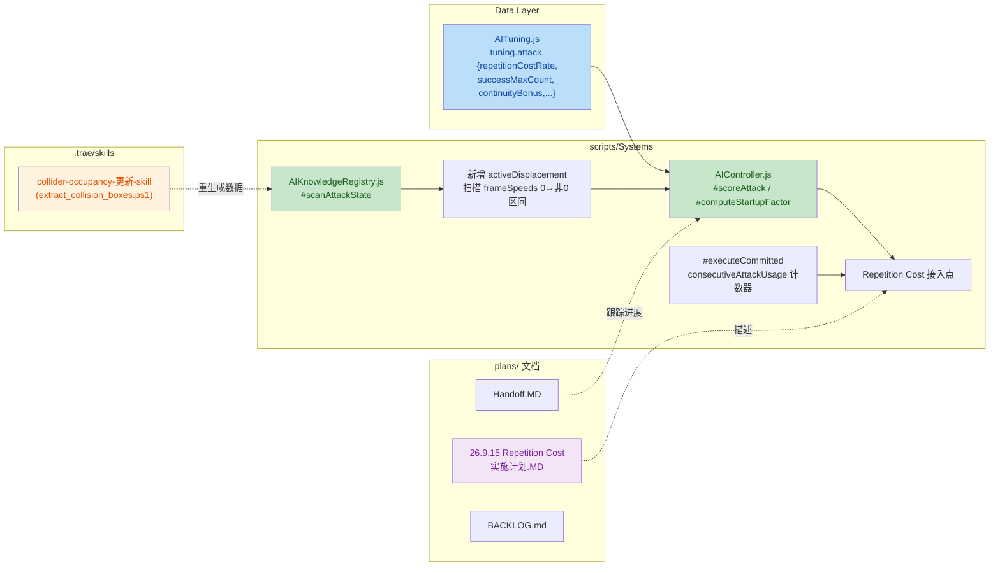

# 代码审查报告 — AI Repetition Cost + Startup Utility + 文档体系

## 1. High-Level Summary (TL;DR) 📊

*   **Impact:** 🟡 **Medium-High** — 核心改动集中在 AI 决策模块，目标是解决「AI 连续命中同招后锁死」的模式化问题，并打通 Phase 2/3 连续距离与 Startup 的整合。
*   **Key Changes:**
    *   ✨ 新增 **Repetition Cost（重复行为成本）**：相同 attack 连击次数越多，边际吸引力递减，强制打破惯性。
    *   ✨ 新增 **Startup Utility（Phase 3）**：把 `startupMs` 从条件式升级为乘法评分因子；opp `recovery` 时奖励快招，`active` 时惩罚慢招。
    *   ✨ 新增 **`activeDisplacement` 字段**：扫描 `frameSpeeds` 的「0→非0 跳变 → 最后非0」区间，校正 dash 类动作的 effectiveRange 高估。
    *   ✨ **`oppThreat` 改连续衰减**：取代 hard range gate，威胁值随距离线性衰减到 0。
    *   🛡️ **Rating 治理**：`feedbackSuccessBonus` 封顶 3 次、`continuityBonus` 0.05→0.02、`reactionVariance` 0.15→0.05（Tuning 弱化）。
    *   📄 **文档体系完善**：新增 Skill 文档（Collider/Occupancy 更新）+ Repetition Cost 实施计划 + AI Handoff。

---

## 2. Visual Overview (Code & Logic Map) 🗺️

### 2.1 新版 Attack Utility 评分流水线



### 2.2 Repetition Cost 状态机



### 2.3 模块协同关系图



---

## 3. Detailed Change Analysis 🔍

### 3.1 🔧 AI Tuning 参数调整（`Data/AITuning.js`）

| 参数 | 原值 | 新值 | 用途 |
|---|---|---|---|
| `reactionVariance` | `0.15` | `0.05` | 降级为 ±2.5% 的最终 tie-break |
| `continuityBonus` | `0.05` | `0.02` | 降级为弱 tie-break |
| `feedbackSuccessBonus` | `0.05`（无封顶） | `0.05`（封顶 3 次） | 短期有效信号 |
| `successMaxCount` 🆕 | — | `3` | Success Bonus 封顶 |
| `repetitionCostRate` 🆕 | — | `0.06` | 每次连续使用成本增长 |
| `repetitionCostMax` 🆕 | — | `0.18` | Repetition cost 上限 |
| `recoveryStartupBonus` 🆕 | — | `0.12` | opp recovery 时快招加分 |
| `activeStartupPenalty` 🆕 | — | `0.10` | opp active 时慢招扣分 |
| `distanceStartupSmooth` 🆕 | — | `0.3` | 距离衰减窗口 |

**Why**：原来 `feedbackSuccessBonus × consecutiveSuccess` 无封顶，连续命中 10 次直接 +0.50，AI 锁死同招。加上 `repetitionCost` 反向力后，即使继续赢也是「可预测但不机械」。

---

### 3.2 🤖 AI Controller 核心改动（`scripts/Systems/AIController.js`）

#### 3.2.1 新增 Repetition Cost 计数器

```javascript
// 私有字段声明
#consecutiveAttackUsage;  // { stateName, count }

// 初始化
this.#consecutiveAttackUsage = null;

// #executeCommitted 内更新
if (kind === "attack") {
    if (this.#consecutiveAttackUsage?.stateName === action.stateName) {
        this.#consecutiveAttackUsage.count++;
    } else {
        this.#consecutiveAttackUsage = { stateName: action.stateName, count: 1 };
    }
} else {
    this.#consecutiveAttackUsage = null;  // dodge/guard/positioning 打断 reset
}
```

#### 3.2.2 `#scoreAttack` 新增减项（Repetition Cost）

```javascript
const usageCount = (this.#consecutiveAttackUsage?.stateName === attack.stateName)
    ? this.#consecutiveAttackUsage.count
    : 0;
if (usageCount >= 2) {
    const repetitionCost = Math.min(
        this.tuning.attack.repetitionCostMax ?? 0.18,
        this.tuning.attack.repetitionCostRate ?? 0.06 * (usageCount - 1)
    );
    score -= repetitionCost;
}
```

#### 3.2.3 `#computeStartupFactor()` 新增（Phase 3）

| 条件 | 公式 | 含义 |
|---|---|---|
| `opp.phase === "recovery"` | `factor += recoveryStartupBonus × startupRatio` | 抢招窗口奖励快招 |
| `opp.phase === "active" && in-range` | `factor -= activeStartupPenalty × (1 - startupRatio)` | 惩罚慢招 |
| 距离接近 effectiveRange | `smoothFactor` 从 1.0 衰减到 0 | 距离衰减渐变 |

`startupRatio = minStartupMs / myStartupMs`（最快招 = 1.0）。最终 clamp 到 `[0.5, 1.2]`。

#### 3.2.4 `oppThreat` 改连续衰减

```javascript
// 旧：硬门控
oppThreat = inRange ? threatVal : 0.3/0.2;

// 新：rangeFactor 在 effRange ~ effRange×2 之间线性衰减到 0
const rangeFactor = distance > farThreshold ? 0 
    : 1 - (distance - effRange) / (farThreshold - effRange);
oppThreat = threatPerPhase × rangeFactor;
// recovery 阶段不变（威胁窗口已过）
```

#### 3.2.5 Phase 2 距离平滑衰减接入

```javascript
// 旧：硬门控 return 0
if (sit.distance > effectiveRange) return 0;

// 新：距离在 effectiveRange ~ maxRange 之间平滑衰减
const maxRange = effectiveRange * (1 + rangeSmoothWindow);
let rangeFactor = 1.0;
if (sit.distance > effectiveRange) {
    rangeFactor = Math.max(0, 1 - (sit.distance - effectiveRange) / (maxRange - effectiveRange));
}
if (sit.distance > maxRange) return 0;
// ... 结尾
score *= rangeFactor;
```

#### 3.2.6 Success Bonus 封顶

```javascript
// 旧：无封顶
if (adaptation.consecutiveSuccess >= 1) {
    score += this.tuning.attack.feedbackSuccessBonus * adaptation.consecutiveSuccess;
}

// 新：封顶 successMaxCount（默认 3）
const cappedSuccess = Math.min(adaptation.consecutiveSuccess, this.tuning.attack.successMaxCount ?? 3);
if (cappedSuccess >= 1) {
    score += this.tuning.attack.feedbackSuccessBonus * cappedSuccess;
}
```

#### 3.2.7 displacement 数据源修复

```javascript
// 旧：使用全动画 displacement（dash 高估）
const fwdBoost = (attack.displacement ?? 0) < 0 ? -attack.displacement : 0;

// 新：使用 activeDisplacement（weaponbox 实际覆盖期间）
const effectiveDisplacement = attack.activeDisplacement ?? attack.displacement ?? 0;
const fwdBoost = effectiveDisplacement < 0 ? -effectiveDisplacement : 0;
```

---

### 3.3 📚 KB 扫描新增 `activeDisplacement`（`scripts/Systems/AIKnowledgeRegistry.js`）

**新增算法**：扫描 `frameSpeeds` 的「最后一次 0→非 0 跳变」到「最后一个非 0」区间，按帧时长累加得到 `activeDisplacement`。

```javascript
let activeDisplacement = 0;
let startIdx = -1, endIdx = -1;
for (let i = 0; i < frameSpeeds.length; i++) {
    const cur = frameSpeeds[i] ?? 0;
    const prev = i > 0 ? (frameSpeeds[i - 1] ?? 0) : 0;
    if (cur !== 0 && prev === 0) startIdx = i;
    if (cur !== 0) endIdx = i;
}
if (startIdx >= 0 && endIdx >= startIdx) {
    for (let i = startIdx; i <= endIdx; i++) {
        activeDisplacement += frameSpeeds[i] * (atlasFrames[i]?.durationMs ?? 100) / 1000;
    }
}
```

> **Why**：dash 全动画 `frameSpeeds=[0,-0.1,-2,-1,-0.7,0]`（6 帧）位移约 -3.8，但 `attackActiveFrames=[3,4]` 只 2 帧有 weaponbox。`activeDisplacement ≈ -3.5`，fwdBoost 从 0.76→3.5，effectiveRange 从 2.78→5.51。

**return 对象新增字段**：`activeDisplacement`。

---

### 3.4 📄 文档体系

| 文件 | 类型 | 关键内容 |
|---|---|---|
| `.trae/skills/collider-occupancy-更新-skill/SKILL.md` | 🆕 新 Skill | 两条 PS1 脚本路线（Collider vs Occupancy）、路径约定、批量处理模板、颜色表、FAQ |
| `plans/26.9.11 AI模式化问题/26.9.15 Repetition Cost + Success Bounded — 实施计划.MD` | 🆕 实施计划 | 7 步实施：tuning 调参 → Success 封顶 → 计数器 → Repetition Cost → 文档化 |
| `plans/Handoff.MD` | 🆕 交接文档 | Phase 1-5 进度跟踪、KB 数据日志、Pending diff 列表、下一步 |
| `plans/BACKLOG.md` | ✏️ 微调 | 删除「扫描距离判定考虑 framespeeds 但没考虑该帧时间」，改为「framespeed 的移动在命中判定后终止」+「超远距离玩家动作 ai 有反应」 |

#### Collider/Occupancy Skill 关键点：

| 维度 | 路线 A（Collider）| 路线 B（Occupancy）|
|---|---|---|
| 适用角色 | `longswordman`、`rabble_stick` | `traveller`、`merchant`、`merchant2` |
| 脚本 | `extract_collision_boxes.ps1` | `extract_rootmotion_occupancy.ps1` |
| 输入 | `Data/CollisionMask/` + `Data/RootMotion/` | `Data/RootMotion/NPCs/` |
| 输出 | `{character}_{action}.collider.json` | `{npc}.occupancy.json` |

**颜色约定**：`#FFFF00`(hitbox) / `#E37800`(strong_blade) / `#FF0000`(weak_blade) / `#7082C1`(root)

#### Repetition Cost 实施计划 7 步骤：

```
Step 1: 新增 #consecutiveAttackUsage 计数器
Step 2: #scoreAttack 接入 Repetition Cost 减项
Step 3: Success Bonus 封顶 3 次
Step 4: continuityBonus 0.05→0.02
Step 5: reactionVariance 0.15→0.05
Step 6: #computeStartupFactor 数据源修复
Step 7: Tuning 参数总览与四档 profile 扩展设计
```

---

### 3.5 🎨 二进制美术资产（5 个文件，差异仅二进制）

| 文件 | 类型 | 备注 |
|---|---|---|
| `Art/RawAssets/Env/Tavern.ase` | 🔄 二进制修改 | 场景美术 |
| `Art/RawAssets/Env/arrow.ase` | 🔄 二进制修改 | 装饰元素 |
| `Art/RawAssets/Env/floor.kra` | 🔄 二进制修改 | Krita 文件 |
| `Art/RawAssets/Env/treeline_pine.kra` | 🔄 二进制修改 | Krita 文件 |
| `Art/RawAssets/rabblestick/rabble_stick_dash.ase` | 🔄 二进制修改 | dash 攻击动画帧 |

> ⚠️ 二进制 diff 不显示具体内容，建议美术同事手动确认是否有视觉破坏性修改。

---

## 4. Impact & Risk Assessment ⚠️

### 4.1 Breaking Changes

| 项目 | 影响 | 等级 |
|---|---|---|
| Tuning 默认值变更 | `reactionVariance` / `continuityBonus` 数值变化，可能让已训练的 AI 表现略有不同 | 🟡 Medium |
| KB profile 结构 | 新增 `activeDisplacement` 字段，**老 KB 缓存/序列化文件**需要重新生成 | 🟠 Medium-High |
| `attackActiveFrames` 字段 | KB 扫描逻辑不再依赖该字段，但 frameSpeeds 的「有效区间」定义已变化 | 🟢 Low |

### 4.2 ⚠️ 风险点

1. **Repetition Cost 与 Continuity 叠加**：`continuityBonus=0.02` + `feedbackSuccessBonus×3=0.15` - `repetitionCostMax=0.18` 可能在临界场景下互相抵消导致 score 抖动。建议灰度开启。
2. **`activeDisplacement` 算法边界**：`startIdx = 最后一个 0→非0 跳变点`，但若 `frameSpeeds` 中间有短暂 0 帧（如 `[0,-1,0,-1,0]`），会取第二次的 -1 为起点。需要在 KB 测试中验证。
3. **`oppThreat` 连续衰减**：远距离 recovery 阶段的 threat 不衰减（`recovery` 不乘 rangeFactor），这是有意的（recovery 是已过去的威胁），但日志调试时容易混淆。
4. **Startup smoothFactor 与 Phase 2 rangeFactor 重复**：`#computeStartupFactor` 内部 smoothFactor 已固定为 1.0（统一交给 rangeFactor 处理），调试时应避免重复计数。

### 4.3 Testing Suggestions 🧪

| 场景 | 验证点 |
|---|---|
| **AI 连续命中同招** | 第 1-2 次继续该招（合理）；第 3-4 次 score 被 Repetition Cost 拉低 |
| **dodge 打断** | dodge 后下次 attack 的 `count` 从 1 重计 |
| **强招纵贯** | Thrust base=0.95 时即使 repetition cost 封顶 -0.18，净分 0.77 仍 > 其他招 |
| **dash 距离评估** | console 看 `[dbg-ai] KB attacks:`，dash effR 应在 5.5 左右（原 2.78 已修复） |
| **远距离冷启动** | opp 远超 effRange×2 时，`oppThreat ≈ 0`，防御评分应被门控挡掉 |
| **Startup 效用** | opp recovery 时偏好快招；opp active + in-range 时偏好更快招 |
| **二进制美术** | Tavern、floor、arrow、treeline_pine、dash 攻击动画视觉对比 |
| **技能脚本** | 长 swordman 批量更新 collider 后，攻击 hitbox 与武器轨迹对齐 |

### 4.4 部署注意 📦

> ⚡ 浏览器缓存是已知坑：部署 `Data/AITuning.js` 后必须 **Ctrl+Shift+R 硬刷新**！

---

## 5. 改动文件汇总 📋

| # | 文件路径 | 类别 | 改动级别 |
|---|---|---|---|
| 1 | `Data/AITuning.js` | 🎛️ Tuning | 🟡 Medium（参数调整） |
| 2 | `scripts/Systems/AIController.js` | 🤖 AI 核心 | 🟠 High（新增 5 段逻辑） |
| 3 | `scripts/Systems/AIKnowledgeRegistry.js` | 📚 KB 扫描 | 🟡 Medium（新增字段） |
| 4 | `plans/BACKLOG.md` | 📋 Backlog | 🟢 Low（条目整理） |
| 5 | `.trae/skills/collider-occupancy-更新-skill/SKILL.md` | 📄 Skill 文档 | 🟢 Low（新增 131 行） |
| 6 | `plans/26.9.11 AI模式化问题/26.9.15 Repetition Cost + Success Bounded — 实施计划.MD` | 📄 实施计划 | 🟢 Low（新增 311 行） |
| 7 | `plans/Handoff.MD` | 📄 交接文档 | 🟢 Low（新增 326 行） |
| 8-12 | `Art/RawAssets/Env/*.{ase,kra}` + `Art/RawAssets/rabblestick/rabble_stick_dash.ase` | 🎨 美术 | ⚪ Binary（仅二进制差异） |

---

## 6. 一句话总结 🧭

> 本次 PR 是 **AI 决策系统的一次重要治理升级**：通过引入 **Repetition Cost（重复成本）+ Success 封顶 + Startup Utility + rangeFactor 平滑** 四个反向力，把「连续命中即锁死」的单调循环改造成「可预测但不机械」的有节奏决策；并把设计过程沉淀为可执行 Skill 与实施计划文档。