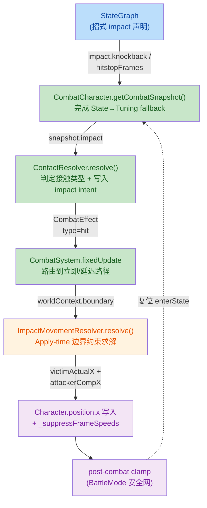
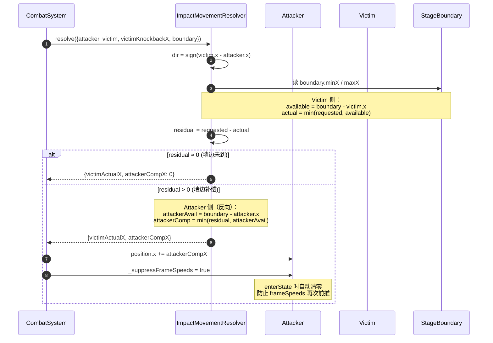
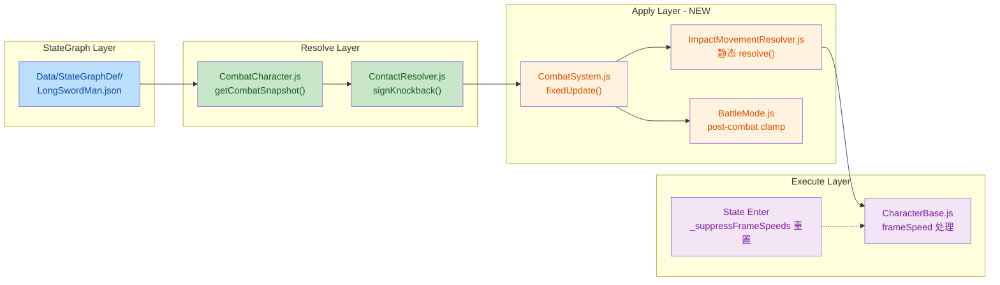

## 1. High-Level Summary (TL;DR) 📋

- **Impact:** 🟡 **Medium-High** — 引入 Per-State Impact Override（每个招式独立的 knockback / hitstop）+ Boundary Compensation（板边反击退）重构，同时修复一处 AI 评分 bug 并完善设计文档。
- **Key Changes:**
  - ✨ **新增** `ImpactMovementResolver`：纯函数 Apply-time 边界位移求解器，剩余击退量反推给攻击者。
  - ✨ **招式粒度配置**：5 个 LongSwordMan 招式在 StateGraph 中新增 `impact.knockback` / `impact.hitstopFrames`，不再硬读 `CombatTuning`。
  - ✨ **Snapshot 层 fallback**：`CombatCharacter.getCombatSnapshot()` 输出 `impact` 字段，`ContactResolver` / `CombatSystem` 直接消费。
  - ✨ **post-combat clamp 兜底**：`BattleMode` 在 `combatSystem.fixedUpdate` 之后再做一次 `clampCharacter`，防止 knockback 把角色推出边界。
  - 🐛 **Bug 修复**：`AIController.js` 误用未定义变量 `finalScore` → 实际为 `score`（此前大概率抛 ReferenceError 被异常吞掉）。
  - 📝 **新增** 3 份规划/设计文档（Gameplay State Guideline、26.9.16 实施计划、Handoff）；更新 `INDEX.md`、`BACKLOG.md`；新增 `.trae/skills/collider-occupancy-更新-skill/SKILL.md`。

---

## 2. Visual Overview (Code & Logic Map) 🗺️

### 2.1 Combat Effect 生命周期（新架构）



### 2.2 Boundary Compensation 算法（核心逻辑）



### 2.3 文件与责任分工



---

## 3. Detailed Change Analysis 🔍

### 3.1 新增模块 ✨

#### Component Name: `ImpactMovementResolver` (NEW)

- **What Changed:** 新建纯函数静态类 `ImpactMovementResolver.resolve()`，替代原本"立即写 `position.x += knockback`"的做法，根据当前空间位置 + `boundary` 动态计算：
  - `victimActualX`：被害人实际可后退的距离（不超过边界）
  - `attackerCompX`：剩余位移反向转给攻击者
- **关键算法**（同文档 26.9.16 §2.6 一致）：
  - `dir = sign(victim.x - attacker.x)`（**不用 facing**，facing 可能被修正过）
  - `victimAvailable = boundary.{maxX/minX} - victim.x`
  - `victimMagnitude = min(|requested|, |victimAvailable|)`
  - `residual = requested - victimActualX`（残余量交给 attacker）
- **Source:** `scripts/Systems/ImpactMovementResolver.js:1-64`

```js
static resolve({ attacker, victim, victimKnockbackX, boundary }) {
    // ... 纯函数，无副作用 ...
    return { victimActualX, attackerCompX };
}
```

---

### 3.2 Snapshot 层：招式参数解析 🎯

#### Component Name: `CombatCharacter.getCombatSnapshot()`

- **What Changed:** snapshot 增加 `impact` 字段，**在 Snapshot 层完成 State→Tuning fallback**，下游不必重复查找。
- 同时引入新字段：
  - `stateImpact.knockback ?? CombatTuning.hit.victimKnockbackX` → `attackKnockback`
  - `stateImpact.hitstopFrames ?? CombatTuning.hit.hitstopFrames` → `attackHitstopFrames`
- ⚠️ **遗留 TODO**（见 `Console.log`）：`[SnapImpact]` debug 日志，生产前需删除；同时还有一个 `finalScore` 的报错注释遗留。
- **Source:** `scripts/Enties/CombatCharacter.js:328-345`

```js
const impact = {
    attackKnockback: stateImpact.knockback ?? CombatTuning.hit.victimKnockbackX,
    attackHitstopFrames: stateImpact.hitstopFrames ?? CombatTuning.hit.hitstopFrames,
};
return { ..., boxes: worldBoxes, impact };
```

---

### 3.3 Resolver 层：从 snapshot 读取参数 🔧

#### Component Name: `ContactResolver` (Hit Path)

- **What Changed:** Phase 2 hit 路径不再硬读 `this.tuning.hit.victimKnockbackX`，改为从 attackerSnapshot.impact 取值，并写入 `attackHitstopFrames` 到 effect.context 给 `CombatSystem` 消费。
- **Source:** `scripts/Systems/ContactResolver.js:218-256`

| 字段 | Old 来源 | New 来源 |
|---|---|---|
| knockback magnitude | `tuning.hit.victimKnockbackX` | `attackerSnap.impact.attackKnockback ?? tuning` |
| hitstop frames | `tuning.hit.hitstopFrames`（由 CombatSystem 读） | `attackerSnap.impact.attackHitstopFrames ?? tuning` 写入 `effect.context` |

> 第一版 **clash / parry** 的 impact 相关参数仍保持 `this.tuning.*` 不变（改动范围可控）。

---

### 3.4 Apply 层：边界位移实际落地 ⚙️

#### Component Name: `CombatSystem.fixedUpdate()`

- **What Changed:** 
  - 签名扩展：`fixedUpdate(characters, tickCount, worldContext = {})`，接收 `worldContext.boundary`。
  - hit effect 处理段新增 **Apply-time 边界求解**：调用 `ImpactMovementResolver.resolve()` 拿到 `finalKnockbackX`（victim 实际量）和 `attackerCompX`（攻击者补偿量）。
  - **attacker 被反推时设置 `attacker._suppressFrameSpeeds = true`**，防止 state 自带的 frameSpeeds 再次前推覆盖补偿。
  - `hitstopFrames` 改为从 `effect.context?.attackHitstopFrames` 读取，不再硬读 tuning。
  - `clash freezeImpact` 改为从 `effect.context?.freezeImpactFrames ?? tuning` 读——为以后扩展打开路径（当前仍 fallback 到 tuning）。
  - `takeDamage(ctx)` 调用前覆盖 `knockbackX = finalKnockbackX`，传 `modifiedCtx`。
- **Source:** `scripts/Systems/CombatSystem.js:1-138`

#### Component Name: `BattleMode.fixedUpdate()`

- **What Changed:** 
  - 把 `stageBoundary` 注入 `worldContext` 传给 `CombatSystem`。
  - **新增 post-combat clamp** 安全网：computation 完成后再次循环 `clampCharacter`，兜底任何漏网位移。
- **Source:** `scripts/Systems/Modes/BattleMode.js:100-110`

---

### 3.5 Execution 层：抑制 frameSpeeds 🛑

#### Component Name: `CharacterBase` + `CombatCharacter`

- **What Changed:** 
  - `CombatCharacter` 构造函数新增 `_suppressFrameSpeeds = false` 标志位。
  - `CharacterBase._applyStateSpeed()` 增加 OR 条件：当 `inputLocked || _suppressFrameSpeeds` 时，`stateSpeed` 和 `frameSpeeds` 都被置 `null`。
  - `CharacterBase.enterState()` 在状态切换时**自动清零** `_suppressFrameSpeeds = false`。
- **设计意图：** 当 attacker 因 boundary compensation 被反向补偿后，state 自带的 frameSpeeds 会继续把角色向前推，抵消补偿位移；所以补偿生效期间必须抑制 frameSpeeds，等攻击状态退出后恢复。
- **Source:** `scripts/Enties/CharacterBase.js:366-372, 531-535`

```js
// enterState 内自动清零（防止状态切换后旧标志残留）
this._suppressFrameSpeeds = false;
```

---

### 3.6 数据：5 个招式独立配置 Impact 📊

#### Component Name: `LongSwordMan.json` (StateGraph)

| State | 攻击类型 | knockback | hitstopFrames |
|---|---|---:|---:|
| `attack1` (thrust, active=[2]) | 轻刺 | 0.08 | 6 |
| `attack2` (slash, active=[3]) | 轻斩 | 0.10 | 7 |
| `attack3` (heavy, timeScale=1.0, bonus=1.2) | 重击 A | 0.18 | 10 |
| `attack4` (heavy, bonus=1.0) | 重击 B | 0.18 | **24** |
| `attack5` (thrust, active=[3]) | 中刺 | 0.15 | 9 |

> 第一版只为 hit path 开放 per-state override；clash/parry 维持 tuning 默认。
> **Source:** `Data/StateGraphDef/LongSwordMan.json:200-345`

---

### 3.7 Bug 修复 🐛

#### Component Name: `AIController.#computeRangeUtility` (Phase 2 评分)

- **What Changed:** 末尾返回值从 `finalScore`（未定义变量）→ `score`（当前已乘以 `rangeFactor` 的局部变量）。
- **Bug 影响：** 直接抛 `ReferenceError: finalScore is not defined`；外层 try/catch 大概率吞掉，导致 `evaluateAttackScoring` 返回 `null`/`undefined`，AI 攻击评分路径静默失败。`[dbg-ai-thrust-react]` 日志也可能因为异常被绕过。
- **关联提示：** `CombatCharacter.js` 内仍有 `[SnapImpact]` 残留 `console.log` 与 `finalScore is not defined` TODO 注释，建议一并清理。
- **Source:** `scripts/Systems/AIController.js:535-538`

```diff
-        return finalScore;     // ReferenceError: finalScore is not defined
+        return score;
```

---

### 3.8 文档与规划 📚

| 文件 | 类型 | 摘要 |
|---|---|---|
| `plans/26.9.16 版边pushback，hitstopframes分招式配置计划.MD` | 🆕 实施计划 (695 行) | 完整 Step 1-7 设计：问题诊断 / 架构决策 / Boundary 算法钉死 / Step 步骤 |
| `plans/26.9.17 版边pushback momentum增强计划.MD` | 🆕 空文件 | 仅占位 1 字节，准备记录 momentum 增强的下一步 |
| `plans/Gameplay State & Impact Configuration Guideline.md` | 🆕 架构 Guideline (593 行) | 13 节，定义 StateGraph / ContactResolver / Character 的职责边界，明确"不要在 State 中写接触结果逻辑" |
| `plans/Handoff.MD` | 🆕 Handoff briefing | 给新会话的 quick-start 上下文（Bug 3 / 已修复项清单） |
| `plans/INDEX.md` | ✏️ 增加 Update Log (2026-09-16 / 09-15) | 记录最近修复历史 |
| `plans/BACKLOG.md` | ✏️ 状态更新 | 删除几条已实现的项，标注 AI swing 不换招的根因已部分修复 |
| `.trae/skills/collider-occupancy-更新-skill/SKILL.md` | 🆕 Skill 文件 (131 行) | AI 助手的"更新 collider / occupancy" 操作手册：两个 PowerShell 脚本的用法、目录约定、颜色约定、常见问题 |

---

### 3.9 美术资产 🎨

| 文件 | 类型 | 说明 |
|---|---|---|
| `Art/RawAssets/Env/Tavern.ase` | 🔒 二进制 | Aseprite 文件改动 |
| `Art/RawAssets/Env/arrow.ase` | 🔒 二进制 | Aseprite 文件改动 |
| `Art/RawAssets/Env/floor.kra` | 🔒 二进制 | Krita 文件改动 |
| `Art/RawAssets/Env/treeline_pine.kra` | 🔒 二进制 | Krita 文件改动 |

> 二进制文件无法做代码审查，需美术同事单独走查。

---

## 4. Impact & Risk Assessment ⚠️

### 4.1 Breaking Changes 🧨

| 类型 | 影响 |
|---|---|
| **API/接口** | `CombatSystem.fixedUpdate()` 第三参数 `worldContext` 为可选（带默认 `{}`），**对老调用方无 breaking**；但 `BattleMode` 已是唯一调用方，未传 `boundary` 时 `ImpactMovementResolver.resolve()` 会走早返回（`if (!boundary)`），行为兼容。 |
| **配置行为** | StateGraph 中**新增可选项** `impact`，未配置招式继续 fallback 到 `CombatTuning`；老数据无破坏。 |
| **执行时序** | BattleMode 新增 post-combat clamp——若有第三方系统依赖"clamp 只在 combat 之前发生"，行为改变（**应该没有**，但需确认）。 |
| **AI 行为** | `AIController` 末尾返回值修复——这是 **bug 修复**，之前是被异常吞掉的"假阳性"。修复后 AI 评分行为可能与历史表现**不一致**（因为之前实际是抛异常）。 |

### 4.2 Testing Suggestions 🧪

| 场景 | 期望 |
|---|---|
| 🟢 **正常击退（非边界）** | victim 收到完整 knockback；attacker 不动；frameSpeeds 正常生效 |
| 🟢 **板边击退（victim 在墙边）** | victim 退到边界即停；attacker 被反向推；`_suppressFrameSpeeds = true`；enterState 后标志清零 |
| 🟢 **双方均靠边（极端）** | residual 丢弃，不越界 |
| 🟡 **clash / parry 的 freezeImpact** | 仍走 `tuning.hit.freezeImpactFrames`；24 帧后走 TimeControlSystem 路径（**Step 7** 文档指出待实施；此 PR 暂未改 TimeControlSystem，clash 路径的边界补偿尚未生效） |
| 🟡 **AI 长 swing 一直尝试**（已部分修复） | 26.9.16 Bug 3 修复后，AI swing 被 hit 打断会回传 `interrupted` outcome，需实测确认换招行为 |
| 🔴 **AI 评分回归** | 修复 `finalScore` bug 后，log 应不再出现 `ReferenceError`，但 AI 出招分布可能改变，需要 log diff 验证 |
| 🟢 **未配 impact 的招式** | fallback 到 `CombatTuning` 默认，行为等价 |
| 🔴 **[SnapImpact] console.log 残留** | 验证：连续命中几次，确认 console 不再刷 `[SnapImpact]` 日志后清理掉 TODO |

### 4.3 风险等级矩阵 🎯

| 风险点 | 严重度 | 说明 |
|---|---|---|
| `_suppressFrameSpeeds` 标志未在状态切换外的退出清除 | 🟡 Medium | 当前只在 `enterState` 清零；如果 attacker 被击退后又被打断到一个**非 enterState** 的状态（如死亡），标志可能残留。但进入死亡状态通常也会 enterState，所以风险较低。 |
| clash/parry 路径边界补偿暂未接入 | 🟡 Medium | 文档 Step 7 描述了 `TimeControlSystem.tick()` 的接入方案，本 PR 未实施；clash/parry 撞墙暂时没有补偿效果。需要在 Step 7 完成。 |
| `impact.hitstopFrames` 仅作用于 hit 路径 | 🟢 Low | 按设计第一版就是这样；clash/parry hitstop 仍走 tuning。 |
| `ImpactMovementResolver` 假设 `root.position.x` 必存在 | 🟡 Medium | 没有 null check `attacker.root` 或 `victim.root`；CombatCharacter 一定有但要小心扩展到非 CombatCharacter 类型时炸掉。 |
| AI bug 修复后行为漂移 | 🟡 Medium | 需要对比修复前后的攻招分布；可能需要调一下 `AITuning`。 |

---

### 4.4 推荐后续行动 ✅

1. **立即清理**：
   - 移除 `CombatCharacter.js` 的 `[SnapImpact]` `console.log` + `finalScore` 注释。
2. **本月目标**：完成 `26.9.16` 实施计划 Step 7，把 `TimeControlSystem.tick()` 接入 `ImpactMovementResolver`，让 clash/parry 的延迟击退也能做 boundary compensation。
3. **后续 milestone**：撰写真实压测场景，验证 26.9.17 momentum 增强计划（目前是空文件）。
4. **美术流程**：`Tavern.ase` / `arrow.ase` / `floor.kra` / `treeline_pine.kra` 二进制改动需美术走查，确认是否影响现有 collider / occupancy 提取。

---

> 💡 **核心设计原则（来自 Guideline.md）**：
> **StateGraph 定义行为（"这招是什么、基础 impact"）**，
> **ContactResolver 解析行为（"这次接触最终什么结果"）**，
> **Character 执行结果（"最终如何位移"）**。
> Boundary 是接触环境的规则，不是招式的属性——这就是为什么 impact 配置里**不出现 `boundaryKnockback`**。