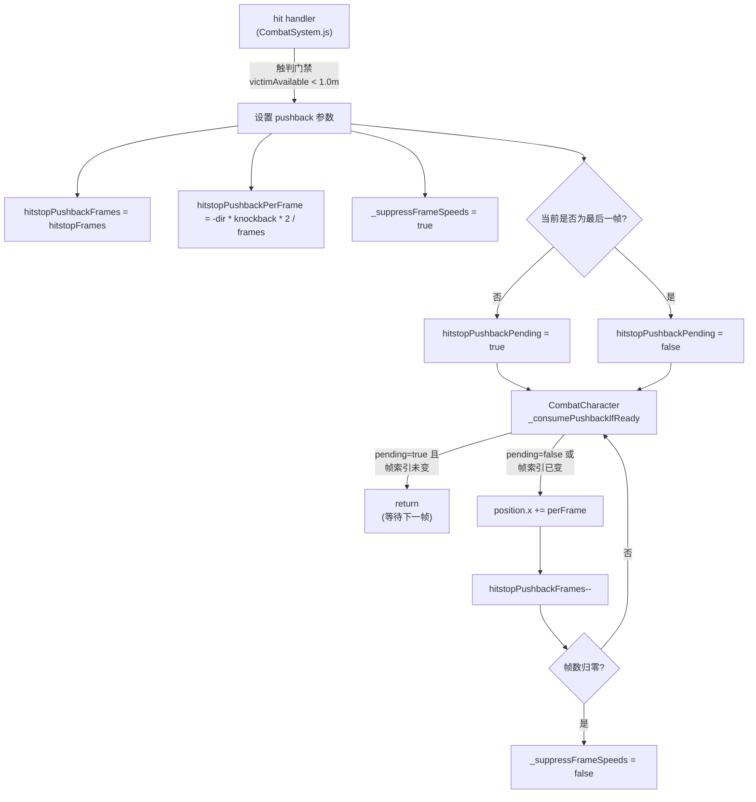
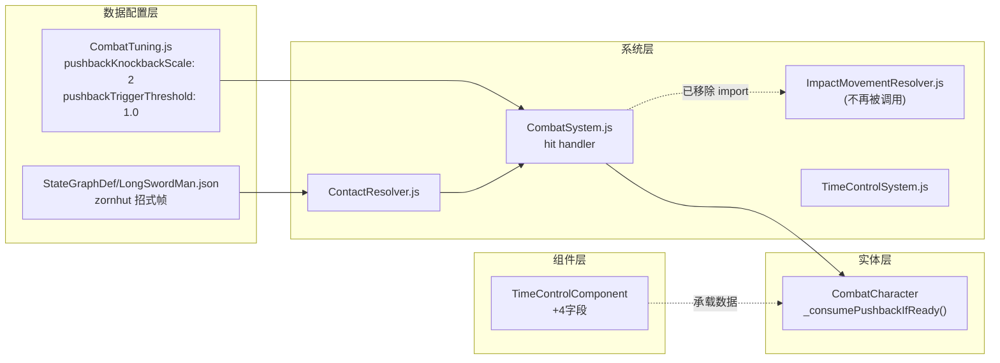

## 1. 高层摘要 (TL;DR)

* **影响等级:** 🟡 **中等** — 主要围绕**战斗命中时版边反推（Pushback）机制**的第二轮重构，并新增了碰撞盒自动生成的 Skill 文档。
* **核心改动:**
 * ✨ 重构 **Pushback v2**：完全废弃原 `ImpactMovementResolver` 的边界守恒方案，改为**固定值 + 显式边界触判 + pending 延迟启动**。
    * 🐛 修复 `zornhut` 招式帧定义：取消帧索引 3 命中、`hitstopFrames` 提升至 24、`frameSpeeds` 增加反推动作。
    * 📜 新增 `.trae/skills/collider-occupancy-更新-skill/SKILL.md` 与 `plans/Handoff.MD`，沉淀开发文档。

---

## 2. 可视化总览 (Code & Logic Map)

### Pushback v2 时序流程图



### 模块依赖关系



---

## 3. 详细变更分析

### 🛠️ 战斗数据层

#### `Data/CombatTuning.js` — 新增 Pushback 配置

| 配置项 | 类型 | 默认值 | 说明 |
|---|---|---|---|
| `pushbackKnockbackScale` | number | `2` | 边界反推系数：`attacker反推 = victimKnockback × 此值` |
| `pushbackTriggerThreshold` | number | `1.0`（米） | victim 到该侧边界距离 < 此值时才触发 |

#### `Data/StateGraphDef/LongSwordMan.json` — `zornhut` 招式帧调整

| 字段 | 旧值 | 新值 | 原因 |
|---|---|---|---|
| `attackActiveFrames` | `[3,4]` | `[4]` | 取消帧 3 命中，避免过早判定 |
| `hitstopFrames` | `10` | `24` | 拉长停顿，匹配视觉反馈 |
| `frameSpeeds` | `[0.4, 1.2, 0, 2.4, 0.4]` | `[0.4, 1.2, 0, 2.4, 0.2, -0.2]` | 末两帧增加**反推位移**（负值方向），配合 pushback 视觉效果 |

---

### 🎮 运行时逻辑层

#### `scripts/Components/TimeControlComponent.js` — 新增 4 字段

```javascript
// hitstop 结束后 attacker pushback 逐帧消费
this.hitstopPushbackFrames = 0;       // 待消费帧数
this.hitstopPushbackPerFrame = 0;     // 每帧位移量
// pending 延迟启动：hitstop 解冻后等 sprite 切到下一帧才开始
this.hitstopPushbackPending = false;
this.hitstopPushbackStartFrameIndex = 0;
```

#### `scripts/Enties/CombatCharacter.js` — 关键改动

* ❌ **删除** `_suppressFrameSpeeds` 的初始化字段（构造函数中保留，但语义改为 pushback 期间门禁）。
* ❌ **删除** `[SnapImpact]` 调试 log（含遗留 TODO 注释）。
* ✨ **新增** `_consumePushbackIfReady()` 方法：
    * **Pending 模式**：当 `hitstopPushbackPending=true` 且 `currentFrameIndex === startFrameIndex` 时，**等待 sprite 切帧**才开始消费（解决位置与 sprite 时序差）。
    * **正常消费**：每帧将 `position.x += perFrame`，帧数归零时自动清除 `_suppressFrameSpeeds`。
* 🔌 **接入点**：在动画推进路径的两处（冻结早返路径 / 正常更新路径）末尾调用，确保与 sprite 更新**同帧**。

#### `scripts/Systems/CombatSystem.js` — Pushback v2 主战场

| 改动 | 说明 |
|---|---|
| ❌ 移除 `ImpactMovementResolver` 的 `import` 与所有相关调用 | 整套边界守恒方案被废弃 |
| ❌ 移除 `attacker.root.position.x += result.attackerCompX` 瞬时反推 | 改为**逐帧消费** |
| ✨ 新增 pushback 设置块 | 命中后立即计算 `perFrame` 并写入 `TimeControlComponent` |
| 🧠 新增**显式触判** | `victimAvailable = pushDir>0 ? maxX-victimX : victimX-minX`，仅当 `< 1.0m` 才触发 |
| 🎯 新增**最后一帧判断** | `hitstopPushbackPending = !isLastFrame`，最后一帧命中立即开始消费 |

#### `scripts/Systems/ContactResolver.js` — 新增传递字段

* 在生成 hit effect context 时透传 `pushbackMultiplier`（默认 `0.05`），保留对未来基于招式调整反推量的扩展点。

#### `scripts/Systems/ImpactMovementResolver.js` — 函数签名扩展（但已无调用方）

```diff
- static resolve({ attacker, victim, victimKnockbackX, boundary }) {
+ static resolve({ attacker, victim, victimKnockbackX, boundary, attackerAdditionalPushbackX = 0 }) {
```

> ⚠️ **注**：此文件仍保留在仓库但**已无人调用**（CombatSystem 已不再 import）。属于历史资产。

#### `scripts/Systems/TimeControlSystem.js` — 微调

* 仅删除文件末尾的空行（无害 diff）。

---

### 📜 新增文档

#### `.trae/skills/collider-occupancy-更新-skill/SKILL.md` (新建)

为 AI Agent 提供的 Skill 触发规则，覆盖两条工作流：

| 触发关键词 | 工作流 | 工具脚本 |
|---|---|---|
| "更新 collider" / "更新碰撞盒" / "重新生成 collider.json" | 战斗角色 (`longswordman`, `rabble_stick`) | `scripts/tools/extract_collision_boxes.ps1` |
| "更新 occupancy" / "更新 NPC 占用盒" / "重新生成 occupancy.json" | NPC (`traveller`, `merchant`, `merchant2`) | `scripts/tools/extract_rootmotion_occupancy.ps1` |

* 包含单 action / 批量处理 / 颜色约定的完整模板。

#### `plans/Handoff.MD` (新建)

完整记录 Pushback 第二轮重构的**前序方案废弃原因**与**当前实现细节**：

* **废弃原因**：momentumDisp 时序问题、开阔地误触发、位置与 sprite 时序差、缺乏显式触判。
* **迭代路线**：第三轮计划从 frameSpeeds 推导 / StateGraph `pushbackDistance` 配置改为**计算值方案**。

#### `plans/BACKLOG.md` — 待办调整

| 删除项 | 新增项 |
|---|---|
| `framespeed的移动在命中判定后终止` | `防不住zornhut` |
| `近距离会一直尝试swing但被thrust到死` (附26.9.16 修复备注) | — |

#### `scripts/SceneDefs.js` — 无语义改动

```diff
- offsetX: 0, offsetY: 0, offset : 0, lerp: 0.12, height: 1, orthoWidth: 20
+ offsetX: 0, offsetY: 0, offset : 0, lerp: 0.12, height: 1  , orthoWidth: 20
```

仅在 `height: 1` 后面多了一个空格（**纯格式调整**）。

---

### 🖼️ 美术资源 (Binary)

* `Art/RawAssets/Env/Tavern.ase`、`arrow.ase`、`floor.kra`、`treeline_pine.kra` 均发生**二进制变更**，但 Git diff 无法查看内容。建议在编辑器中确认：
    * Tavern场景资源
    * 飞行道具 (arrow) 资源
    * 地面与松树贴图

---

## 4. 影响 & 风险评估### ⚠️ 破坏性 / 兼容性影响

| 项 | 评估 | 说明 |
|---|---|---|
| `ImpactMovementResolver.js` | **已废弃但未删除** | 仓库仍有文件，但 CombatSystem 不再 import。建议下轮清理。 |
| `_suppressFrameSpeeds` 字段 | 仍在 CombatCharacter 使用 | 删除构造函数初始化时仅影响默认值，逻辑仍保留；可安全清理。 |
| `zornhut` 招式帧表 | **API 行为变更** | `attackActiveFrames` 从 `[3,4]` → `[4]`，会改变命中窗口，下游 AI 与 HUD 计时需复核。 |
| `hitstopFrames` zornhut | **数值变更** | `10 → 24`，体感停顿明显变长，剧情 / 演出脚本可能需要同步调整。 |

### 🧪 建议测试场景

1. **开阔地 pushback 不触发**：让 attacker / victim 远离边界命中，确认无任何位置变化。
2. **贴墙 pushback 触发**：将 victim 推到 `minX` / `maxX` 附近（< 1.0m）命中，确认 attacker 反推位移 ≈ `victimKnockback × 2`。
3. **attacker 自贴墙**：victim 远墙、attacker 自贴墙，应**不**触发 pushback（触判只看 victim）。
4. **zornhut 命中在第 4 帧**：应为 `pending=true`，需等到 sprite 切到第 5 帧才开始反推位移。
5. **zornhut 命中在最后帧**：应为 `pending=false`，hitstop 解冻后**立刻**开始反推。
6. **pushback 期间 frameSpeeds 抑制**：zornhut 末两帧 `frameSpeeds` 含 `-0.2`，pushback 期间应被门禁掉，无叠加位移。
7. **二轮触判边界场景**：victim 距墙 1.05m（>1.0m 阈值），命中后应**不**触发 pushback。

### 🧹 遗留清理项（来自 `Handoff.MD`）

| 文件 | 待清理 log |
|---|---|
| `TimeControlSystem.js` | `[TimeControl hitstop] id=... frames=...` |
| `CombatSystem.js` | `[hitstop] effect.context.attackHitstopFrames=...`、`[Pushback v2] ...`、`[Pushback skip] ...` |
]<]minimax[>[