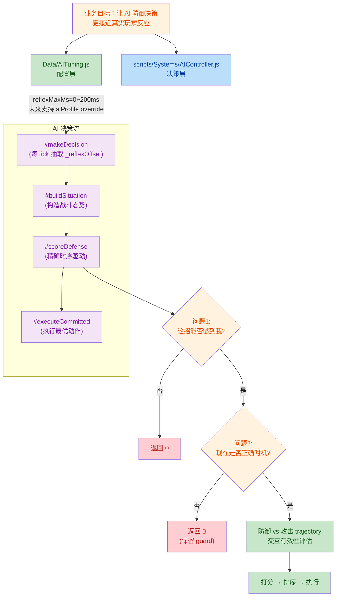
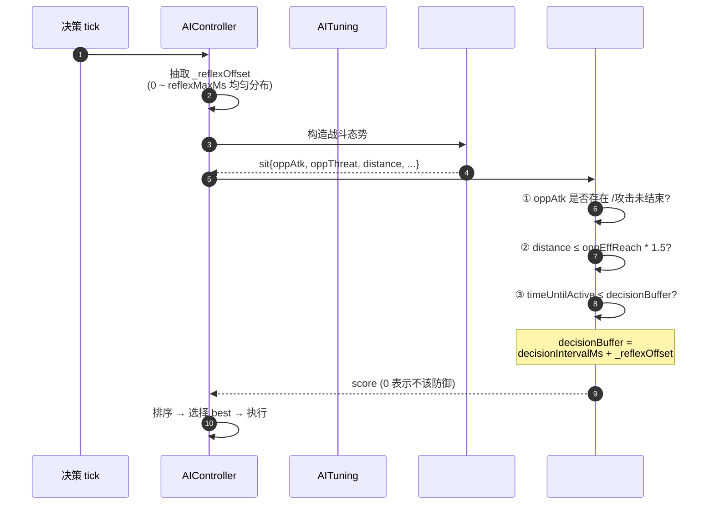

## 1. 高层摘要 (TL;DR)

* **影响范围：** **中等** — 本次提交以 AI 决策逻辑重构为核心，配合美术资产更新、计划文档迭代与新的工具型 Skill 文件。
*   **关键变更：**
    *   🧠 **AI 防御评分重写：** 将 `AIController.#scoreDefense` 从粗粒度的 `threat` 近似门控改为精确时序驱动（`timeUntilActive` + `decisionBuffer` + `reflexOffset`）。
    *   🎯 **反应延迟随机化：** 新增 `reflexMaxMs` 配置，使 AI 反应窗口可呈现真实分布（支持 tutorial/elite/boss 等差异化配置）。
    *   📋 **计划文档归档：** `BACKLOG.md` 清理已完成项，`INDEX.md` 与 `Handoff.MD` 记录版边 Pushback 第二轮交付。
    *   🛠️ **新增 Skill 文档：** `.trae/skills/collider-occupancy-更新-skill/SKILL.md` 沉淀碰撞盒 / 占用盒更新流程。
    *   🎨 **环境美术更新：** Tavern / arrow / floor / treeline_pine 4 个环境资产二进制变更。

---

## 2. 视觉概览（代码与逻辑映射图）





---

## 3. 详细变更分析

### 🧠 3.1 AI 配置层 — `Data/AITuning.js`

**变更内容：** 在 `defense` 配置块中新增 `reflexMaxMs` 字段。

| 参数 | 默认值 | 含义 |
|---|---|---|
| `reflexMaxMs` | `0` | 每个决策 tick 抽取 0~N 毫秒的随机偏移，加到防御 `decisionBuffer` 上。`0` 表示保持当前行为；`200` 表示 AI 反应窗口变为 `[100ms, 300ms]` 随机分布 |

**关键注释摘录：**
> "未来可通过 aiProfile 角色级 override（如 `tutorial=400, elite=0, boss=0`）。"

---

### 🎯 3.2 AI 决策层 — `scripts/Systems/AIController.js`

**(a) 构造器新增反应偏移字段**
```js
// 反应延迟：每个决策 tick 抽取 0~reflexMaxMs 的随机偏移
this.reflexMaxMs = this.tuning.defense?.reflexMaxMs ?? 0;
this._reflexOffset = 0;  // 每个决策 tick 更新
```

**(b) `#makeDecision` 头部抽取反射偏移**
```js
this._reflexOffset = this.reflexMaxMs > 0
    ? Math.random() * this.reflexMaxMs
    : 0;
```

**(c) 新增三组诊断日志** (`debugVisible` 时打印)
* `decision` — 决策选择与 top3候选
*   `oppAttack perception` — 对手攻击阶段、归一化时间、距离
*   `defenseScore timing window` — `timeUntilActive` / `decisionBuffer` / `urgency`

**(d) `#scoreDefense` 重写：从 threat 近似 → 精确时序**

| 维度 | 原逻辑 | 新逻辑 |
|---|---|---|
| **门控条件** | `opp.phase==="none"` 或 `oppThreat < activationThreshold` | 三段式检查：`oppAtk` 存在 &距离 ≤ `oppEffReach*1.5` & `timeUntilActive ≤ decisionBuffer` |
| **startup 评分** | 用 `myStartupMs <= oppRemainingMs` 区分"来得及/来不及" | 用 `urgency = max(0, 1 - timeUntilActive/decisionBuffer)` 表达反应紧急度 |
| **基础分** | 阶段化叠加（active/startupCanAct/startupTooLate） | 简化为 `activeBase` 或 `startupCanActBase`，tooLate 情况不再单独打分（被门控拦掉） |
| **决策间隔影响** | 未显式建模 | `decisionBuffer = decisionIntervalMs + _reflexOffset`，精确反映"决策延迟 + 反应延迟" |

**(e) 修复 `return sit` → `return {…}`**
原代码尾部有死代码 `return sit;`，现已被显式 `return {…}`取代。

> ⚠️ `oppThreat` 在 startup 阶段仍保留给 attack 评分与 positioning retreat 使用，但不再作为防御评分的门控条件。

---

### 📋 3.3 计划文档迭代

**`plans/BACKLOG.md` 变更：**

| 移除项 | 新增项 |
|---|---|
| `framespeed的移动在命中判定后终止` | `防不住zornhut` |
| `近距离会一直尝试swing但被thrust到死` | — |

> 前者在26.9.16 interrupt outcome 修复中已闭环；后者作为新的待办项沉淀。

**`plans/INDEX.md` 新增 2026-09-18 Update Log：**
*   标记"版边 Pushback 三轮迭代全部落地"
*   核心链路：`CombatSystem hit handler` → `CombatCharacter._consumePushbackIfReady` → `BattleMode post-combat clamp`
*   参数外置：`CombatTuning.hit.pushbackKnockbackScale`(2) + `CombatTuning.hit.pushbackTriggerThreshold`(1.0)
*   废弃清理：`ImpactMovementResolver` 整套移除

---

### 🛠️ 3.4 新增 Skill 文档 — `.trae/skills/collider-occupancy-更新-skill/SKILL.md`

> ✨ 新文件 — 沉淀碰撞盒 / 占用盒更新流程，提供可重复执行的工作流。

| 路线 | 适用角色 | 输出 |
|---|---|---|
| **A：战斗角色 Collider** | `longswordman`、`rabble_stick` | `Data/CollisionMask/{character}/*.collider.json` |
| **B：NPC Occupancy** | `traveller`、`merchant`、`merchant2` | `Data/RootMotion/NPCs/*.occupancy.json` |

**触发关键词：** "更新 collider" / "更新 occupancy" / "重新生成 collider.json" / "角色名+上述意图"

---

### 📝 3.5 新增交接文档 — `plans/Handoff.MD`

> ✨ 新文件 — 版边 Pushback 第二轮交接记录。

**核心内容：**
*   ✅ 第一轮（固定值 + 逐帧消费 + 时机正确）— 完成
*   ✅ 第二轮（加触判条件：只有 victim 贴墙才触发）— 完成
*   ⏳ 第三轮（固定值 → 计算值，按招式轻重/前冲量算）— 待做

**废弃方案清单：**

| 废弃项 | 原因 |
|---|---|
| `ImpactMovementResolver.js`（整套删除） | momentumDisp 因时序恒为 0 |
| `getRemainingAttackMomentumDisplacement()` | 同上 |
| `boundary resolver` + `pushbackMultiplier` 接线 | 开阔地误触发 |
| `_suppressFrameSpeeds` 初始化旧版本 | 替换为新机制 |

---

### 🎨 3.6 环境美术资产更新（二进制）

| 文件 | 格式 | 变更类型 |
|---|---|---|
| `Art/RawAssets/Env/Tavern.ase` | Aseprite | 二进制 diff |
| `Art/RawAssets/Env/arrow.ase` | Aseprite | 二进制 diff |
| `Art/RawAssets/Env/floor.kra` | Krita | 二进制 diff |
| `Art/RawAssets/Env/treeline_pine.kra` | Krita | 二进制 diff |

> ⚠️ 二进制差异不可直接审查，需美术团队确认变更意图（推测：环境贴图 / 酒馆内饰 / 箭头 icon / 地板纹理 / 松树边线）。

---

## 4. 影响与风险评估

### ⚠️ 风险点

| 风险 | 说明 |
|---|---|
| **AI 防御行为变化** | `urgency` 驱动的 start-up 评分与原 `remainingMs` 判断在边界场景下可能表现不同，需回归测试 |
| **反射延迟随机性** | `_reflexOffset` 是均匀分布，会让 AI 反应呈现"运气"成分；高难度测试需固定 seed 验证 |
| **诊断日志量** | 新增三组 `console.log`，需确认 `debugVisible` 默认关闭，否则线上日志爆炸 |
| **美术二进制无审查** | 4 个环境资产变更未附描述，需美术确认变更意图 |

### 🔄 破坏性变更

*   **无 API/数据库破坏性变更**
*   **配置层新增字段**：`reflexMaxMs`（默认 `0`，向后兼容）
*   **代码层移除废弃逻辑**：`ImpactMovementResolver` 已整套删除（按 Handoff 文档说明）

### 🧪 测试建议

1. **基础功能回归：**
    *   长剑客 vs 群众（贴近墙 / 开阔地 / attacker 自贴墙三种场景）— 确认版边 Pushback 触发条件正确
    *   zornhut 防御 — 确认 `BACKLOG.md` 新增的"防不住 zornhut"待办已复现
    *   AI 攻击被 hit 打断 — 确认 Feedback Memory 闭环（26.9.16 修复）仍正常2. **新防御评分逻辑：**
    *   对手 startup 阶段，AI 是否在 `timeUntilActive ≤ decisionBuffer` 时才出 guard（避免过早浪费 guard）
    *   对手距离 `> oppEffReach * 1.5` 时，AI 是否选择攻击/走位而非 guard
    *   多轮决策下，`_reflexOffset` 随机性是否让 AI表现更接近真实玩家
3. **配置外化验证：**
    *   `CombatTuning.hit.pushbackKnockbackScale` 改为 3 / 5 / 0，验证 pushback 距离按招式轻重变化
    *   `pushbackTriggerThreshold` 改为 0.5 / 2.0，验证触判敏感度
4. **美术资产：**
    *   4 个环境资产在场景中视觉对比，排查回归

### 📌 待清理项（按 Handoff 文档）

| 文件 | 待清理 Log |
|---|---|
| `TimeControlSystem.js` | `[TimeControl hitstop] id=... frames=...` |
| `CombatSystem.js` | `[hitstop] effect.context.attackHitstopFrames=...` |
| `CombatSystem.js` | `[Pushback v2] ...` |
| `CombatSystem.js` | `[Pushback skip] ...` |
]<]minimax[>[