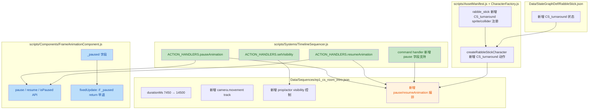

## 1. 高层摘要 (TL;DR)

*   **影响范围：** **中** —— 围绕 TimelineSequencer 新增 3 种 clip 类型 + 1 个可选字段，并相应扩展脚本/数据/文档；同时为第一章 tavern 房间序章 CS 大幅扩展编排内容。
*   **核心变更：**
    *   ✨ **3 种新 clip**：`setVisibility`（actor 视觉显隐）、`pauseAnimation`（暂停帧推进）、`resumeAnimation`（恢复帧推进）
    *   ✨ **`command` clip 新增 `pause` 可选字段**（进态后立即冻结）
    *   ✨ **`FrameAnimationComponent` 新增暂停机制**：`_paused` 状态 + `pause()`/`resume()`/`isPaused` API
    *   🎬 **`ep1_cs_room_intro` 序列大改**：时长 7450ms → 14500ms；新增相机运动 track、prop 显隐、enemy_1 的 `CS_turnaround` 动画编排
    *   🎭 **rabble_stick 新增 `CS_turnaround` 动作资源**（sprite/collider/stategraph 全链路接入）
    *   📚 同步更新 4 份设计/使用文档（PROJECT_CONTEXT、TreelinesSequencer User Guide、INDEX、Handoff、新增可见性控制设计稿）

## 2. 视觉概览（业务逻辑映射）

```mermaid
flowchart TD
    Start([Sequence ep1_cs_room_intro 启动]) --> FadeIn[t=500ms cameraEffect fade in]
    FadeIn --> HeroMove[hero 移动 + faceWorldX]
    HeroMove --> HeroSleep[hero 切到 sleep 命令]
    HeroSleep --> FadeOut1[t=3400ms fade out]
    FadeOut1 --> HiddenPhase[黑场阶段<br/>enemy_1/prop 隐藏<br/>charlotte 显示]
    HiddenPhase --> CamMove1[t=4600ms 镜头移向中景]
    CamMove1 --> CamMove2[t=8600ms 镜头拉远]
    CamMove2 --> FadeIn2[t=7500ms fade in<br/>prop_rabble_kidnap 显现<br/>charlotte 隐藏]
    FadeIn2 --> EnemyShow[enemy_1 显现 +<br/>进态 CS_turnaround pause]
    EnemyShow --> EnemyResume[t=9200ms resumeAnimation]
    EnemyResume --> HeroPause[hero sleep 暂停<br/>pauseAnimation at 8400ms]
    HeroPause --> HeroResume[hero sleep 恢复<br/>resumeAnimation at 11500ms]
    HeroResume --> CamMove3[t=11500ms 镜头回中景]
    CamMove3 --> EnemyMove[enemy_1 moveActorByDirection]
    EnemyMove --> PropHold[t=10600ms prop_rabble_kidnap hold]
    PropHold --> PropDispose[t=11000ms 销毁 prop]
    PropDispose --> HeroStand[hero 切到 standing]
    HeroStand --> Unlock[t=14500ms inputLock 解除]

    style Start fill:#bbdefb,color:#0d47a1
    style FadeIn fill:#fff3e0,color:#e65100
    style FadeOut1 fill:#fff3e0,color:#e65100
    style FadeIn2 fill:#fff3e0,color:#e65100
    style HiddenPhase fill:#f3e5f5,color:#7b1fa2
    style EnemyShow fill:#c8e6c9,color:#1a5e20
    style HeroPause fill:#c8e6c9,color:#1a5e20
    style HeroResume fill:#c8e6c9,color:#1a5e20
    style Unlock fill:#ffcdd2,color:#b71c1c
```





## 3. 详细变更分析

### 3.1 🆕 TimelineSequencer 新增 clip 类型（核心）

**文件：** `scripts/Systems/TimelineSequencer.js`

`ACTION_HANDLERS` 新增 3 个条目 + `command` handler 增加 `pause` 字段处理：

| 新 clip | 触发形式 | 行为 | 备注 |
|---------|---------|------|------|
| `setVisibility` | event clip | 通过 `actor.root.setEnabled(visible)` 级联隐藏整个 Babylon 子树 | 纯视觉层，不影响碰撞/位置/动画 |
| `pauseAnimation` | event clip | 调 `actor.animation.pause()` 冻结帧推进 | `actor.animation` 需有 pause 方法 |
| `resumeAnimation` | event clip | 调 `actor.animation.resume()` 恢复帧推进 | 从中断点继续，不重置当前帧计时 |
| `command.pause` | event clip（字段） | command 执行完后若 `pause:true` 立即调 `actor.animation.pause()` | 与 pauseAnimation 效果等价，写法更紧凑 |

**setVisibility 行为细节（Source：`scripts/Systems/TimelineSequencer.js` L725-744）：**
*   通过 `_resolveActor(ctx, track.binding)` 找 actor
*   优先用 `actor.root.setEnabled(visible)`，无 root 时 fallback 到 `actor.spritePlane.setEnabled(visible)`
*   不提供 `update`/`end` —— 区间隐藏用两条 event clip 表达
*   防御性默认 `visible = (clip.visible !== false)`，缺失字段视为显示

### 3.2 🆕 FrameAnimationComponent 暂停机制

**文件：** `scripts/Components/FrameAnimationComponent.js`

```js
// 新增字段
this._paused = false;

// 新增 API
pause()       { this._paused = true; }
resume()      { this._paused = false; }
get isPaused(){ return this._paused; }

// fixedUpdate 入口早退
fixedUpdate(dtMs) {
    if (this._paused) return;  // 关键：冻结时跳过整段帧推进
    // ... 原逻辑
}
```

**关键设计（Source：PROJECT_CONTEXT.md §20 + TimelineSequencer User Guide §5.16/5.17）：**
*   **状态机不受影响**：`CharacterBase._consumeTransition` 在 `animation.fixedUpdate` 之前执行，但 pause 期间 `normalizedTime` 不变，所以依赖 `normalizedTime` 的 transition 条件自然 freeze
*   **不跨状态持久**：`enterState` 内部调 `animation.play()` 会重置 `_paused = false`，所以 pause 期间发生状态切换会自动解除（设计意图）
*   **帧计时连贯**：`timeInFrameMs` 在 pause 期间不累积，resume 后从中断点继续

### 3.3 🎭 rabble_stick 新增 CS_turnaround 动作资源

**文件：** `scripts/AssetManifest.js`、`scripts/CharacterFactory.js`、`Data/StateGraphDef/RabbleStick.json`

| 文件 | 改动 |
|------|------|
| `scripts/AssetManifest.js` L40-45 | `atlas.rabble` 新增 `CS_turnaround` sprite 路径 |
| `scripts/AssetManifest.js` L101-106 | `colliders.rabble` 新增 `CS_turnaround` 碰撞遮罩路径 |
| `scripts/CharacterFactory.js` L217-222 | `createRabbleStickCharacter` 的 clips map 新增 `CS_turnaround` 配置（`loop: false`） |
| `Data/StateGraphDef/RabbleStick.json` L185-190 | 新增 `CS_turnaround` 状态（`loop: false`，空 `transitions`） |

> 整体动线：`CS_turnaround` 是一次性演出动作（状态图 `loop: false` + 空 transitions），配合 `command+paused` + `resumeAnimation` 实现在第一帧等待显式播放指令。

### 3.4 🎬 ep1_cs_room_intro 序列大幅扩展

**文件：** `Data/Sequences/ep1_cs_room_intro.json`

**总体变更：**
*   `durationMs`：**7450 → 14500**（增加约 7 秒）
*   track 数量：1 个 → 5 个（camera.movement / fx.fadein / prop_rabble_kidnap / chalotte_sleep / enemy_1 + 原 hero）

**新 track 1：camera.movement（多段运镜）**

| 时刻 (ms) | 指令 | 相机状态 |
|----------|------|---------|
| 4600 | `setCameraFrame` | center=[-5.22,-2.98,0], height=-2, orthoWidth=8（中景特写） |
| 4600 | `cameraBlend` (1000ms) | blend to scripted |
| 8600 | `setCameraFrame` | center=[5.7,-2.21,0], orthoWidth=20（拉远） |
| 8600 | `cameraBlend` (1000ms) | blend to scripted |
| 11500 | `setCameraFrame` | center=[-5.22,-2.98,0], orthoWidth=20 |
| 11500 | `cameraBlend` (1000ms) | blend to scripted |
| 12500 | `setCameraFollow` | follow hero, lerp=0.12, orthoWidth=20 |

**新 track 2：fx.fadein（多段淡入淡出）**

| 时刻 (ms) | 效果 |
|----------|------|
| 500 | fade from 1 to 0（开场淡入） |
| 3400 | fade from 0 to 1（淡出到黑场） |
| 7500 | fade from 1 to 0（黑场后淡入） |

**新 track 3：prop_rabble_kidnap 显隐生命周期**

| 时刻 (ms) | 操作 |
|----------|------|
| 0 | `setVisibility visible:false`（开场隐藏） |
| 7500 | `setVisibility visible:true`（淡入时显现） |
| 10600 | `command: hold` |
| 11000 | `callback: disposeProp`（销毁） |

**新 track 4：chalotte_sleep 显隐**

| 时刻 (ms) | 操作 |
|----------|------|
| 0 | `setVisibility visible:true`（显示） |
| 7500 | `setVisibility visible:false`（淡入时隐藏） |

**新 track 5：enemy_1 演出（关键创新点）**

| 时刻 (ms) | 操作 | 备注 |
|----------|------|------|
| 0 | `setVisibility visible:false` | 开场隐藏 |
| 7400 | `command: CS_turnaround, pause:true` | 进态后立即冻结在首帧 |
| 7500 | `setVisibility visible:true` | 显现（敌人出现） |
| 9200 | `resumeAnimation` | 显式触发敌人转身动画播放 |
| 10200 | `moveActorByDirection` 500ms dir=[-1,-0.5] | 转身播放完毕后向斜左方移动 |

**原 hero track 调整：**

| 时刻 (ms) | 旧指令 | 新指令 |
|----------|--------|--------|
| 3400 | command: sleep reverse | command: sleep reverse（保留） |
| 5400 | command: sleep | **8000** command: sleep |
| 7400 | command: standing | **8400** pauseAnimation（冻结 sleep 第二帧） |
| 7450 | inputLock unlocked | **9400** resumeAnimation<br/>**12800** command: standing<br/>**14500** inputLock unlocked |

### 3.5 🏞️ 场景定义调整

**文件：** `Data/SceneDefs/ep1_tavern_room.json`

| Actor | 旧配置 | 新配置 | 原因 |
|-------|--------|--------|------|
| `prop_rabble_kidnap_charlotte` | `clips.loop: { mode: "loop" }` | `clips.loop: { mode: "hold" }` + `autoPlay: false` | sequence 编排显隐，actor 自身不自动 loop |
| `rabble_stick` | 无 | `autoPlay: false` | sequence 编排演出，不让 AI/自动播放介入 |

### 3.6 🆕 新增长剑 inspect 动作的根运动数据

**新文件：** `Data/RootMotion/longswordman/longswordman_inspect.json`

*   6 帧动画根运动图集（128x128 帧尺寸，768x128 总尺寸）
*   各帧 duration：100/100/200/200/1500/100 ms
*   图层：mainvisual / main / weapon / rightarm / lefthand / cloak / rootmotion
*   暂未挂入 AssetManifest 或 StateGraph（仅基础数据落地）

### 3.7 🎨 美术资源更新（二进制文件）

*   `Art/RawAssets/Env/Tavern.ase`（Aseprite 源文件）
*   `Art/RawAssets/Env/arrow.ase`
*   `Art/RawAssets/Env/floor.kra`（Krita 源文件）
*   `Art/RawAssets/Env/treeline_pine.kra`

> 美术师更新了 tavern 房间的环境贴图源文件，导出物会重新生成 sprite atlas。

### 3.8 📚 文档同步更新

| 文件 | 改动 |
|------|------|
| `PROJECT_CONTEXT.md` L154 | 新增第 20 条 "Animation pause/resume 设计约定"，解释 pause 不污染状态机、enterState 自动解除 pause 的设计意图 |
| `docs/TimelineSequencer User Guide.md` | **重大扩展**：§5.1 command 表加 `pause` 字段；新增 §5.15 setVisibility、§5.16 pauseAnimation、§5.17 resumeAnimation 完整字段表与示例；§9.2 排查表新增 pauseAnimation 行；§10 已知限制新增第 8/9/10/11 条 |
| `plans/INDEX.md` | 新增 2026-09-02 Update Log；将 clip 类型清单由 14 改为 17 |
| `plans/Handoff.MD` | **新文件**（306 行）：交接文档，记录 `cameraBlend to explore` 出 sequence 后相机不动的根因（handler 内 `this.context.game` 误用，改为 `ctx.game`）以及 flee 结束抖动的二次根因（`#clampCameraPositionHard` 需无条件执行） |
| `plans/sequence中的character,prop可见性控制.MD` | **新文件**（193 行）：setVisibility 的设计文档，含 6 大行为边界表、5 条已知限制、扩展预留 |
| `.trae/skills/collider-occupancy-更新-skill/SKILL.md` | **新文件**（131 行）：collider/occupancy 更新工具使用规则，含 A/B 两条路线（战斗角色 vs NPC）、颜色约定表、5 条常见问题 |

### 3.9 🐛 隐含修复（来自 Handoff.MD）

虽然本 diff 未直接改动相关文件，但 `plans/Handoff.MD` 文档化了一个已修复 bug：

*   **根因：** `TimelineSequencer.js` cameraBlend handler 的 `to==="explore"` 分支误用 `this.context.game`，handler 以普通函数方式调用时 `this` 指向 plain object，`this.context` 为 undefined → 抛 TypeError 被静默吞掉
*   **影响：** `setClampEnabled` / `cameraManager.startBlend` / `state.cameraManager` 全部未执行 → `switchRig("explore")` 未调 → 相机停在 scripted rig
*   **修复：** `this.context.game` → `ctx.game`（一行改动，与同函数风格一致）

## 4. 影响与风险评估

### 4.1 ⚠️ 破坏性变更

*   **无 API 破坏**：`setVisibility` / `pauseAnimation` / `resumeAnimation` / `command.pause` 均为新增字段，未改动现有字段语义
*   **无数据库/Schema 破坏**：JSON 数据格式向后兼容
*   **clip 类型总数 14 → 17**：`plans/INDEX.md` 文档已同步

### 4.2 ⚠️ 行为约束

| 约束 | 详情 |
|------|------|
| `setVisibility` 不自动恢复 | sequence 结束后 actor 保持 hidden 状态，需显式 `visible:true` 恢复（与 `cameraBlend` 等不回滚约定一致） |
| `setVisibility` 不影响碰撞 | 隐藏后若 `blocksMovement=true` 仍阻挡玩家（视觉层与物理层解耦） |
| `pauseAnimation` 可被 `enterState` 静默解除 | 这是设计意图（切到新状态理应自动播放），但编排者需注意若 pause 期间发生 state 切换不会残留 |
| `command+paused` 与 `pauseAnimation` 等价 | 两者混用无副作用，区别仅在写法（单条 clip vs 两条 event clip） |

### 4.3 ✅ 测试建议

*   **基本可见性切换**：`ep1_cs_room_intro` 播放中观察 `prop_rabble_kidnap` / `charlotte` / `enemy_1` 三个 actor 的显隐时机是否符合预期（淡入淡出节奏）
*   **`CS_turnaround` 演出**：t=7400 敌人应"瞬间出现+停在首帧"，t=9200 才开始转身动作（视觉上"突然出现+等待一帧再转"）
*   **hero sleep 暂停**：t=8400 后 hero 应冻结在 sleep 第二帧约 3.1 秒（至 t=11500），期间状态机不应自动切到 standing
*   **缓动/插值**：t=12500 `setCameraFollow` 后，相机应平滑跟随 hero，不再停留在 scripted rig
*   **多 track 并行**：所有 5 个 track 同时启动，sequencer 不应出现竞态
*   **缓存清理**：新 handler 加入后若页面未硬刷新（Ctrl+Shift+R），`_getHandler` 返回 null —— 排查第一步永远是清缓存
*   **黑场过渡**：t=3400 淡出 → t=7500 淡入，黑场期间不应对所有 actor 有视觉残留
*   **collision 行为**：验证 `prop_rabble_kidnap` 隐藏后是否能正常穿过（如果此前有阻挡逻辑）

### 4.4 📌 遗留/未实现项

*   `longswordman_inspect.json` 数据已落地但未挂入 AssetManifest / StateGraph
*   `plans/Handoff.MD` 中提到 BACKLOG 仍有「prologue_cs_rabble_flee.json 摄像机移向 prop 时的 jitter」未解决（与本次修复的 flee 结束抖动是不同问题）
*   隐藏后阻挡问题（`setActorBlocking` 扩展）暂不在范围内
*   `setVisibility` 渐变（淡入淡出）需求暂未实现，需 material.opacity 路径支持