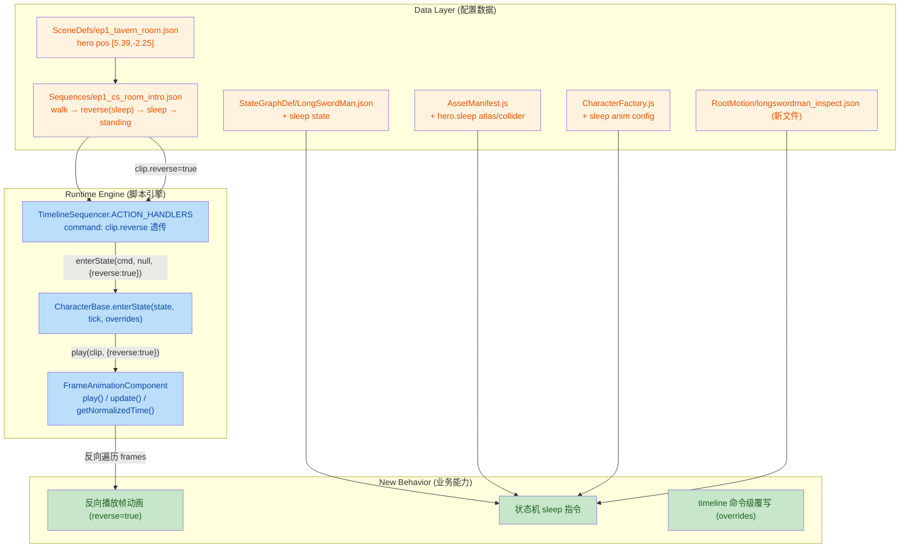
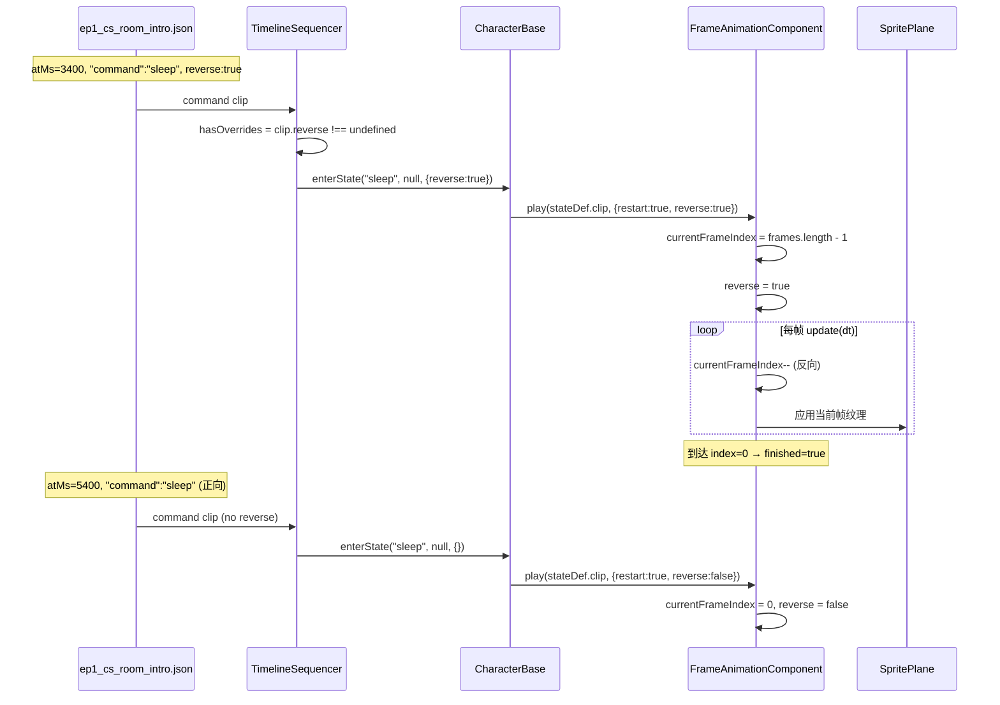

## 1. 高层摘要 (TL;DR)

*   **影响范围：** **中-高** —— 同时引入新角色状态、新序章演出、帧动画反向播放能力，并修复相机相关回归。
*   **核心变更：**
    *   ✨ **新增 `sleep` 角色状态**：LongSwordMan 状态机新增 `sleep` 指令，配套新增 sprite atlas、collider、root motion 与工厂配置。
    *   ✨ **新增 EP1 序章演出序列** `ep1_cs_room_intro`：英雄从 [5.39, -2.25] 走到床边，**先反向播放"睡下"动作，再正向播放"睡下 → 起身"动作**。
    *   🛠 **帧动画组件支持反向播放**：`FrameAnimationComponent` 新增 `reverse` 字段，`CharacterBase.enterState` 与 `TimelineSequencer` 透传该覆写。
    *   🐛 **相机抖动修复 (已记录于 Handoff)**：cameraBlend to explore 静默 crash (handler 中 `this.context` 误用) + enter 时未硬 clamp 双重问题修复。
    *   📚 新增 **collider/occupancy 更新 SKILL** 文档与 **Handoff.MD** 交接文档。

---

## 2. 可视化总览 (Code & Logic Map)



**调用链时序图：反向睡眠动作**



---

## 3. 详细变更分析

### 🧩 3.1 角色状态扩展：`sleep` 状态

**`Data/StateGraphDef/LongSwordMan.json`**
*   `commands` 列表追加 `"sleep"`。
*   新增 `states.sleep` 节点，绑定 `clip: "sleep"`，`allowMoveInput: false`，`loop: false`，`transitions: []` (即：睡眠态不会自动转出，需外部命令切走)。

**`Data/RootMotion/longswordman/longswordman_inspect.json` (新增)**
*   6 帧 root motion (128×128)，帧时长分布：`100/100/200/200/1500/100` ms。中间帧 1500ms 模拟"检查/观察"停顿；图层含 `rootmotion` 层供碰撞脚本扫描。

### 🎨 3.2 资源与工厂配置

| 文件 | 变更点 | 说明 |
|---|---|---|
| `scripts/AssetManifest.js` | `hero.sleep` atlas + collider 路径 | 注册 `./Art/Sprite/longswordman/longswordman_sleep.json` 与对应 `.collider.json` |
| `scripts/CharacterFactory.js` | `animations.hero.sleep` 块 | `spriteSheetUrl` + `atlasData` + `colliderData` + `loop: false` |
| `Data/SceneDefs/ep1_tavern_room.json` | `hero.pos`: `[0,0]` → `[5.39, -2.25]` | 与新序章起点对齐（床边） |

### 🔁 3.3 帧动画反向播放能力 (核心引擎增强)

**`scripts/Components/FrameAnimationComponent.js`**

| 变更 | 行为说明 |
|---|---|
| 新增字段 `this.reverse = false` | 反向播放标记 |
| `play()` 接受 `options.reverse` | 默认 false；设置后 `currentFrameIndex` 初始化为 `frames.length - 1` |
| `getNormalizedTime()` 分支 | 反向时 `playedFrames = (len-1 - idx) + progress`，保证从 0 单调递增到 1 |
| `update()` 拆分为 if/else | 反向：idx 递减；越界按 `loop` 处理 (回到 `len-1` 或停在 0)；非反向逻辑保留原样 |

**`scripts/Enties/CharacterBase.js`**

```js
// 关键 diff：enterState 新增 overrides 形参
enterState(stateName, tickCount = null, overrides = {}) {
    // ...
    const reverse = overrides.reverse ?? false;
    this.animation.play(stateDef.clip, { restart: true, reverse });
}
```

**`scripts/Systems/TimelineSequencer.js`**

| 行为 | 旧逻辑 | 新逻辑 |
|---|---|---|
| `hasOverrides` 判断 | 无 | `const hasOverrides = clip.reverse !== undefined;` |
| pushCommand 路径 | 始终走 `pushCommand(clip.command)` | 有 overrides 时**直接走 enterState**，避免 pushCommand 内部 enterState 不带 overrides |
| fallback enterState | `enterState(clip.command)` | `enterState(clip.command, null, {})` 或 `enterState(clip.command, null, { reverse: clip.reverse })` |

> ⚠️ **设计要点**：pushCommand 链路内的 enterState 不会透传 overrides，因此 timeline 层在检测到 `reverse` 覆写时**直接绕开** pushCommand 走 enterState，确保 reverse 生效。

### 🎬 3.4 新序章序列 `ep1_cs_room_intro`

| 字段 | 旧值 | 新值 | 说明 |
|---|---|---|---|
| `id` | `ep1_intro` | `ep1_cs_room_intro` | 与文件名一致化 |
| `durationMs` | `6600` | `7450` | 时长扩展 +850ms |
| 新增 `hero.walk` track | — | `kind:"actor"`, `binding.actorId:"hero"` | hero 主动作轨 |

**hero.walk track 时间线：**

| atMs (ms) | clip.type | 参数 | 业务含义 |
|---|---|---|---|
| 0 | `inputLock` | `locked:true` | 锁定玩家输入 |
| 0 | `faceWorldX` | `direction:-1` | 转向左 |
| 200 | `command` | `walk` | 开始走路 |
| 200 | `moveActorTo` | `x:-5.22, y:-2.98, duration:3000ms, speed:1.4, startPos:[5.39,-2.25]` | 平滑位移到床边 |
| 3000 | `faceWorldX` | `direction:1` | 转向右（朝床） |
| **3400** | `command` | `sleep`, **`reverse:true`** | **反向播放睡下（站起动作倒放 → 躺下）** |
| 5400 | `command` | `sleep` | 正向播放睡下（保持躺姿） |
| 7400 | `command` | `standing` | 起身 |
| 7450 | `inputLock` | `locked:false` | 解除输入锁定 |

### 📚 3.5 文档与流程资产

| 路径 | 类型 | 用途 |
|---|---|---|
| `.trae/skills/collider-occupancy-更新-skill/SKILL.md` | 新增 SKILL 文档 | 描述两条脚本路线 (战斗角色 collider / NPC occupancy)、PowerShell 命令模板、颜色约定 |
| `plans/Handoff.MD` | 新增交接文档 | 详细记录 cameraBlend to explore 回归问题的诊断过程与两次根因修复 |

### 🖼 3.6 二进制素材

| 文件 | 变更类型 | 备注 |
|---|---|---|
| `Art/RawAssets/Env/Tavern.ase` | Binary diff | 酒馆内景 Aseprite 工程 |
| `Art/RawAssets/Env/arrow.ase` | Binary diff | 指示箭头 |
| `Art/RawAssets/Env/floor.kra` | Binary diff | 地板 Krita 工程 |
| `Art/RawAssets/Env/treeline_pine.kra` | Binary diff | 松树林 Krita 工程 |

> 这些是环境美术原画，**无代码逻辑影响**；建议同步检查其导出的 sprite/json 是否需要更新。

---

## 4. 风险与影响评估

### ⚠️ 4.1 破坏性变更 (Breaking Changes)

| 项 | 影响范围 | 风险等级 |
|---|---|---|
| `Data/SceneDefs/ep1_tavern_room.json` `hero.pos` 改动 | 任何引用 `ep1_tavern_room` 的旧存档/旧 sequence | 🟡 中 |
| `Data/Sequences/ep1_cs_room_intro.json` `id` 从 `ep1_intro` → `ep1_cs_room_intro` | 按 id 查找该 sequence 的代码 (如 `TimelineSequencer.play("ep1_intro")`) | 🟠 中-高 |
| `LongSwordMan.json` `commands` 列表追加 `sleep` | 任何硬编码 commands 枚举的地方 | 🟢 低 (append 兼容) |
| `enterState` 签名扩展 | 调用方若用 `enterState(name, tick)` 旧两参形式仍兼容 (overrides 默认 `{}`) | 🟢 低 |

### 🐛 4.2 兼容性陷阱

1. **`ep1_intro` id 重命名**：如果 `ExploreMode._startGiveSequence` 或其他 bootstrap 仍硬编码 `"ep1_intro"`，需同步更新为 `"ep1_cs_room_intro"`。  
2. **timeline `reverse` 字段**：仅在 `pushCommand` 失败时 fallback 才会被透传；actor 必须有 `enterState` 方法（PropEntity/companion 通常满足）。  
3. **collision clip 注册**：`FrameAnimationComponent.play` 不动 `collision.setClip`，但 `CharacterBase.enterState` 仍调 `this.collision?.setClip(stateDef.clip)`，**反向播放的 sleep 帧对应的 collider 也要就绪**——已确认 `assets.colliders.hero.sleep` 已注册。  
4. **binary 美术资源**：若有任何运行时从 `Art/RawAssets/Env/*.ase|.kra` 读取，需确认上层 sprite/atlas 是否同步更新。

### ✅ 4.3 测试建议

| 场景 | 预期 | 验证点 |
|---|---|---|
| 🎬 EP1 序章完整播放 | 英雄走到床边 → 躺下 → 起身 → 镜头恢复 | 3400ms 睡下动作是否**平滑倒放**（无跳帧、纹理不撕裂） |
| 🛏 单纯 `command: sleep` | 不带 reverse 时正常正向播放 | index 从 0 → len-1 推进 |
| 🐛 cameraBlend 边界 | 序章/flee 结束后相机正确切到 explore rig | Handoff 修复后[ExploreCam] enter 日志应出现且 weight=1 |
| 🎮 玩家输入锁定 | 序章期间 `inputLock` 期间无操作响应 | atMs ∈ [0, 7450] 内 controller 输入被忽略 |
| 📦 旧 sequence 引用 | 任何引用 `id: "ep1_intro"` 的代码应改为 `"ep1_cs_room_intro"` | 全局 grep 确认 |
| 🔁 反向播放边界 | 循环模式下反向到 index=0 后回跳到 len-1 | 循环边界处的视觉是否平滑 |
| 🛡 多次 `enterState` 切换 | 反复 `sleep` ↔ `standing` 时 `reverse` 状态正确 | overrides 不应在状态间残留 |

### 🧹 4.4 后续清理建议

*   `Handoff.MD` 提及的临时 `[ExploreCam]` 诊断 log 需评估移除 (Source: `ExploreCameraRig.js:64, 80, 88`)。
*   建议排查 `TimelineSequencer.ACTION_HANDLERS` 其它 handler 是否还有 `this.context` / `this.xxx` 误用 (handler 是 plain object 方法，普通函数调用下 `this` 不指向 TimelineSequencer 实例)。
*   设计文档 `plans/Explore 相机边界（Camera Boundary）设计.MD` §5.5、§10 需同步更新。