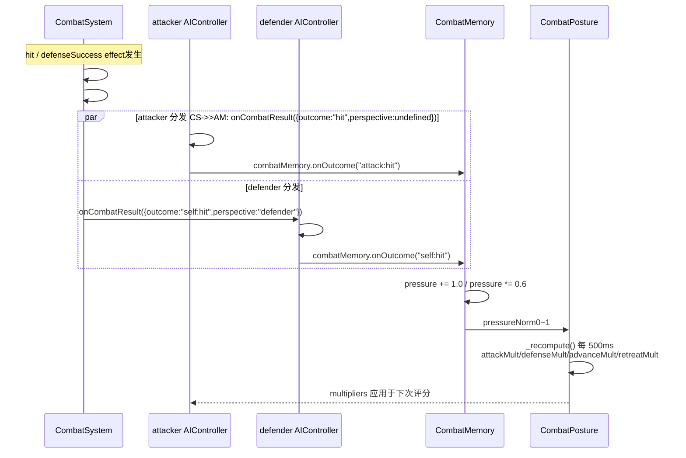
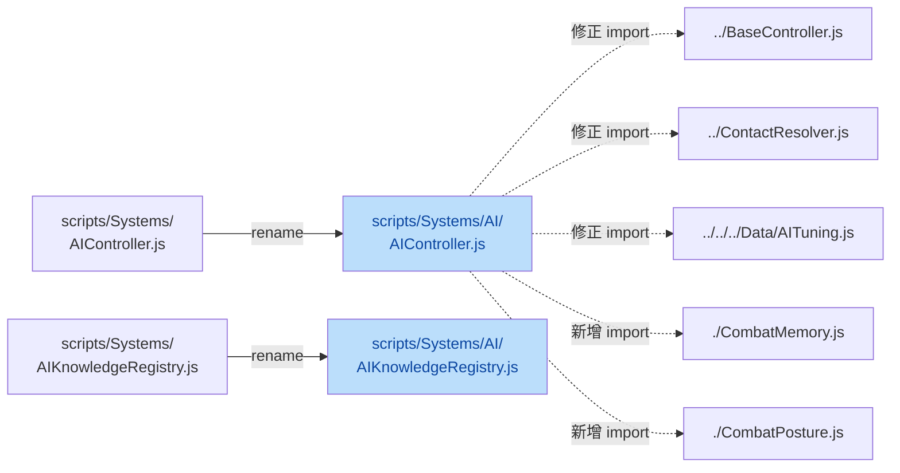

## 1. High-Level Summary (TL;DR) 🚀

* **Impact:** 🔴 **High** - AI 控制系统重大重构（Phase 0~3），引入双层架构（CombatMemory + CombatPosture），并对 CombatSystem 进行双视角 outcome 改造。同时清理了上一轮的 Pushback 方案（ImpactMovementResolver 整套废弃）。
*   **Key Changes:**
    *   ✨ **AI 文件重组**：将 `AIController.js` 和 `AIKnowledgeRegistry.js` 移入 `scripts/Systems/AI/` 子目录，并更新所有 import 路径。
    *   ✨ **新增 CombatMemory（Layer 0）**：纯历史记录层，存储5s 滑窗 outcomes + pressure衰减 + per-state tracking。
    *   ✨ **新增 CombatPosture（Layer 1）**：500ms tick 的慢变量姿态层，输出 4 个 multipliers（attack/defense/advance/retreat）。
    *   ✨ **AIController 重构**：评分管线改造 -引入 positioning（approach/hold/retreat）进入同一评分池；opPhase=`"none"` 时引入 defensiveReadiness 小分支；attacker/defender 双视角 outcome 接收。
    *   🐛 **CombatSystem 双视角 outcome**：新增 `#collectDefenderOutcomeFromEffect` + `#dispatchDefenderOutcomes`，区分 `self:hit/guard:broken/dodge:fail` 与 `guard:success/dodge:success`。
    * 🎨 **LongSwordMan 动画节奏调整**：`frameSpeeds` 由 `[0, 0, 0.2, 0.7, -0.4]` 改为 `[0, 0, 0.7, 1.2, -0.4]`（加快中段节奏）。
    *   📚 **文档完善**：新增 `Handoff.MD`（版边 Pushback 第二轮交付说明）、`SKILL.md`（collider/occupancy 更新流程）；`BACKLOG.md` 新增 AI 系统 Phase 4+ 缺口分析（B1/B2/B3）。

---

## 2. Visual Overview (Code & Logic Map) 🗺️

### 2.1 AI 决策架构（三层）

```mermaid
graph TD
    subgraph "Combat Layer（来源数据）"
        CS["CombatSystem.fixedUpdate"]
        CMem[("outcomes 事件流")]
    end

    subgraph "scripts/Systems/AI/（本次新增/迁移）"
        AIC["AIController<br/>主控制器"]
        Memory["CombatMemory<br/>Layer 0 历史记录<br/>（新增）"]
        Posture["CombatPosture<br/>Layer 1 慢变量<br/>500ms tick（新增）"]
        Registry["AIKnowledgeRegistry<br/>知识注册表"]
    end

    subgraph "评分管线"
        ScoreAtk["#scoreAttack()"]
        ScoreDef["#scoreDefense()"]
        ScorePos["#scorePositioning()<br/>Phase 2 新增"]
        Execute["#executeCommitted()"]
    end

    CS -->|"attacker outcome"| AIC    CS -->|"defender outcome<br/>perspective='defender'"| AIC
    AIC -->|"#mapToCombatMemoryOutcome()"| Memory
    Memory -->|"pressure/outcomes"| Posture
    Posture -->|"attackMultiplier /<br/>defenseMultiplier /<br/>advanceMultiplier /<br/>retreatMultiplier"| ScoreAtk
    Posture --> ScoreDef
    Posture --> ScorePos
    Registry -->|"kbProfile"| AIC
    ScoreAtk --> Execute
    ScoreDef --> Execute
    ScorePos --> Execute
    Memory -->|"getAdaptation(stateName)"| ScoreAtk

    style Memory fill:#bbdefb,color:#0d47a1
    style Posture fill:#fff3e0,color:#e65100
    style AIC fill:#c8e6c9,color:#1a5e20
    style Registry fill:#f3e5f5,color:#7b1fa2
```

### 2.2 outcome 双视角映射流



### 2.3 文件迁移路径



---

## 3. Detailed Change Analysis 🔍

### 3.1 AI 系统核心模块 ✨ (核心改动)

#### 3.1.1 文件迁移与路径修正

| 原路径 | 新路径 | 备注 |
|---|---|---|
| `scripts/Systems/AIController.js` | `scripts/Systems/AI/AIController.js` | rename，import 路径全部调整 |
| `scripts/Systems/AIKnowledgeRegistry.js` | `scripts/Systems/AI/AIKnowledgeRegistry.js` | 纯重命名，import 路径修正 |
| - | `scripts/Systems/AI/CombatMemory.js` | **新增** Layer 0 |
| - | `scripts/Systems/AI/CombatPosture.js` | **新增** Layer 1 |

**调用方同步更新**：
* `scripts/Game.js`：`import { AIKnowledgeRegistry } from "./Systems/AI/AIKnowledgeRegistry.js"` ✅
*   `scripts/Scene.js`：`import { AIController } from "./Systems/AI/AIController.js"` ✅

#### 3.1.2 CombatMemory（Layer 0，新增229 行）

**职责边界**：纯历史记录，不修改 Utility 分数，只提供数据。

| 数据结构 | 容量 | 用途 |
|---|---|---|
| `outcomes[]` | 最近 20 条 | 全局 outcome 滑窗 |
| `#perStateOutcomes: Map<stateName, [...]>` | 每 state 8 条 | per-state tactical adaptation |
| `commits[]` | 最近 6 条 | 提交行为日志 |
| `pressure` | 0~3 | 被击压力（慢变量） |
| `consecutiveMisses` | 计数 | 连续 attack miss |

**outcome 类型枚举（与计划文档对齐）**：

| 视角 | outcome枚举 | 来源 mapping |
|---|---|---|
| attacker | `attack:hit` / `attack:miss` / `attack:parried` | `hit` / `miss` / `parried` / `guard_blocked` / `interrupted` |
| defender | `self:hit` / `guard:success` / `guard:broken` / `dodge:success` / `dodge:fail` | CombatSystem 直接传入 |

**关键 API**：
* `onOutcome(outcome, stateName)`：记录 outcome + 更新 pressure/consecutiveMisses
*   `onOppOutcome(oppOutcome)`：对手 miss → pressure *= 0.7
*   `pushCommit(kind, stateName)`：记录一次行为 commit
*   `tick(dtMs)`：每帧调用，pressure 衰减（×0.995^Δt/500ms, half-life ≈ 135s）+ 过期清理
*   `getAdaptation(stateName)`：Phase 3 新增，返回 `{consecutiveFail, consecutiveSuccess}`，替代旧 `#computeAdaptationFactor`
*   `pressureNorm` getter：pressure 归一化 0~1

**压力更新规则**：

| outcome | 效果 |
|---|---|
| `self:hit` / `guard:broken` / `dodge:fail` | `pressure = min(3.0, pressure + 1.0)` |
| `guard:success` / `dodge:success` | `pressure *= 0.6` |
| `attack:hit` | `pressure *= 0.7` + `consecutiveMisses = 0` |
| `attack:miss` / `attack:parried` | `consecutiveMisses += 1` |

#### 3.1.3 CombatPosture（Layer 1，新增 176 行）

**职责边界**：每 500ms tick 一次，把 Memory + Situation 转成 4 个 1.0-centered multipliers。

| Multiplier | 范围 | 消费方 | 语义 |
|---|---|---|---|
| `attackMultiplier` | [0.6, 1.4] | `#scoreAttack` | >1 鼓励攻击，<1 抑制 |
| `defenseMultiplier` | [0.7, 1.3] | `#scoreDefense` | >1 鼓励防御，<1 抑制 |
| `advanceMultiplier` | [0.7, 1.3] | `#scorePositioning` | >1 鼓励靠近 |
| `retreatMultiplier` | [0.7, 1.3] | `#scorePositioning` | >1 鼓励后退 |

**target 计算（核心公式）**：

```javascript
tAttack  = baseAggression - pressureNorm * cautionFromDamage
         - consecutiveMissesNorm * cautionFromMisses
         + (oppVulnerable > 0.5 ? punishDesire : 0)
         - smoothstep(oppIdleMs, 800, 2000) * idleCaution;

tDefense = baseDefense
         + pressureNorm * defenseFromDamage
         + smoothstep(oppIdleMs, 800, 2000) * readinessFromIdle
         + (oppPhase === "startup" ? startupDefenseBonus : 0);

tAdvance = clamp(tAttack * distanceAppetite, 0.7, 1.3);
tRetreat = clamp(tDefense * retreatDesire, 0.7, 1.3);

// Low-pass smoothing
mult += alpha * (tMult - mult) // alpha = 0.15
```

**Debug label**：根据 `attackMultiplier` / `defenseMultiplier` 阈值输出 `AGGRESSIVE` / `DEFENSIVE` / `CAUTIOUS` / `NEUTRAL`。

#### 3.1.4 AIController 重构（~500 行 diff）

**a) 构造函数新增字段**：

| 字段 | 用途 |
|---|---|
| `combatMemory` | Layer 0 实例 |
| `combatPosture` | Layer 1 实例（持有 memory 引用） |
| `_oppLastPhase` | 用于检测 opp 从 active→none |
| `_oppLastActiveTs` | 用于计算 oppIdleMs |
| `_selfJustHitByOpp` | opp miss 判定 |

**b) `#mapToCombatMemoryOutcome()` 桥接方法**：把 CombatSystem 原始 outcome 映射到计划文档枚举。

| CombatSystem outcome (attacker) | 映射为 |
|---|---|
| `hit` | `attack:hit` |
| `miss` | `attack:miss` |
| `parried` | `attack:parried` |
| `guard_blocked` | `attack:miss` |
| `interrupted` | `attack:miss` |
| `clash` | `null`（不算 outcome） |

**c) `#checkOppMiss()`（Phase 0 修复）**：观察 opp phase 从 `in_attack` → `none` 且 `!_selfJustHitByOpp` → 调用 `combatMemory.onOppOutcome("miss")` → `pressure *= 0.7`。**关键修复**：`_selfJustHitByOpp` 只在 opp 进入新 attack 时重置，不再每 tick 无条件清，确保 active→none 时 flag 恰好反映"这招打到我了吗"。

**d) `fixedUpdate` 流水线改造**：

| 阶段 | 改动 |
|---|---|
| tick入口 | 新增 `this.combatMemory.tick(dtMs)` |
| 决策间隔 | 决策后调用 `combatPosture.update(intervalMs, sit)` + `#checkOppMiss()` + `#logPhase0Status()` |

**e) `#makeDecision()` 重构**：

| 改动 | 说明 |
|---|---|
| ❌ 删除 `#computeAdaptationFactor()` | 改为读 `combatMemory.getAdaptation()` |
| ❌ 删除 `#executePositioning()` | 改为 `#scorePositioning()` 进入评分池 |
| ✨ 新增 positioning评分 | approach/hold/retreat 与 attack/defense 同池竞争 |
| ❌ 删除 `committedScoreThreshold` 硬门控 | 改为 `score > 0` 直接执行（极端情况全部 hold） |
| ✨ 新增 oppPhase=`"none"` defensiveReadiness | guard 可在 opp idle 2s+ 时获得0.08 × readiness × pressureNorm 的小分 |

**f) `#scoreAttack()` 接入 Layer 1**：

```javascript
//末尾新增：
score *= this.combatPosture.attackMultiplier;  // Phase 1
score *= this.tuning.aiProfile.attackPreferences[attack.stateName] ?? 1.0;  // Phase 1 per-attack 偏好
```

**g) `#scoreDefense()` 接入 Layer 1**：

```javascript
// 末尾新增：
score *= this.combatPosture.defenseMultiplier;  // Phase 1
```

**h) `#scorePositioning()`（Phase 2 全新方法）**：

| 子动作 | 触发条件 | 基础分 | multiplier |
|---|---|---|---|
| approach | `distance > maxEffReach` | `0.35 * min(1, distanceHunger + 0.5)` | × advanceMultiplier |
| hold | `closestMinReach < distance ≤ maxEffReach` | `0.15`（cooldown 中 +0.08） | 不乘 |
| retreat | `distance ≤ closestMinReach + 0.3` 或 oppThreat > threshold | `0.5` / `0.3` | × retreatMultiplier |

distanceHunger 用 smoothstep 在 `[maxEffReach*1.5, maxEffReach*3]` 之间从 0→1。

**i) `#executeCommitted()` 适配 positioning**：

```javascript
// Phase 2: positioning 三候选 — 只设 moveIntent，没有 stateName 可 queue
if (kind === "approach" || kind === "hold" || kind === "retreat") {
    if (kind === "approach") this.setMoveIntent({x: -1, y: 0});
    else if (kind === "retreat") this.setMoveIntent({x: 1, y: 0});
    else this.setMoveIntent({x: 0, y: 0});
    this.combatMemory.pushCommit(kind, kind);
    this.#consecutiveAttackUsage = null;
    return;
}
// attack / defense 原逻辑保持```

**j) `#logPhase0Status()` 新增 debug 输出**（每 decision tick ~5Hz）：

```
[Phase0] oppIdleMs=0.5s oppPhase=none oppVuln=0.00 | 
Mem: pressure=0.00 consecMiss=0 outCnt=3 | 
Posture: cur={att=1.00,def=1.00,adv=1.00,ret=1.00} 
tgt={att=1.00,def=1.00,adv=1.00,ret=1.00} → NEUTRAL
```

---

### 3.2 CombatSystem 双视角 outcome ✨

**新增的两个 Map**：
* `outcomeMap: Map<attackerId, {outcome, attackInstanceId}>` —— 已有
*   `defenderOutcomeMap: Map<defenderId, {outcome, attackerId}>` —— **Phase 0 新增**

**`#collectDefenderOutcomeFromEffect()` 映射规则**：

| effect.type | 防御方状态 | 映射 outcome |
|---|---|---|
| `hit` | `guardActive === true` | `guard:broken` |
| `hit` | `dodgeActive === true` | `dodge:fail` |
| `hit` | 正常 | `self:hit` |
| `defenseSuccess` | `source === "dodge"` | `dodge:success` |
| `defenseSuccess` | `source === "guard_block"` 或 `"parry"` | `guard:success` |

**`#dispatchDefenderOutcomes()`** 通过 `controller.onCombatResult({outcome, perspective: "defender"})` 回传给 defender，attacker 视角回传保持不变。

---

### 3.3 动画数据微调 🎨

**`Data/StateGraphDef/LongSwordMan.json`**（line 282-286）：

| 项 | 旧值 | 新值 | 影响 |
|---|---|---|---|
| `frameSpeeds[2]` | `0.2` | `0.7` | 第 2 帧位移节奏 ×3.5 倍 |
| `frameSpeeds[3]` | `0.7` | `1.2` | 第 3 帧位移节奏 ×1.7 倍 |
| `frameSpeeds[4]` | `-0.4` | `-0.4` | 不变 |

整体加快中段动画位移速度，需要回归测试是否与 hitbox 时序匹配。

---

### 3.4 资源文件（4 个二进制） 📦

| 文件 | 类型 | 备注 |
|---|---|---|
| `Art/RawAssets/Env/Tavern.ase` | Aseprite 二进制 | 酒馆场景图 |
| `Art/RawAssets/Env/arrow.ase` | Aseprite 二进制 | 箭头图元 |
| `Art/RawAssets/Env/floor.kra` | Krita 二进制 | 地板图层 |
| `Art/RawAssets/Env/treeline_pine.kra` | Krita 二进制 | 松树林图层 |

仅文件 hash变化，diff 中无可读 diff 内容。**建议**：在 Aseprite/Krita 中打开验证视觉无回退。

---

### 3.5 文档与流程 ⚠️

| 文件 | 类型 | 摘要 |
|---|---|---|
| `plans/BACKLOG.md` | 新增章节 | AI 系统 Phase 4+ 缺口分析（B1/B2/B3 优先级排序）|
| `plans/Handoff.MD` | 新建 | 版边 Pushback 第二轮交付 — 废弃 ImpactMovementResolver，采用"固定值 + pending 延迟 + 显式边界触判" |
| `.trae/skills/collider-occupancy-更新-skill/SKILL.md` | 新建 | 触发关键词："更新 collider / 更新 occupancy"；区分战斗角色（路线 A）与 NPC（路线 B）两条更新路径 |

**BACKLOG.md 新增内容要点**：
*   **Rabble 草案（Phase 4 可直接用）**：JSON 配置 `baseAggression/baseDefense/decayAlpha/distanceAppetite/retreatDesire/repetitionCostRate/attackPreferences`。
*   **B1（中优先）**：不区分 opp 出什么招 → 补 attackProfile 感知。
*   **B2（高优先）**：缺 `defensePreferences` → 补 per-defense-state 偏好。
*   **B3（低优先）**：positioning 仅一维推拉 → 加 strafe。

**Handoff.MD 核心结论**：上一轮基于 ImpactMovementResolver 的整套方案**完全废弃**（含 momentumDisp、boundary resolver 接线、pushbackMultiplier、TimeControl slip 字段），新方案核心：
1. **固定值 + pending 延迟启动 + 显式边界触判**
2. `PUSHBACK_TRIGGER_THRESHOLD = 1.0m`（约一个 pushbox 宽）
3. pending 机制：等 sprite 切帧再开始（避免与 frameSpeeds 抢改 position）
4. `_suppressFrameSpeeds` 防止 frameSpeeds 干扰

---

## 4. Impact & Risk Assessment ⚠️

### 4.1 破坏性改动（Breaking Changes）

| 改动 | 影响面 | 风险 |
|---|---|---|
| 🟢 AI 文件迁移到 `scripts/Systems/AI/` 子目录 | 所有引用 `AIController` / `AIKnowledgeRegistry` 的文件 | **低** - 已同步更新 `Game.js`、`Scene.js`；需 grep确认无遗漏 |
| 🟡 删除 `committedScoreThreshold` 硬门控 | 评分阈值行为 | **中** - 极端低分不再强制走 positioning，可能导致 AI行为细微变化 |
| 🟡 `#scoreAttack` 末尾乘 `attackMultiplier` + `attackPreferences` | AI 攻击评分 | **中** - 新 multiplier 范围 `[0.6, 1.4]`，需回归测试各 profile |
| 🟡 `#scoreDefense` 末尾乘 `defenseMultiplier` | AI 防御评分 | **中** - 新 multiplier 范围 `[0.7, 1.3]`，需回归测试 guard 触发频率 |
| 🟡 CombatSystem 新增 defender 视角 outcome 回传 | 所有 controller.onCombatResult | **中** - 双重 outcome 可能让 CombatMemory 累计压力变快（一次 hit 现在会同时影响 attacker 和 defender 的 AI） |
| 🟢 `LongSwordMan.json` frameSpeeds 调整 | longswordman 战斗手感 | **低** - 节奏加快，需验证 hitbox 时序仍对齐 |

### 4.2 性能影响

*   `combatMemory.tick(dtMs)` 每帧调用：O(outcomes.length) + O(perStateOutcomes entries)，maxOutcomes=20、perStateMax=8，开销可忽略。
*   `combatPosture.update()` 每 500ms 才触发 `_recompute()`，计算量可控。
*   `outcomeMap` + `defenderOutcomeMap` 双 Map：每帧 effect 数量较少（<10），无明显开销。

### 4.3 测试建议 🧪

#### 必测场景
1. **AI行为回归**：
    *   长剑男 vs 玩家（baseline行为）→ 攻击 / 防御 / 走位比例是否变化
    *   Rabble 角色（若已启用 Phase 4）→ defenseMult 是否按压力调整
2. **outcome累计正确性**：
    *   玩家击中 AI → AI 端 CombatMemory.pressure 是否 +1
    *   AI 被防住 → AI 端是否记 `attack:miss` 而非 `attack:hit`
    *   AI 防御成功 → AI 端 `guard:success` 是否触发 pressure *= 0.6
3. **positioning 评分**：
    *   距离 > maxEffReach*3 → approach 是否赢
    *   oppThreat 高 + 距离 ≤ maxEffReach → retreat 是否赢
    *   攻击圈内 → hold 是否被 attack击败（hold=0.15 < attack.baseWeight=0.4）
4. **defensiveReadiness 分支**：
    *   opp idle 2s+ + AI 被打过（pressure>0）→ guard是否有小分
 *   opp idle 2s+ + AI 没被打过（pressure=0）→ guard 是否仍为 0
5. **Pushback 触判门禁**：
    *   开阔地命中 → 是否正确跳过 pushback
    *   victim 贴墙 + attacker 不贴墙 → pushback 是否触发
    *   victim 不贴墙 + attacker 贴墙 → pushback 是否被跳过（只看 victim）
6. **frameSpeeds 节奏**：
    *   longswordman attack动作中段是否仍能命中（hitbox 时序对齐）

#### 边界场景
*   `combatMemory.outcomes` 达到 maxOutcomes=20 → shift 是否正确
*   `combatPosture` 第一次 `update()` → `_initialized = false` 分支立即 recompute
*   `_selfJustHitByOpp` 在 opp phase=none→in_attack 重置时序### 4.4 后续待办（来自文档）

| 来源 | 待办 |
|---|---|
| `Handoff.MD` | 清掉所有 debug log（TimeControlSystem / CombatSystem 中 hitstop/pushback诊断） |
| `Handoff.MD` | 第三轮 Pushback：固定值 1.5m → 计算值（按招式轻重 / 前冲量）+ 边界 clamp attacker |
| `BACKLOG.md` | Phase 4 Rabble profile 落地，验证7 个 knob 效果 |
| `BACKLOG.md` | B2（高优）：补 `aiProfile.defensePreferences`（最小改动、性价比最高） |
| `SKILL.md` | PowerShell `-ExecutionPolicy Bypass` 必须带（已写明） |

---

## 📎 关键文件路径速查

| 模块 | 路径 |
|---|---|
| AI 主控制器 | `scripts/Systems/AI/AIController.js` |
| AI知识注册 | `scripts/Systems/AI/AIKnowledgeRegistry.js` |
| 新增 Layer 0 | `scripts/Systems/AI/CombatMemory.js` |
| 新增 Layer 1 | `scripts/Systems/AI/CombatPosture.js` |
| Combat核心 | `scripts/Systems/CombatSystem.js` |
| 入口 | `scripts/Game.js` / `scripts/Scene.js` |
| 数据 | `Data/StateGraphDef/LongSwordMan.json` / `Data/AITuning.js` |
| 文档 | `plans/Handoff.MD` / `plans/BACKLOG.md` / `.trae/skills/collider-occupancy-更新-skill/SKILL.md` |