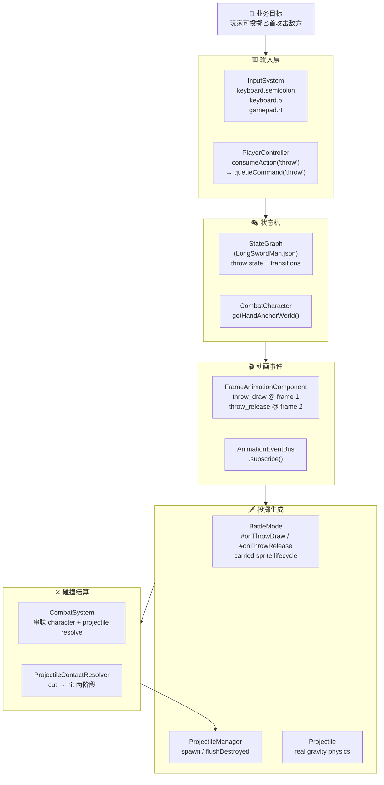

# 🎯 投掷物（飞刀/匕首）系统端到端接入 — 代码评审摘要

> 项目：`BlindDuel`（Blinding Duel，剑斗 RPG）｜此次 diff 把"玩家投掷飞刀"从设计稿落地到了完整可玩链路

---

## 1. 🧭 High-Level Summary (TL;DR)

| 项目 | 内容 |
|---|---|
| **Impact** | 🟠 **High** — 新增完整的投掷物子系统（实体 / 管理器 / 碰撞 / 状态机 / 输入 / 资产 / 文档） |
| **范围** | 涉及 16 个 .js / .json 文件 + 3 个 .ps1 / .md 工具脚本 + 4 个二进制美术资产（.ase/.kra） |
| **关键性质** | 一次性闭环：Phase 1 物理 → Phase 2 碰撞 → Phase 3a 资产 → Phase 3b 输入&动画绑定 |
| **遗留风险** | 5 处 `[DIAG]` 调试 log 未清理；carried sprite z 遮挡修复 diff 待 Accept；无冷却/弹药 |

**Key Changes:**
- ✨ **新建 `Projectile` 实体** —— 真重力抛物线、X 恒速、落地销毁、`alphaIndex=9000` 永远在上层但仍受 stencil 遮挡
- ✨ **新建 `ProjectileContactResolver`** —— 两阶段碰撞：**斩 → 击**（slash 武器可斩断 `cuttable` 飞刀），自伤豁免（ownerId 跳过）
- ✨ **新建 `ProjectileManager`** —— `spawn / fixedUpdate / flushDestroyed` 三段式生命周期管理
- ✨ **新建投掷闭环**：`;` / `P` / RT 键 → `bufferAction("throw")` → `queueCommand("throw")` → `StateGraph throw 状态` → `throw_release 帧事件` → `BattleMode 订阅` → `spawn Projectile`
- 🐛 **场景控制器调整**：`rabble_stick` 从 `ai` 改为 `dummy`（避免在测试期间被 AI 反击）
- 🛠️ **碰撞盒工具升级**：`extract_collision_boxes.ps1` 新增 `hand anchor`（粉色 `#FF00FF`）扫描，输出到 `anchors.hand`
- 📚 **新增 Handoff 文档**：`plans/Handoff.MD` 229 行项目交接说明（架构约束 / 已知问题 / 后续 TODO）

---

## 2. 🗺️ Visual Overview (Code & Logic Map)

### 2.1 端到端数据流（用户按 `;` → 飞刀命中/落地）

```mermaid
sequenceDiagram
    autonumber
    actor User as 👤 玩家
    participant IS as InputSystem
    participant PC as PlayerController
    participant SG as StateGraph<br/>(LongSwordMan.json)
    participant FAC as FrameAnimationComponent
    participant Bus as AnimationEventBus
    participant BM as BattleMode
    participant PM as ProjectileManager
    participant CS as CombatSystem
    participant PCR as ProjectileContactResolver
    participant CC as CombatCharacter<br/>(受击者)

    User->>IS: 按下 ";" (event.code='Semicolon')
    IS->>IS: keyboard.semicolon = true
    IS->>PC: consumeAction("throw")
    PC->>CC: queueCommand("throw")
    CC->>SG: 当前态(standing/walk/idle/move) 检测到 throw command
    SG->>CC: 迁移到 throw 状态（clip="throw"）
    CC->>FAC: 播放 throw clip
    FAC->>FAC: 推进 frame，到 frame 1
    FAC->>Bus: dispatch throw_draw
    Bus->>BM: #onThrowDraw → 创建 carried sprite（手牌匕首平面）
    FAC->>FAC: 推进 frame，到 frame 2
    FAC->>Bus: dispatch throw_release
    Bus->>BM: #onThrowRelease → dispose carried + spawn Projectile
    BM->>PM: spawn(config)
    PM->>PM: new Projectile(scene, config)
    Note over PM: 每 tick: Projectile.fixedUpdate()<br/>重力积分、X 恒速

    loop 每个 fixedUpdate tick
        PM->>PM: Projectile.fixedUpdate(dtMs, tick)
        BM->>CS: fixedUpdate(combatants, tick, {projectiles})
        CS->>PCR: resolve(projectiles, combatants)
        alt 命中 slash weaponbox（cuttable=true）
            PCR->>CS: effect {type: "projectile_cut"}
            PCR->>CS: effect {type: "projectile_destroy"}
        else 命中 hitbox 且非 ownerId
            PCR->>CS: effect {type: "hit", attackerId=owner}
            PCR->>CS: effect {type: "projectile_destroy"}
        end
        CS->>PM: requestDestroy(projId)
        BM->>PM: flushDestroyed() —— 出池 + dispose Babylon
    end

    alt hit 命中
        CS->>CC: takeDamage → hitstop / knockback
    end

    alt simPos.y <= groundY
        PM->>PM: Projectile 落地销毁
    end
```

### 2.2 投掷闭环 — 业务目标 ↔ 模块映射



### 2.3 关键决策（设计亮点）

```mermaid
graph TD
    subgraph Collision["ProjectileContactResolver 两阶段"]
        A["SubPhase A<br/>projectile ↔ weaponbox (slash)"]
        B["hit! → effect: projectile_cut"]
        C["effect: projectile_destroy"]
        D["cutIds.add(projectileId)"]
        E["SubPhase B<br/>surviving projectile ↔ hitbox"]
        F["ownerId 跳过 → 自伤豁免"]
        G["hit! → effect: hit (复用)"]
        H["attackHitstopFrames=0 → 投射者不卡帧"]

        A --> B --> C --> D --> E --> F --> G --> H
    end

    subgraph Projectile["Projectile 物理"]
        P0["v0 = √(2 * g * arcHeight)"]
        P1["X 恒速 velocity.x"]
        P2["Y 重力积分 vy -= g*dt"]
        P3["simPos.y <= groundY → 销毁"]
        P4["落地 snap 到 groundY 防止穿透"]

        P0 --> P1 --> P2 --> P3 --> P4
    end
```



---

## 3. 🔬 Detailed Change Analysis

### 3.1 🗡️ 投掷物核心实体（新增）

#### `scripts/Enties/Projectile.js`（新建，210 行）

| 字段 | 类型 | 默认值 | 说明 |
|---|---|---|---|
| `id` | string | `proj_{ownerId}_{timestamp}` | 唯一标识 |
| `ownerId` | string\|null | `null` | 用于自伤豁免 |
| `teamId` | string\|null | `null` | 阵营 |
| `cuttable` | boolean | `true` | 是否可被 slash 武器斩断 |
| `damage` | number | `1` | 命中伤害 |
| `lifetimeMs` | number | `4000` | 安全网寿命（落地检测失败兜底） |
| `gravity` | number | `20` | Y 轴重力（world units/s²） |
| `arcHeight` | number | `0` | 弧峰在出手点**上方**（world units） |
| `velocity.x` | number | `6` | 恒定水平速度 |
| `velocity.y` | number | `√(2·g·h)` | 初速度自动从 arcHeight 推导 |
| `colliderHalfWorld` | object | frameRect / 2 | 从像素 → 世界（`× pxToWorld`） |
| `renderTransform.{previous, current}` | Vector3 | 同 simPos | Scene.entityPool 插值 duck type |

**物理流程**（来自 `fixedUpdate`）：
```
prevSimPos ← simPos
X: simPos.x += velocity.x * dt
Y: velocity.y -= gravity * dt
   simPos.y  += velocity.y * dt
   if simPos.y <= groundY → snap 到地面 + isDestroyed = true
   if elapsed >= lifetimeMs → isDestroyed = true  (兜底)
```

**渲染层级**：`spritePlane.alphaIndex = 9000`（角色/prop=0，depthMask=10000），既能在场景道具前面看到，又被 stencil 墙遮挡。

#### `scripts/Systems/ProjectileManager.js`（新建，88 行）

| 方法 | 职责 |
|---|---|
| `spawn(config)` | `new Projectile(scene, config)` + 推入 `entityPool` 参与 render interpolation |
| `fixedUpdate(dtMs, tick)` | 遍历 `_projectiles`，对每个 `!isDestroyed` 的调 `Projectile.fixedUpdate` |
| `getActiveProjectiles()` | 过滤未销毁的（给 `ProjectileContactResolver` 用） |
| `requestDestroy(id)` | 由 `CombatSystem` 调用 → 标记 `isDestroyed=true` 推迟到下个 `flushDestroyed` |
| `flushDestroyed()` | 出池（`entityPool.splice`）+ `dispose()`（texture/material/plane/root） |
| `clearAll()` | `BattleMode.exit()` 用 → 标记所有 → flush |

#### `scripts/Systems/ProjectileContactResolver.js`（新建，206 行）

**两阶段碰撞**（`SubPhase A → SubPhase B`）：

| 阶段 | 输入对 | 触发条件 | 产出 effects |
|---|---|---|---|
| **A · 斩** | projectile ↔ weaponbox | `box.boxRole === "attack"` 且 `box.attackTrajectory === "slash"` 且 `proj.cuttable` | `projectile_cut`（信息性）+ `projectile_destroy` |
| **B · 击** | surviving projectile ↔ hitbox | 不在无敌/dodge 时；**`snap.characterId !== proj.ownerId`**（自伤豁免） | 复用 `hit` effect（attackerId=proj.ownerId），+ `projectile_destroy` |

**复用 hit effect 的设计要点**：
- `attackHitstopFrames: 0` —— 投射者不卡帧（已经完成"投掷出手"的打击感）
- `pushbackMultiplier: 0.05` —— 软击退
- `knockbackX` 用 `#signedKnockback`（基于 `box.center.x` vs `projBox.center.x`）
- `attackInstanceId: null, attackLevel: null` —— 标记为投射物而非近战

**碰撞算法**：复制自 `ContactResolver.#obbIntersect2D` 的 4 轴 OBB 分离测试（注释明确写"don't refactor in prototype phase"）。

---

### 3.2 ⌨️ 输入层（修改）

#### `scripts/Systems/InputSystem.js`

**键盘绑定**（关键 bug 修复：从中文 IME + `key in keyboard` 守卫两个坑里爬出来）：

| 触发 | 实际判断 | 备注 |
|---|---|---|
| `;` | **`event.code === "Semicolon"`**（绕开全角 `；` 陷阱） | 写在 `if (key in this.keyboard)` 守卫**外面**（`semicolon` 字段≠`;` 字符） |
| `P` | `key === "p"` + 跟踪 `keyboard.p` | 备用 |
| `RT` (Xbox) | `gamepad.buttons[7].pressed` → bufferAction | 右扳机 |

`keyboard` 对象新增 `semicolon` / `p`，`gamepad` 新增 `rt`。

#### `scripts/Systems/PlayerController.js`

```js
if (this.inputSystem.consumeAction("throw", tickCount)) {
    console.log("[DIAG] PlayerController: queueCommand('throw')");  // 待清理
    this.queueCommand("throw");
}
```

紧跟在 `consumeAction("dodge")` 之后，复用同一套动作消费管线。

---

### 3.3 🎭 状态机（修改）

#### `Data/StateGraphDef/LongSwordMan.json`

| 改动点 | 说明 |
|---|---|
| `inputs.commands` | 追加 `"throw"` |
| `standing` / `walk` / `idle` / `move` 各自的 `transitions` | 都加了 `{ to: "throw", when: [{command: "throw"}] }` |
| 新增 `throw` 状态 | `clip: "throw"`, `allowMoveInput: false`, `loop: false`, transition 到 idle（`time normalized >= 1.0`） |

---

### 3.4 🎬 动画事件 & 资产注册（修改）

#### `Data/AnimationEvents/longswordman/longswordman_throw.events.json`（新建）

```json
{ "clips": { "throw": {
    "events": [
      { "frame": 1, "type": "throw_draw" },
      { "frame": 2, "type": "throw_release" }
    ]
}}}
```

#### `Data/CollisionMask/longswordman/longswordman_throw.collider.json`（新建，277 行）

4 帧的碰撞盒数据，**`anchors.hand` 在帧 1/2/3 都有数据**（frame 0 没有手柄位置）：
- frame 0 → `hand: null`（未出手）
- frame 1 → `hand: (18.5, 21.5)`（carry 起点）
- frame 2 → `hand: (92, 49)`（释放点——spawn Projectile 的依据）
- frame 3 → `hand: (108, 44)`（收手帧）

#### `scripts/AssetManifest.js`

| 区块 | 改动 |
|---|---|
| `atlas.hero` | 追加 `throw: "./Art/Sprite/longswordman/longswordman_throw.json"`（comma 收尾调整） |
| `colliders.hero` | 追加 `throw: "./Data/CollisionMask/longswordman/longswordman_throw.collider.json"` |
| `animationEvents.hero` | 追加 `throw: "./Data/AnimationEvents/longswordman/longswordman_throw.events.json"` |

#### `scripts/CharacterFactory.js`

`createHeroCharacter().clips` 增加 `throw` entry：

```js
throw: {
    spriteSheetUrl: "./Art/Sprite/longswordman/longswordman_throw.png",
    atlasData: assets.atlas.hero.throw,
    colliderData: assets.colliders.hero.throw,
    eventsData: assets.animationEvents?.hero?.throw,
    loop: false
}
```

---

### 3.5 🧑 角色实体辅助 API（修改）

#### `scripts/Enties/CombatCharacter.js`（新增方法）

```js
getHandAnchorWorld() {
    const clipName = this.animation.currentClipName;
    const clipDef = this.config?.clips?.[clipName];
    const colliderFrame = clipDef?.colliderData?.frames?.[this.animation.currentFrameIndex];
    const hand = colliderFrame?.anchors?.hand;
    const rootAnchor = colliderFrame?.anchors?.root;
    if (!hand || !rootAnchor) return null;
    // 与 getCombatSnapshot 同样的世界转换公式
    return {
        x: this.root.position.x + (hand.cx - rootAnchor.cx) * this.pxToWorld,
        y: this.root.position.y + (rootAnchor.cy - hand.cy) * this.pxToWorld,  // Y 反向
        z: this.root.position.z
    };
}
```

> **关键**：`cy` 方向相反（`rootAnchor.cy - hand.cy`）—— 像素坐标系 Y 向下的世界坐标转换。

---

### 3.6 ⚔️ 战斗系统接线（修改）

#### `scripts/Systems/CombatSystem.js`

```diff
+import { ProjectileContactResolver } from "./ProjectileContactResolver.js";

 constructor: 
+   this.projectileResolver = options.projectileResolver ?? new ProjectileContactResolver({debugTrace});
 fixedUpdate(characters, tickCount, worldContext):
+   const projectiles = worldContext.projectiles ?? [];
+   const characterResult = this.resolver.resolve(combatants, {tickCount});
+   const projectileResult = this.projectileResolver.resolve(projectiles, combatants);
+   const allEffects = [...characterResult.effects, ...projectileResult.effects];

 for (const effect of allEffects) {
+    if (effect.type === "projectile_destroy") {
+        projectileManager?.requestDestroy(effect.targetId);
+        continue;
+    }
+    if (effect.type === "projectile_cut") {
+        continue;   // v1 仅 informational
+    }
     // ... 原有 hit / clash / hurt 等 effect 处理保持不变
 }
```

`return` 由 `result` 改为 `{ effects: allEffects, frameContacts: characterResult.frameContacts }` —— 保留原有 `frameContacts` 给调用者用。

---

### 3.7 🎮 BattleMode 投掷入口（重大修改）

#### `scripts/Systems/Modes/BattleMode.js`（+200 行）

| 子模块 | 说明 |
|---|---|
| `enter()` | `new ProjectileManager({scene, entityPool})`；订阅 `throw_draw` / `throw_release` |
| `exit()` | `pm.clearAll()`、`unsubscribe`、清理所有 carried sprites |
| `fixedUpdate()` | 角色 update 后 → `#updateCarriedSprites()` 同步手柄 → pm.fixedUpdate → combatSystem 传 `projectiles + projectileManager` → 最后 `pm.flushDestroyed()` |
| `#onThrowDraw(payload)` | 第 1 帧：创建 `BABYLON.TransformNode + Plane + StandardMaterial`，加载 `proj_dagger.png`，初始位置 `getHandAnchorWorld()`，`alphaIndex=9000`（**z = thrower.root.z + 0.05** 防遮挡） |
| `#updateCarriedSprites()` | 每 tick 把每个 carried plane 的 root 贴到 `getHandAnchorWorld()` |
| `#onThrowRelease(payload)` | 第 2 帧：先 dispose carried → 再 spawn Projectile，**默认参数**：|

```js
spawn({
    ownerId: thrower.id,
    teamId: thrower.kind === "player" ? "hero" : "enemy",
    startPos: { x: handWorld.x, y: handWorld.y },
    groundY: thrower.root.position.y,                    // 落地=投掷者脚下
    velocity: { x: dirX * 6, y: 1 },                     // dirX = 对手方向
    arcHeight: 1.5,                                       // 出手上方 1.5 world units
    gravity: 4,                                           // 4 world units/s²（注意 Handoff 描述是 20，默认值是 20）
    damage: 1, cuttable: true, lifetimeMs: 4000,
    spriteUrl: "./Art/Sprite/projectiles/proj_dagger.png",
});
```

> **冲突点**：Handoff 文档声称 `gravity = 20`，但 BattleMode 实际调用传 `gravity: 4`（反过来 Projectile.js 默认值是 20）。**需要 Reviewer 确认意图**——可能是文档滞后或调参未同步。

---

### 3.8 🛠️ 工具脚本升级（修改）

#### `scripts/tools/extract_collision_boxes.ps1`

| 改动 | 解释 |
|---|---|
| 新增 `$rootColor = '#7082C1'` / `$handColor = '#FF00FF'` | 提取为变量，避免散落硬编码 |
| 每帧加 `Extract-Root $rootBmp $fr (Parse-HexColor $handColor)` | 扫描手柄锚点（粉色） |
| `anchors` 输出 | 从 `{ root }` 扩展为 `{ root; hand }` |
| 顶层 `source` 输出 | 加 `handColor: $handColor` 字段 |

---

### 3.9 🐛 调试 log 残留（修改，待清理）

> ⚠️ Handoff 文档明确指出："5 个文件残留 `console.log('[DIAG] ...')`，需统一删除"

| 文件 | 位置 |
|---|---|
| `scripts/Enties/CharacterBase.js` | `enterState()` 每次状态切换都打 |
| `scripts/Components/FrameAnimationComponent.js` | `throw_release` 帧事件触发时打 |
| `scripts/Systems/InputSystem.js` | `;` / `P` 键 bufferAction 时打 |
| `scripts/Systems/PlayerController.js` | `queueCommand("throw")` 时打 |
| `scripts/Systems/Modes/BattleMode.js` | `#onThrowDraw` 进入 / 各 bail 分支 / plane 创建 / `#onThrowRelease` 进入 / `#updateCarriedSprites` 死对象清理 |

---

### 3.10 🐛 场景配置小修

#### `Data/SceneDefs/ep1_tavern_hall.json`

```diff
 "controller": "ai",
 "controller": "dummy",
```

将 `rabble_stick` 从 AI 控制改为 `dummy`（推测是 Phase 3 测试期间避免被 AI 反击打断测试流程）。

---

### 3.11 🆕 新建文档 / Skill

#### `plans/Handoff.MD`（229 行）

标准的项目 Handoff 文档，结构非常完整：
- 总体进度表（Phase 1~3b + 清理 DIAG log 状态）
- 新建文件清单 / 已修改文件清单
- 当前物理模型
- 已通过的测试清单
- **关键 bug 修复踩坑记录**（中文 IME、bus API 命名、坐标轴等）
- 遗留问题（carried sprite 遮挡、DIAG log 清理、facing mirror、frame 3 handedness）
- 后续优先级 P0~P3
- 关键文件索引
- 架构约束（不可突破）
- Console 验证命令 snippet

#### `.trae/skills/collider-occupancy-更新-skill/SKILL.md`（新建，131 行）

Skill 文档，把 collider / occupancy 更新流程固化下来：

| 适用 | 工具 | 输出 |
|---|---|---|
| 战斗角色 | `scripts/tools/extract_collision_boxes.ps1` | `.collider.json` |
| NPC | `scripts/tools/extract_rootmotion_occupancy.ps1` | `.occupancy.json` |

包含完整命令模板、批量脚本示例、颜色约定表、常见问题（ExecutionPolicy、同帧合并、最小像素、Root 缺失回退、旧脚本路径）。

---

## 4. ⚠️ Impact & Risk Assessment

### 4.1 Breaking Changes
- ✅ 无外部 API break。
- ✅ 无数据库 schema。
- ⚠️ `Controller.kind === "player" ? "hero" : "enemy"` 隐式假设 —— 如果将来出现中性阵营 NPC（如训练木桩），需要扩展 teamId 逻辑。
- ⚠️ `rabble_stick` 控制器从 `ai` 改成 `dummy` —— 战斗行为变更（不再会反击），需要确认是否在测试完成后恢复。

### 4.2 Behaviour Changes
| 行为 | 之前 | 现在 |
|---|---|---|
| 投掷命令 | 不存在 | `;` / `P` / RT → 触发抛物线匕首 |
| 角色状态机 | 无 throw | 新增 throw 状态（4 帧动画 + carry+release） |
| 战斗碰撞 | 仅角色↔角色 | + 角色↔投射物（两阶段：cut→hit） |
| 自伤 | 不存在 | 投射物 owner 不会被自己的飞行物击中 |
| carried sprite | 不存在 | 飞刀在手里跟手柄点位移动画 |
| 切刀机制 | 仅切剑 | slash 武器可斩断 `cuttable=true` 的飞行物 |

### 4.3 测试场景建议（按 Handoff 文档 P0~P1）

| # | 场景 | 期望 |
|---|---|---|
| 1 | 玩家站 idle 时按 `;` | 角色进入 throw 状态 → 4 帧后回 idle → 飞刀命中对手 → 扣 1 血 |
| 2 | 玩家边走边按 `;` | 从 walk 状态可正确迁移到 throw → 子弹从手世界坐标生成 → 沿行进方向前飞 |
| 3 | 切剑碰撞刀刃 vs 飞行匕首 | 飞刀被斩 → 播放 `projectile_cut`（v1 仅 log） → 销毁 |
| 4 | 飞行飞刀 vs 投掷者本人 | 不造成自伤（ownerId 豁免） |
| 5 | 飞行飞刀落地 | simPos.y ≤ groundY → 销毁（不应穿透地板） |
| 6 | 飞刀直飞 4 秒未落地 | lifetimeMs 兜底销毁 |
| 7 | `P` 键 / RT 替代触发 | 同样能完整跑通 |
| 8 | 中途切换为 SAB 模式（THEN 退出） | BattleMode.exit 清理所有 carried + projectiles，无 Babylon 资源泄漏 |
| 9 | 中文 IME 状态下按 `;` | event.code === "Semicolon" 触发（不要要求切半角） |
| 10 | **（回归已修复 bug）** `bus.on()` 写法 | 确认所有用到 bus 的代码用 `.subscribe()` |
| 11 | **（视觉回归）** 飞行匕首在桌子 prop 之前 | `root.z = thrower.root.z + 0.05` 后 visible（待 Accept） |

### 4.4 遗留问题清单（来自 Handoff §7）

| # | 问题 | 严重性 | 状态 |
|---|---|---|---|
| 7.1 | carried sprite 被桌子遮挡 | 🟠 Medium | **Diff 已出未 Accept** |
| 7.2 | 5 个文件残留 `[DIAG]` log | 🟡 Low | 未做 |
| 7.3 | facing mirror —— carried sprite 不随朝向镜像 | 🟡 Low | 潜在 |
| 7.3 | frame 3 hand anchor 边界检查 | 🟢 Info | 待验证 |
| — | 无限连扔（无 cooldown / ammo） | 🟠 Medium | 未做 |
| — | 匕首 sprite 不旋转 | 🟡 Low | 未做 |

### 4.5 Reviewer 重点关注

> - 🐛 **`gravity` 参数不一致**：Handoff 文档写 `gravity: 20`world units/s²，但 `BattleMode.#onThrowRelease` 实际传入 `gravity: 4`，而 `Projectile` 默认值是 `20`。请确认手感目标（重力越小弧越平），同步代码与文档。
> - 🐛 **`throw_release` 没有"飞刀从手出发"配套事件**：`#onThrowRelease` 中 `handWorld` 用 `frame=2` 的手柄坐标，但 `Bus.dispatch` 时机是 `frame=2` 帧事件触发**开始**的瞬间——`this.animation.currentFrameIndex` 此时到底是 1 还是 2？需要确认 `FrameAnimationComponent` 触发事件时是 `frame === 1` 还是 `2`。**可疑**。
> - 🐛 **`#onThrowRelease` 没有 `carrySprite` 时不警告**：如果 `throw_draw` 因为 bail（bus 时机 / 动画进度错位）而没创建 carried sprite，玩家仍然会扔出飞刀，但手不会"有飞刀"的那帧。属于感知一致性 bug。
> - 🐛 **`teamId` 推断基于 `kind`**：`thrower.kind === "player" ? "hero" : "enemy"`，但 `kind` 可能被多个阵营共用。建议用显式 `teamId` 字段。
> - 🐛 **`Scene.entityPool` 假设**：`ProjectileManager` 依赖外部提供 `entityPool`。如果某些场景（如 dialog scene）没注册 entityPool，Projectile 不会被 Scene 自动插值（视觉卡顿/抖动）。
> - 🛠️ **重复代码**：`ProjectileContactResolver` 的 `#obbIntersect2D` / `#separatedOnAxis` 完全从 `ContactResolver` 复制（注释说"don't refactor in prototype phase"）。完成阶段需要统一到一个工具文件。
> - 🛠️ **`#disposeCarriedSprite` 异常吞噬**：`try { ... } catch (e) { console.warn(...) }` 会让 Babylon 资源释放失败不被感知，需更严格日志。

---

## 5. 📎 附录

### 5.1 完整改动文件清单

| 状态 | 路径 | 类型 |
|---|---|---|
| 🆕 新建 | `scripts/Enties/Projectile.js` | 实体 |
| 🆕 新建 | `scripts/Systems/ProjectileManager.js` | 系统 |
| 🆕 新建 | `scripts/Systems/ProjectileContactResolver.js` | 系统 |
| 🆕 新建 | `Data/AnimationEvents/longswordman/longswordman_throw.events.json` | 数据 |
| 🆕 新建 | `Data/CollisionMask/longswordman/longswordman_throw.collider.json` | 数据 |
| 🆕 新建 | `plans/Handoff.MD` | 文档 |
| 🆕 新建 | `.trae/skills/collider-occupancy-更新-skill/SKILL.md` | Skill |
| ✏️ 修改 | `scripts/AssetManifest.js` | 注册 throw 资产 |
| ✏️ 修改 | `scripts/CharacterFactory.js` | hero clip throw entry |
| ✏️ 修改 | `scripts/Components/FrameAnimationComponent.js` | DIAG log |
| ✏️ 修改 | `scripts/Enties/CharacterBase.js` | DIAG log |
| ✏️ 修改 | `scripts/Enties/CombatCharacter.js` | `getHandAnchorWorld()` |
| ✏️ 修改 | `scripts/Systems/CombatSystem.js` | 集成 projectile resolver |
| ✏️ 修改 | `scripts/Systems/InputSystem.js` | `;` / `P` / RT |
| ✏️ 修改 | `scripts/Systems/Modes/BattleMode.js` | 投掷主入口 + carried sprite |
| ✏️ 修改 | `scripts/Systems/PlayerController.js` | throw command |
| ✏️ 修改 | `scripts/tools/extract_collision_boxes.ps1` | hand anchor |
| ✏️ 修改 | `Data/StateGraphDef/LongSwordMan.json` | throw state + transitions |
| ✏️ 修改 | `Data/SceneDefs/ep1_tavern_hall.json` | rabble_stick: ai→dummy |
| 📦 二进制 | `Art/RawAssets/Env/Tavern.ase`, `arrow.ase`, `floor.kra`, `treeline_pine.kra` | 环境美术 |

### 5.2 架构约束（来自 Handoff §10，**不可突破**）

1. **Projectile 不是 Character 子类** —— 独立实体，没有 `stateName`/`attackInstanceId`，不走 `CombatResolver` 的 dedupe 机制。
2. **ProjectileContactResolver 独立** —— 不共享 `ContactResolver` 的 `hitDedupe/clashDedupe`。
3. **carried sprite 由 BattleMode 管理** —— 不侵入 Character 或 Projectile。
4. **AnimationEventBus API**：`subscribe / unsubscribe / dispatch`（**不是** `.on / .off`）。
5. **落地销毁条件**：`simPos.y <= groundY`（`groundY` 由 `BattleMode` 传 `thrower.root.position.y`）。
6. **物理**：`arcHeight` 是**出手点上方**的高度，不是绝对高度。

> ✨ 一次闭环投掷系统从 0 到可玩——**架构边界保持干净**、carried sprite 与 Projectile 完全一致的 root/anchor 对齐、自伤豁免实现了，分层调用清晰。**P0 收尾**（Accept z-fix diff + 清 DIAG log + 全链路回归）是这个 PR 上线前的必做事项。