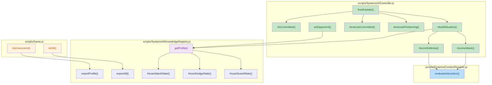
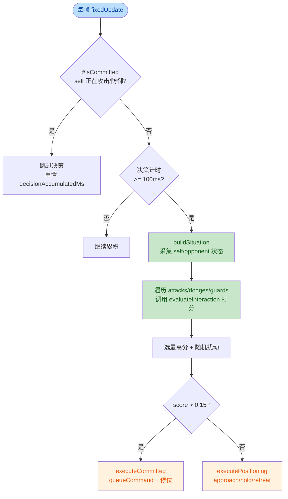

## 1. 高层总结 (TL;DR)

*   **影响等级：** 🔴 **高 (High)** — 这是 AI 战斗决策系统的一次重大架构升级，从「距离分段 + 随机选招」演进为「局面感知 + Utility 评分 + 动作 Commitment」，并新增了与 `ContactResolver` 的规则查询通道。
*   **核心变更：**
    *   🎯 **AI 决策重塑**：`AIController` 引入 `#buildSituation()`、`#scoreAttack()`、`#scoreDefense()`、`#executeCommitted()`，将原随机选招改造为基于局面的效用评分系统。
    *   🛡️ **规则查询接口**：`ContactResolver` 新增 `evaluateInteraction()` 静态方法，让 AI 能查询"我的攻击对他的 guard 是否被防住"等克制关系。
    *   📚 **知识库扩展**：`AIKnowledgeRegistry` 扩展扫描 `dodges[]`、`guards[]`，并为攻击 profile 增加 `trajectory` / `weight` 字段（用于克制判定）。
    *   🐛 **隐含修复**：新增 `Game.kb()` / `kbAll()` 调试 API，便于导出 AI 知识档案。
    *   📝 **文档与流程**：新增 3 份计划文档（AI 决策设计原则/强化计划/相机交接）+ 1 份 Skill 文档（碰撞盒更新工具说明）。

---

## 2. 可视化概览（代码与逻辑图）

### 2.1 AI 决策系统新架构



### 2.2 AI 决策主流程（每 100ms 触发）



### 2.3 Utility 评分的关键信号

| 信号 | 来源 | 用途 |
|---|---|---|
| `distance` | `character.position` | 攻击可达性 / 防御时机 |
| `oppAttackProfile` | `opponentKB.attacks[]` 匹配当前状态名 | 攻击 timing/range/trajectory/weight |
| `oppPhase` | `getAttackPhase()` 解析 `normalizedTime` | startup / active / recovery 阶段判定 |
| `oppThreat` | 综合 phase + range + selfIsBusy | 0~1 威胁值（影响防御评分） |
| `oppVulnerable` | opponent recovery + 距离 | 攻击 punish 窗口加分 |
| `interaction` | `ContactResolver.evaluateInteraction()` | 克制关系（被防/被闪/parryable） |

---

## 3. 详细变更分析

### 3.1 🛡️ AIController.js — 决策系统重写（核心）

**文件：** `scripts/Systems/AIController.js`

**What Changed：**

1. **新增 opponent KB 懒加载**（Source: `AIController.js:18-22, 46-48`）
    * 构造时只加载 `self.kbProfile`，opponent KB 在 `setOpponent()` 和首次 `fixedUpdate` 时懒加载。
2. **Action Commitment 机制**（Source: `AIController.js:66-78, 95-101`）
    * 新增 `#isCommitted()`：检查 `currentStateDef.attackActive / dodgeActive / guardActive`。
    * 处于 committed 状态时跳过决策、重置计时器，让动作有完整生命周期。
3. **Combat Situation 构造**（Source: `AIController.js:107-213`）
    * 新增 `#buildSituation()`：构造包含 `distance / self state / opp state / oppAttackProfile / oppPhase / oppThreat / oppVulnerable` 的局面对象。
    * 新增 `#getAttackPhase()`：根据 `normalizedTime` 和 `KB timing` 计算 `startup / active / recovery`。
    * 新增 `#opponentHasParry()`：检查 opponent guard 的 transitions 是否含 `parryBonus` tag。
4. **Utility 评分**（Source: `AIController.js:242-346`）
    * `#scoreAttack()`：考虑距离可达性、冷却、克制关系（调用 `ContactResolver.evaluateInteraction()`）、opponent vulnerability、抢先窗口。
    * `#scoreDefense()`：考虑 phase 时机（active 必须防 / startup 预判）、克制关系（parry 额外加分）。
    * 评分都使用 `Math.max(0, Math.min(1, score))` 限幅。
5. **执行层**（Source: `AIController.js:353-388`）
    * `#executeCommitted()`：停位 + `queueCommand` + 记录攻击时间。
    * `#executePositioning()`：根据 `oppThreat` 决定 retreat/approach/hold。
6. **删除**：旧的 `preferredMinDistance / preferredMaxDistance` 距离缓冲配置（原代码块 `[38-40]` 被移除）。

**关键约束：** 所有克制关系判定都走 `ContactResolver.evaluateInteraction()`，AI 不自己硬编码规则。

---

### 3.2 📚 AIKnowledgeRegistry.js — 知识库扩展

**文件：** `scripts/Systems/AIKnowledgeRegistry.js`

**What Changed：**

1. **新增导出 API**（Source: `AIKnowledgeRegistry.js:48-66`）
    * `static exportProfile(character)` → 返回单个角色 KB 的 JSON 字符串。
    * `static exportAll()` → 返回所有缓存 KB 的 JSON 字符串。
2. **扩展扫描范围**（Source: `AIKnowledgeRegistry.js:97-160`）
    * 新增 `dodgeProfiles[]` 和 `guardProfiles[]` 数组。
    * 状态扫描时区分 `attackActive / dodgeActive / guardActive` 三种类型。
3. **攻击 profile 新增克制字段**（Source: `AIKnowledgeRegistry.js:304-306`）
    * `trajectory: stateDef.attackTrajectory`（`"thrust"` | `"slash"` | null）
    * `weight: stateDef.attackWeight`（`"light"` | `"heavy"` | null）
4. **新增扫描方法**（Source: `AIKnowledgeRegistry.js:428-484`）
    * `#scanDodgeState()`：扫描闪避状态，记录 `timing / displacement / frameSpeeds / invincible`。
    * `#scanGuardState()`：扫描格挡状态，记录 `timing / guardType / canParry`（根据 transitions 是否含 `parryBonus` tag）。

**数据流（重要）：**

| 字段 | 来源 | 消费方 |
|---|---|---|
| `attacks[].trajectory` | `stateDef.attackTrajectory` | `ContactResolver.evaluateInteraction` |
| `attacks[].weight` | `stateDef.attackWeight` | `ContactResolver.evaluateInteraction` |
| `dodges[].invincible` | 写死 `true` | AI 决定是否信任 dodge 免疫 |
| `guards[].canParry` | `transitions[].when[].hasTag === "parryBonus"` | `evaluateInteraction` 返回 `parryable` |
| `guards[].guardType` | `stateDef.guardType` | `evaluateInteraction` 决定是否被防 |

---

### 3.3 🔗 ContactResolver.js — AI 查询通道

**文件：** `scripts/Systems/ContactResolver.js`

**What Changed：**

新增静态方法 `evaluateInteraction()`（Source: `ContactResolver.js:488-518`），提供**纯规则查询**能力，不依赖实例状态（避免 AI 复制战斗逻辑）。

**API 签名：**

```javascript
static evaluateInteraction({
    offenseTrajectory,  // "thrust" | "slash" | null
    offenseWeight,      // "light" | "heavy" | null
    defenseGuardType,   // "guard" | "shield" | null
    defenseIsDodging,   // boolean
    defenseCanParry     // boolean (可选)
}) → { blocked, dodged, parryable, willMiss }
```

**规则表（与 `resolve` 同源）：**

| 防御方 \ 攻击方 | thrust | slash (light) | slash (heavy) | 其他 |
|---|---|---|---|---|
| **dodge** | 🟢 dodged | 🟢 dodged | 🟢 dodged | 🟢 dodged |
| **guard** | 🔴 blocked=false | 🟢 blocked | 🟢 blocked | 🔴 blocked=false |
| **shield** | 🟢 blocked | 🟢 blocked | 🔴 blocked=false | 🔴 blocked=false |
| **null** | 🔴 blocked=false | 🔴 blocked=false | 🔴 blocked=false | 🔴 blocked=false |

> **设计核心**：这是 ContactResolver 内部规则逻辑的"薄包装"，确保 AI 评分与实际战斗结果不会 desync。

---

### 3.4 🐛 Game.js — 调试接口

**文件：** `scripts/Game.js`

新增两个调试方法到 `window.debug`（Source: `Game.js:712-739`）：

| 方法 | 参数 | 功能 |
|---|---|---|
| `kb(characterId)` | `entity id`（如 `"enemy_1"`, `"hero"`） | 导出单个角色 AI 知识档案为 JSON，控制台打印 + 尝试复制到剪贴板 |
| `kbAll()` | 无 | 导出所有已缓存的知识档案为 JSON |

**依赖：** 新增 `import { AIKnowledgeRegistry }`（Source: `Game.js:28`）

---

### 3.5 📝 计划与文档（新增 3 份）

| 文件 | 类型 | 行数 | 主题 |
|---|---|---|---|
| `plans/AI Combat Decision Guidelines.md` | 设计原则（英文） | 788 | 三层职责分离、Phase 1 范围、Extensibility 8 条原则 |
| `plans/AI 战斗决策强化计划.MD` | 实施计划（中文） | 202 | 4 阶段路线图（基础感知→规则查询→血量→Intent 分层） |
| `plans/Handoff.MD` | 交接文档 | 306 | **相机回归修复**：cameraBlend to explore 后相机不动根因（`this.context` 误用 → `ctx`） |

**Handoff.MD 关键信息：**
* 上一轮加的 `setClampEnabled` 机制导致 `intro` / `flee` 结束后相机不动。
* **根因**：`TimelineSequencer.js:611` 用 `this.context.game`（handler 是 plain object，`this` 不指向实例），抛 TypeError 被静默吞掉。
* **修复**：改为 `ctx.game`（一行改动）。
* **第二根因**：`ExploreCameraRig.enter` 中 `seqBusy=true` 时跳过 `#clampCameraPositionHard()`，导致相机停在未 clamp 的 desired 位置。
* **修复**：把硬 clamp 提到 `if` 外面，与 weight 设置解耦。

---

### 3.6 🛠️ 新增 Skill 文档

**文件：** `.trae/skills/collider-occupancy-更新-skill/SKILL.md`（131 行）

提供两个 PowerShell 工具的使用说明：

| 工具 | 输入 | 输出 | 适用角色 |
|---|---|---|---|
| `extract_collision_boxes.ps1` | 碰撞遮罩 PNG + 根运动 PNG | `.collider.json` | `longswordman`、`rabble_stick` |
| `extract_rootmotion_occupancy.ps1` | 根运动 PNG | `.occupancy.json` | `traveller`、`merchant` 等 NPC |

**包含**：单 action 命令模板、批量处理脚本示例、颜色约定（`#FFFF00`=hitbox, `#E37800`=strong_blade, `#FF0000`=weak_blade, `#7082C1`=root）。

---

### 3.7 🎨 美术资源（二进制）

7 个艺术资源被更新（aseprite / krita 原文件）：

| 文件 | 类型 | 用途 |
|---|---|---|
| `Art/RawAssets/Env/Tavern.ase` | Aseprite | 酒馆环境图 |
| `Art/RawAssets/Env/arrow.ase` | Aseprite | 箭矢图 |
| `Art/RawAssets/Env/floor.kra` | Krita | 地板图层 |
| `Art/RawAssets/Env/treeline_pine.kra` | Krita | 松树林线 |
| `Art/RawAssets/longswordman/longswordman_quart.ase` | Aseprite | 长剑士 quart 动作 |
| `Art/RawAssets/longswordman/longswordman_thrust.ase` | Aseprite | 长剑士 thrust 动作 |
| `Art/RawAssets/longswordman/longswordman_zornhut.ase` | Aseprite | 长剑士 zornhut（防御姿态） |

> ⚠️ 注意：thrust / zornhut 是 AI 新加的克制判定（`trajectory="thrust"`, `guardType="guard"`）关键依赖动作。

---

### 3.8 🆕 新增数据

**文件：** `Data/RootMotion/longswordman/longswordman_inspect.json`（71 行）

* 长剑士 `inspect` 动作的图集数据，6 帧（100/100/200/200/1500/100 ms）。
* 图片路径：`E:\se\BlindDuel\Art\RawAssets\longswordman\longswordman_inspect.png`
* 尺寸：768x128（6 帧 × 128px）。
* 层结构：`mainvisual / main / weapon / rightarm / lefthand / cloak / rootmotion`。
* 暂未注册 `frameTags`，需配合代码侧注册才会在状态图中可用。

---

## 4. 影响与风险评估

### 4.1 ⚠️ 破坏性变更 / 兼容性

| 项 | 状态 | 说明 |
|---|---|---|
| `AIKnowledgeRegistry` 输出 schema | 🟡 **向后兼容** | 新增 `dodges[]` / `guards[]` 字段；攻击 profile 新增 `trajectory` / `weight` 字段；已有消费方忽略新字段即可 |
| `AIController` 行为 | 🔴 **行为变更** | 旧版按距离分段 + 随机选招；新版按 Utility 评分 + Commitment。AI 表现会有显著差异（更"聪明"但需调参） |
| `ContactResolver.resolve()` | 🟢 **未变** | 仅新增静态方法，未修改任何已有逻辑 |
| 状态机定义（`stateDef`） | 🟡 **软依赖** | AI 现在会读 `attackTrajectory` / `attackWeight` / `guardType`；若状态定义缺失这些字段，`evaluateInteraction` 会回退为 `null`（不判定），仍可工作但 AI 无法利用克制 |

### 4.2 🐛 已识别风险

1. **评分权重未充分调优**：Phase 1 默认权重（如攻击 base=0.4、防御 active=0.8~0.9）来自直觉判断，实际游戏可能需要多轮 playtest 调优。
2. **`buildSituation` 性能开销**：每 100ms 一次的双 KB 加载 + opponent state 解析在大量 AI 时可能成为瓶颈（取决于 `opponentKB.attacks.find()`）。
3. **Commitment 可能让 AI 错过反击窗口**：明确设计为"不强制打断 commitment"，文档强调反击由下一次正常决策发现，但若两次决策间隔 100ms + 自身动作周期 > opponent recovery 时长，可能错过窗口。
4. **`opponentKB` 懒加载的潜在 bug**：如果 `setOpponent` 被调过但 `opponent` 后来被替换（如场景切换），`opponentKB` 不会自动重新加载（首次 `fixedUpdate` 检查 `!this.opponentKB` 后才会重载——若已加载过旧 opponent，则不会重载）。
5. **新增的 `longswordman_inspect.json` 未注册 frameTags**：单独存在但不挂载到状态机时不会被使用。

### 4.3 ✅ 测试建议

| 场景 | 预期表现 | 验证点 |
|---|---|---|
| **Opponent 在 startup** | AI 应能识别并选择 dodge / guard / 抢先 attack | 观察 `oppPhase` 是否为 `"startup"`，对应评分是否加 0.6~0.7 |
| **Opponent 在 recovery** | AI 应选 punish 攻击 | `oppVulnerable` 应为 0.8，攻击评分应加 0.32 |
| **Opponent guard 防御 thrust** | AI 不应选 thrust 攻击（应被防住） | `interaction.willMiss=true`，`score -= 0.6` |
| **AI 自己 guard + parry 反击** | guard 评分额外 +0.2 | `defenseCanParry=true` + `parryable=true` 路径 |
| **高威胁时 retreat** | `oppThreat > 0.6` 时 AI 优先后撤 | `#executePositioning` 第一个 `if` 分支 |
| **Commitment 行为** | AI 选完 attack 后，startup/active/recovery 期间不重决策 | 在 100ms tick 内观察 `currentStateDef.attackActive===true` 时是否跳过 |
| **空 opponent / 缺 KB** | 评分回退到 base 0.4 | `opponentKB.attacks` 为空时 `find()` 返回 undefined |
| **调试 API** | `debug.kb("hero")` 应打印英雄 KB JSON | 控制台输出 + 剪贴板 |

### 4.4 📋 复审建议清单

* [ ] 确认所有 longswordman 状态定义都补充了 `attackTrajectory` / `attackWeight`（如 `thrust.ase` → `"thrust"`, `quart.ase` → `"slash"`，weight 看实际动作）。
* [ ] 确认所有 guard 状态定义补充了 `guardType`（`"guard"` vs `"shield"`）和 `parryBonus` tag 标记。
* [ ] 验证 `setOpponent` 在场景切换时的 opponent 重置逻辑（是否需要添加 `opponent` 引用变化检测？）。
* [ ] Handoff.MD 中提到的诊断 log 是否清理（`[ExploreCam]` 标注为临时）。
* [ ] `longswordman_inspect.json` 是否需要同步注册到状态机定义。
* [ ] BACKLOG 中第 58 行 "prologue_cs_rabble_flee 期间抖动" 是不同问题（flee 期间 vs flee 结束），需独立处理。

---

## 5. 总结

本次变更核心是 **AI 决策架构的全面升级**：
- 把 AI 从"距离分段 + 随机"进化为"局面感知 + Utility 评分 + Commitment"。
- 严格遵守三层职责分离：Knowledge（数据）、Rules（规则，ContactResolver 唯一持有）、Decision（评分）。
- 配套新增 3 份计划文档、1 份 Skill 文档、1 份相机回归 Handoff 文档。
- 配合 7 个美术资源更新（thrust / zornhut 是克制判定的关键动作）。

**下一步推荐**：进入 Phase 2 的效用调优 + 真实对战 playtest，验证克制矩阵下 AI 的实际反应是否符合预期。