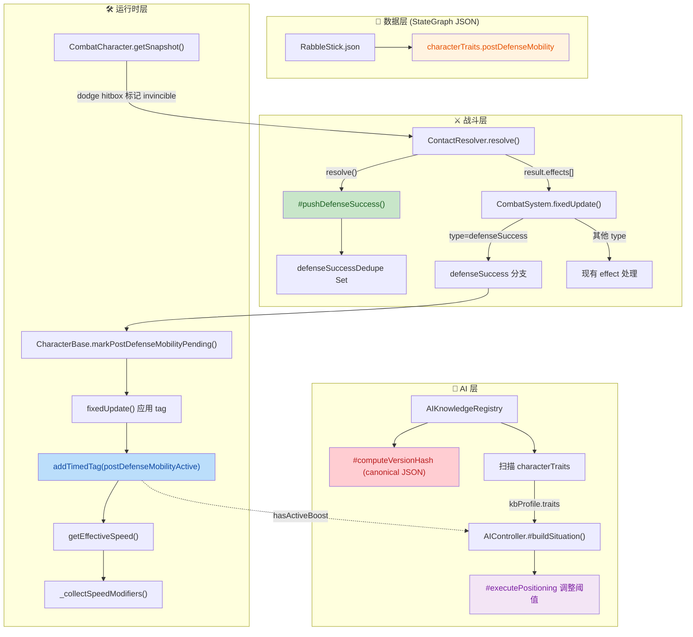
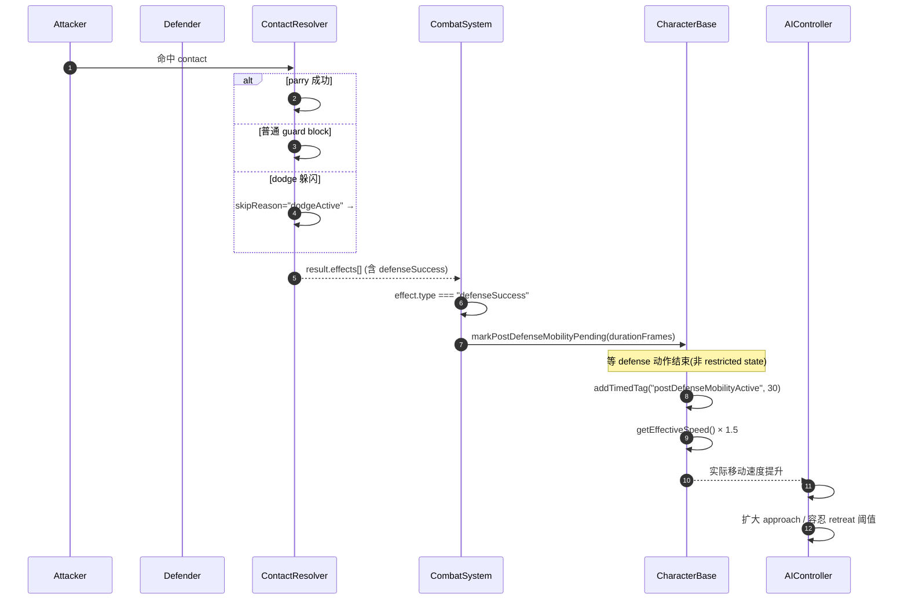
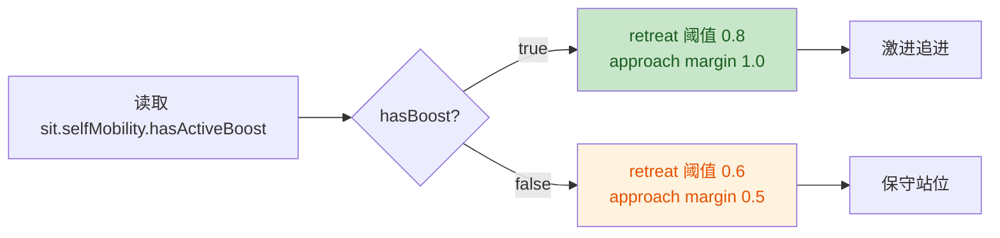

# 📋 Rabble Stick Post-Defense Mobility 实现（核心）+ 美术/工具资产更新

## 1. High-Level Summary (TL;DR)

*   **Impact:** **High** — 引入「Character Trait → Combat Event → Runtime State → AI Knowledge」完整可复用架构链,首次实现数据驱动角色特性(Rabble Stick 防守成功后 500ms / 1.5× 移速)。同时新增 2 个文档计划、1 个 AI Skill、多个美术/碰撞资源,范围横跨数据/战斗/运行时/AI 四层。
*   **Key Changes:**
    *   ⚔️ **新战斗事件 `defenseSuccess`**:ContactResolver 在 parry / guard_block / dodge 三种防守路径统一推送事件,带 dedupe 防止重复触发。
    *   🎯 **Rabble Stick 新增 `postDefenseMobility` 特性**:StateGraph JSON 新增 `characterTraits` 块,防守成功后 500ms 内移速 ×1.5。
    *   🛠️ **CharacterBase 速度计算重构**:`getEffectiveSpeed()` 抽出 `_collectSpeedModifiers()` 统一接口,扩展只需加 tag + trait 配置。
    *   🤖 **AI 被动感知 `selfMobility`**:AIController 读取 KB profile 中的 traits + 当前 active tag,在加速期间扩大 approach 范围、提高威胁忍耐阈值。
    *   🐛 **CombatCharacter dodge hitbox 修复**:`isInvincible` 命中框由 filter 改为标记 `invincible` 字段,确保 Phase 2 能感知 dodge 接触并推送事件。
    *   🔧 **AIKnowledgeRegistry 哈希重构**:从白名单改为 canonical JSON 序列化整个 stateGraph,后续字段变更自动触发重扫。

---

## 2. Visual Overview (Code & Logic Map)

### 2.1 架构总览(数据 → 战斗 → 运行时 → AI)



### 2.2 事件推送时序



---

## 3. Detailed Change Analysis

### 3.1 🗂️ 数据层:StateGraph JSON 新增 characterTraits

**文件:** `Data/StateGraphDef/RabbleStick.json`

*   **What Changed:** 状态图顶层新增 `characterTraits` 配置块,定义 `postDefenseMobility` 特性的开启、触发源、持续时间、移速倍率。

| 字段 | 值 | 说明 |
|---|---|---|
| `enabled` | `true` | 是否启用该特性 |
| `triggers` | `["guard_block", "parry", "dodge"]` | 哪些防守来源触发 |
| `durationMs` | `500` | 加速持续时间(毫秒) |
| `speedMultiplier` | `1.5` | 移速倍率 |

---

### 3.2 ⚔️ 战斗层:ContactResolver + CombatSystem

#### ContactResolver 新增 `defenseSuccess` 事件三路推送

**文件:** `scripts/Systems/ContactResolver.js`

*   **What Changed:**
    *   构造函数新增 `defenseSuccessDedupe = new Set()`,key 格式 `"${attackId}|${defenseCharId}"`,同一次攻击对同一防守方只触发一次。
    *   新增私有方法 `#pushDefenseSuccess(defenseCharId, attackId, source, effects)`。
    *   **parry 分支**:`canParry` 为 true 时,先 push `defenseSuccess { source: "parry" }` 再 push 原 effect(parryBonus/clash/hitstop)。
    *   **guard_block 分支**:`canParry` 为 false 时,先 push `defenseSuccess { source: "guard_block" }` 再 push blockstun/hitstop。
    *   **dodge 分支**:在 `skipReason === "dodgeActive"` 路径 push `defenseSuccess { source: "dodge" }`。
    *   `cleanupDedupe()` 新增 `defenseSuccessDedupe` 清理逻辑(攻击结束后清除 key)。

| 分支 | 现有 effect | 新增 Event |
|---|---|---|
| parry | parryBonus + clash + hitstop | `defenseSuccess { source: "parry" }` |
| guard_block | blockstun + hitstop | `defenseSuccess { source: "guard_block" }` |
| dodge | (无 effect) | `defenseSuccess { source: "dodge" }` |

#### CombatSystem trait 处理分支

**文件:** `scripts/Systems/CombatSystem.js`

*   **What Changed:** 在 effect 处理循环里,parryBonus 之前新增 `defenseSuccess` 分支:
    *   读取 `target.stateGraph?.characterTraits` 配置
    *   遍历每个 `traitConfig`,校验 `enabled === true` 且 `triggers.includes(effect.context.source)`
    *   命中 `postDefenseMobility` 时,计算 `durationFrames = round(durationMs / (1000/60))` 并调用 `target.markPostDefenseMobilityPending(durationFrames)`

```javascript
if (effect.type === "defenseSuccess") {
    const traits = target.stateGraph?.characterTraits || {};
    for (const [traitName, traitConfig] of Object.entries(traits)) {
        if (!traitConfig.enabled) continue;
        if (!traitConfig.triggers?.includes(source)) continue;
        if (traitName === "postDefenseMobility") {
            const durationFrames = Math.round((traitConfig.durationMs ?? 500) / (1000 / 60));
            if (typeof target.markPostDefenseMobilityPending === "function") {
                target.markPostDefenseMobilityPending(durationFrames);
            }
        }
    }
    continue;
}
```

---

### 3.3 🐛 关键修复:CombatCharacter dodge hitbox 标记

**文件:** `scripts/Enties/CombatCharacter.js` (L~252)

*   **What Changed:** `getSnapshot()` 不再 filter 掉 invincible 的 hitbox,改为打上 `invincible: true` 标志。Phase 2 会因 `skipReason === "dodgeActive"` continue,但在此之前能感知到 dodge 接触并推送 `defenseSuccess` 事件。
*   **效果完全等价**:对原有战斗判定零影响,只是多了一次事件触发机会。

| 行为 | 旧实现 (filter) | 新实现 (标记) |
|---|---|---|
| dodge 时 hitbox | 被丢弃,Phase 2 收不到 | 标记 invincible,Phase 2 可感知 |
| 战斗判定 | 攻击失效 | 攻击失效(同) |
| 事件触发 | ❌ 无法推 defenseSuccess | ✅ 可推 defenseSuccess { source: "dodge" } |

---

### 3.4 🛠️ 运行时层:CharacterBase 速度 Modifier 重构

**文件:** `scripts/Enties/CharacterBase.js`

*   **What Changed:**
    *   构造函数将 `this.timedTags` 初始化上移到与 `stateTags` 同一区域(原位置在 speed 字段后)。
    *   新增 `_pendingPostDefenseMobility = null` 字段,记录延迟触发的时长。
    *   新增 `markPostDefenseMobilityPending(durationFrames)` 方法,仅设置 pending 字段。
    *   **`getEffectiveSpeed()` 重构**:删除两条硬编码 tag 特判(`parryBonus` / `chainBonus`),改为调用 `_collectSpeedModifiers()` 收集 multiplier 列表统一计算。
    *   **新增 `_collectSpeedModifiers()`**:
        *   若 `hasTag("parryBonus") || hasTag("chainBonus")` → push `{ source: "parryBonus", multiplier: this._moveSpeedBonus }`
        *   若 `hasTag("postDefenseMobilityActive")` → 读 `stateGraph.characterTraits.postDefenseMobility.speedMultiplier`
    *   **`fixedUpdate()` 末尾新增延迟触发逻辑**:
        *   仅在 `stateDef.frameSpeeds` 为空 **且** `stateDef.allowMoveInput !== false` 时才将 pending 转成 active tag
        *   保证 defense 动作期间不触发,只在转入 idle/move 等自由状态后才生效

| 状态 | 是否触发 postDefenseMobility |
|---|---|
| 防御中(有 frameSpeeds) | ❌ 延迟 |
| 防御中(allowMoveInput=false) | ❌ 延迟 |
| idle / move | ✅ 立即 addTimedTag |

---

### 3.5 🤖 AI 层:AIController 被动消费 trait

**文件:** `scripts/Systems/AIController.js`

*   **What Changed:**
    *   `#buildSituation()` 新增读取 `kbProfile?.traits?.postDefenseMobility` 和角色 `hasTag("postDefenseMobilityActive")`,塞入返回的 `situation.selfMobility`。
    *   `#executePositioning()` 阈值参数化:
        *   `retreatThreatThreshold`:无 boost 时 `0.6`,有 boost 时 `0.8`(更敢于贴近)
        *   `approachReachMargin`:无 boost 时 `0.5`,有 boost 时 `1.0`(主动接近范围扩大)
    *   在高威胁/距离判定时同时使用这两个参数。



---

### 3.6 🔧 AIKnowledgeRegistry 哈希重构

**文件:** `scripts/Systems/AIKnowledgeRegistry.js`

*   **What Changed:**
    *   `#computeVersionHash()` 从"白名单 states 列表"改为 **canonical JSON 序列化整个 `stateGraph` 对象**(键名排序后 stringify),未来新增字段(如 `characterTraits`)自动纳入哈希,触发重扫。
    *   `#scanCharacter()` 返回值新增 `traits` 字段(读取 `stateGraph?.characterTraits`),让 AI 可被动感知。

| 哈希来源 | 旧实现 | 新实现 |
|---|---|---|
| states 列表 | ✅ 显式枚举 | ❌ 不再单独处理 |
| colliderData generatedAt | ✅ 保留 | ✅ 保留 |
| 整个 stateGraph | ❌ 不参与 | ✅ canonical JSON 序列化 |

---

### 3.7 📄 新增文档与 Skill

| 文件 | 类型 | 说明 |
|---|---|---|
| `plans/Rabble Stick Post-Defense Mobility 设计计划.MD` | 设计文档 | 完整设计稿(背景/动机/架构图/参数/实施步骤 1-7) |
| `plans/Handoff.MD` | 交接文档 | 已完成改动汇总 + 阻塞问题诊断(tag 加了但 speed 读不到,3 个假设 A/B/C) |
| `.trae/skills/collider-occupancy-更新-skill/SKILL.md` | AI Skill | 触发词:"更新 collider/occupancy"等,2 条路线 + 颜色约定 |
| `Data/RootMotion/longswordman/longswordman_inspect.json` | 资源 | 新增 longswordman inspect 动作的根运动数据(6 帧,768×128) |

---

### 3.8 🖼️ 美术资源(纯二进制变更)

| 文件 | 类型 | 说明 |
|---|---|---|
| `Art/RawAssets/Env/Tavern.ase` | Aseprite 源文件 | 酒馆环境图(重新编辑) |
| `Art/RawAssets/Env/arrow.ase` | Aseprite 源文件 | 箭头图(重新编辑) |
| `Art/RawAssets/Env/floor.kra` | Krita 源文件 | 地板图(重新编辑) |
| `Art/RawAssets/Env/treeline_pine.kra` | Krita 源文件 | 松树图(重新编辑) |
| `Art/RawAssets/longswordman/longswordman_quart.ase` | 角色动作 | 剑士 quart 动作 |
| `Art/RawAssets/longswordman/longswordman_thrust.ase` | 角色动作 | 剑士 thrust 动作 |
| `Art/RawAssets/longswordman/longswordman_zornhut.ase` | 角色动作 | 剑士 zornhut 动作 |

> ⚠️ 二进制 diff 仅显示 hash 变化,具体帧内容需打开 Aseprite/Krita 工具确认。

---

## 4. Impact & Risk Assessment

### 4.1 ⚠️ 已知阻塞问题(交接文档已记录)

`plans/Handoff.MD` 标记 `CharacterBase.js` 存在 bug:`addTimedTag` 确实加了 `postDefenseMobilityActive`,但 `getEffectiveSpeed` 里 `hasTag` 一直返回 false。

**3 个最可能根因(按优先级):**

| 假设 | 描述 | 验证方法 |
|---|---|---|
| **A. 时序错位** | CharacterBase.fixedUpdate 先于 CombatSystem,导致 tag 还没加就被读取 | 在 `_handleTimedTags` 加 log,看 tick 序列 |
| **B. 实例错配** | ADD-TAG 的 `enemy_1` 和 speed 读的不是同一个 CharacterBase 实例 | `_collectSpeedModifiers` log 加 `this.id` |
| **C. tickCount 不一致** | CombatSystem 和 CharacterBase 用不同 tickCount | ADD-TAG 和 speed log 都打 `this.tickCount` 对比 |

### 4.2 💥 Breaking Changes

*   **无对外 API/Schema 破坏**:`characterTraits` 是新增字段,主角 LongSwordMan.json 不加配置则行为零变化(继续走原 `parryBonus` 路径)。
*   **CombatCharacter.getSnapshot 输出结构变化**:命中框多了 `invincible: boolean` 字段(原 filter 行为,后改为标记);下游若依赖 box 数量需留意。
*   **AIKnowledgeRegistry 版本哈希变化**:`#computeVersionHash` 算法改写,所有角色 KB 缓存会首次 miss 重新扫描(预期内)。

### 4.3 🧪 Testing Suggestions

1. **主角回归验证**(必做):LongSwordMan parry 后速度仍正常加速,行为与之前完全一致。
2. **Rabble Stick 三路触发**:分别测试 parry / guard_block / dodge 三种情况,确认 500ms 内移速 ×1.5 生效。
3. **延迟触发测试**:Rabble 在 guard 动作期间不应加速,只有进入 idle/move 才生效。
4. **dedupe 测试**:同一次攻击对同一防守方只触发一次 `defenseSuccess`(多次 hitbox 接触不重复)。
5. **AI 行为测试**:Rabble 防守成功后,AI 应主动接近对手,而非继续保持距离。
6. **KB 缓存失效**:重启后确认 AI 重新扫描 RabbleStick,`kbProfile.traits.postDefenseMobility` 字段存在。
7. **冷却回归**:连续多次 parry/guard/dodge 不应导致无限叠加加速(目前策略为 refresh 重置 duration)。

### 4.4 📊 风险矩阵

| 改动 | 风险 | 等级 | 说明 |
|---|---|---|---|
| ContactResolver defenseSuccess 推送 | 低 | 🟢 | 新增分支,旧 effect 仍存在 |
| CombatSystem trait 分支 | 低 | 🟢 | 新增 `if` 分支,continue 跳过原逻辑 |
| CharacterBase.getEffectiveSpeed 重构 | 中 | 🟡 | 替换两条硬编码 tag 特判,主角需回归 |
| `_pendingPostDefenseMobility` 延迟逻辑 | 中 | 🟡 | 新机制,需测试 restricted state 边界 |
| CombatCharacter invincible 标记 | 低 | 🟢 | 仅标记字段,Phase 2 skip 逻辑已存在 |
| AIController 阈值调整 | 低 | 🟢 | 局部参数化,无新分支 |
| AIKnowledgeRegistry canonical JSON | 低 | 🟢 | 仅首次扫描成本增加,后续缓存命中 |

---

## 5. 📌 设计原则备忘(摘自设计文档)

*   **配置描述资源,代码描述行为** — `characterTraits` 是数据,trait 匹配逻辑在 CombatSystem 里。
*   **Event vs Effect 分层** — `defenseSuccess` 是 Event(事实),`parryBonus` / `blockstun` / `hitstop` 是 Effect(对事实的响应)。
*   **Scope 锁死** — 只碰移动速度这条线,不碰 `bonusTimeScale`(动画加速);不做完整 Buff System。
*   **两套并存** — 主角继续用 `parryBonus` tag 系统,Rabble 用新 trait 系统,零回归风险。
*   **原型验证期数据语义优先** — 宁可参数明显(500ms + 1.5×),让机制效应肉眼可见。