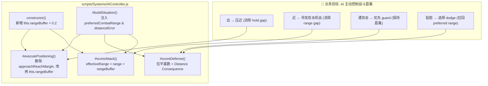
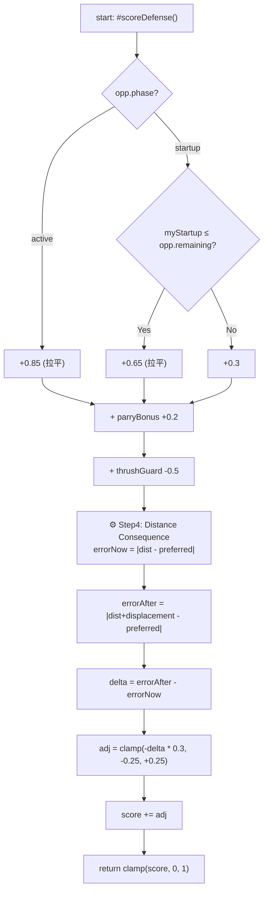

## 1. 高层级摘要 (TL;DR)

*   **影响程度：** 🟡 **中高 (Medium-High)** —— 核心战斗 AI 决策逻辑重构（统一距离评价模型 + 防御动作距离后果），并配套大量设计/实施/交接文档；附带美术资源刷新和根运动数据新增。
*   **关键改动：**
    *   ✨ **AIController.js**：引入统一 `rangeBuffer`，消除攻击有效阈值与 positioning hold 区之间的 gap；拉平 dodge/guard 基础分；新增 **Distance Consequence** 评价，让防御选择同时考虑"距离后果"。
    *   📐 **设计文档**：`AI_Combat_Distance_Guideline.md` + `AI Combat Distance Rebalance 实施计划.MD`，固化"以战斗距离为核心评价轴"的设计原则。
    *   🤝 **交接文档**：`Handoff.MD` 记录 Rabble Stick Post-Defense Mobility 实现的排查过程。
    *   🎨 **美术 / 数据**：7 个二进制美术资源刷新（场景 + 长剑士三段攻击动作）；新增 `longswordman_inspect` 6 帧根运动数据。
    *   🛠️ **流程工具**：新增 `.trae/skills/collider-occupancy-更新-skill/SKILL.md`，规范碰撞盒/占用盒更新命令。

---

## 2. 可视化总览 (代码与逻辑地图)

### 2.1 业务目标 ↔ 模块 ↔ 关键方法映射



### 2.2 防御评分流程（Step 3 + Step 4 改造后）



---

## 3. 详细变更分析

### 3.1 ⚔️ 核心改动：`AIController.js` (Medium-High Impact)

#### A. 统一范围常量 (Step 1)
| 项目 | 旧值 | 新值 | 备注 |
|---|---|---|---|
| 攻击有效阈值 | `range + 0.3` (硬编码) | `range + this.rangeBuffer` | `rangeBuffer = 0.2` |
| positioning hold 上边界 | `maxReach + 0.5` (boost 时 +1.0) | `maxReach + this.rangeBuffer` | **boost 不再扩大** |
| `approachReachMargin` 变量 | 存在 (0.5 / 1.0) | **删除** | 由 `rangeBuffer` 统一替代 |

> **效果**：消除 `attack 有效范围` 与 `positioning hold 区` 之间的语义 gap，AI 进入 hold 区时 attack 评分不再"打不到"。

#### B. 注入距离模型字段 (Step 2)
在 `#buildSituation()` 返回对象中新增：
*   `preferredCombatRange` = `selfMaxReach`（角色所有攻击中最大 reach）
*   `distanceError` = `distance - preferredCombatRange`

#### C. 防御评分基数拉平 (Step 3)

| 阶段 | 旧值 (dodge / guard) | 新值 (统一) |
|---|---|---|
| `active` | 0.9 / 0.8 | **0.85** |
| `startup` (可拦截) | 0.7 / 0.6 | **0.65** |
| `startup` (来不及) | 0.3 | 0.3 (不变) |

> parry +0.2 奖励与 thrust guard -0.5 扣分保持不变。

#### D. Distance Consequence 评价 (Step 4 — 新增)

```javascript
// 核心公式
predictedDistance = currentDistance + action.displacement;
errorNow          = |currentDistance - preferredRange|;
errorAfter        = |predictedDistance - preferredRange|;
delta             = errorAfter - errorNow;
adjustment        = clamp(-delta * 0.3, -0.25, +0.25);
score += adjustment;
```

**示例效果** (Rabble Stick, preferred = 3.0, dodge displacement ≈ 0.6)：

| 当前距离 | 动作 | predicted | errorNow → errorAfter | delta | 评分调整 |
|---|---|---|---|---|---|
| 3.5 (略远) | guard | 3.5 | 0.5 → 0.5 | 0 | 0 |
| 3.5 (略远) | dodge | 4.1 | 0.5 → 1.1 | +0.6 | **-0.18** |
| 2.5 (偏近) | guard | 2.5 | 0.5 → 0.5 | 0 | 0 |
| 2.5 (偏近) | dodge | 3.1 | 0.5 → 0.1 | -0.4 | **+0.12** |
| 3.0 (完美) | guard | 3.0 | 0 → 0 | 0 | 0 |
| 3.0 (完美) | dodge | 3.6 | 0 → 0.6 | +0.6 | **-0.18** |

---

### 3.2 📐 设计/计划/交接文档 (Information Only)

| 文件 | 性质 | 关键内容 |
|---|---|---|
| `plans/AI_Combat_Distance_Guideline.md` | 设计指导 | 12 章 / 918 行——"战斗距离为核心评价轴"完整论证 |
| `plans/AI Combat Distance Rebalance 实施计划.MD` | 实施计划 | 8 章 / 392 行——4 步走 (Step1-4) + 验证清单 + 非目标 |
| `plans/Handoff.MD` | 交接文档 | Rabble Stick Post-Defense Mobility 5 步完成 + tag 读不到的 3 个排查假设 |
| `plans/BACKLOG.md` | 待办列表 | 新增 item [61] "板边击退距离加成" |

**设计核心原则**：
> 数据定义能力 (Knowledge)，代码定义如何根据局面推导行为 (Decision)。决策层不得复制 `ContactResolver.evaluateInteraction()` 的克制规则，不得硬编码角色专属偏移量。

---

### 3.3 🛠️ 流程规范：Collider / Occupancy 更新 Skill

新增 `.trae/skills/collider-occupancy-更新-skill/SKILL.md` (131 行)：

| 维度 | 路线 A：战斗角色 Collider | 路线 B：NPC Occupancy |
|---|---|---|
| **适用角色** | `longswordman` / `rabble_stick` | `traveller` / `merchant` / `merchant2` |
| **脚本** | `scripts/tools/extract_collision_boxes.ps1` | `scripts/tools/extract_rootmotion_occupancy.ps1` |
| **输入** | `Data/CollisionMask/{char}/` + `Data/RootMotion/{char}/` | `Data/RootMotion/NPCs/{npc}/` |
| **输出** | `{char}_{action}.collider.json` | `{npc}.occupancy.json` |
| **颜色约定** | `#FFFF00` hitbox, `#E37800` strong_blade, `#FF0000` weak_blade, `#7082C1` root | 同左 |

---

### 3.4 🎨 美术与动画数据

| 类别 | 文件 | 变更 |
|---|---|---|
| 场景 | `Tavern.ase` / `arrow.ase` / `floor.kra` / `treeline_pine.kra` | 二进制刷新 |
| 角色动作 | `longswordman_quart.ase` / `longswordman_thrust.ase` / `longswordman_zornhut.ase` | 二进制刷新 |
| 根运动 | `Data/RootMotion/longswordman/longswordman_inspect.json` | **新增** 6 帧 (128×128, 100/100/200/200/1500/100ms) |

> 根运动数据为 longswordman 检视（idle/inspect）动画预留，配套图层包括 mainvisual、weapon、rightarm、lefthand、cloak、rootmotion。

---

## 4. 影响与风险评估

### 4.1 ⚠️ 破坏性变更 / 兼容性

| 项目 | 状态 | 说明 |
|---|---|---|
| **AIController options API** | 🟢 兼容 | `rangeBuffer` 为可选参数（默认 0.2），外部调用方无影响 |
| **attack 有效范围** | 🟡 行为变更 | 阈值由 `+0.3` → `+0.2`，攻击有效区轻微**收缩** |
| **positioning hold 区** | 🟡 行为变更 | 上边界由 `+0.5/+1.0` → `+0.2`（统一），AI 不再"过早停下" |
| **dodge 评分** | 🟡 行为变更 | active 阶段基础分 0.9 → 0.85，可能减少过度 dodge 倾向 |
| **AI 行为整体** | 🟠 期望中变更 | 期望：远→压近、近→找机会、攻击→优先 guard；需 playtest 验证 |

### 4.2 🧪 测试建议

#### 代码级检查
*   [ ] `rangeBuffer` 在三处（构造函数、`#scoreAttack`、`#executePositioning`）引用同一值
*   [ ] 全局搜索 `0\.3|0\.5|1\.0` 不再出现 range 相关硬编码（除 `rangeBuffer=0.2` 和 `retreatThreatThreshold`）
*   [ ] `mobility boost` 不再扩大 `rangeBuffer`

#### 行为级观察 (按设计文档 §18 对照)

| 期望表现 ✅ | 失败表现 ❌ |
|---|---|
| 玩家攻击 → Rabble Guard → 防御 → postDefenseMobility → 主动逼近 → 攻击 | 玩家攻击 → Rabble Dodge → 越来越远 → 继续 Dodge → 站着等 |
| Rabble Approach → 进入 range → 立刻攻击 (无 gap) | Rabble Approach → 进入 hold → 攻击打不到 → 站定 |
| AI 贴脸太近 (distance < minReach) 优先 dodge 拉开 | AI 完美距离附近仍大量 dodge |

#### 边界场景
*   **多攻击 reach 差异**：若 Rabble thrust 与 swing reach 差距过大，`preferredCombatRange = maxReach` 可能让 swing 永远打不到 → **需 playtest 确认**
*   **mobility boost 期间**：rangeBuffer 保持 0.2 不会扩大，AI 应冲得更近而不是停得更远
*   **800ms attackCooldown**：本计划未动，若仍有"攻击后发呆"再单独考虑

#### 调试辅助
*   在 `#makeDecision()` 后临时打印 Top-3 评分明细（phase 分 / 交互分 / **距离后果分**），验证后清除

### 4.3 📌 文档可追溯性

| 文档 | 是否完整描述本次实现 | 备注 |
|---|---|---|
| `AI_Combat_Distance_Guideline.md` | ✅ 完整 | 设计原则层 |
| `AI Combat Distance Rebalance 实施计划.MD` | ✅ 完整 | 含代码 diff 模板 |
| `Handoff.MD` | ⚠️ 仅描述上一个 PR (Rabble Post-Defense Mobility) | 标签 `postDefenseMobilityActive` 读不到的 bug **未解决** |

> **关注点**：`Handoff.MD` 指出 `_collectSpeedModifiers()` 中 `hasMobilityTag=false` 但 `addTimedTag` 已成功添加。该问题不在本次 diff 范围内，但可能影响本计划 Step 4 的"distance consequence"评价与 post-defense 加速的协同效果。

---

## 5. 📋 变更文件清单

| # | 文件 | 类型 | 影响 |
|---|---|---|---|
| 1 | `scripts/Systems/AIController.js` | 修改 | 🟠 高 - AI 决策核心 |
| 2 | `plans/AI_Combat_Distance_Guideline.md` | 新增 | 🟡 设计文档 |
| 3 | `plans/AI Combat Distance Rebalance 实施计划.MD` | 新增 | 🟡 实施计划 |
| 4 | `plans/Handoff.MD` | 新增 | 🟢 交接记录 |
| 5 | `plans/BACKLOG.md` | 修改 | 🟢 待办 |
| 6 | `.trae/skills/collider-occupancy-更新-skill/SKILL.md` | 新增 | 🟢 工具规范 |
| 7 | `Data/RootMotion/longswordman/longswordman_inspect.json` | 新增 | 🟢 动画数据 |
| 8-14 | 7 个 `Art/RawAssets/**/*.ase` / `.kra` | 二进制 | 🟢 美术刷新 |