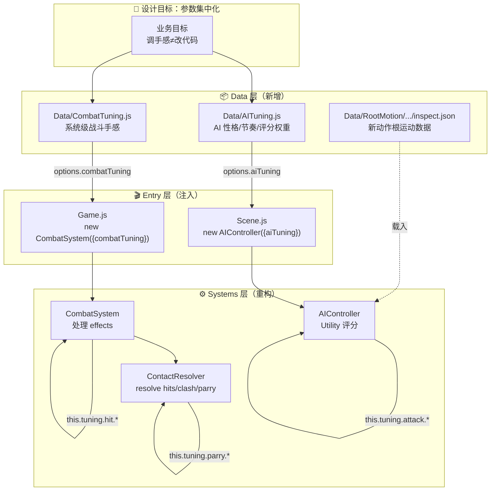

<markdown_report>
## 1. High-Level Summary (TL;DR) 📋

*   **Impact:** **Medium-High** — 一次系统级的**架构重构**：把散落在战斗与 AI 代码中的魔数(magic numbers)抽离到集中化的 `Data/CombatTuning.js` 与 `Data/AITuning.js`，让"调手感"和"改规则"分离。
*   **Key Changes:**
    *   ✨ **新建两个 Tuning 数据模块**（`CombatTuning` / `AITuning`），把 hitstop、击退、parry 阈值、AI 评分权重等系统级参数集中管理。
    *   🔧 **重写 4 个核心系统文件**（`ContactResolver` / `CombatSystem` / `AIController` / `Scene` / `Game`），全部通过 `this.tuning.xxx` 读取参数，去掉硬编码。
    *   🎨 **新增 longswordman_inspect 动画资源**及对应 RootMotion JSON（含 6 帧）。
    *   📚 **新增 3 份文档**：Combat Tuning 设计指南 / Rabble Stick 交接文档 / Collider-Occupancy 更新 Skill。
    *   🖼️ **更新 7 个艺术资源**（Tavern/arrow/floor/treeline/longswordman×3），均为二进制 diff。

---

## 2. Visual Overview (Code & Logic Map) 🗺️

本次改动核心是建立 **"数据描述参数、代码描述规则"** 的分层架构：



**核心数据流**：Entry 层把 `Tuning` 对象注入到 System 构造器；System 内部用 `this.tuning.xxx` 替换所有硬编码常量。

---

## 3. Detailed Change Analysis 🔍

### 3.1 🆕 新建模块：Data 层

#### ① `Data/CombatTuning.js`（46 行，新文件）

集中管理"战斗结果表现"参数——hitstop 帧、击退距离、parry/block 阈值。

| 分组 | 字段 | 值 | 原位置 |
|---|---|---|---|
| `hit` | `victimKnockbackX` | 0.12 | `ContactResolver.hitKnockback` |
| `hit` | `freezeImpactFrames` | 24 | `CombatSystem.freezeImpact(24,…)` |
| `block` | `knockbackX` | 0.2 | `ContactResolver.clashKnockback` |
| `block` | `hitstopFrames` | 4 | `ContactResolver` block 分支 |
| `block` | `blockstunFrames` | 10 | `ContactResolver` block 分支 |
| `parry` | `hitstopFrames` | 8 | parry 双方 hitstop |
| `parry` | `preemptiveTickDiffMax` | 16 | Just Guard 判定阈值 |
| `parry` | `bonusDurationFrames` | 40 | `parryBonus` effect |
| `parry` | `bonusDefaultDurationFrames` | 15 | effect fallback |
| `clash` | `tieHitstopFrames` | 8 | clash_tie 双方 |
| `clash` | `loseLoserHitstopFrames` | 6 | clash_lose 弱方 |
| `clash` | `loseWinnerHitstopFrames` | 4 | clash_lose 强方 |

> **设计边界**：文件顶部注释明确——这里改的是"手感"，**战斗规则**（克制关系）属于 `ContactResolver` 内部逻辑，不放在 tuning 里。

#### ② `Data/AITuning.js`（81 行，新文件）

集中管理"AI 如何评价行为"的参数——节奏、距离模型、性格门控、攻击/防御偏好、distance 后果、retreat 阈值。

| 分组 | 字段 | 值 | 含义 |
|---|---|---|---|
| 节奏 | `decisionIntervalMs` | 100 | 决策间隔 |
| 节奏 | `attackCooldownMs` | 800 | 攻击冷却 |
| 距离 | `rangeBuffer` | 0.2 | 统一安全/操作 margin |
| 性格 | `committedScoreThreshold` | 0.15 | 评分阈值才执行 |
| 性格 | `reactionVariance` | 0.15 | 随机扰动 |
| 威胁 | `threatPerPhase.{active,startup,recovery}` | 1.0/0.6/0.1 | 对手各阶段威胁感知 |
| 威胁 | `selfBusyThreatBonus` | 0.2 | self 攻击时威胁放大 |
| 脆弱 | `vulnerabilityPerPhase.{recovery,startup}` | 0.8/0.3 | punish 机会 |
| 攻击 | `attack.baseWeight` | 0.4 | 基础分 |
| 攻击 | `attack.cooldownPenalty` | 0.5 | 冷却扣分 |
| 攻击 | `attack.{parryRiskPenalty,missPenalty}` | 0.9/0.6 | 风险扣分 |
| 攻击 | `attack.guardLeakBonus` | 0.25 | 抓 guard 漏洞 |
| 攻击 | `attack.vulnReward` | 0.4 | 脆弱乘数 |
| 攻击 | `attack.threatPenalty` | 0.3 | 被 active 攻击扣分 |
| 攻击 | `attack.preemptiveBonus` | 0.2 | 抢先攻击加分 |
| 攻击 | `attack.rangeEdgeBonus` | 0.05 | 边缘命中微加分 |
| 防御 | `defense.activationThreshold` | 0.3 | 防御激活阈值 |
| 防御 | `defense.parryReward` | 0.2 | parry 加分 |
| 防御 | `defense.badDefensePenalty` | 0.5 | 防错招扣分 |
| 防御 | `defense.{activeBase,startupCanActBase,startupTooLateBase}` | 0.85/0.65/0.3 | 防御基础分 |
| 距离 | `distanceConsequence.{multiplier,clamp}` | 0.3/0.25 | 距离后果限幅 |
| 撤退 | `retreat.{normalThreat,mobilityBoostThreat}` | 0.6/0.8 | 撤退触发阈值 |

> **设计边界**：注释中强调字段命名已为未来**角色级 override** 预留扩展点（扁平语义而非单值聚合名）。

---

### 3.2 🔧 重构模块：Systems 层

#### ① `scripts/Systems/ContactResolver.js`

**核心改动**：
*   引入 `import { CombatTuning }`；新增 `this.tuning = options.combatTuning ?? CombatTuning`。
*   **删除**字段：`hitKnockback`、`clashKnockback`（合并到 `tuning`）。
*   **替换**所有数值常量：
    *   `guardFrameIdx === 0 || tickDiff <= 16` → `<= this.tuning.parry.preemptiveTickDiffMax`
    *   parry 路径：`durationFrames: 40` → `this.tuning.parry.bonusDurationFrames`
    *   parry 路径：双方 hitstop `8` → `this.tuning.parry.hitstopFrames`
    *   guard_block 路径：`blockstunFrames:10 / hitstopFrames:4` → `this.tuning.block.*`
    *   clash_tie / clash_lose hitstop → `this.tuning.clash.*`
    *   weapon vs hitbox 击退 → `this.tuning.hit.victimKnockbackX`
    *   `#buildClashEffect` 击退 → `this.tuning.block.knockbackX`

**关键代码片段**：
```javascript
// Before
const isPreemptiveGuard = guardFrameIdx === 0 || tickDiff <= 16;
const knockback = this.#signedKnockback(targetPos, attackerPos, this.hitKnockback);

// After
const isPreemptiveGuard = guardFrameIdx === 0 || tickDiff <= this.tuning.parry.preemptiveTickDiffMax;
const knockback = this.#signedKnockback(targetPos, attackerPos, this.tuning.hit.victimKnockbackX);
```

#### ② `scripts/Systems/CombatSystem.js`

**核心改动**：
*   引入 `import { CombatTuning }`；新增 `this.tuning` 字段。
*   关键约束：**强制将同一 `combatTuning` 透传给 `ContactResolver`**，保证 resolve 阶段与 effect 处理阶段使用**同一套参数**：
    ```javascript
    this.resolver = options.resolver ?? new ContactResolver({ ...options, combatTuning: this.tuning });
    ```
*   `parryBonus` effect 的 fallback 时长 `15` → `this.tuning.parry.bonusDefaultDurationFrames`
*   `freezeImpact(24,…)` → `freezeImpact(this.tuning.hit.freezeImpactFrames,…)`

#### ③ `scripts/Systems/AIController.js`（改动最大）

**核心改动**：
*   引入 `import { AITuning }`；新增 `this.tuning = options.aiTuning ?? AITuning`。
*   **删除**构造器中的所有 `options.xxx ?? 默认值` 模式（共 5 处），统一改为 `this.tuning.xxx`。
*   **替换所有评分函数中的魔数**：

| 函数 | 原硬编码 | 替换为 |
|---|---|---|
| `#scoreAttack` 入口 | `score = 0.4` | `this.tuning.attack.baseWeight` |
| 冷却中扣分 | `score -= 0.5` | `this.tuning.attack.cooldownPenalty` |
| parry 风险 | `0.9` | `this.tuning.attack.parryRiskPenalty` |
| miss 风险 | `0.6` | `this.tuning.attack.missPenalty` |
| guard 漏洞 | `score += 0.25` | `this.tuning.attack.guardLeakBonus` |
| vulnerability 乘数 | `* 0.4` | `* this.tuning.attack.vulnReward` |
| threat 扣分 | `* 0.3` | `* this.tuning.attack.threatPenalty` |
| 抢先 | `+ 0.2` | `+ this.tuning.attack.preemptiveBonus` |
| 边缘命中 | `+ 0.05` | `+ this.tuning.attack.rangeEdgeBonus` |
| `#scoreDefense` 激活阈值 | `sit.oppThreat < 0.3` | `< this.tuning.defense.activationThreshold` |
| parry 加分 | `+ 0.2` | `+ this.tuning.defense.parryReward` |
| 防错招扣分 | `- 0.5` | `- this.tuning.defense.badDefensePenalty` |
| 防御 active 基础分 | `+ 0.85` | `+ this.tuning.defense.activeBase` |
| 距离后果限幅 | `0.3 * 0.25` | `dc.multiplier * dc.clamp` |
| retreat 阈值 | `0.6` / `0.8` | `this.tuning.retreat.normalThreat / mobilityBoostThreat` |
| `oppThreat` 计算 | 阶段硬编码 1.0/0.6/0.1 | `this.tuning.threatPerPhase.*` |
| `oppVulnerable` 计算 | 硬编码 0.8/0.3 | `this.tuning.vulnerabilityPerPhase.*` |
| committed action 阈值 | `> 0.15` | `> this.tuning.committedScoreThreshold` |

#### ④ `scripts/Game.js` & `scripts/Scene.js`（注入入口）

仅 2 行级改动：
```javascript
// Game.js
this.combatSystem = new CombatSystem({ combatTuning: CombatTuning, debugTrace: true });

// Scene.js
this.rabbleController = new AIController(rabbleStick, {
    opponent: hero, debugVisible: this._debugVisible, aiTuning: AITuning
});
```

---

### 3.3 📦 资源与文档

#### ① `Data/RootMotion/longswordman/longswordman_inspect.json`（新文件）
*   6 帧新动画数据（128×128 sprite，每帧 duration 100/200ms，第 5 帧 1500ms 停留）
*   图集尺寸 768×128；图层含 mainvisual/main/weapon/rightarm/lefthand/cloak/rootmotion

#### ② `.trae/skills/collider-occupancy-更新-skill/SKILL.md`（新文件，131 行）
AI agent 技能定义：解释何时用 `extract_collision_boxes.ps1`（战斗角色）vs `extract_rootmotion_occupancy.ps1`（NPC），含批量处理脚本示例、颜色约定、5 条常见问题。

#### ③ `plans/Combat_Tuning_Data_Guideline.md`（新文件，421 行）
设计原则文档，含 10 章节：
*   三类数据归属（角色属性 / CombatTuning / AI Tuning）
*   判断标准：改值是"改变表现"还是"改变逻辑"
*   "一个概念只一个权威来源"原则（解决 positioning/attack buffer 错位问题）
*   明确暂时不要做：动态击退 / 完整 Buff 框架

#### ④ `plans/Handoff.MD`（新文件，239 行）
Rabble Stick Post-Defense Mobility 实现的交接文档，含 **5 步已完成改动** + **阻塞问题诊断**（tag 加了但读不到）+ 3 个根因假设 + 下一步排查计划。

#### ⑤ 🎨 艺术资源（7 个二进制文件）
| 类别 | 文件 |
|---|---|
| 环境 | `Tavern.ase`、`arrow.ase`、`floor.kra`、`treeline_pine.kra` |
| 长剑士 | `longswordman_quart.ase`、`longswordman_thrust.ase`、`longswordman_zornhut.ase` |

> 二进制 diff，仅记录存在变更。

---

## 4. Impact & Risk Assessment ⚠️

### 4.1 💥 Breaking Changes
*   **API 接口变化**（影响范围：仅内部）：
    *   `ContactResolver` 移除 `hitKnockback` / `clashKnockback` 选项，改为统一 `combatTuning` 注入
    *   `CombatSystem` 构造器新增 `combatTuning` 字段（推荐传入；不传则用 `CombatTuning` 默认）
    *   `AIController` 构造器中的 `attackCooldownMs` / `decisionIntervalMs` / `rangeBuffer` / `reactionVariance` 直接被 `aiTuning` 覆盖——**这些 options 形参虽然签名还在但已被忽略**
*   **数值语义零变化**：所有调出来的值与原硬编码完全一致（仅做了位置迁移），所以**游戏行为应该完全等价**

### 4.2 🔍 潜在风险

| 风险项 | 等级 | 说明 |
|---|---|---|
| 参数分母差异 | 🟡 中 | `distanceConsequence` 改用了 `dc.clamp`/`dc.multiplier` 局部变量，若未来误改 `dc` 名，限幅会失效 |
| override 路径未实现 | 🟡 中 | `AITuning` 注释承诺"未来扩展角色级 override"但本次未实现——若 Rabble/LongSwordMan 性格真不同需先解决 |
| 二进制资源改动 | 🟢 低 | 仅 7 个 .ase/.kra 二进制修改，需美术确认是否影响现有动画 |
| 默认值耦合 | 🟢 低 | `AIController` 改用 `this.tuning.xxx` 后**没有 `?? 默认值` 兜底**，若 `AITuning.js` 漏字段会得到 `undefined`，导致计算 NaN |
| 文档与代码同步 | 🟢 低 | `Combat_Tuning_Data_Guideline.md` 中举的示例字段（如 `hitstopMs`、`parryWindowMs`）和实际 `CombatTuning.js` 用的字段名（`hitstopFrames`、`preemptiveTickDiffMax`）**不完全一致**，新人易混淆 |

### 4.3 ✅ Testing Suggestions

1. **回归测试**（关键 — 行为应完全等价）：
    *   跑 `Rabble Stick` vs 主角：parry/guard_block/dodge 后的击退、hitstop、blockstun 时长是否与重构前**逐帧一致**
    *   跑 `LongSwordMan` vs 主角：clash_tie / clash_lose 的双方 hitstop 差异（8/8 vs 6/4）
    *   Just Guard 触发：连续 16 tick 内的 guard 是否被识别为 parry

2. **AI 行为边界测试**：
    *   冷却期间：AI 是否仍按 `cooldownPenalty=0.5` 大幅扣分（验证 `this.tuning.attack.cooldownPenalty` 生效）
    *   Retreat 触发：threat=0.7 时是否撤退（介于 normalThreat=0.6 与 mobilityBoostThreat=0.8 之间）
    *   Mobility boost 状态下：threat=0.7 时是否不撤退（因为 boost 阈值 0.8 > 0.7）

3. **数据完整性测试**：
    *   临时在 `AITuning` 中删一个字段（如 `attack.baseWeight`），看是否会出现 `score=NaN` 的边界（确认缺字段兜底行为）
    *   注入自定义 tuning：`new AIController(stick, { aiTuning: { attack: { baseWeight: 0.9 } } })`，验证部分 override 不会崩溃

4. **资源加载测试**：
    *   `longswordman_inspect` 动画能否在主角或 NPC 状态图中正常引用（确认图层名 `mainvisual/main/weapon/rightarm/lefthand/cloak/rootmotion` 与 StateGraph 引用一致）

### 4.4 📋 文档建议

*   `Combat_Tuning_Data_Guideline.md` 的示例代码（第 145-175 行）字段名应与 `CombatTuning.js` 实际字段对齐，否则会误导后续维护者
*   `Handoff.MD` 提到的 `addTimedTag`/`hasTag` 矛盾是独立 bug（tag 加了但读不到），与本次重构无关，但需要另开 issue 跟进