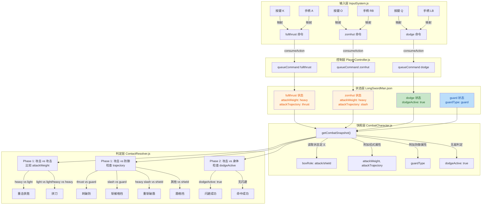
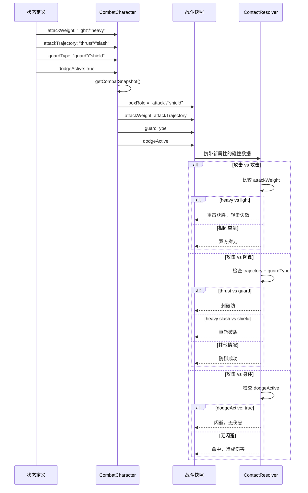

## 1. 高层摘要

- **影响范围**: 高 - 核心战斗判定系统的全面重构，涉及输入控制、碰撞检测、状态管理等多个模块
- **核心变更**:
  - 🔄 从"武器部位强弱"判定转向"招式属性"判定系统
  - ✨ 新增 `dodge` 和 `fullthrust` 动作
  - ⌨️ 重映射键盘快捷键并扩展手柄支持
  - 🛡️ 实现新的防御/盾牌机制，区分 `guard` 和 `shield` 防御类型

---

## 2. 视觉概览

### 战斗判定逻辑流程



### 数据流：新判定系统关键属性



---

## 3. 详细变更分析

### 3.1 输入系统重构

| 功能 | 键盘按键 | 手柄按钮 | 动作命令 |
|------|---------|---------|---------|
| 快速突刺 | `K` | `A` | `fullthrust` |
| 烈焰斩 | `O` | `RB` | `zornhut` |
| 闪避 | `Q` | `LB` | `dodge` |
| 格挡 | `J` | `X` | `guard` |
| 突刺 | `L` | `B` | `thrust` |
| 反刺 | `I` | `Y` | `quart` |

**变更文件**: `scripts/Systems/InputSystem.js`

- 新增按键: `q`, `o` 到键盘状态追踪
- 新增手柄按钮: `a`, `x`, `lb`, `rb`
- 重新映射: `K` 键从 `zornhut` 改为 `fullthrust`, `O` 键设为 `zornhut`

---

### 3.2 状态图数据更新

#### 新增状态 (Data/StateGraphDef/LongSwordMan.json)

| 状态 | clip | 攻击类型 | 轨迹类型 | 激活帧 | 帧速度 |
|------|------|---------|---------|--------|--------|
| **fullthrust** | fullthrust | heavy | thrust | [3,4] | [0,0,0,2.4,0,0] |
| **dodge** | dodge | - | - | - | [-1.2,0] |

#### 现有状态属性补充

| 状态 | 新增字段 | 值 |
|------|---------|---|
| thrust | attackWeight | `"light"` |
| thrust | attackTrajectory | `"thrust"` |
| quart | attackWeight | `"light"` |
| quart | attackTrajectory | `"slash"` |
| zornhut | attackWeight | `"heavy"` |
| zornhut | attackTrajectory | `"slash"` |
| guard | guardType | `"guard"` |

---

### 3.3 战斗快照系统重构

**变更文件**: `scripts/Enties/CombatCharacter.js`

#### 关键变更点

1. **无敌判定扩展**
   ```javascript
   // 旧逻辑
   const isInvincible = this.currentStateDef?.invincible === true;
   
   // 新逻辑
   const isInvincible = this.currentStateDef?.invincible === true 
                        || this.currentStateDef?.dodgeActive === true;
   ```

2. **新增 `boxRole` 字段**
   - 根据 `subtype` 和当前状态动态计算
   - `strong_blade` + `guardActive` → `"shield"`
   - `strong_blade` + 攻击激活帧 → `"attack"`
   - 其他 → `null`

3. **新增战斗属性**
   ```javascript
   boxRole,                    // "attack" 或 "shield"
   attackWeight,              // "light" 或 "heavy"
   attackTrajectory,          // "thrust" 或 "slash"
   guardType,                 // "guard" 或 "shield"
   dodgeActive,               // 布尔值，快照级别
   ```

4. **简化 `canParry` 判定**
   - 从 `guardActive` 改为 `guardType === "guard"`
   - 只有用剑格挡可触发完美格挡，盾牌不能

---

### 3.4 碰撞解析系统完全重写

**变更文件**: `scripts/Systems/ContactResolver.js`

#### 删除的方法
- `#toWeaponLevel()` - 旧武器级别转换
- `#weaponLevelRank()` - 旧级别排名

#### 新判定矩阵

| 场景 | 判定依据 | 结果 |
|------|---------|------|
| **Attack vs Attack** | `attackWeight` | heavy > light，同级 clash |
| **Attack vs Guard** | `attackTrajectory` | thrust 破防，slash 被防 |
| **Attack vs Shield** | `trajectory` + `weight` | 重斩破盾，其他被防 |
| **Attack vs Dodge** | `dodgeActive` | 完全闪避，无伤害 |

#### 代码逻辑片段 (简化)

```javascript
// 攻击 vs 攻击
if (weightA === weightB) {
    // 拼刀，双方都失效
    invalidatedAttacks.add(attackA);
    invalidatedAttacks.add(attackB);
} else if (weightA === "heavy") {
    // A 赢，B 失效
    invalidatedAttacks.add(attackB);
}

// 攻击 vs 防御盒
if (guardType === "guard") {
    blocked = (trajectory !== "thrust");  // 刺破防
} else if (guardType === "shield") {
    blocked = !(trajectory === "slash" && weight === "heavy");  // 重斩破盾
}

// 闪避检查
if (targetSnap?.dodgeActive) continue;  // 跳过所有伤害计算
```

---

### 3.5 资源清单扩展

**变更文件**: 
- `scripts/AssetManifest.js`
- `scripts/CharacterFactory.js`

| 资源类型 | 新增路径 |
|---------|---------|
| Atlas | `Art/Sprite/longswordman/longswordman_fullthrust.json` |
| Atlas | `Art/Sprite/longswordman/longswordman_dodge.json` |
| Collider | `Data/CollisionMask/longswordman/longswordman_fullthrust.collider.json` |
| Collider | `Data/CollisionMask/longswordman/longswordman_dodge.collider.json` |

---

### 3.6 UI/UX 调整

| 快捷键 | 旧功能 | 新功能 | 变更文件 |
|--------|--------|--------|---------|
| `O` | 切换相机投影 | - | `character_demo.js` |
| `C` | - | 切换相机投影 | `character_demo.js` |
| `C` | 显示碰撞 | - | `scripts/Scene.js` |
| `X` | - | 显示碰撞 | `scripts/Scene.js` |

---

## 4. 影响与风险评估

### ⚠️ 破坏性变更

1. **判定逻辑完全改变**
   - 旧的 `strong_blade`/`weak_blade` 系统被 `attackWeight`/`attackTrajectory` 替代
   - 所有现有战斗场景需要重新平衡

2. **快捷键冲突**
   - 用户习惯的按键映射已改变
   - 需要更新文档或教程

3. **碰撞蒙版语义反转**
   - 扫描脚本输出的 `subtype` 与运行时含义相反
   - `#FF0000` (大红色) → `weak_blade` → 运行时 **防御盒**
   - `#E37800` (橙色) → `strong_blade` → 运行时 **攻击盒**

### ✅ 向后兼容性

- 动画文件格式未变
- 状态图基础结构未变
- 碰撞蒙版文件格式未变

### 🧪 测试建议

#### 核心战斗场景测试

| 测试场景 | 预期结果 |
|---------|---------|
| 轻击 vs 轻击 | 双方拼刀，都有硬直 |
| 重击 vs 轻击 | 重击获胜，轻击失效 |
| Thrust vs Guard | 攻击命中，格挡被破 |
| Quart vs Guard | 攻击被格挡，格挡者短暂硬直 |
| Smash vs Shield | 重斩破盾，防御者受击 |
| Quart vs Shield | 盾格挡成功，攻击无效 |
| 任意攻击 vs Dodge | 完全闪避，无伤害 |

#### 边界情况测试

- ⚡ 同帧双击闪避 → 不应重复触发
- ⚡ 完美格挡时机测试（前16帧）→ 应触发 parryBonus
- ⚡ 闪避期间被重击包围 → 应完全无敌
- ⚡ 相同重量攻击同时命中 → 应触发拼刀逻辑

#### 输入系统测试

- ⚡ 手柄断开重连 → 输入缓冲不应残留
- ⚡ 快速连招输入 → 命令队列应正确处理
- ⚡ 同时按下多个按键 → 不应触发错误动作

---

## 5. 新文档说明

新增 `plans/COMBAT_RULES_REDESIGN_PLAN.md`，详细记录了：
- 设计背景与决策理由
- 完整的实施步骤（0-7步）
- 碰撞蒙版颜色约定
- 判定矩阵与角色招式分配
- 未来扩展：manatarms 角色与 shield 机制

该文档为此次变更的核心设计文档，建议作为后续开发的参考依据。

---

## 📊 变更统计

| 类型 | 数量 |
|------|------|
| 修改的 JavaScript 文件 | 7 |
| 新增/修改的状态图文件 | 1 |
| 新增的动画资源声明 | 2 |
| 新增的碰撞盒声明 | 2 |
| 新增的文档 | 1 |
| 艺术资源变更 | 8+ (ASE/JSON) |

**总代码变更行数**: ~250+ 行（不含资源文件和文档）

---

## 🎯 总结

本次变更实现了战斗系统从"基于武器部位"到"基于招式属性"的范式转移，显著提升了系统的可扩展性和平衡性。新增的 `dodge` 和 `fullthrust` 动作丰富了战斗策略性，而改进的手柄支持为多平台体验打下基础。主要风险集中在判定逻辑的重大变更，需要全面的回归测试。