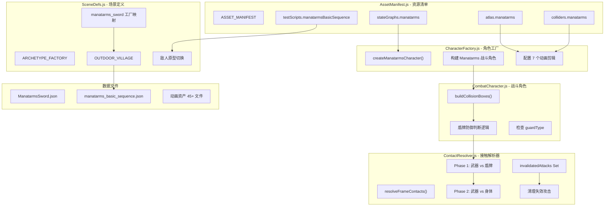

## 📋 高级摘要 (TL;DR)

*   **影响范围:** **高** - 新增完整角色类型（重装兵 Manatarms），并优化战斗系统的防御逻辑和攻击失效机制
*   **核心变更:**
    *   ✨ 新增 Manatarms 重装兵角色，包含完整的动画、碰撞盒、状态机配置
    *   🛡️ 优化盾牌防御逻辑，支持从配置层级的防御类型判断
    *   ⚔️ 改进攻击失效机制，新增跨帧跟踪失效攻击的功能
    *   🎮 将测试场景中的敌人从 rabble_stick 切换为 manatarms_sword

---

## 🗺️ 视觉概览 (代码与逻辑映射)



---

## 🔍 详细变更分析

### 1️⃣ 资源清单系统 (`AssetManifest.js`)

**变更内容:**
为 Manatarms 重装兵角色添加完整的资源配置。

**新增资源类型:**

| 资源类型 | 新增内容 | 说明 |
|---------|---------|------|
| **状态图** | `manatarms: "./Data/StateGraphDef/ManatarmsSword.json"` | 角色状态机定义 |
| **测试脚本** | `manatarmsBasicSequence` | 测试用攻击序列 |
| **动画图集** | idle, move, quart, reverse_quart, smash, hit, knockdown | 7 个状态动画 |
| **碰撞盒** | idle, move, quart, reverse_quart, smash, hit, knockdown | 7 个状态的碰撞定义 |

**代码片段:**
```javascript
// 新增 manatarms 资源配置
manatarms: {
    idle: "./Art/Sprite/manatarms_sword/manatarms_sword_idle.json",
    move: "./Art/Sprite/manatarms_sword/manatarms_sword_move.json",
    quart: "./Art/Sprite/manatarms_sword/manatarms_sword_quart.json",
    // ... 其他动画
}
```

---

### 2️⃣ 角色工厂系统 (`CharacterFactory.js`)

**变更内容:**
新增 `createManatarmsCharacter()` 工厂函数，用于创建重装兵角色实例。

**角色配置参数:**

| 参数 | 值 | 说明 |
|-----|---|------|
| `name` | "manatarms" | 角色标识 |
| `kind` | "enemy" | 敌对类型 |
| `guardType` | "shield" | 防御类型：盾牌 |
| `deathState` | "defeated" | 死亡状态 |
| `blocksMovement` | false | 不阻挡移动 |
| `interactable` | false | 不可交互 |

**动画剪辑配置:**
- **循环动画:** `idle`（待机）、`move`（移动）
- **攻击动画:** `quart`（轻斩）、`reverse_quart`（反向斩）、`smash`（重击）
- **受击动画:** `hit`（被击中）、`knockdown`（倒地）

---

### 3️⃣ 战斗系统优化 (`CombatCharacter.js`)

**变更内容:**
优化盾牌防御类型判断逻辑，支持多层级的防御类型查询。

**变更对比:**

| 位置 | 原逻辑 | 新逻辑 |
|-----|-------|-------|
| 盾牌角色判断 (Line 248) | `this.currentStateDef?.guardType ? "shield" : null` | `this.currentStateDef?.guardType \|\| this.config?.guardType ? "shield" : null` |
| 防御类型获取 (Line 263) | `this.currentStateDef?.guardType ?? null` | `this.currentStateDef?.guardType ?? this.config?.guardType ?? null` |

**逻辑说明:**
- 原逻辑仅检查当前状态定义中的 `guardType`
- 新逻辑增加后备检查，从角色配置层级 `config.guardType` 读取
- 这使得盾牌类型可以在角色级别统一配置，无需在每个状态中重复定义

---

### 4️⃣ 接触解析器系统 (`ContactResolver.js`)

**变更内容:**
改进攻击失效跟踪机制和调试支持。

**新增属性:**

| 属性 | 类型 | 说明 |
|-----|------|------|
| `invalidatedAttacks` | `Set` | 跟踪失效攻击的集合（跨帧保留） |

**核心变更点:**

1. **攻击失效集合生命周期管理**
   - 原逻辑: `invalidatedAttacks` 作为局部变量，每帧重置
   - 新逻辑: 改为实例成员 `this.invalidatedAttacks`，跨帧保留
   - 清理时机: 在帧结束时清理非活跃攻击

2. **Phase 1 (武器 vs 盾牌) 增强**
   - 新增详细的跳过原因日志（已注释）
   - 改进调试输出格式

3. **Phase 2 (武器 vs 身体) 优化**
   - 重构跳过判断逻辑，使用 `skipReason` 变量统一处理
   - 新增调试日志（已注释）

4. **清理逻辑**
   ```javascript
   // 新增失效攻击清理代码
   for (const attackId of this.invalidatedAttacks) {
       if (!activeAttackIds.has(attackId)) {
           this.invalidatedAttacks.delete(attackId);
       }
   }
   ```

---

### 5️⃣ 场景定义系统 (`SceneDefs.js`)

**变更内容:**
将测试场景中的敌人类型从 RabbleStick 切换为 Manatarms。

**场景配置变更:**

| 配置项 | 原值 | 新值 |
|-------|------|------|
| `archetype` | "rabble_stick" | "manatarms_sword" |
| `name` | "rabble_stick" | "manatarms_sword" |
| `id` | "enemy_1" | "enemy_1" |
| `kind` | "enemy" | "enemy" |
| `controller` | "test" | "test" |
| `pos` | `[3.2, 0]` | `[3.2, 0]` |

**导入变更:**
```javascript
import {
    createHeroCharacter,
    createRabbleStickCharacter,
    createManatarmsCharacter,  // 新增
    // ... 其他工厂
}
```

---

### 6️⃣ 场景加载器 (`Scene.js`)

**变更内容:**
更新测试脚本加载路径。

| 配置项 | 原值 | 新值 |
|-------|------|------|
| 测试脚本 | `assets?.testScripts?.rabbleBasicSequence` | `assets?.testScripts?.manatarmsBasicSequence` |

---

### 7️⃣ 数据文件 (新增/修改)

#### A. 状态图定义 (`Data/StateGraphDef/ManatarmsSword.json`)
**新增内容:**
- **机器名称:** `manatarms_sword`
- **初始状态:** `idle`
- **输入命令:** `quart`, `reverse_quart`, `smash`

**状态定义:**

| 状态 | 循环 | 攻击 | 攻击权重 | 攻击轨迹 | 说明 |
|-----|------|------|----------|----------|------|
| `idle` | ✅ | ❌ | - | - | 待机 |
| `move` | ✅ | ❌ | - | - | 移动 |
| `quart` | ❌ | ✅ | light | slash | 轻斩 |
| `reverse_quart` | ❌ | ✅ | light | slash | 反向斩 |
| `smash` | ❌ | ✅ | strong | slash | 重击 |
| `hit` | ❌ | ❌ | - | - | 被击中 |
| `knockdown` | ❌ | ❌ | - | - | 倒地 |

#### B. 测试脚本 (`Data/TestScripts/manatarms_basic_sequence.json`)
**攻击序列:**

| 步骤 | 动作 | 等待时间 |
|-----|------|---------|
| 1 | quart 攻击 | 1800ms |
| 2 | reverse_quart 攻击 | 1800ms |
| 3 | 向右移动 (x=1) | 1300ms |
| 4 | smash 重击 | 1800ms |
| 5 | 停止移动 | 1500ms |
| **循环** | ✅ | - |

#### C. 动画资产文件 (45+ 新文件)
**新增动画数据:**

| 角色 | 动画类型 | 文件路径模式 |
|-----|---------|-------------|
| **rabblestick** | clash, guard | `Art/RawAssets/rabblestick/*.json` |
| **longswordman** | dodge, fullthrust | `Art/Sprite/longswordman/*.json` |
| **manatarms** | 7 个状态 | `Art/Sprite/manatarms_sword/*.json` |
| **所有角色** | 碰撞盒 | `Data/CollisionMask/*/*.json` |
| **所有角色** | 推箱 | `Data/PushBox/*/*.json` |
| **所有角色** | 根运动 | `Data/RootMotion/*/*.json` |

---

## ⚠️ 影响与风险评估

### 🔴 破坏性变更
| 变更项 | 影响 | 建议 |
|-------|------|------|
| **场景敌人切换** | 默认测试敌人从 RabbleStick 变为 Manatarms | 确认这是有意为之，如需保留 RabbleStick 测试，需创建新场景 |

### 🟡 风险点
1. **防御逻辑变更风险**
   - 多层级的 `guardType` 查询可能导致意外的防御行为
   - **建议:** 测试不同状态下的防御交互，确保盾牌行为一致

2. **攻击失效机制变更**
   - 跨帧保留失效攻击可能影响后续帧的碰撞检测
   - **建议:** 验证攻击被盾牌格挡后，不会再对同一目标造成伤害

3. **资源文件完整性**
   - 新增 45+ 资源文件，需确保所有文件存在且格式正确
   - **建议:** 运行游戏加载测试，检查是否有资源缺失错误

### ✅ 测试建议
- [ ] **基础测试:** 启动游戏，验证 Manatarms 角色正确加载和显示
- [ ] **动画测试:** 检查 7 个状态动画（idle, move, quart, reverse_quart, smash, hit, knockdown）均能正常播放
- [ ] **战斗测试:** 
  - 验证盾牌防御功能正常工作
  - 测试三种攻击（quart, reverse_quart, smash）的伤害判定
  - 确认攻击被盾牌格挡后不会穿透
- [ ] **状态机测试:** 验证状态转换逻辑正确（idle ↔ move, idle → 攻击等）
- [ ] **测试脚本:** 运行 `manatarms_basic_sequence.json`，验证 AI 循环执行攻击序列
- [ ] **性能测试:** 检查新增的资源加载和碰撞检测逻辑对性能的影响

---

## 📊 资产文件统计

| 类别 | 新增文件数 | 主要目录 |
|-----|-----------|---------|
| 状态图定义 | 1 | `Data/StateGraphDef/` |
| 测试脚本 | 1 | `Data/TestScripts/` |
| 动画图集 | 9 | `Art/Sprite/` |
| 碰撞盒数据 | 18 | `Data/CollisionMask/` |
| 推箱数据 | 9 | `Data/PushBox/` |
| 根运动数据 | 9 | `Data/RootMotion/` |
| 原始资源 | 2 | `Art/RawAssets/` |
| **总计** | **49+** | - |

---

## 🎯 关键改进亮点

1. **⚔️ 角色扩展性增强**
   - 通过工厂模式和配置驱动的设计，添加新角色类型更加便捷

2. **🛡️ 防御系统优化**
   - 支持角色级别的防御类型配置，减少重复定义

3. **🐛 战斗逻辑修复**
   - 攻击失效机制的改进解决了潜在的"一击多判"问题

4. **🔧 调试能力提升**
   - 新增详细的调试日志（已注释），便于问题排查